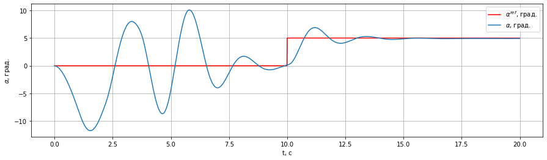
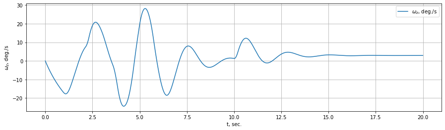

Пример использования IHDP вместе с LinearLongitudinalF16-v0
===========================================================

```python
import numpy as np
from tqdm import tqdm
import gymnasium as gym

from tensoraerospace.utils import generate_time_period, convert_tp_to_sec_tp
from tensoraerospace.signals.standard import unit_step
from tensoraerospace.agent.ihdp.model import IHDPAgent
```

```python
# Параметры
dt = 0.01
tp = generate_time_period(tn=20, dt=dt)
tps = convert_tp_to_sec_tp(tp, dt=dt)
number_time_steps = len(tp)
reference_signals = np.reshape(
    unit_step(degree=5, tp=tp, time_step=10, output_rad=True),
    [1, -1]
)
```

```python
# Среда Gymnasium
env = gym.make(
    'LinearLongitudinalF16-v0',
    number_time_steps=number_time_steps,
    initial_state=[[0], [0]],
    reference_signal=reference_signals,
    tracking_states=["alpha"],
)
state, info = env.reset()
```

```python
# Настройки агента IHDP
actor_settings = {
    "start_training": 5,
    "layers": (25, 1),
    "activations": ("tanh", "tanh"),
    "learning_rate": 2,
    "learning_rate_exponent_limit": 10,
    "type_PE": "combined",
    "amplitude_3211": 15,
    "pulse_length_3211": 5 / dt,
    "maximum_input": 25,
    "maximum_q_rate": 20,
    "WB_limits": 30,
    "NN_initial": 120,
    "cascade_actor": False,
    "learning_rate_cascaded": 1.2,
}

incremental_settings = {
    "number_time_steps": number_time_steps,
    "dt": dt,
    "input_magnitude_limits": 25,
    "input_rate_limits": 60,
}

critic_settings = {
    "Q_weights": [8],
    "start_training": -1,
    "gamma": 0.99,
    "learning_rate": 15,
    "learning_rate_exponent_limit": 10,
    "layers": (25, 1),
    "activations": ("tanh", "linear"),
    "WB_limits": 30,
    "NN_initial": 120,
    "indices_tracking_states": env.indices_tracking_states,
}
```

```python
# Инициализация и цикл управления
model = IHDPAgent(
    actor_settings,
    critic_settings,
    incremental_settings,
    env.tracking_states,
    env.state_space,
    env.control_space,
    number_time_steps,
    env.indices_tracking_states,
)

xt = np.array([[np.deg2rad(3)], [0]])
for step in tqdm(range(number_time_steps - 1)):
    ut = model.predict(xt, reference_signals, step)
    xt, reward, terminated, truncated, info = env.step(np.array(ut))
    if terminated or truncated:
        break
```

```python
# Визуализация
env.model.plot_transient_process('alpha', tps, reference_signals[0], to_deg=True, figsize=(15,4))
```



```python
env.model.plot_state('wz', tps, to_deg=True, figsize=(15,4))
```


