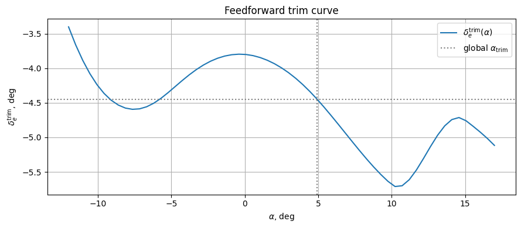

# Пример: IHDP на нелинейной F-16 — слежение за синусоидальным α

Пример обучает агент **Incremental Heuristic Dynamic Programming (IHDP)** слежению за синусоидальным задающим углом атаки на чисто-NumPy [нелинейной модели F-16](../../../model/f16_nonlinear_longitudinal.md). Исходный ноутбук: `example/reinforcement_learning/incremental_adp/example_ihdp_nonlinear_f16.ipynb`.

## Ключевая идея: feedforward + IHDP-residual

IHDP — реактивный алгоритм: на каждом шаге он видит только текущее состояние и текущее задание. Для синусоидального сигнала к моменту реакции агента задание уже сдвинулось, что даёт фазовый лаг 60–90° (косинус в ответ на синус). Решение — подать в среду **inverse-model feedforward**, который делает основную часть работы по слежению, оставив IHDP лишь небольшой динамический residual:

\[
\delta_e(t) \;=\; \mathrm{ff}\bigl(\alpha_{\text{ref}}(t+\tau)\bigr) \;+\; \mathrm{agent\_residual}(t)
\]

Три ингредиента делают FF работоспособным:

1. **Статическая trim-кривая** \(\alpha \to \delta_e^{\text{trim}}\). Для каждого кандидата \(\alpha\) заранее находим отклонение руля, обнуляющее момент тангажа (через `fsolve`).
2. **Lookahead** \(\tau \approx 0.85\,\text{с}\). Вместо `α_ref(t)` в trim-кривую подаём `α_ref(t + τ)` — это компенсирует запаздывание привода и планера (примерно постоянная времени короткопериодической моды F-16 при \(V=150\) м/с).
3. **Коэффициент амплитуды** \(g = 1.55\). На движущемся задании равновесия недостаточно — рулю нужно «перехлестнуть» статическую цель, чтобы создать угловое ускорение тангажа, удерживающее α в фазе с \(\dot\alpha_{\text{ref}}\). Отклонение от глобального трима перед поиском в trim-кривой умножается на этот коэффициент.

С таким FF агенту IHDP остаётся выучить лишь небольшую динамическую поправку.

## 1. Импорты и трим

```python
import math

import gymnasium as gym
import matplotlib.pyplot as plt
import numpy as np
from scipy.optimize import fsolve
from tqdm import tqdm

import tensoraerospace  # регистрирует gymnasium-среды
from tensoraerospace.aerospacemodel.f16.nonlinear.longitudinal.dynamics import f16_ode_long
from tensoraerospace.aerospacemodel.f16.nonlinear.longitudinal.params import default_parameters
from tensoraerospace.agent.ihdp.model import IHDPAgent
from tensoraerospace.utils import convert_tp_to_sec_tp, generate_time_period
```

Находим \((\alpha_{\text{trim}}, \delta_{e,\text{trim}})\), при которых \(\dot\alpha=0\) и \(\dot\omega_z=0\) при нулевой скорости тангажа:

```python
params = default_parameters()

def trim_residual(z):
    alpha, stab = z
    x = np.array([alpha, 0.0, stab, 0.0])
    return list(f16_ode_long(x, np.array([stab]), 0.0, params)[:2])

sol, _info, ier, _ = fsolve(
    trim_residual, x0=[math.radians(2.0), math.radians(-2.0)], full_output=True
)
alpha_trim_rad, stab_trim_rad = float(sol[0]), float(sol[1])
alpha_trim_deg = math.degrees(alpha_trim_rad)
stab_trim_deg = math.degrees(stab_trim_rad)
# глобальный трим: alpha = +4.9184 град, руль = -4.4467 град
```

## 2. Построение FF trim-кривой

Для каждого \(\alpha\) из \([-12°, 17°]\) находим отклонение руля, обнуляющее момент тангажа:

```python
def stab_for_alpha(alpha_rad: float) -> float:
    def res(s):
        x = np.array([alpha_rad, 0.0, s[0], 0.0])
        return f16_ode_long(x, np.array([s[0]]), 0.0, params)[1]  # dwz
    return float(fsolve(res, x0=[math.radians(-2.0)])[0])

alphas_grid_deg = np.linspace(-12.0, 17.0, 61)
alphas_grid_rad = np.deg2rad(alphas_grid_deg)
stabs_grid_deg = np.array([math.degrees(stab_for_alpha(a)) for a in alphas_grid_rad])
```



## 3. Задающий сигнал

80-секундный эпизод при \(dt = 0.01\) с. Первые 2 с задание удерживается на \(\alpha_{\text{trim}}\), чтобы инкрементальная модель IHDP успела идентифицировать полезную локальную линеаризацию, затем — 3° амплитуды синус при 0.1 Гц, центрированный на триме.

```python
dt = 0.01
tp = generate_time_period(tn=80, dt=dt)
tps = convert_tp_to_sec_tp(tp, dt=dt)
number_time_steps = len(tp)

amplitude_deg = 3.0
freq_hz = 0.1
warmup_steps = int(2.0 / dt)

ref_alpha_rad = np.full(number_time_steps, alpha_trim_rad)
active_t = np.arange(number_time_steps - warmup_steps) * dt
ref_alpha_rad[warmup_steps:] = (
    alpha_trim_rad + math.radians(amplitude_deg) * np.sin(2 * np.pi * freq_hz * active_t)
)
reference_signals = ref_alpha_rad.reshape(1, -1)
```


## 4. FF-функция и среда

```python
lookahead_sec = 0.85
lookahead_steps = int(lookahead_sec / dt)
ff_gain = 1.55

def feedforward_fn(time_step: int, ref_signal: np.ndarray) -> float:
    k = min(time_step + lookahead_steps, ref_signal.shape[1] - 1)
    alpha_ref_deg = math.degrees(ref_signal[0, k])
    alpha_eff_deg = alpha_trim_deg + ff_gain * (alpha_ref_deg - alpha_trim_deg)
    return float(np.interp(alpha_eff_deg, alphas_grid_deg, stabs_grid_deg))

env = gym.make(
    "NonlinearLongitudinalF16-v0",
    number_time_steps=number_time_steps,
    initial_state=[alpha_trim_rad, 0.0, stab_trim_rad, 0.0],
    reference_signal=reference_signals,
    state_space=["alpha", "wz"],
    control_space=["stab"],
    tracking_states=["alpha"],
    use_reward=False,
    dt=dt,
    integrator="euler",
    feedforward_fn=feedforward_fn,
)
```

## 5. Конфигурация IHDP

Два отличия от канонического примера с линейной F-16:

- **`Q_weights = [200]`** (против 8 в линейном примере). FF покрывает основную часть слежения, поэтому residual-ошибка мала. Более высокая `Q` усиливает эту малую ошибку, давая актору полезный градиент.
- **`NN_initial = 47`** — лучшее зерно после прогона `[1, 100]` при `Q=200, lr=2`: даёт MAE ≈ 0.05° на этом задании. `NN_initial=120` — «безопасное» среднее (~0.14°).

```python
actor_settings = {
    "start_training": 5,
    "layers": (25, 1),
    "activations": ("tanh", "tanh"),
    "learning_rate": 2,
    "learning_rate_exponent_limit": 10,
    "type_PE": "combined",
    "amplitude_3211": 3,
    "pulse_length_3211": 5 / dt,
    "maximum_input": 15,
    "maximum_q_rate": 20,
    "WB_limits": 30,
    "NN_initial": 47,
    "cascade_actor": False,
    "learning_rate_cascaded": 1.2,
}

critic_settings = {
    "Q_weights": [200],
    "start_training": -1,
    "gamma": 0.99,
    "learning_rate": 15,
    "learning_rate_exponent_limit": 10,
    "layers": (25, 1),
    "activations": ("tanh", "linear"),
    "WB_limits": 30,
    "NN_initial": 47,
    "indices_tracking_states": env.unwrapped.indices_tracking_states,
}

incremental_settings = {
    "number_time_steps": number_time_steps,
    "dt": dt,
    "input_magnitude_limits": 15,
    "input_rate_limits": 60,
}

agent = IHDPAgent(
    actor_settings, critic_settings, incremental_settings,
    env.unwrapped.tracking_states,
    env.unwrapped.state_space,
    env.unwrapped.control_space,
    number_time_steps,
    env.unwrapped.indices_tracking_states,
)
```

## 6. Онлайн-цикл обучения

IHDP обучается полностью онлайн: на каждом шаге актор предлагает residual, среда прибавляет FF и продвигается на шаг, затем актор / критик / инкрементальная модель обновляются по полученной транзиции.

```python
obs, _ = env.reset()
xt = np.asarray(obs, dtype=float).reshape(-1, 1)

for step in tqdm(range(number_time_steps - 3)):
    ut = agent.predict(xt, reference_signals, step)
    xt, _reward, terminated, truncated, _info = env.step(np.asarray(ut))
    xt = np.asarray(xt, dtype=float).reshape(-1, 1)
    if terminated or truncated:
        break
```

## 7. Результат слежения


Метрики на второй половине эпизода (40 с → 80 с):

| Метрика | Значение |
|---------|----------|
| Средняя абсолютная ошибка | **0.053°** (1.77 % от амплитуды) |
| RMS | 0.074° |
| Макс. абсолютная ошибка | 0.174° (5.81 % от амплитуды) |

## 8. Ablation — что даёт каждый компонент

Тот же эксперимент с постепенно отключаемыми ингредиентами:

| Конфигурация | Late MAE |
|--------------|----------|
| Без FF, только IHDP (Q=8) | 1.91° |
| Только FF lookahead (Q=8) | 0.67° |
| FF lookahead + gain (Q=8) | 0.22° |
| FF lookahead + gain (**Q=200**) | **0.053°** |

Фазокомпенсирующий lookahead даёт основной вклад. Коэффициент амплитуды закрывает остаточный недолёт. Высокая `Q` полезна только когда residual уже мал.

## Замечания

- **Почему помогает gain.** Статический FF предполагает равновесие; на движущемся задании рулю надо «перехлестнуть» статическую цель на величину, необходимую для ускорения α. Оптимальный коэффициент зависит от частоты задания; для более медленных — приближается к 1.0.
- **Sweep по NN_initial.** IHDP чувствителен к инициализации весов. Прогон `NN_initial ∈ [1, 100]` при `Q=200, lr=2` дал MAE 0.049° (зерно 47), медиана ~0.12°, ~17 зёрен разошлись. Выбор зерна — часть настройки IHDP.
- **Смена интегратора.** Для больших амплитуд задания `integrator="rk4"` даёт более высокую численную точность. Для 3° разница незначительна.
- **Более «жёсткое» задание.** Амплитуды 5–8° остаются в диапазоне FF-кривой \([-12°, 17°]\); слегка снижайте `ff_gain` (к 1.4), и IHDP скомпенсирует увеличенный нелинейный residual.
