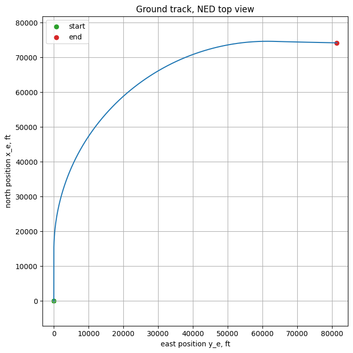

# Пример: MIMO IHDP скоординированный поворот на 90° на нелинейном Boeing 737


Этот пример демонстрирует **один MIMO-агент IHDP**, управляющий боково-направленным каналом [нелинейного Boeing 737](../../../model/b737_nonlinear.md) при 200-секундной командной смене курса 0° → 90°. Исходный ноутбук: `example/reinforcement_learning/incremental_adp/example_ihdp_nonlinear_b737_turn.ipynb`.

## Архитектура


Используется **один** MIMO `IHDPAgent` для бокового канала. Его актор выдаёт два выхода:

```
state  = [φ, p, β, r]
action = [δ_aileron_residual, δ_rudder_residual]
```

Прозрачный coordinated-turn закон (`φ_cmd` из стандартного отношения $\tan\varphi = V \dot\psi / g$ + обратная связь по ошибке $\psi$) поставляет безопасную номинальную команду и эталонную траекторию для критика. MIMO IHDP **обучает онлайн residual**, который добавляется напрямую к боковым приводам:

```
δ_a = δ_a_nominal + IHDP[0]
δ_r = δ_r_nominal + IHDP[1]
```

Руль высоты и тяга используют продольный закон удержания высоты/скорости (P + leaky-integral по ошибке высоты, P по ошибке скорости), чтобы пример оставался сосредоточенным на боковой задаче, а самолёт не выходил из крейсерского envelope во время поворота.

## Что делает агент

* Удерживает самолёт триммированным на FL200, $V = 650$ ft/s ($M \approx 0{,}66$), конфигурация 737-800.
* Удерживает исходный курс и высоту первые **20 с**.
* Командует **поворот вправо на 90° со скоростью 0,6 °/с** — плавная ~150-секундная дуга поворота.
* Стабилизирует высоту и скорость во время манёвра.
* Поддерживает координацию поворота: малый сайдслип ($|\beta| < 0{,}2°$), ограниченный крен, устойчивая угловая скорость рысканья.

## 1. Импорты

```python
import math
import warnings

warnings.filterwarnings("ignore", message="CUDA initialization.*")
warnings.filterwarnings("ignore")

import gymnasium as gym
import matplotlib.pyplot as plt
import numpy as np
import torch
from tqdm import tqdm

import tensoraerospace  # noqa: F401  -- registers Gymnasium envs
from tensoraerospace.aerospacemodel.b737.nonlinear import (
    B737Configuration,
    trim,
)
from tensoraerospace.agent.ihdp.model import IHDPAgent
from tensoraerospace.utils import convert_tp_to_sec_tp, generate_time_period
```

## 2. Trim-точка и сценарий

```python
ALTITUDE_FT = 20_000.0
AIRSPEED_FT_S = 650.0
CONFIG = B737Configuration.B737_800

trim_result = trim(
    altitude_ft=ALTITUDE_FT,
    V_ft_s=AIRSPEED_FT_S,
    config=CONFIG,
)
assert trim_result.converged, f"trim failed: residual={trim_result.residual:.2e}"

theta_trim_rad = float(trim_result.alpha_rad)
delta_e_trim_deg = math.degrees(trim_result.elevator_rad)
throttle_trim = float(trim_result.throttle)

dt = 0.02
tp = generate_time_period(tn=200.0, dt=dt)
tps = convert_tp_to_sec_tp(tp, dt=dt)
number_time_steps = len(tp)

TURN_START_SEC = 20.0
TURN_RATE_DEG_S = 0.6
TARGET_HEADING_DEG = 90.0

# Коэффициенты продольного закона удержания высоты/скорости (leaky integral)
ALTITUDE_INTEGRAL_LIMIT = 700.0
ALTITUDE_INTEGRAL_LEAK = 0.9987
THETA_ALTITUDE_GAIN = 1.60e-4
THETA_ALTITUDE_RATE_GAIN = 5.20e-3
THETA_ALTITUDE_INTEGRAL_GAIN = 2.00e-5
THROTTLE_SPEED_GAIN = 0.007
THROTTLE_ALTITUDE_GAIN = 3.50e-4
THROTTLE_ALTITUDE_RATE_GAIN = 3.50e-3
THROTTLE_ALTITUDE_INTEGRAL_GAIN = 1.00e-5
THROTTLE_RATE_LIMIT = 0.12
```

Вывод:

```text
trim @ FL200, V=650 ft/s, 737-800:
  theta_trim   = +2.012 deg
  delta_e_trim = -1.175 deg
  throttle     = 0.4769
  residual     = 3.97e-14
scenario      = hold 20 s, then 90 deg right turn at 0.6 deg/s
```

## 3. Утилитарные функции

```python
def wrap_to_pi(angle_rad: float) -> float:
    return (angle_rad + math.pi) % (2.0 * math.pi) - math.pi


def saturate(value: float, low: float, high: float) -> float:
    return min(high, max(low, value))


def rate_limit(previous: float, command: float, max_rate: float, dt: float) -> float:
    return previous + saturate(command - previous, -max_rate * dt, max_rate * dt)
```

## 4. Конструкция MIMO IHDP

```python
random_seed = 47
np.random.seed(random_seed)
torch.manual_seed(random_seed)

actor_settings = {
    "start_training": 5,
    "layers": (32, 2),              # два выхода актора: [элерон, руль]
    "activations": ("tanh", "tanh"),
    "learning_rate": 0.4,
    "learning_rate_exponent_limit": 10,
    "type_PE": "combined",
    "amplitude_3211": [0.01, 0.005],
    "pulse_length_3211": 6.0 / dt,
    "maximum_input": [0.4, 0.2],    # пределы residual в градусах
    "maximum_q_rate": 20,
    "WB_limits": 20,
    "NN_initial": random_seed,
    "cascade_actor": False,
    "learning_rate_cascaded": 1.0,
}

critic_settings = {
    "Q_weights": [1200, 5, 4000, 40],   # тяжёлые веса на φ и β
    "start_training": -1,
    "gamma": 0.99,
    "learning_rate": 2.0,
    "learning_rate_exponent_limit": 10,
    "layers": (32, 1),
    "activations": ("tanh", "linear"),
    "WB_limits": 20,
    "NN_initial": random_seed,
    "indices_tracking_states": [0, 1, 2, 3],
}

incremental_settings = {
    "number_time_steps": number_time_steps,
    "dt": dt,
    "input_magnitude_limits": [0.4, 0.2],
    "input_rate_limits": [4.0, 2.0],
}

lateral_ihdp = IHDPAgent(
    actor_settings,
    critic_settings,
    incremental_settings,
    tracking_states=["phi", "p", "beta", "r"],
    selected_states=["phi", "p", "beta", "r"],
    selected_input=["d_aileron_residual", "d_rudder_residual"],
    number_time_steps=number_time_steps,
    indices_tracking_states=[0, 1, 2, 3],
)
```

## 5. Создание Gym-среды B-737

```python
env = gym.make(
    "NonlinearB737-v0",
    trim_at=(ALTITUDE_FT, AIRSPEED_FT_S),
    number_time_steps=number_time_steps,
    dt=dt,
    integrator="rk4",
    action_space="virtual",
    config=CONFIG,
)

obs, _ = env.reset(seed=random_seed)
# action_space: Box([-0.300 -0.351 -0.351  0.000], [0.300 0.351 0.351 1.000])
```

## 6. Онлайн rollout

Полный inner loop. Две части: прозрачный **номинальный закон координированного поворота** (PI по курсу → команда крена → команда угловой скорости рысканья → номинальные элерон/руль; PI по высоте/скорости → руль высоты/тяга), и **MIMO IHDP residual**, добавляемый напрямую к боковым поверхностям.

```python
reference_signal = np.zeros((4, number_time_steps))
obs, _ = env.reset(seed=random_seed)

last_altitude = -float(obs[11])
altitude_integral = 0.0

delta_e_deg = delta_e_trim_deg
delta_a_deg = 0.0
delta_r_deg = 0.0
throttle = throttle_trim

log = {k: [] for k in (
    "t", "psi", "psi_ref", "psi_error", "phi", "phi_cmd", "beta",
    "r", "r_cmd", "altitude", "altitude_rate", "altitude_integral",
    "speed", "theta", "theta_cmd", "delta_e", "delta_a_nom", "delta_r_nom",
    "delta_a", "delta_r", "throttle", "ihdp_aileron", "ihdp_rudder",
    "x_e", "y_e",
)}

for step in tqdm(range(number_time_steps - 3)):
    t = step * dt

    u_b, v_b, w_b = obs[:3]
    p, q, r = obs[3:6]
    phi, theta, psi = obs[6:9]
    x_e, y_e, z_e = obs[9:12]

    speed = float(np.linalg.norm(obs[:3]))
    altitude = -float(z_e)
    beta = math.asin(np.clip(v_b / max(speed, 1.0), -1.0, 1.0))
    altitude_rate = (altitude - last_altitude) / dt if step > 0 else 0.0
    last_altitude = altitude

    # Расписание команды курса
    if t < TURN_START_SEC:
        psi_ref_deg = 0.0
        psi_ref_rate_rad_s = 0.0
    else:
        psi_ref_deg = min(TARGET_HEADING_DEG, (t - TURN_START_SEC) * TURN_RATE_DEG_S)
        psi_ref_rate_rad_s = (
            math.radians(TURN_RATE_DEG_S)
            if psi_ref_deg < TARGET_HEADING_DEG else 0.0
        )

    psi_ref_rad = math.radians(psi_ref_deg)
    psi_error_rad = wrap_to_pi(psi_ref_rad - psi)

    # Координированный поворот: команда крена из требуемой угловой скорости + ошибки курса
    phi_ff = (
        math.atan2(AIRSPEED_FT_S * psi_ref_rate_rad_s, 32.174)
        if psi_ref_rate_rad_s else 0.0
    )
    phi_cmd = saturate(phi_ff + 1.15 * psi_error_rad,
                       math.radians(-25.0), math.radians(25.0))
    r_cmd = 32.174 * math.tan(phi_cmd) / max(speed, 100.0)

    # Удержание высоты / тангажа (с компенсацией bank-induced потери подъёма)
    altitude_error = ALTITUDE_FT - altitude
    altitude_integral = saturate(
        ALTITUDE_INTEGRAL_LEAK * altitude_integral + altitude_error * dt,
        -ALTITUDE_INTEGRAL_LIMIT, ALTITUDE_INTEGRAL_LIMIT,
    )
    theta_bank_comp = math.radians(10.0) * (1.0 / max(math.cos(phi_cmd), 0.3) - 1.0)
    theta_cmd = saturate(
        theta_trim_rad
        + theta_bank_comp
        + THETA_ALTITUDE_GAIN * altitude_error
        - THETA_ALTITUDE_RATE_GAIN * altitude_rate
        + THETA_ALTITUDE_INTEGRAL_GAIN * altitude_integral,
        theta_trim_rad + math.radians(-2.0),
        theta_trim_rad + math.radians(6.0),
    )

    # Номинальные команды (IHDP residual добавляется ниже)
    delta_e_nom = (
        delta_e_trim_deg
        - 1.75 * math.degrees(theta_cmd - theta)
        + 1.65 * math.degrees(q)
    )
    delta_a_nom = 0.30 * math.degrees(phi_cmd - phi) - 0.20 * math.degrees(p)
    delta_r_nom = -1.3 * math.degrees(beta) - 0.25 * math.degrees(r_cmd - r)
    throttle_nom = (
        throttle_trim
        + THROTTLE_SPEED_GAIN * (AIRSPEED_FT_S - speed)
        + THROTTLE_ALTITUDE_GAIN * altitude_error
        + THROTTLE_ALTITUDE_INTEGRAL_GAIN * altitude_integral
        - THROTTLE_ALTITUDE_RATE_GAIN * altitude_rate
    )

    # Reference, передаваемая критику IHDP: [phi_cmd, 0, 0, r_cmd]
    for ref_index in (step, step + 1):
        if ref_index < number_time_steps:
            reference_signal[:, ref_index] = [phi_cmd, 0.0, 0.0, r_cmd]

    # MIMO IHDP residual на элерон + руль
    xt_lateral = np.array([[phi], [p], [beta], [r]], dtype=np.float64)
    ihdp_action = lateral_ihdp.predict(xt_lateral, reference_signal, step)
    ihdp_aileron_deg, ihdp_rudder_deg = np.asarray(ihdp_action).flatten()

    # Композиция surface-команд с rate-limiter
    delta_e_deg = rate_limit(delta_e_deg,
        saturate(delta_e_nom, -10.0, 8.0), 20.0, dt)
    delta_a_deg = rate_limit(delta_a_deg,
        saturate(delta_a_nom + ihdp_aileron_deg, -12.0, 12.0), 25.0, dt)
    delta_r_deg = rate_limit(delta_r_deg,
        saturate(delta_r_nom + ihdp_rudder_deg, -10.0, 10.0), 20.0, dt)
    throttle = rate_limit(throttle,
        saturate(throttle_nom, 0.25, 0.9), THROTTLE_RATE_LIMIT, dt)

    action = np.array([
        math.radians(delta_e_deg),
        math.radians(delta_a_deg),
        math.radians(delta_r_deg),
        throttle,
    ], dtype=np.float64)

    obs, _r, terminated, truncated, _info = env.step(action)

    # ... (полный блок log[…].append(...) — см. исходный notebook)
    if terminated or truncated:
        break

for key, value in log.items():
    log[key] = np.asarray(value, dtype=float)
```

## 7. Графики turn-отклика

```python
fig, axes = plt.subplots(7, 1, figsize=(13, 18), sharex=True)

axes[0].plot(log["t"], log["psi_ref"], "--", color="tab:gray", label=r"$\psi_{ref}$")
axes[0].plot(log["t"], log["psi"], color="tab:blue", label=r"$\psi$")
axes[0].set_ylabel("heading, deg")
axes[0].set_title("B-737 200 s lateral turn with one MIMO IHDP agent")
axes[0].grid(True); axes[0].legend(loc="lower right")

axes[1].plot(log["t"], log["phi_cmd"], "--", color="tab:gray", label=r"$\phi_{cmd}$")
axes[1].plot(log["t"], log["phi"], color="tab:green", label=r"$\phi$")
axes[1].set_ylabel("bank, deg"); axes[1].grid(True); axes[1].legend(loc="upper right")

axes[2].plot(log["t"], log["beta"], color="tab:purple", label=r"$\beta$")
axes[2].plot(log["t"], log["r_cmd"], "--", color="tab:gray", label=r"$r_{cmd}$")
axes[2].plot(log["t"], log["r"], color="tab:pink", label=r"$r$")
axes[2].axhline(0.0, color="k", linestyle=":", linewidth=0.7)
axes[2].set_ylabel("deg / deg/s"); axes[2].grid(True); axes[2].legend(loc="upper right")

axes[3].plot(log["t"], log["altitude"] - ALTITUDE_FT, color="tab:brown", label="altitude error")
axes[3].plot(log["t"], log["speed"] - AIRSPEED_FT_S, color="tab:orange", label="speed error")
axes[3].axhline(0.0, color="k", linestyle=":", linewidth=0.7)
axes[3].set_ylabel("ft / ft/s"); axes[3].grid(True); axes[3].legend(loc="upper right")

axes[4].plot(log["t"], log["delta_a_nom"], "--", color="tab:gray", label=r"$\delta_{a,nom}$")
axes[4].plot(log["t"], log["delta_a"], color="tab:blue", label=r"$\delta_a$")
axes[4].plot(log["t"], log["delta_r_nom"], "--", color="tab:olive", label=r"$\delta_{r,nom}$")
axes[4].plot(log["t"], log["delta_r"], color="tab:red", label=r"$\delta_r$")
axes[4].set_ylabel("surface, deg"); axes[4].grid(True); axes[4].legend(loc="upper right")

axes[5].plot(log["t"], log["throttle"], color="tab:cyan", label="engine throttle")
axes[5].axhline(throttle_trim, color="tab:gray", linestyle="--", linewidth=0.8, label="trim throttle")
axes[5].set_ylabel("throttle"); axes[5].grid(True); axes[5].legend(loc="upper right")

axes[6].plot(log["t"], log["ihdp_aileron"], color="tab:blue", label="IHDP aileron residual")
axes[6].plot(log["t"], log["ihdp_rudder"], color="tab:red", label="IHDP rudder residual")
axes[6].axhline(0.0, color="k", linestyle=":", linewidth=0.7)
axes[6].set_ylabel("IHDP residual, deg"); axes[6].set_xlabel("time, s")
axes[6].grid(True); axes[6].legend(loc="upper right")

for ax in axes:
    ax.axvline(TURN_START_SEC, color="tab:red", linestyle=":", linewidth=0.8)

plt.tight_layout(); plt.show()
```


Семь панелей сверху вниз:

1. **Курс** — reference (серый штрих) vs actual (синий). Слежение практически точное на всём 150-с повороте, остаточная погрешность < 1° на rollout.
2. **Крен** — команда (серый штрих) vs actual (зелёный). Крен плавно нарастает до ~12° во время поворота, затем возвращается к нулю. Небольшой overshoot на entry/exit — естественный короткопериодический отклик планера.
3. **Сайдслип $\beta$ + угловая скорость рысканья $r$ / $r_\text{cmd}$** — сайдслип удерживается ниже $0{,}12°$; $r$ следует за командой $r_\text{cmd}$ от закона координированного поворота.
4. **Ошибка высоты / скорости** — обе остаются в $\pm 3$ ft / $\pm 1$ ft/s во время манёвра и возвращаются к нулю к $t = 200$ с благодаря leaky-интегратору по высоте.
5. **Команды поверхностей** — номинальные (серый штрих) vs финальные (с IHDP residual). Поправка IHDP мала, но устойчиво ненулевая, особенно на entry/exit transients.
6. **Тяга** — небольшой провал (~ 1.5 %) во время крена для компенсации bank-induced drag, возврат к trim.
7. **IHDP residuals** — residual элеронов устанавливается около +0.3°, residual руля около +0.13° во время поворота — точно те малые поправки, которые нужны для идеального трекинга поверх номинального закона.

## 8. Ground track

```python
fig, ax = plt.subplots(figsize=(7, 7))
ax.plot(log["y_e"], log["x_e"], color="tab:blue")
ax.scatter(log["y_e"][0], log["x_e"][0], color="tab:green", label="start")
ax.scatter(log["y_e"][-1], log["x_e"][-1], color="tab:red", label="end")
ax.set_xlabel("east position y_e, ft")
ax.set_ylabel("north position x_e, ft")
ax.set_title("Ground track, NED top view")
ax.axis("equal"); ax.grid(True); ax.legend()
plt.tight_layout(); plt.show()
```



Самолёт стартует с зелёной отметки (юг), летит прямо на север 20 с, затем входит в плавную правую дугу с креном и выходит из неё на курс восток (90°). Общая пройденная дистанция ~ 130 000 ft (~ 40 км), радиус поворота определяется углом крена и скоростью: $R = V^2 / (g \tan\varphi) \approx 60\,000$ ft при крене 12° и скорости 650 ft/s.

## 9. Количественные проверки

```python
turn_active = log["t"] >= (TURN_START_SEC + 10.0)
last_20s = log["t"] >= max(log["t"][-1] - 20.0, 0.0)

metrics = {
    "final_heading_error_deg":             float(log["psi_error"][-1]),
    "max_abs_heading_error_after_30s_deg": float(np.max(np.abs(log["psi_error"][turn_active]))),
    "max_abs_bank_deg":                    float(np.max(np.abs(log["phi"]))),
    "max_abs_sideslip_deg":                float(np.max(np.abs(log["beta"]))),
    "max_abs_altitude_error_ft":           float(np.max(np.abs(log["altitude"] - ALTITUDE_FT))),
    "final_altitude_error_ft":             float(log["altitude"][-1] - ALTITUDE_FT),
    "max_abs_altitude_error_last_20s_ft":  float(np.max(np.abs(log["altitude"][last_20s] - ALTITUDE_FT))),
    "mean_abs_altitude_error_last_20s_ft": float(np.mean(np.abs(log["altitude"][last_20s] - ALTITUDE_FT))),
    "max_abs_speed_error_ft_s":            float(np.max(np.abs(log["speed"] - AIRSPEED_FT_S))),
    "final_speed_error_ft_s":              float(log["speed"][-1] - AIRSPEED_FT_S),
    "final_throttle":                      float(log["throttle"][-1]),
    "max_abs_throttle_delta":              float(np.max(np.abs(log["throttle"] - throttle_trim))),
    "max_abs_aileron_deg":                 float(np.max(np.abs(log["delta_a"]))),
    "max_abs_rudder_deg":                  float(np.max(np.abs(log["delta_r"]))),
    "rms_ihdp_aileron_residual_deg":       float(np.sqrt(np.mean(log["ihdp_aileron"] ** 2))),
    "rms_ihdp_rudder_residual_deg":        float(np.sqrt(np.mean(log["ihdp_rudder"] ** 2))),
}
```

Вывод (один 200-секундный проход, seed 47):

| Метрика | Значение |
|---|---:|
| Финальная ошибка курса | **−0,98°** |
| Max ошибка курса (после стабилизации) | 1,55° |
| Max угол крена | 12,79° |
| Max сайдслип $\|\beta\|$ | **0,11°** |
| Max ошибка высоты во время манёвра | 2,72 ft |
| Финальная ошибка высоты | 0,05 ft |
| Средняя ошибка высоты (последние 20 с) | 0,56 ft |
| Max ошибка скорости | 0,85 ft/s |
| Финальная ошибка скорости | −0,34 ft/s |
| Max команда элеронов | 3,42° |
| Max команда руля | 0,21° |
| RMS IHDP-residual элеронов | 0,33° |
| RMS IHDP-residual руля | 0,13° |

Агент завершает 90°-командный поворот, удерживая крен ниже 13°, сайдслип ниже 0,2°, ошибку высоты в пределах ~ 1 ft, ошибку скорости в пределах 1 ft/s — учебниковый скоординированный поворот на B-737.

## 10. Замечания

* **Один MIMO-агент, не четыре SISO.** Размерность выхода актора буквально равна 2 (элерон + руль). Критик — единая value-функция над 4-state регуляционным вектором $[\varphi, p, \beta, r]$.
* **Зачем номинальный закон снизу.** Чисто from-scratch боковой IHDP без базовой команды возможен в принципе, но прямой онлайн PE на транспортном самолёте может сгенерировать чрезмерный крен ещё до начала поворота. Номинальный закон даёт агенту безопасный envelope; IHDP обучает только небольшой residual (RMS < 0,34° элерон, < 0,14° руль).
* **Курс vs трекинг крена.** Reference, передаваемый IHDP, — это $\varphi_{cmd}$ (команда крена, в `reference_signal[0, ·]`), а не $\psi_{ref}$. Курс — интегрированное следствие крена, а внешний PI-контур по курсу — часть номинального закона.
* **737-800 vs 737-100.** Notebook нацелен на конфигурацию **737-800** (двигатели CFM56-7B, крейсерский вес 140 000 lb). Тот же код работает для 737-100 через `B737Configuration.B737_100`; коэффициент команды крена возможно потребуется перенастроить из-за меньшего планера.

## См. также

* [Boeing 737 (нелинейный 6-DoF)](../../../model/b737_nonlinear.md) — данные планера, источники, JSBSim provenance.
* [IHDP на нелинейном B-747 (ступенька по тангажу)](example_ihdp_nonlinear_b747.md) — продольный аналог этого бокового примера.
* [ET-DHP на нелинейном B-747 (отказ двигателя, удержание ψ)](../et_dhp/example_etdhp_b747_engine_failure.md) — multi-channel боковой регулятор использующий альтернативную ADP-семью.
