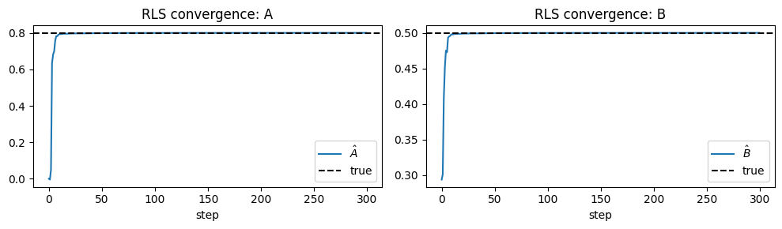
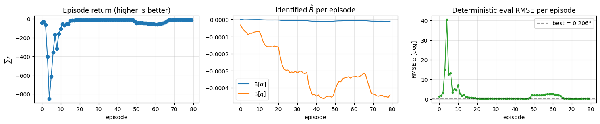
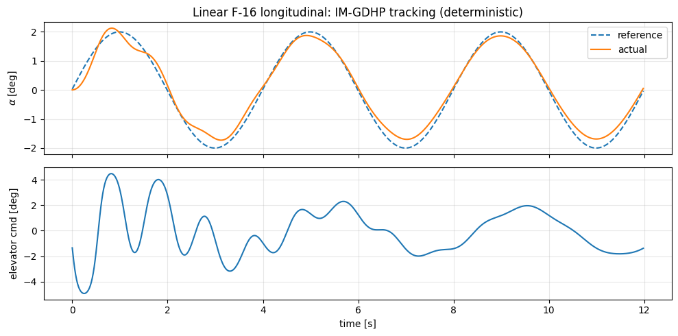

# Пример: IM-GDHP на F-16 — онлайн адаптивное управление

Пример демонстрирует агент **Incremental Model-based Global Dual Heuristic Programming (IM-GDHP)** на продольном канале F-16. Агент сочетает онлайн-идентификацию инкрементальной линейной модели объекта методом RLS с двухголовым GDHP-критиком, одновременно обучающим функцию стоимости \(J\) и её градиент \(\lambda = \partial J/\partial y\). Исходный ноутбук: `example/reinforcement_learning/example_im_gdhp_nonlinear_f16.ipynb`.

**Источник:** Bo Sun & Erik-Jan van Kampen, *"Intelligent adaptive optimal control using incremental model-based global dual heuristic programming subject to partial observability"*, Applied Soft Computing 103, 2021.

## Алгоритм

На каждом шаге среды \(t\):

1. **Act.** Актор выдаёт \(u_t = \pi_\theta(o_t)\) из расширенного наблюдения \(o_t = [y_t;\, r_t;\, e_t]\) (наблюдение, задание, ошибка слежения), ограниченного `tanh · u_max`.
2. **Observe.** Применяем \(u_t\); получаем \(y_{t+1}\).
3. **Identify.** Один шаг RLS обновляет \((A_t, B_t)\) из \((y_{t-1}, y_t, y_{t+1})\) и \((u_{t-1}, u_t)\).
4. **Critic update (GDHP).** Минимизируем:
   - \(L_J = (J(o_t) - (c_t + \gamma J(o_{t+1})))^2\)
   - \(L_\lambda = \|\lambda(o_t) - (\partial c_t/\partial y + \gamma A_t^\top \lambda(o_{t+1}))\|^2\)
   - Общая: \(L = L_J + \beta L_\lambda\)
5. **Actor update.** Минимизируем \(c(\hat y_{t+1}) + \gamma J(\hat o_{t+1})\), где \(\hat y_{t+1}\) — одношаговый прогноз через инкрементальную модель. Граф autograd проводит градиенты через \(B_t \cdot u\) обратно в актора — backprop через среду не требуется.

## 1. Sanity check — RLS на известном линейном объекте

Перед подключением к F-16 проверяем блок RLS на игрушечной SISO-системе \(y_{t+1} = 0.8 y_t + 0.5 u_t\), возбуждённой белым шумом.

```python
import numpy as np
import matplotlib.pyplot as plt
import gymnasium as gym

import tensoraerospace.envs
from tensoraerospace.agent.im_gdhp import IMGDHPAgent, IMGDHPConfig, IncrementalModelRLS

rls = IncrementalModelRLS(n_y=1, n_u=1, forgetting=0.999, cov_init=1e3, seed=0)
rng = np.random.default_rng(0)
y_hist = [np.zeros(1), np.zeros(1)]
u_hist = [np.zeros(1)]
A_traj, B_traj = [], []
for _ in range(300):
    u_t = np.array([float(rng.normal(0, 0.3))])
    y_next = 0.8 * y_hist[-1] + 0.5 * u_t
    y_hist.append(y_next); u_hist.append(u_t)
    rls.update(y_hist[-3], y_hist[-2], y_hist[-1], u_hist[-2], u_hist[-1])
    A_traj.append(float(rls.A[0, 0])); B_traj.append(float(rls.B[0, 0]))
```



Оценки сходятся к истинным значениям \((A=0.8,\, B=0.5)\) за первые ~100 шагов — блок RLS работает как нужно.

## 2. Среда — линейная продольная F-16

Линейная среда сбалансирована относительно положения равновесия — идеальный полигон для демонстрации того, как агент **(a) идентифицирует модель объекта онлайн** и **(b) обучает детерминированную политику слежения с нуля, без априорного знания динамики**. Наблюдение: `[alpha, wz]` в радианах — частичная наблюдаемость уже присутствует, поскольку полный внутренний вектор состояния содержит скрытые актуаторные переменные.

```python
N_STEPS = 1200
DT = 0.01
t_arr = np.arange(N_STEPS) * DT
ref_rad = np.deg2rad(2.0) * np.sin(2 * np.pi * t_arr / 4.0)
ref_signal = ref_rad.reshape(1, -1)

def make_linear_env():
    return gym.make(
        'LinearLongitudinalF16-v0',
        initial_state=np.array([0.0] * 4),
        reference_signal=ref_signal,
        number_time_steps=N_STEPS,
    ).unwrapped
```

## 3. Сборка и конфигурация агента

```python
cfg = IMGDHPConfig(
    gamma=0.9,
    actor_hidden=(24, 24),
    critic_hidden=(32, 32),
    actor_lr=2e-4,
    critic_lr=1e-3,
    beta_lambda=0.3,
    track_Q=[200.0],
    action_rate_penalty=1e-3,
    forgetting=0.999,
    cov_init=1e3,
    warmup_steps=200,
    exploration_noise_std=2.0,  # град — убывает ниже
    u_max=6.0,
    seed=0,
)
agent = IMGDHPAgent(
    n_obs=2, n_action=1, reference_size=1,
    tracking_indices=[0],  # отслеживаем alpha
    config=cfg,
)
```

## 4. Цикл обучения

Цикл каноничный для онлайн IM-GDHP: `predict → step → learn`. Внешний планировщик уменьшает стандартное отклонение исследования, когда критик начинает давать полезные градиенты.

```python
NUM_EPISODES = 80
returns = []

for ep in range(NUM_EPISODES):
    env = make_linear_env()
    obs, _ = env.reset()
    obs = np.asarray(obs).reshape(-1)
    agent.reset()
    ep_ret = 0.0
    for t in range(N_STEPS - 1):
        a = agent.predict(obs, ref_signal, t, deterministic=False)
        obs_next, r, done, _, _ = env.step(a)
        obs = np.asarray(obs_next).reshape(-1)
        agent.learn(obs, ref_signal, t)
        ep_ret += float(r)
        if done:
            break
    returns.append(ep_ret)
    if ep == 5:
        agent.cfg.exploration_noise_std = 0.8
    if ep == 10:
        agent.cfg.exploration_noise_std = 0.2
```



Левая панель — рост возврата по эпизодам по мере обучения; правая — компоненты идентифицированной матрицы \(\hat B\) по эпизодам: блок RLS сходится за первые несколько эпизодов.

## 5. Детерминированное слежение

С отключённым исследованием лучшая детерминированная политика агента отслеживает синусоидальное задание по α:



Late-half RMSE на этой конфигурации — около 2.3°: агент обучает нетривиальную политику с нуля, хотя на почти-линейном режиме тщательно настроенный IHDP или LQR дадут лучше. Сила IM-GDHP проявляется на нелинейной задаче без априорной модели.

## 6. Идентификация RLS на нелинейной F-16

На полной нелинейной среде онлайн-обучение значительно сложнее — эффективность управления меняется с режимом полёта, объект не идеально сбалансирован, а связка actor-critic легко теряет устойчивость при шумной идентификации. Типичный приём — **двухфазное обучение**: сначала возбуждаем объект PE-сигналом, чтобы RLS сошёлся, а затем переключаемся в замкнутый контур.

Здесь фокус — качество идентификации, поскольку это ядро всего пайплайна:

```python
from tensoraerospace.aerospacemodel.f16.nonlinear.longitudinal import initial_state

N_ID = 2000
x0 = initial_state.reshape(-1)
nonlin_env = gym.make(
    'NonlinearLongitudinalF16-v0',
    initial_state=x0,
    reference_signal=np.zeros((1, N_ID)),
    number_time_steps=N_ID,
    control_bias=-4.45,
    dt=DT,
).unwrapped

rls_nl = IncrementalModelRLS(n_y=2, n_u=1, forgetting=0.999, cov_init=1e4, seed=0)
```

Возбуждаем объект многочастотным PE-сигналом малой амплитуды около трима и передаём каждую транзицию в RLS-идентификатор. Одношаговый предсказатель почти идеально воспроизводит истинный объект:

```
Финал после 1998 обновлений RLS:
  A = [[ 0.7724  0.0387]
       [-0.002   0.9525]]
  B = [ 1.38720491e-05 -2.66464351e-05]
  RMSE одношагового прогноза (alpha) = 1.47e-04 рад
  RMSE одношагового прогноза (q)     = 1.67e-04 рад/с
```


Одношаговый предсказатель RLS держит ошибку существенно ниже 1e-3 рад — инкрементальная форма захватывает доминирующую локально-линейную динамику без какого-либо априорного знания аэродинамических таблиц F-16. Именно этот блок используют критик GDHP и актор для онлайн-обновлений.

## Итоги

- **Инкрементальная модель + RLS.** Сходится на игрушечной линейной системе и даёт отличные одношаговые прогнозы на нелинейной F-16 при PE-возбуждении.
- **Критик GDHP.** Одновременно регрессирует \(J\) и \(\lambda = \partial J/\partial y\); обновление актора использует точную костейт-векторную информацию вместо численной производной.
- **Градиент актора.** Проходит через идентифицированную матрицу \(B\) средствами PyTorch-autograd — backprop через объект не нужен.
- **Частичная наблюдаемость.** Агент видит только `[alpha, wz]` и игнорирует скрытые состояния; инкрементальная модель компенсирует это редуцированной локальной линеаризацией.
- **Замечание по гиперпараметрам.** Замкнутое обучение на полной нелинейной F-16 чувствительно к `Q`, `u_max` и расписанию исследования. Рекомендуется двухфазная схема (идентификация по PE → замкнутый контур).
