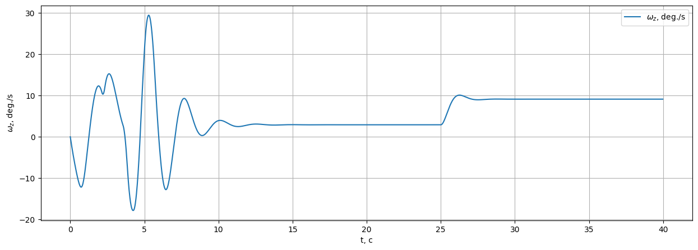
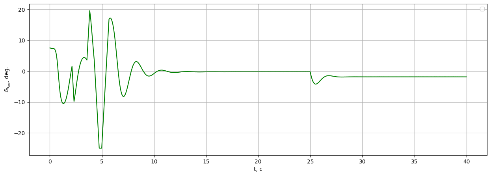

# IHDP при отказе системы в полёте

Демонстрация того, как регулятор **Incremental Heuristic Dynamic Programming (IHDP)** адаптируется при изменении динамики в полёте. Обучаемся на `LinearLongitudinalF16-v0` в течение 40 секунд, а в момент \(t=25\) с изменяем элемент дискретной матрицы A — имитация отказа управляющей поверхности или изменения аэродинамики.

Исходный ноутбук: `example/failure_demos/example_ihdp_failure.ipynb`.

## 1. Импорты

```python
import warnings
warnings.filterwarnings('ignore')

import gymnasium as gym
import numpy as np
import pandas as pd
from tqdm import tqdm

import tensoraerospace  # регистрирует Gymnasium-среды
from tensoraerospace.agent.ihdp.model import IHDPAgent
from tensoraerospace.signals.standard import unit_step
from tensoraerospace.utils import convert_tp_to_sec_tp, generate_time_period
```

## 2. Конфигурация эксперимента

```python
CONFIG = {
    "dt": 0.01,              # шаг интегрирования [с]
    "tn": 40,                # длительность симуляции [с]
    "step_amplitude_deg": 5, # амплитуда ступеньки по α [град]
    "step_time": 10,         # момент ступеньки [с]
    "failure_step": 2500,    # номер шага, на котором вводим отказ
    "failure_value": 0.98,   # новое значение A[1][1] после отказа
    "tracking_state": "alpha",
}
```

## 3. Среда

```python
tp = generate_time_period(tn=CONFIG["tn"], dt=CONFIG["dt"])
tps = convert_tp_to_sec_tp(tp, dt=CONFIG["dt"])
number_time_steps = len(tp)

reference_signals = np.reshape(
    unit_step(
        tp=np.asarray(tps, dtype=np.float32),
        degree=CONFIG["step_amplitude_deg"],
        time_step=CONFIG["step_time"],
        output_rad=True,
    ),
    (1, -1),
)

env = gym.make(
    'LinearLongitudinalF16-v0',
    number_time_steps=number_time_steps,
    initial_state=[[0], [0], [0], [0]],
    reference_signal=reference_signals,
    tracking_states=[CONFIG["tracking_state"]],
)
env.reset()
```

Дискретная матрица состояния линеаризованной F-16:

|        | theta | alpha    | q        | ele       |
|--------|-------|----------|----------|-----------|
| theta  | 1.000 | 0.000016 | 0.009959 | -0.000003 |
| alpha  | 0.000 | 0.994583 | 0.009090 | -0.000013 |
| q      | 0.000 | 0.003281 | 0.991879 | -0.000514 |
| ele    | 0.000 | 0.000000 | 0.000000 | 0.817095  |

Отказ перезаписывает `A[1][1]` (собственная связь α) с `0.994583` на `0.98`.

## 4. Конфигурация IHDP

```python
actor_settings = {
    "start_training": 5,
    "layers": (25, 1),
    "activations": ('tanh', 'tanh'),
    "learning_rate": 2,
    "learning_rate_exponent_limit": 10,
    "type_PE": "combined",
    "amplitude_3211": 15,
    "pulse_length_3211": 5 / CONFIG["dt"],
    "maximum_input": 25,
    "maximum_q_rate": 20,
    "WB_limits": 30,
    "NN_initial": 120,
    "cascade_actor": False,
    "learning_rate_cascaded": 1.2,
}

critic_settings = {
    "Q_weights": [8],
    "start_training": -1,
    "gamma": 0.99,
    "learning_rate": 15,
    "learning_rate_exponent_limit": 10,
    "layers": (25, 1),
    "activations": ("tanh", "linear"),
    "WB_limits": 30,
    "NN_initial": 120,
    "indices_tracking_states": env.unwrapped.indices_tracking_states,
}

incremental_settings = {
    "number_time_steps": number_time_steps,
    "dt": CONFIG["dt"],
    "input_magnitude_limits": 25,
    "input_rate_limits": 60,
}

agent = IHDPAgent(
    actor_settings, critic_settings, incremental_settings,
    env.unwrapped.tracking_states,
    env.unwrapped.state_space,
    env.unwrapped.control_space,
    number_time_steps,
    env.unwrapped.indices_tracking_states,
)
```

## 5. Симуляция с инъекцией отказа

```python
xt = np.array([[0], [0]])

for step in tqdm(range(number_time_steps - 1)):
    if step == CONFIG["failure_step"]:
        # Меняем A-матрицу объекта в момент t = 25 с. Агент об этом не знает.
        env.unwrapped.model.filt_A[1][1] = CONFIG["failure_value"]

    ut = agent.predict(xt, reference_signals, step)
    xt, reward, terminated, truncated, info = env.step(np.array(ut))
    if terminated or truncated:
        break
```

## 6. Результаты

**Слежение за углом атаки.** Отказ в \(t = 25\) с вызывает небольшой переходный процесс; инкрементальная модель IHDP подхватывает новую локальную линеаризацию за пару секунд и слежение восстанавливается.


**Угловая скорость тангажа.** Короткий всплеск в момент отказа, быстро демпфируется.



**Команда руля высоты.** Регулятор смещает рабочую точку, компенсируя изменившуюся динамику.



## Итог

| Фаза | Время | Поведение |
|------|-------|-----------|
| Штатный режим | 0 – 25 с | α отслеживает ступеньку 5° |
| Инъекция отказа | \(t = 25\) с | `A[1][1]` → 0.98 |
| Адаптация | 25 – 40 с | Инкрементальная модель IHDP переидентифицируется, слежение восстанавливается |

Ключевой вывод: онлайн-идентификация в IHDP позволяет регулятору самостоятельно восстановиться после неожиданного изменения динамики объекта — без перенастройки или рестарта.

## Опционально: количественная оценка

```python
from tensoraerospace.benchmark import ControlBenchmark

benchmark = ControlBenchmark()
metrics = benchmark.plot(
    np.rad2deg(reference_signals[0]),
    env.unwrapped.model.state_history['alpha'],
    dt=CONFIG['dt'],
    tps=tps,
    title="IHDP F-16 failure response",
)
```
