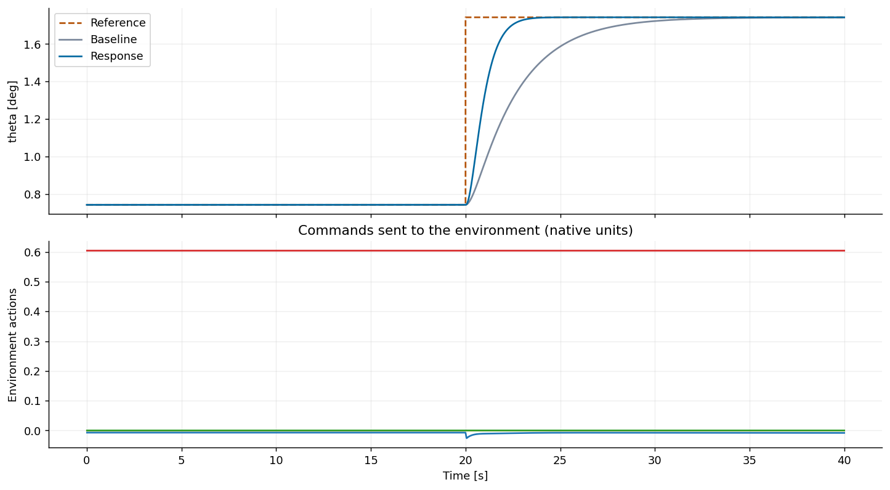
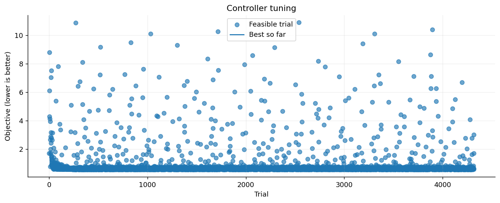

# Поиск и продолжение лучшего переходного процесса: AIDI на нелинейном B737

Пример использует SDK TensorAeroSpace: задаёт физический эксперимент, подбирает параметры нативного адаптивного контроллера, продолжает тот же поиск через `resume()` и сохраняет checkpoint. `find_best_response()` выделяет дополнительный бюджет на минимизацию выбранной метрики — CPI по умолчанию — даже если прежняя цель остановки уже достигнута.

Исходный режим самолёта — 10 000 ft / 600 ft/s. На 20-й секунде задание тангажа увеличивается на 1°; полный прогон длится 40 с при dt=0,01 с. Идентификация AIDI остаётся включённой весь эпизод. Каждый кандидат начинает с нового контроллера при одинаковых условиях моделирования. Профиль использует нативный интерфейс управления угловыми скоростями и внешний контур преобразования заданных углов в скорости.

В сохранённом запуске — 2200 начальных попыток, 2000 дополнительных через `resume()` и ещё 120 попыток, с 12 рабочими процессами. Для короткой демонстрации уменьшите бюджеты или число процессов; новый поиск может дать другой результат. Результат — **лучший проверенный допустимый процесс**, без гарантии глобального минимума. Выбранная траектория и две дополнительные амплитуды независимо пересчитаны перед публикацией.

```python
from pathlib import Path
import numpy as np
import pandas as pd
import matplotlib.pyplot as plt
import optuna
from IPython.display import display
from tensoraerospace.optimization import ControllerTuner, Step, Float

optuna.logging.set_verbosity(optuna.logging.WARNING)
plt.rcParams.update({"figure.dpi": 130, "axes.spines.top": False,
                     "axes.spines.right": False})
```

## 1. Эксперимент, требования и бюджет поиска

`Step(amplitude=1, at=20, unit="deg")` добавляет 1° к начальному балансировочному тангажу. До ступеньки задание удерживает исходное значение. Нативный бенчмарк вычисляет CPI по полному переходному процессу; `normalize=True` масштабирует каждый канал по амплитуде его задания. Значение CPI не ограничено диапазоном [0, 1].

Требования к точности ниже — **жёсткие ограничения**: их должен выполнить каждый проверяемый seed. Выход за область модели, неполная траектория, нечисловые состояния и невыполненные требования исключают кандидата. `target_cpi` только досрочно останавливает поиск при достаточно низком лучшем допустимом CPI. Недостигнутая цель не отбрасывает лучший допустимый результат.

```python
experiment = dict(
    env="NonlinearB737-v0",
    env_kwargs={"trim_at": (10000.0, 600.0), "dt": 0.01},
    reference={"theta": Step(amplitude=1.0, at=20.0, unit="deg")},
    controller="aidi",
    duration=40.0,
    seed=42,
)
constraints = {
    "relative_tail_max_error": 0.02,  # <= 2% of the commanded step
    "pre_step_relative_error": 0.02,
    "command_settling_time": 12.0,    # seconds after the step, 5% band
}
target_cpi = 0.3

budgets = (
    dict(initial=2200, resume=2000, best=120, unconstrained=120,
         genetic=120, multi=24, n_jobs=12)
)
display(pd.DataFrame([budgets], index=["Search budgets"]))

tuner = ControllerTuner(**experiment, method="tpe", constraints=constraints)
baseline = tuner.simulate()
```

<div>
<style scoped>
    .dataframe tbody tr th:only-of-type {
        vertical-align: middle;
    }

    .dataframe tbody tr th {
        vertical-align: top;
    }

    .dataframe thead th {
        text-align: right;
    }
</style>
<table border="1" class="dataframe">
  <thead>
    <tr style="text-align: right;">
      <th></th>
      <th>initial</th>
      <th>resume</th>
      <th>best</th>
      <th>unconstrained</th>
      <th>genetic</th>
      <th>multi</th>
      <th>n_jobs</th>
    </tr>
  </thead>
  <tbody>
    <tr>
      <th>Search budgets</th>
      <td>2200</td>
      <td>2000</td>
      <td>120</td>
      <td>120</td>
      <td>120</td>
      <td>24</td>
      <td>12</td>
    </tr>
  </tbody>
</table>
</div>

## 2. Параметры выбранного контроллера

Для AIDI встроенное пространство варьирует коэффициент внутреннего контура угловых скоростей, частоту среза фильтра, коэффициент внешнего контура, ковариацию RLS и `config.rls_sigma0`. `profile()` также показывает нативные пути параметров конструктора. У других контроллеров свои наборы параметров.

Необязательный словарь `known_ihdp_params` сохранён для переключения эксперимента на `controller="ihdp"`. Он получен в прежнем поиске iHDP для этого самолёта и ступеньки. Эти параметры используются только для iHDP; текущий поиск AIDI начинается без такой стартовой точки. Скорости обучения actor/critic не являются параметрами AIDI.

```python
profile = ControllerTuner.profile(experiment["controller"])
display(pd.DataFrame({"Search range": {
    name: repr(distribution) for name, distribution in profile["search_space"].items()
}}))

known_ihdp_params = {
    "actor_lr": 0.0011089721528085023,
    "critic_lr": 0.0987622995017457,
    "track_weight": 9.974992811899032,
    "gamma": 0.9944023883540949,
    "hidden_size": 16,
    "excitation_amplitude": 0.0011552319280603832,
    "actor_settings.learning_rate_decay": 0.9977777505481639,
    "critic_settings.learning_rate_decay": 0.9989690921428205,
}
initial_params = known_ihdp_params if tuner.controller == "ihdp" else None
```

<div>
<style scoped>
    .dataframe tbody tr th:only-of-type {
        vertical-align: middle;
    }

    .dataframe tbody tr th {
        vertical-align: top;
    }

    .dataframe thead th {
        text-align: right;
    }
</style>
<table border="1" class="dataframe">
  <thead>
    <tr style="text-align: right;">
      <th></th>
      <th>Search range</th>
    </tr>
  </thead>
  <tbody>
    <tr>
      <th>rate_gain</th>
      <td>FloatDistribution(high=10.0, log=True, low=0.5...</td>
    </tr>
    <tr>
      <th>cutoff_hz</th>
      <td>FloatDistribution(high=20.0, log=True, low=2.0...</td>
    </tr>
    <tr>
      <th>outer_gain</th>
      <td>FloatDistribution(high=1.0, log=True, low=0.1,...</td>
    </tr>
    <tr>
      <th>rls_cov_init</th>
      <td>FloatDistribution(high=10.0, log=True, low=0.1...</td>
    </tr>
    <tr>
      <th>config.rls_sigma0</th>
      <td>FloatDistribution(high=0.1, log=True, low=0.00...</td>
    </tr>
  </tbody>
</table>
</div>

## 3. Однократный запуск исследования

`optimize()` создаёт новое исследование. Выполните эту ячейку один раз, а для дополнительных попыток используйте следующую. TPE поддерживает параллельные процессы CPU: у каждого кандидата своя среда и контроллер. Прогресс показывает лучший допустимый результат и оценку оставшегося времени. Для отжига требуется `n_jobs=1`.

Если ни один кандидат не выполнил все жёсткие ограничения, посмотрите `tuner.diagnostics()`. После такой ошибки `resume()` может добавить попытки с сохранением требований.

```python
initial = tuner.optimize(
    n_trials=budgets["initial"],
    n_jobs=budgets["n_jobs"],
    target=target_cpi,
    initial_params=initial_params,
)
print("Initial selected parameters:", initial.best_params)
print("Initial normalized CPI:", initial.best_value)
print("Trials evaluated:", len(initial.study.trials))
```

```text
Initial selected parameters: {'rate_gain': 3.843117143499538, 'cutoff_hz': 18.171249399594355, 'outer_gain': 0.9999717553981868, 'rls_cov_init': 0.2513641850878104, 'config.rls_sigma0': 0.0012036520670622775}
Initial normalized CPI: 0.5677131999803134
Trials evaluated: 2200
```

```python
initial_figure = initial.plot_response(baseline=baseline)
plt.show()
```



## 4. Продолжение через `resume()`

Теперь `n_trials` означает **дополнительные** попытки. Сохраняются история, RNG и состояние метода поиска, лучший кандидат и прежнее число процессов. Повторный `optimize()` начинает поиск заново.

Переданный `target` проверяется по лучшему результату всей истории. Если цель достигнута, новые кандидаты не запускаются. Уберите `target`, если хотите продолжать улучшение независимо от старой цели. Среда, задание, метрика и ограничения должны оставаться прежними.

```python
previous_trials = len(tuner.optimizer.study.trials)
resumed = tuner.resume(
    n_trials=budgets["resume"],
    target=target_cpi,
)
print("Additional trials:", len(resumed.study.trials) - previous_trials)
print("Total trials:", len(resumed.study.trials))
print("CPI before / after continuation:", initial.best_value, resumed.best_value)
```

```text
Additional trials: 2000
Total trials: 4200
CPI before / after continuation: 0.5677131999803134 0.5677131999803134
```

## 5. Бюджет на лучший найденный переходный процесс

`find_best_response()` начинает поиск, если исследования ещё нет, и продолжает существующее в остальных случаях. Он минимизирует выбранную метрику, CPI по умолчанию, **без порога досрочной остановки по цели**. Остановка происходит по бюджету попыток, времени или необязательному `patience` — числу попыток без улучшения. Все жёсткие ограничения сохраняются.

Режим использует существующий оптимизатор, уравнения контроллера и определение CPI. Снижение CPI не означает улучшения каждого показателя: отдельно проверяйте точность, перерегулирование и установление.

В сохранённом запуске AIDI CPI снизился с 3,51360 у встроенных параметров до 0,567713, а время установления относительно задания — с 7,77 до 2,36 с. Продолжение увеличило историю с 2200 до 4200 и затем 4320 попыток без улучшения этого кандидата. Целевой CPI=0,3 не достигнут. Это сравнение со встроенными параметрами на данном эксперименте, без доказательства глобального минимума или превосходства над отдельно настроенным контроллером.

```python
result = tuner.find_best_response(
    n_trials=budgets["best"],
    patience=None,  # Use the full additional budget
)
print("Best observed parameters:", result.best_params)
print("Best observed normalized CPI:", result.best_value)
print("Total evaluated trials:", len(result.study.trials))

keys = ["cpi", "command_settling_time", "command_overshoot",
        "relative_tail_max_error", "pre_step_relative_error"]
display(pd.DataFrame({
    "Baseline": baseline.metrics,
    "Initial TPE search": initial.best_run.metrics,
    "After resume": resumed.best_run.metrics,
    "Best observed response": result.best_run.metrics,
}).loc[keys].T)
result.plot_response(baseline=baseline)
plt.show()
result.plot_history()
plt.show()
```

```text
Best observed parameters: {'rate_gain': 3.843117143499538, 'cutoff_hz': 18.171249399594355, 'outer_gain': 0.9999717553981868, 'rls_cov_init': 0.2513641850878104, 'config.rls_sigma0': 0.0012036520670622775}
Best observed normalized CPI: 0.5677131999803134
Total evaluated trials: 4320
```

<div>
<style scoped>
    .dataframe tbody tr th:only-of-type {
        vertical-align: middle;
    }

    .dataframe tbody tr th {
        vertical-align: top;
    }

    .dataframe thead th {
        text-align: right;
    }
</style>
<table border="1" class="dataframe">
  <thead>
    <tr style="text-align: right;">
      <th></th>
      <th>cpi</th>
      <th>command_settling_time</th>
      <th>command_overshoot</th>
      <th>relative_tail_max_error</th>
      <th>pre_step_relative_error</th>
    </tr>
  </thead>
  <tbody>
    <tr>
      <th>Baseline</th>
      <td>3.513600</td>
      <td>7.77</td>
      <td>0.000000</td>
      <td>0.001022</td>
      <td>8.011022e-14</td>
    </tr>
    <tr>
      <th>Initial TPE search</th>
      <td>0.567713</td>
      <td>2.36</td>
      <td>0.008232</td>
      <td>0.000025</td>
      <td>1.769184e-14</td>
    </tr>
    <tr>
      <th>After resume</th>
      <td>0.567713</td>
      <td>2.36</td>
      <td>0.008232</td>
      <td>0.000025</td>
      <td>1.769184e-14</td>
    </tr>
    <tr>
      <th>Best observed response</th>
      <td>0.567713</td>
      <td>2.36</td>
      <td>0.008232</td>
      <td>0.000025</td>
      <td>1.769184e-14</td>
    </tr>
  </tbody>
</table>
</div>




### Минимизация только CPI, без ограничений на точность

Для такого поиска явно создайте **отдельный** tuner с `constraints={}`. Он вернёт минимальный CPI среди полных физически допустимых траекторий, даже если цель по точности не выполнена. Проверки области модели, конечности состояний и приводов продолжают действовать. Прежний поиск с ограничениями не ослабляется и не смешивается с новым экспериментом.

Таблица явно проверяет прежние требования к точности на полученной траектории. Невыполненная цель означает, что кандидат не подходит, если это требование обязательно.

```python
cpi_tuner = ControllerTuner(
    **experiment, method="tpe", metric="cpi", constraints={},
)
cpi_only = cpi_tuner.find_best_response(
    n_trials=budgets["unconstrained"],
    n_jobs=budgets["n_jobs"],
    initial_params=result.best_params,
)
print("Lowest tested CPI without accuracy ceilings:", cpi_only.best_value)
quality_check = pd.DataFrame([
    {"Metric": name, "Measured": cpi_only.best_run.metrics[name],
     "Required maximum": bound,
     "Meets goal": (cpi_only.best_run.metrics[name] is not None
                    and np.isfinite(cpi_only.best_run.metrics[name])
                    and cpi_only.best_run.metrics[name] <= bound)}
    for name, bound in constraints.items()
]).set_index("Metric")
display(quality_check)
```

```text
Lowest tested CPI without accuracy ceilings: 0.5677131999803134
```

<div>
<style scoped>
    .dataframe tbody tr th:only-of-type {
        vertical-align: middle;
    }

    .dataframe tbody tr th {
        vertical-align: top;
    }

    .dataframe thead th {
        text-align: right;
    }
</style>
<table border="1" class="dataframe">
  <thead>
    <tr style="text-align: right;">
      <th></th>
      <th>Measured</th>
      <th>Required maximum</th>
      <th>Meets goal</th>
    </tr>
    <tr>
      <th>Metric</th>
      <th></th>
      <th></th>
      <th></th>
    </tr>
  </thead>
  <tbody>
    <tr>
      <th>relative_tail_max_error</th>
      <td>2.523823e-05</td>
      <td>0.02</td>
      <td>True</td>
    </tr>
    <tr>
      <th>pre_step_relative_error</th>
      <td>1.769184e-14</td>
      <td>0.02</td>
      <td>True</td>
    </tr>
    <tr>
      <th>command_settling_time</th>
      <td>2.360000e+00</td>
      <td>12.00</td>
      <td>True</td>
    </tr>
  </tbody>
</table>
</div>

## 6. Сохранение поиска и перезапуск Jupyter

Сохраняйте checkpoint после остановки поиска. В него входят эксперимент, все попытки и состояние метода поиска. Продолжается оптимизация параметров; обученные веса выбранной нейросети не сохраняются. Загружайте собственные доверенные pickle-файлы в совместимом окружении Python/SDK/Optuna.

`result.save("report.json")` экспортирует отчёт, а `save_checkpoint()` создаёт поиск, который можно продолжить.

```python
checkpoint = Path("adaptive-controller-search.pkl")
tuner.save_checkpoint(checkpoint)
print("Saved search checkpoint:", checkpoint.resolve())
```

В **новом ядре** выполните следующий код, чтобы продолжить TPE с ограничениями:

```python
from tensoraerospace.optimization import ControllerTuner

tuner = ControllerTuner.load_checkpoint("adaptive-controller-search.pkl")
result = tuner.resume(n_trials=120)  # Прежние число процессов и состояние поиска
# Или: result = tuner.find_best_response(n_trials=120)
result.plot_response()
result.plot_history()
```

Загрузка не запускает моделирование. Изменение самолёта, каналов, dt, ограничений или метрики требует нового исследования. `resume()` отклоняет такие изменения до запуска новых кандидатов.

## 7. Генетический поиск для того же контроллера

Создаётся отдельное исследование с Optuna NSGA-II, стартующее с найденных выше допустимых параметров AIDI. Начальные значения относятся к выбранному контроллеру. Пример демонстрирует API; он не сравнивает методы при одинаковом бюджете, поскольку генетический поиск получает готовую стартовую точку.

```python
genetic_tuner = ControllerTuner(
    **experiment,
    method="genetic",
    method_options={"population_size": 4},
    constraints=constraints,
)
genetic = genetic_tuner.find_best_response(
    n_trials=budgets["genetic"],
    n_jobs=min(budgets["n_jobs"], 4),
    initial_params=result.best_params,
)
display(pd.DataFrame({
    "TPE with continuation": result.best_run.metrics,
    "Warm-started genetic search": genetic.best_run.metrics,
}).loc[keys].T)
```

<div>
<style scoped>
    .dataframe tbody tr th:only-of-type {
        vertical-align: middle;
    }

    .dataframe tbody tr th {
        vertical-align: top;
    }

    .dataframe thead th {
        text-align: right;
    }
</style>
<table border="1" class="dataframe">
  <thead>
    <tr style="text-align: right;">
      <th></th>
      <th>cpi</th>
      <th>command_settling_time</th>
      <th>command_overshoot</th>
      <th>relative_tail_max_error</th>
      <th>pre_step_relative_error</th>
    </tr>
  </thead>
  <tbody>
    <tr>
      <th>TPE with continuation</th>
      <td>0.567713</td>
      <td>2.36</td>
      <td>0.008232</td>
      <td>0.000025</td>
      <td>1.769184e-14</td>
    </tr>
    <tr>
      <th>Warm-started genetic search</th>
      <td>0.567713</td>
      <td>2.36</td>
      <td>0.008232</td>
      <td>0.000025</td>
      <td>1.769184e-14</td>
    </tr>
  </tbody>
</table>
</div>

## 8. Несколько заданных состояний

Для каждого состояния задайте свою ступеньку. Адаптер AIDI преобразует задания тангажа и крена в задания угловых скоростей. Целевая функция — среднее нормализованных CPI каналов; `theta.cpi` и `phi.cpi` доступны отдельно.

Это новый эксперимент без ограничений на точность. Одноканальный результат задаёт начальные параметры; история исследования не переносится. Проверяйте ошибку и время установления каждого канала.

В сохранённом запуске на 24 попытки оба канала устанавливаются в полосе ±5% за 2,35 с. Максимальные ошибки в конце — около 0,0027% для тангажа и 0,0060% для крена. В этом эксперименте оба канала выполняют цель точности 2%. Если другой запуск показывает NaN для времени установления, процесс не установился на горизонте моделирования.

```python
multi_tuner = ControllerTuner(
    **{**experiment, "reference": {
        "theta": Step(0.5, at=20.0, unit="deg"),
        "phi": Step(1.0, at=20.0, unit="deg"),
    }},
    method="tpe",
)
multi = multi_tuner.find_best_response(
    n_trials=budgets["multi"],
    n_jobs=budgets["n_jobs"],
    initial_params=result.best_params,
)
display(pd.DataFrame({
    state: {key: multi.best_run.metrics[f"{state}.{key}"]
            for key in ["cpi", "command_settling_time", "relative_tail_max_error"]}
    for state in multi.best_run.states
}).T)
print("Mean channel CPI:", multi.best_value)
multi.plot_response()
plt.show()
```

<div>
<style scoped>
    .dataframe tbody tr th:only-of-type {
        vertical-align: middle;
    }

    .dataframe tbody tr th {
        vertical-align: top;
    }

    .dataframe thead th {
        text-align: right;
    }
</style>
<table border="1" class="dataframe">
  <thead>
    <tr style="text-align: right;">
      <th></th>
      <th>cpi</th>
      <th>command_settling_time</th>
      <th>relative_tail_max_error</th>
    </tr>
  </thead>
  <tbody>
    <tr>
      <th>theta</th>
      <td>0.556807</td>
      <td>2.35</td>
      <td>0.000027</td>
    </tr>
    <tr>
      <th>phi</th>
      <td>0.568038</td>
      <td>2.35</td>
      <td>0.000060</td>
    </tr>
  </tbody>
</table>
</div>

```text
Mean channel CPI: 0.5624227082544488
```


## 9. Проверка других амплитуд и нового seed

Повторите выбранные параметры на случаях, которые не использовались в одноканальном TPE с ограничениями. Для каждого случая создаётся новая среда и новый контроллер, онлайн-адаптация остаётся включённой. Проверяется переносимость гиперпараметров; обученная политика не загружается.

Сохранённые ступеньки −1° и +0,5° при seed=17 выполняют исходные ограничения точности: время установления относительно задания — 2,36 и 2,35 с, максимальные ошибки в конце ниже 0,0025% амплитуды. Две проверки исправного самолёта не доказывают робастность к отказам, шуму датчиков и другим режимам полёта.

```python
validation = {}
for amplitude in (-1.0, 0.5):
    check = ControllerTuner(**{
        **experiment,
        "reference": {"theta": Step(amplitude, at=20.0, unit="deg")},
    })
    run = check.simulate(result.best_params, seed=17)
    validation[f"{amplitude:+g} deg, seed=17"] = {
        key: run.metrics[key] for key in keys
    }
display(pd.DataFrame(validation).T)
```

<div>
<style scoped>
    .dataframe tbody tr th:only-of-type {
        vertical-align: middle;
    }

    .dataframe tbody tr th {
        vertical-align: top;
    }

    .dataframe thead th {
        text-align: right;
    }
</style>
<table border="1" class="dataframe">
  <thead>
    <tr style="text-align: right;">
      <th></th>
      <th>cpi</th>
      <th>command_settling_time</th>
      <th>command_overshoot</th>
      <th>relative_tail_max_error</th>
      <th>pre_step_relative_error</th>
    </tr>
  </thead>
  <tbody>
    <tr>
      <th>-1 deg, seed=17</th>
      <td>0.567585</td>
      <td>2.36</td>
      <td>0.008174</td>
      <td>0.000024</td>
      <td>1.769184e-14</td>
    </tr>
    <tr>
      <th>+0.5 deg, seed=17</th>
      <td>0.556772</td>
      <td>2.35</td>
      <td>0.008219</td>
      <td>0.000025</td>
      <td>3.538367e-14</td>
    </tr>
  </tbody>
</table>
</div>

## 10. Выбор контроллера, метрики и параметров

Этот же API принимает `iadp`, `imgdhp` (`im_gdhp`), `ihdp`, `et_dhp`, `aa_indi`, `aidi`, `hdp` и `mpc` с документированными ограничениями совместимости. `ControllerTuner.available_controllers()` показывает сочетания; `ControllerTuner.profile(name)` — встроенные диапазоны и нативные пути параметров. В декларативном профиле iHDP сейчас поддерживается один онлайн-эпизод.

Другая метрика выбирается в конструкторе, например `metric="iae"` или `metric="theta.cpi"`; `find_best_response()` учитывает этот выбор. Для iHDP можно задать своё пространство:

```python
search_space = {
    "actor_lr": Float(1e-5, 0.1, log=True),
    "critic_lr": Float(1e-5, 0.1, log=True),
    "track_weight": Float(0.1, 10.0, log=True),
    "actor_settings.learning_rate_decay": Float(0.995, 1.0),
    "critic_settings.learning_rate_decay": Float(0.995, 1.0),
}
```

Фиксированные настройки передаются в `controller_options`. При сравнении кандидатов сохраняйте среду, время ступеньки, бюджет обучения и seeds. Дополнительные попытки могут улучшить оценку или оставить её прежней; ни CPI=0, ни универсальный контроллер не гарантированы.

[Выполненный ноутбук](https://github.com/TensorAeroSpace/TensorAeroSpace/blob/develop/example/optimization/adaptive_controller_tuning.ipynb) · [API](../../optimization/optuna_based.md)
