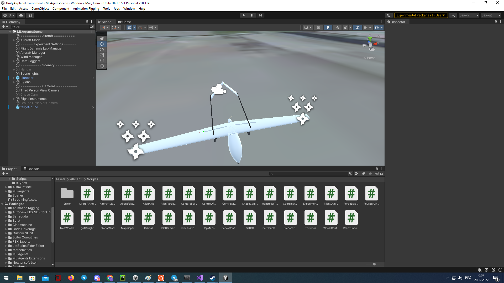

# Настройка Unity окружения

> Быстрый визуальный гайд по запуску Unity-среды и подключению из Python (TensorAeroSpace + ML-Agents).

<div class="grid cards" markdown>

-   :material-rocket-launch-outline: **Быстрый старт**

    Клонируйте проект, установите зависимости, откройте сцену и запустите.

    [:octicons-arrow-right-24: Перейти](#быстрый-старт)

-   :material-cube-outline: **Сборка окружения**

    Как собрать standalone-приложение и запустить в headless-режиме.

    [:octicons-arrow-right-24: Перейти](#сборка-окружения)

-   :material-connection: **Подключение из Python**

    Пример через `gym-unity`: билд и (опционально) Editor.

    [:octicons-arrow-right-24: Перейти](#подключение-из-python)

-   :material-lifebuoy: **Решение проблем**

    Типичные проблемы и их решения.

    [:octicons-arrow-right-24: Перейти](#типичные-проблемы-и-решения)

</div>

---

## Требования

- **Unity Hub** и **Unity 2021.3.5f1** (протестировано)
- **Python 3.8+** (рекомендуется 3.10–3.11) с `pip`
- Доступ к репозиторию `UnityAirplaneEnvironment`

!!! note "Совместимость версий"
    Примеры работают на Unity 2021.3.5f1 + `mlagents==1.1.0`. Для других версий проверьте документацию ML-Agents.

---

## Быстрый старт {#быстрый-старт}

### 1) Клонируйте репозиторий

```shell
git clone git@github.com:tensoraerospace/UnityAirplaneEnvironment.git
cd UnityAirplaneEnvironment
```

!!! info "Альтернатива через HTTPS"
    ```shell
    git clone https://github.com/TensorAeroSpace/UnityAirplaneEnvironment.git
    ```

### 2) Установка Python-зависимостей

Установите пакеты для связи Unity и Python:

```shell
pip install mlagents==1.1.0
```

!!! tip "Изолированное окружение"
    Рекомендуется использовать `venv`/`conda`.

### 3) Установка Unity

- Установите Unity Hub: `https://unity.com/download`
- В Hub добавьте редактор **Unity 2021.3.5f1**: `https://unity.com/releases/editor/archive`

!!! warning "Важно"
    Используйте указанную версию редактора. Несовпадение версий может сломать пакеты/сцены.

### 4) Откройте проект в Unity Hub

1) Запустите Unity Hub → "Open" → укажите директорию проекта.  
2) Выберите проект и откройте его.

{ width=800 }
{ width=800 }
{ width=800 }

### 5) Выберите сцену и запустите

В Unity Editor откройте `Assets/AlbLab3/Scenes/MLAgentsScenes` → например, `MLAgentsScene`.

{ width=800 }

Нажмите ▶ (Play) — сцена должна запуститься без ошибок.

!!! success "Готово"
    Если Play запускается и агенты активируются, можно переходить к подключению из Python.

---

## Сборка окружения {#сборка-окружения}

Рекомендуется для стабильного запуска и headless-режима:

1) В Unity откройте File → Build Settings…  
2) Выберите платформу (Windows/Mac/Linux) и добавьте сцену в "Scenes In Build".  
3) (Опционально) Player Settings → включите "Run In Background".  
4) Нажмите "Build" и выберите путь (например, `./Builds/AirplaneEnv/AirplaneEnv`).

!!! note "Headless-режим"
    Для серверов и CI используйте сборку без графики и установите `no_graphics=True` при инициализации среды из Python.

---

## Подключение из Python {#подключение-из-python}

=== "Билд"

```python
from gym_unity.envs import UnityToGymWrapper
from mlagents_envs.environment import UnityEnvironment

# Путь к собранному окружению
env_path = "./Builds/AirplaneEnv/AirplaneEnv"
unity_env = UnityEnvironment(file_name=env_path, no_graphics=True)
env = UnityToGymWrapper(unity_env, uint8_visual=False)

obs = env.reset()
done = False
total_reward = 0.0

while not done:
    action = env.action_space.sample()
    obs, reward, done, info = env.step(action)
    total_reward += reward

print("Награда за эпизод:", total_reward)
env.close()
```

=== "Editor (опционально)"

```python
from gym_unity.envs import UnityToGymWrapper
from mlagents_envs.environment import UnityEnvironment

# Подключение к Editor: запустите сцену в Play-режиме
unity_env = UnityEnvironment(file_name=None)
env = UnityToGymWrapper(unity_env, uint8_visual=False)

obs = env.reset()
action = env.action_space.sample()
obs, reward, done, info = env.step(action)
env.close()
```

!!! info "Editor vs Билд"
    - Editor удобен для отладки; соединение может быть нестабильным.  
    - Билд предпочтителен для экспериментов/серверов (без графики).

---

## Типичные проблемы и решения {#типичные-проблемы-и-решения}

- **Несовпадение версий пакетов**  
  Убедитесь, что установлена совместимая версия: `mlagents==1.1.0`.

- **Сцена не запускается (Editor)**  
  Проверьте консоль Unity, пакеты в `Packages/manifest.json` и что сцена добавлена в Build Settings.

- **Python не находит окружение**  
  Проверьте путь `file_name` к билду (для Build) или что Editor в Play-режиме (для Editor).  
  На Linux убедитесь, что бинарник исполняемый (`chmod +x`).

- **Конфликт портов**  
  Если порт занят, закройте другие экземпляры среды/Editor. Перезапустите Python-процесс.

---

## Что дальше

- Запустите примеры TensorAeroSpace с агентами (см. разделы "Модели" и "Агенты")
- Интегрируйте Unity-среду в бенчмарки и скрипты обучения
- Создавайте собственные контроллеры и награды, собирайте сцены для ваших задач

## Связанные примеры

- [Unity с DQN](../example/environment/unity_example.md) — обучение DQN-агента
- [Unity с SAC](../example/agent/sac/example-sac-unity.md) — обучение SAC-агента (непрерывное управление)
