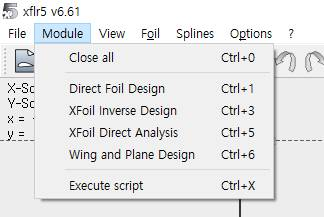

# Анализ профиля крыла (Airfoil Analysis)

## Цель

Подготовить и проанализировать аэродинамические характеристики профиля крыла в XFLR5: подобрать/создать профиль, выполнить расчёт Cl, Cd, Cm на диапазонах углов атаки, чисел Рейнольдса и Маха, сохранить полярные кривые для дальнейшего анализа самолёта.

## Пошаговый план

1. Откройте вкладку Direct Foil Design (Ctrl+1).
2. Создайте NACA‑профиль (Alt+N) или загрузите .dat файл собственного профиля.
3. Перейдите в XFoil Direct Analysis → Analysis → Batch Analysis.
4. Задайте диапазоны: число Рейнольдса, число Маха, углы атаки (начало, конец, шаг).
5. Запустите расчёт и проверьте полярные кривые. Сохраните результаты.

## Параметры анализа — кратко

- Re (число Рейнольдса): режим обтекания (ламинарный/турбулентный), масштаб модели.
- M (число Маха): важен при высоких скоростях (сжимаемость).
- α (угол атаки): диапазон для построения поляр и поиска максимального качества.

## Примечания и советы

> Совет: для анализа самолёта желательно иметь полярные кривые для нескольких значений Re (например, для разных скоростей полёта). Это повысит достоверность итоговой модели.
> Примечание: если профиль нестандартный, проверьте корректность файла .dat (число точек, порядок обхода). Ошибки в файле приводят к некорректным полярным кривым.

Для первого этапа нажмите «CTRL+1» или в панели вкладок выберите «Direct foil Design». Далее «ALT+N» для создания NACA профилей. Для нестандартного профиля воспользуйтесь загрузкой .dat (на рисунке выделена красным квадратом).

{ width=800 }

{ width=800 }

После определения профилей рассчитайте аэродинамику в «XFoil Direct Analysis». Во вкладке «Analysis» → «Batch Analysis» задайте Re, M, углы атаки. Для анализа самолёта требуются данные для нескольких Re.

{ width=800 }

{ width=800 }
