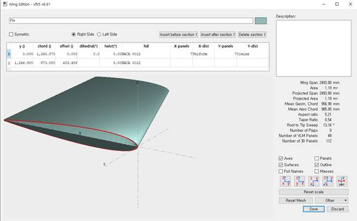
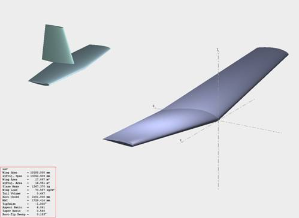
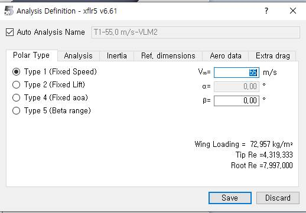
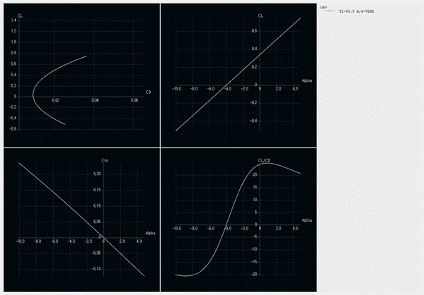

# Анализ самолета (Plane Analysis): аэродинамический анализ

## Цель

Собрать геометрию самолёта (крыло/оперение), задать инерционные характеристики и выполнить аэродинамический расчёт для получения поляр и интегральных коэффициентов.

## Пошаговый план

1. Откройте Wing and Plane Design → Define New Plane (или F3).
2. В разделе Define задайте: размах, хорды, стреловидность, профили, положение элементов по осям x/y/z.
3. Перейдите в Plane inertia и задайте массу; моменты инерции будут рассчитаны автоматически (при необходимости задайте вручную).
4. Откройте Analysis → Define an Analysis и укажите параметры расчёта: Polar Type, Method, Inertia/Ref dimension, плотность/вязкость (Aero data), доп. сопротивление (Extra drag).
5. Выполните расчёт, изучите полярные кривые и ключевые показатели (качество, моментные коэффициенты, положение нейтральной точки).

## Подсказки

> Совет: если самолёт предполагается использовать в разных режимах, создайте несколько анализов с различными настройками (масса, Re, M), затем сравните результаты.

Для построения ОУ (объекта управления) в разделе «Wing and Plane Design» нажмите F3 или «Define New Plane».

{ width=800 }

«Define» служит для задания размаха крыла, длины хорды, стреловидности, профиля крыла; здесь же доступны основные параметры (площадь, удлинение, средняя аэродинамическая хорда) для Main Wing, Elevator, Fin, а также положение элементов по осям x, y, z.

{ width=800 }

{ width=800 }

{ width=800 }

Для расчёта аэродинамических характеристик задайте массу и (при необходимости) моменты инерции во вкладке Plane inertia. После задания массы инерции считаются автоматически; в рабочей области появится эскиз ОУ и слева — основные физико‑геометрические характеристики.

{ width=800 }

{ width=800 }

Далее во вкладке «Analysis» → «Define an Analysis» укажите параметры расчёта.

{ width=800 }

Во вкладке Polar Type задаётся тип поляр, в Analysis — метод расчёта, в Inertia — возможность задать собственные моменты инерции, Ref dimension — выбор критерия подобия, Aero data — плотность и кинематическая вязкость, Extra drag — дополнительное сопротивление.

По результатам видно, является ли ОУ статически устойчивым, при каких углах достигается максимальное качество и как ведёт себя момент тангажа.

{ width=800 }
