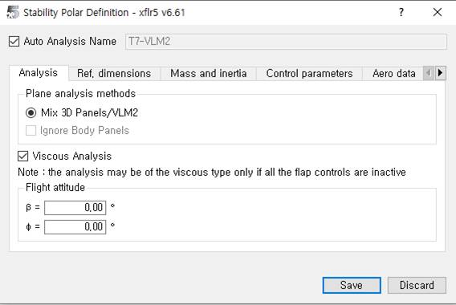
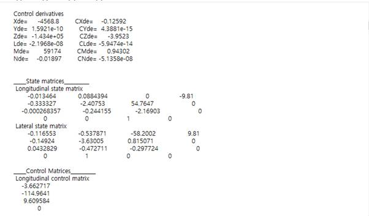

# Анализ самолёта (Plane Analysis): анализ устойчивости

## Цель

Провести расчёт продольной и боковой динамики (статическая и динамическая устойчивость), получить матрицы состояния и чувствительность к отклонениям рулевых поверхностей.

## Пошаговый план

1. Откройте Analysis → Define a Stability Analysis (Shift+F6).
2. Задайте параметры (метод, шаги по углам, режимы).
3. В правой верхней части задайте диапазоны отклонений рулевых поверхностей: начало, конец, шаг.
4. Выполните расчёт для продольного и бокового движения.
5. Просмотрите результаты: матрицы состояния, частоты/коэффициенты затухания мод, графики.

## Советы

> Используйте историю расчётов (клавиша L) и сохраняйте матрицы для экспорта в дальнейшие инструменты (например, в Simulink).

Для анализа устойчивости перейдите в «Analysis» → «Define a Stability Analysis» или нажмите «SHIFT+F6».

{ width=800 }

Расчёт ведётся панельным методом. После задания параметров справа вверху выберите углы отклонения несущих поверхностей (начало, конец, шаг). Расчёт проводится для продольного и бокового движений.

В конце получите необходимые характеристики для каждой точки. Результаты можно смотреть по параметрам или через историю (клавиша «L»). Ниже пример матрицы состояния для ОУ с отклонённым рулём на 2° при α=0°.

{ width=800 }

{ width=800 }
