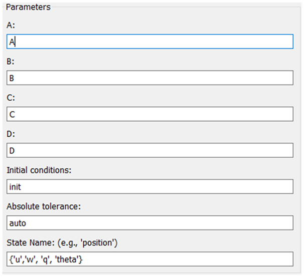

# Создание модели в Simulink

## Создание объекта управления в Simulink

{ width=400 }

Для создания ОУ в Simulink выполните:

1. В рабочее поле добавьте элементы из библиотеки Simulink:
   - Simulink/Continuous/State-Space
   - Simulink/Sources/Digital Clock
   - Simulink/Comonly Used Block/In1
   - Simulink/Comonly Used Block/Out1
2. Переименуйте блоки In1/Out1 в осмысленные имена сигналов.
3. В блоке State-Space задайте параметры (удобно через MATLAB scripts).

{ width=400 }
