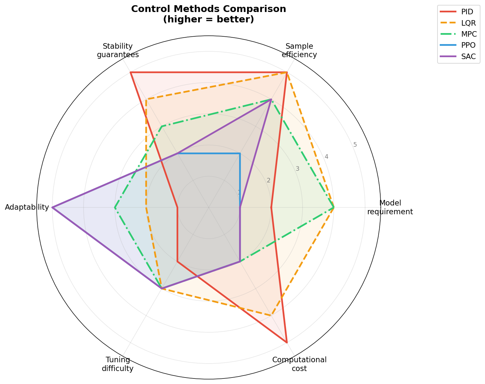

# Урок 8 — Введение в обучение с подкреплением для управления летательными аппаратами

## 1. Зачем обучение с подкреплением в авиакосмической области?

В уроках 1--7 мы изучили классическую теорию управления: модели в пространстве состояний, анализ устойчивости, размещение полюсов, синтез наблюдателей и настройку ПИД-регуляторов. Эти методы десятилетиями составляют основу систем управления полетом и остаются незаменимыми. Однако у них есть хорошо известные ограничения:

* **Фиксированные коэффициенты усиления.** Регулятор, спроектированный для одного режима полета (высоты, скорости, массы), может работать плохо на другом. Переключение коэффициентов (gain scheduling) частично решает проблему, но требует проектирования для большого числа расчетных точек.
* **Потребность в точной модели.** Размещение полюсов и ЛКР (LQR) опираются на точное знание матриц $A$, $B$, $C$, $D$. На практике аэродинамические коэффициенты содержат неопределенности и меняются в результате износа, повреждений или обледенения.
* **Отсутствие адаптации.** Классические регуляторы не обучаются на опыте. Если объект управления изменяется (например, частичный отказ исполнительного механизма), регулятор не может подстроиться самостоятельно.
* **Трудности с нелинейностями.** Линеаризация справедлива лишь вблизи рабочей точки. Маневры с большими углами, области сваливания и перекрестные связи между каналами сложно учесть.

**Обучение с подкреплением (Reinforcement Learning, RL)** предлагает принципиально иную парадигму: вместо того чтобы выводить закон управления из математической модели, регулятор обучается, взаимодействуя с системой (или ее моделью). Основные преимущества:

* **Не требуется явная модель.** Агент самостоятельно выявляет поведение системы методом проб и ошибок.
* **Нелинейности обрабатываются естественным образом.** Нейросетевые политики могут представлять сильно нелинейные отображения.
* **Адаптация во времени.** Онлайн-обучение или непрерывная дообучение позволяют политике подстраиваться под изменяющуюся динамику.
* **Многокритериальная оптимизация.** Функция вознаграждения может кодировать сложные цели (слежение + экономия топлива + ограничения нагрузок на конструкцию).

Реальные авиакосмические применения RL уже активно исследуются:

* Управление ориентацией маневренных БПЛА в условиях ветровых возмущений
* Управляемый спуск многоразовых ракет-носителей (посадка в стиле SpaceX)
* Коррекция орбиты спутников при ограниченном запасе топлива
* Адаптивное управление полетом поврежденного самолета
* Автономное воздушное маневрирование

В этом уроке мы познакомимся с основами RL, покажем связь с уже известными вам классическими концепциями и продемонстрируем, как TensorAeroSpace объединяет оба подхода.

---

## 2. Основы RL за 5 минут

### 2.1 Ключевые понятия

Система RL состоит из двух сущностей:

| Понятие | Аналог в классическом управлении | Термин RL |
|---|---|---|
| Объект управления / самолет | Среда | **Среда** (environment) |
| Регулятор / автопилот | Агент | **Агент** (agent) |
| Показания датчиков | Наблюдение / измерение | **Состояние** $s_t$ |
| Управляющее воздействие | Команда на привод | **Действие** $a_t$ |
| Показатель качества | Функционал стоимости (ЛКР) | **Вознаграждение** $r_t$ |
| Закон управления $u = -Kx$ | Политика | **Политика** $\pi(a \mid s)$ |

На каждом дискретном шаге $t$ агент наблюдает состояние $s_t$, выбирает действие $a_t$ в соответствии со своей политикой $\pi$, а среда переходит в новое состояние $s_{t+1}$ и возвращает скалярное вознаграждение $r_t$. Цель агента --- максимизировать ожидаемое суммарное вознаграждение:

$$J = \mathbb{E}\left[\sum_{t=0}^{T} \gamma^t r_t\right]$$

где $\gamma \in [0,1]$ --- **коэффициент дисконтирования** (насколько агент ценит будущие вознаграждения по сравнению с немедленными).

### 2.2 Структура эпизода

Эпизод --- это одна полная последовательность взаимодействия:

```
reset() --> s_0
  |
  +--> агент выбирает a_0
  |       |
  |       +--> env.step(a_0) --> s_1, r_0, done_0
  |
  +--> агент выбирает a_1
  |       |
  |       +--> env.step(a_1) --> s_2, r_1, done_1
  |
  ... (повторяется до done=True)
```

В авиационных терминах: эпизод начинается в начальном режиме полета, автопилот выдает команды на руль высоты/тягу на каждом шаге, и эпизод завершается при достижении горизонта моделирования или при выходе самолета за пределы безопасной области полета.

### 2.3 Политика

Политика $\pi$ --- это отображение наблюдения в действие. В классическом управлении политика записывается в виде явной формулы, например $u = -Kx$. В RL политика, как правило, задается нейронной сетью:

$$a_t = \pi_\theta(s_t)$$

где $\theta$ --- обучаемые параметры (веса) сети. Обучение подстраивает $\theta$ так, чтобы максимизировать $J$.

Политики бывают **детерминированными** ($a = \mu_\theta(s)$, используется в DDPG) и **стохастическими** ($a \sim \pi_\theta(\cdot \mid s)$, используется в PPO и SAC). Стохастические политики выдают распределение вероятности по действиям --- обычно нормальное распределение с обучаемым средним и стандартным отклонением. Эта встроенная случайность обеспечивает исследование: агент пробует немного различающиеся управляющие воздействия и наблюдает, какие из них приносят более высокое вознаграждение.

### 2.4 Функции ценности и уравнение Беллмана

Две функции ценности являются центральными понятиями RL:

* **Функция ценности состояния** $V^\pi(s)$ --- ожидаемое суммарное вознаграждение, начиная с состояния $s$ и следуя политике $\pi$:

$$V^\pi(s) = \mathbb{E}_\pi\left[\sum_{k=0}^{\infty} \gamma^k r_{t+k} \;\middle|\; s_t = s\right]$$

* **Функция ценности действия** $Q^\pi(s,a)$ --- ожидаемое суммарное вознаграждение, начиная с состояния $s$, выполняя действие $a$, а затем следуя политике $\pi$:

$$Q^\pi(s,a) = \mathbb{E}_\pi\left[\sum_{k=0}^{\infty} \gamma^k r_{t+k} \;\middle|\; s_t = s, a_t = a\right]$$

Обе функции удовлетворяют **уравнению Беллмана**, выражающему рекурсивную зависимость:

$$Q^\pi(s,a) = r(s,a) + \gamma \, \mathbb{E}_{s' \sim P}\left[V^\pi(s')\right]$$

В авиационных терминах: $Q^\pi(s,a)$ отвечает на вопрос: «Если самолет находится в состоянии $s$ и я прямо сейчас отклоню руль высоты на величину $a$, а дальше буду следовать политике $\pi$, насколько хорошо пройдет оставшийся полет?» Уравнение Беллмана разлагает это на немедленное вознаграждение плюс дисконтированную будущую ценность --- та же самая структура, что и принцип оптимальности Беллмана в классическом динамическом программировании.

Алгоритмы актор-критик (A2C, PPO, SAC) поддерживают одновременно политику (актор) и функцию ценности (критик). Критик оценивает, насколько хороша текущая политика, а актор улучшает политику на основе обратной связи от критика.

### 2.5 On-policy и off-policy подходы

Алгоритмы RL делятся на две большие категории:

* **On-policy** (PPO, A2C, A3C): агент обучается на данных, собранных текущей политикой. После каждого обновления политики старые данные отбрасываются. Просто, но требует много данных.
* **Off-policy** (SAC, DDPG, DQN, DSAC): агент сохраняет прошлый опыт в **буфере воспроизведения** (replay buffer) и обучается на нем даже после изменения политики. Более эффективен по данным, но может быть менее стабильным.

Для авиакосмических применений, где каждый эпизод моделирования стоит дорого (высокоточные CFD-модели, полунатурное моделирование), off-policy алгоритмы вроде SAC часто предпочтительнее, так как они извлекают больше знаний из каждого взаимодействия.

### 2.6 Цикл взаимодействия агент--среда для управления тангажом B747

Рассмотрим задачу слежения за заданным углом тангажа для Boeing 747. Схема одного шага:

```
+--------------------+      действие: отклонение      +---------------------+
|                    |     руля высоты  delta_e        |                     |
|   Агент RL         |  -------------------------------->| Среда B747          |
|   (Нейросетевая    |                                   | (Модель в           |
|    политика)       |<----------------------------------| пространстве        |
|                    |   состояние: [alpha, q, theta, ..]| состояний)          |
+--------------------+   вознаграждение:               +---------------------+
                         -|theta - theta_ref|
```

Вектор состояния может включать угол атаки $\alpha$, угловую скорость тангажа $q$, угол тангажа $\theta$ и ошибку слежения. Вознаграждение штрафует за отклонение от опорного сигнала, побуждая агента обучить политику точного слежения.

---


## 3. RL и классическое управление --- когда что использовать

| Критерий | ПИД | ЛКР / Размещение полюсов | МПУ (MPC) | RL (PPO/SAC) |
|---|---|---|---|---|
| Требование к модели | Не нужна (настраивается онлайн) | Точная линейная модель | Точная модель (может быть нелинейной) | Не нужна (обучается по данным) |
| Адаптивность | Низкая (фиксированные коэффициенты) | Низкая | Средняя (пересчет на каждом шаге) | Высокая (обновление политики) |
| Вычислительные затраты (онлайн) | Очень низкие | Очень низкие | Высокие (оптимизация на каждом шаге) | Низкие (прямой проход через НС) |
| Гарантии устойчивости | Запасы по усилению и фазе | На основе Ляпунова | Удовлетворение ограничений | Нет формальных гарантий (эмпирически) |
| Учет ограничений | Нет | Косвенно (весовые матрицы) | Да (явные ограничения) | Через формирование вознаграждения |
| Нелинейные системы | Сначала линеаризация | Сначала линеаризация | Непосредственно | Непосредственно |
| Простота настройки | 3 коэффициента | Матрицы Q, R | Горизонт предсказания, функция стоимости | Функция вознаграждения, гиперпараметры |
| Многокритериальность | Затруднительно | Весовые матрицы Q, R | Многокомпонентный функционал | Гибкое проектирование вознаграждения |

**Правила выбора:**

* **ПИД** --- Используйте для простых одноканальных (SISO) контуров, где нужен быстрый и надежный базовый регулятор с минимальными вычислительными затратами (например, внутренний контур демпфирования угловой скорости).
* **ЛКР / Размещение полюсов** --- Используйте при наличии хорошей линейной модели, когда требуется доказуемая устойчивость и оптимальное качество.
* **МПУ (MPC)** --- Используйте при необходимости учета жестких ограничений (лимиты приводов, защита от выхода за ограничения по перегрузке) и при наличии достаточных вычислительных ресурсов.
* **RL** --- Используйте, когда система сложная, нелинейная или с неопределенностями; когда нужна адаптация регулятора; или когда задача включает многокритериальную оптимизацию, которую трудно выразить аналитически.

На практике RL и классические методы часто комбинируют: классический регулятор обеспечивает безопасную базовую линию, а RL дообучается поверх нее или постепенно замещает.

---




## 4. Алгоритмы RL в TensorAeroSpace

TensorAeroSpace содержит широкий набор алгоритмов управления --- как классических, так и основанных на обучении. Ниже приводится описание каждого с рекомендациями по применению.

### 4.1 PPO --- Proximal Policy Optimization

```python
from tensoraerospace.agent import PPO
```

* **Тип:** On-policy, градиент политики
* **Пространство действий:** Непрерывное
* **Ключевая идея:** Обрезает обновление политики, чтобы предотвратить слишком большие шаги и обеспечить стабильное обучение.
* **Когда использовать:** Первый выбор для большинства авиакосмических задач RL. Стабильный, универсальный, хорошо работает при умеренном объеме данных.

### 4.2 SAC --- Soft Actor-Critic

```python
from tensoraerospace.agent import SAC
```

* **Тип:** Off-policy, актор-критик с энтропийной регуляризацией
* **Пространство действий:** Непрерывное
* **Ключевая идея:** Максимизирует вознаграждение, одновременно максимизируя энтропию политики, что способствует исследованию и робастности.
* **Когда использовать:** Когда нужна более высокая эффективность использования данных, чем у PPO. Особенно эффективен для непрерывного управления с гладкой динамикой.

### 4.3 DDPG --- Deep Deterministic Policy Gradient

```python
from tensoraerospace.agent import DDPG
```

* **Тип:** Off-policy, детерминированный градиент политики
* **Пространство действий:** Непрерывное
* **Ключевая идея:** Обучает детерминированную политику $\mu(s)$ с использованием буфера воспроизведения и целевых сетей.
* **Когда использовать:** Задачи непрерывного управления с одним управляющим воздействием. Может быть менее стабильным, чем SAC; рекомендуется сначала попробовать SAC.

### 4.4 DSAC --- Distributional Soft Actor-Critic

```python
from tensoraerospace.agent import DSAC
```

* **Тип:** Off-policy, распределенное RL
* **Пространство действий:** Непрерывное
* **Ключевая идея:** Моделирует полное распределение доходности (не только среднее), что позволяет учитывать риски.
* **Когда использовать:** Когда важны запасы безопасности и нужно оптимизировать наихудший случай (например, посадка при боковом ветре).

### 4.5 A2C --- Advantage Actor-Critic

```python
from tensoraerospace.agent import A2C
```

* **Тип:** On-policy, актор-критик
* **Пространство действий:** Непрерывное или дискретное
* **Ключевая идея:** Синхронный вариант A3C. Использует оценки преимущества для снижения дисперсии.
* **Когда использовать:** Простой on-policy базовый алгоритм. Хорош для учебных целей и быстрых экспериментов.

### 4.6 A3C --- Asynchronous Advantage Actor-Critic

```python
from tensoraerospace.agent import Agent as A3CAgent
```

* **Тип:** On-policy, асинхронный многопоточный
* **Пространство действий:** Непрерывное или дискретное
* **Ключевая идея:** Запускает несколько экземпляров среды параллельно для ускорения исследования.
* **Когда использовать:** Когда есть много ядер CPU и нужно ускорить on-policy обучение.

### 4.7 DQN --- Deep Q-Network

```python
from tensoraerospace.agent import DQNAgent
```

* **Тип:** Off-policy, на основе функции ценности
* **Пространство действий:** Только дискретное
* **Ключевая идея:** Обучает функцию ценности действий $Q(s,a)$ и действует жадно.
* **Когда использовать:** Среды с дискретным пространством действий (например, авиасимуляторы Unity с дискретными уровнями тяги).

### 4.8 GAIL --- Generative Adversarial Imitation Learning

```python
from tensoraerospace.agent import GAIL
```

* **Тип:** Обучение подражанием
* **Пространство действий:** Непрерывное
* **Ключевая идея:** Обучает политику, подражая экспертным демонстрациям, с помощью дискриминатора, отличающего поведение агента от поведения эксперта.
* **Когда использовать:** Когда есть записанные данные полета от эксперта-пилота или существующего автопилота и нужно воспроизвести это поведение.

### 4.9 ADP / ADHDP --- Адаптивное динамическое программирование

```python
from tensoraerospace.agent import ADP
from tensoraerospace.agent import ADHDP
```

* **Тип:** Нейродинамическое программирование
* **Пространство действий:** Непрерывное
* **Ключевая идея:** Аппроксимирует уравнение Беллмана с помощью нейронных сетей (сеть действий + сеть критика). Имеет корни в теории оптимального управления.
* **Когда использовать:** Когда нужен подход RL, тесно связанный с классическим динамическим программированием и оптимальностью по Беллману.

### 4.10 HDP --- Heuristic Dynamic Programming

```python
from tensoraerospace.agent import HDP
```

* **Тип:** Нейродинамическое программирование
* **Пространство действий:** Непрерывное
* **Ключевая идея:** Вариант с моделью, использующий обученную модель системы наряду с сетями актора и критика.
* **Когда использовать:** Когда есть (или можно обучить) прямая модель объекта управления и нужно использовать ее для ускорения сходимости.

### 4.11 IHDP --- Integral Heuristic Dynamic Programming

```python
from tensoraerospace.agent import IHDPAgent
```

* **Тип:** Нейродинамическое программирование (на базе PyTorch)
* **Пространство действий:** Непрерывное
* **Ключевая идея:** Расширяет HDP интегральным действием для устранения установившейся ошибки.
* **Когда использовать:** Задачи слежения, где критически важна нулевая установившаяся ошибка.

### 4.12 MPC --- Модельное предиктивное управление

```python
from tensoraerospace.agent import MPC
```

* **Тип:** Модельное оптимальное управление
* **Пространство действий:** Непрерывное
* **Ключевая идея:** Решает задачу оптимизации на конечном горизонте на каждом шаге с использованием обученной или известной модели динамики.
* **Когда использовать:** Когда нужен учет ограничений и есть хорошая модель динамики. Мост между классическим и обучаемым управлением.

### 4.13 ПИД --- Классический ПИД-регулятор

Хотя ПИД не является алгоритмом RL, TensorAeroSpace включает его в качестве базового регулятора. Он незаменим для сравнительных исследований.

### 4.14 Схема выбора алгоритма

```
                    СТАРТ
                      |
            Есть ли экспертные данные?
                   /        \
                 Да           Нет
                  |            |
                GAIL     Пространство действий дискретное?
                          /            \
                        Да              Нет
                         |                |
                        DQN      Нужен ли учет рисков?
                                   /            \
                                 Да              Нет
                                  |                |
                                DSAC   Нужна ли высокая эффективность по данным?
                                            /            \
                                          Да              Нет
                                           |                |
                                          SAC          PPO (начните с него)
```

---

## 5. Интерфейс Gymnasium

Среды TensorAeroSpace следуют стандарту [Gymnasium](https://gymnasium.farama.org/). Это означает, что каждая среда --- будь то модель B747, F-16, спутника или ракеты --- предоставляет один и тот же интерфейс.

### 5.1 Основные методы

| Метод | Возвращает | Описание |
|---|---|---|
| `env.reset()` | `obs, info` | Сбрасывает среду в начальное состояние. Возвращает первое наблюдение и словарь с дополнительной информацией. |
| `env.step(action)` | `obs, reward, terminated, truncated, info` | Выполняет один шаг. Возвращает новое наблюдение, вознаграждение, флаги завершения и информацию. |

Два флага завершения соответствуют соглашению Gymnasium:

* **terminated** --- Эпизод завершен из-за физического условия (например, самолет вошел в режим сваливания или опорный сигнал полностью отработан).
* **truncated** --- Эпизод завершен из-за достижения временного лимита.

Эпизод считается завершенным, когда `terminated or truncated` равно `True`.

### 5.2 Пространства наблюдений и действий

Для типичной среды продольного движения самолета:

* **Наблюдение:** Вектор, содержащий переменные состояния (угол атаки, угловая скорость тангажа, угол тангажа и т.д.) и, возможно, ошибку слежения и опорный сигнал.
* **Действие:** Вектор отклонений управляющих поверхностей (например, угол руля высоты в радианах).

Оба пространства непрерывные (`gymnasium.spaces.Box`).

### 5.3 Пример кода: запуск среды B747

Следующий пример создает среду `ImprovedB747Env`, выполняет один эпизод с нулевым управлением и выводит суммарное вознаграждение. Это простейший способ взаимодействия со средой.

```python
import numpy as np
from tensoraerospace.envs import ImprovedB747Env
from tensoraerospace.signals.standard import unit_step
from tensoraerospace.utils import generate_time_period, convert_tp_to_sec_tp

# ----- Параметры моделирования -----
dt = 0.1                                              # шаг по времени (секунды)
tp = generate_time_period(tn=40, dt=dt)               # массив времени
tps = convert_tp_to_sec_tp(tp, dt=dt)                 # время в секундах
number_time_steps = len(tp)                            # общее число шагов

# Опорный сигнал: ступенька 1 градус угла тангажа (в радианах)
reference = np.reshape(
    unit_step(degree=1, tp=tp, time_step=50, output_rad=True),
    (1, -1),
)

# ----- Создание среды -----
env = ImprovedB747Env(
    initial_state=np.array([[0], [0], [0], [0]], dtype=np.float32),
    reference_signal=reference,
    number_time_steps=number_time_steps,
    dt=dt,
)

# ----- Запуск одного эпизода с нулевым управлением -----
obs, info = env.reset()
done = False
total_reward = 0.0

while not done:
    action = np.array([0.0], dtype=np.float32)   # нет управления
    obs, reward, terminated, truncated, info = env.step(action)
    done = terminated or truncated
    total_reward += reward

print(f"Эпизод завершен за {number_time_steps} шагов")
print(f"Суммарное вознаграждение без управления: {total_reward:.2f}")
print(f"Финальное наблюдение: {obs}")
```

**Что вы должны увидеть:** Без управления самолет не отслеживает опорный сигнал, и суммарное вознаграждение оказывается низким. Это базовая линия разомкнутой системы --- именно ее RL будет учиться улучшать.

### 5.4 Доступные среды

TensorAeroSpace предоставляет среды для широкого спектра летательных и космических аппаратов:

| Среда | Аппарат | Тип |
|---|---|---|
| `ImprovedB747Env` | Boeing 747 | Тяжелый транспортный самолет |
| `LinearLongitudinalB747` | Boeing 747 | Линейная продольная модель |
| `LinearLongitudinalF16` | F-16 Fighting Falcon | Истребитель |
| `F4CPitchEnvNormalized` | F-4C Phantom | Истребитель (канал тангажа) |
| `LinearLongitudinalF4C` | F-4C Phantom | Линейная продольная модель |
| `ImprovedX15Env` | X-15 | Гиперзвуковой экспериментальный самолет |
| `ImprovedUltrastickEnv` | Ultrastick 120 | Малый БПЛА |
| `LinearLongitudinalUAV` | Обобщенный БПЛА | Линейная продольная модель |
| `ImprovedLAPANEnv` | LAPAN Surveillance UAV | БПЛА наблюдения |
| `ImprovedELVEnv` | Ракета-носитель | Ракета |
| `LinearLongitudinalMissileModel` | Обобщенная ракета | Управляемая ракета |
| `ImprovedMissileEnv` | Обобщенная ракета | Улучшенная модель ракеты |
| `ImprovedComSatEnv` | Спутник связи | Удержание на орбите |
| `GeoSatEnv` | Геостационарный спутник | Коррекция орбиты |
| `ComSatEnv` | Спутник связи | Линейная модель спутника |

Все среды используют единый интерфейс Gymnasium, показанный выше.

---

## 6. От классического управления к RL: наведение мостов

Если вы проработали уроки 1--7, вы уже понимаете строительные блоки RL --- просто они называются иначе. Установим соответствие явно.

### 6.1 Модель в пространстве состояний становится средой Gymnasium

В уроке 7 самолет описывался системой:

$$\dot{x} = Ax + Bu, \quad y = Cx$$

В TensorAeroSpace эта же модель в пространстве состояний обернута в среду Gymnasium. Метод `step()` интегрирует уравнения на шаг $\Delta t$ вперед и возвращает новое состояние.

| Классическое управление | RL / Gymnasium |
|---|---|
| Вектор состояния $x = [\alpha, q]^T$ | `obs`, возвращаемое `env.step()` |
| Управляющее воздействие $u = \delta_e$ | `action`, передаваемое в `env.step()` |
| Интегрирование $x(t + \Delta t) = \ldots$ | Внутренняя динамика в `env.step()` |
| Начальное условие $x_0$ | `env.reset()` |

### 6.2 Матрица усиления K становится нейросетевой политикой

В уроке 7 закон управления был:

$$u = -Kx = -\begin{bmatrix} 26.4 & 15.7 \end{bmatrix} \begin{bmatrix} \alpha \\ q \end{bmatrix}$$

Это линейная политика. Агент RL заменяет $K$ нейронной сетью:

$$u = \pi_\theta(x)$$

Нейронная сеть может представлять любое нелинейное отображение, что означает возможность работы в ситуациях, где одного линейного коэффициента усиления недостаточно.

### 6.3 Функционал стоимости ЛКР становится функцией вознаграждения

В ЛКР минимизируемый функционал стоимости:

$$J = \int_0^\infty \left( x^T Q x + u^T R u \right) dt$$

В RL вознаграждение на каждом шаге часто определяется как:

$$r_t = -\left( x_t^T Q x_t + u_t^T R u_t \right)$$

(Обратите внимание на знак минус: ЛКР минимизирует стоимость, RL максимизирует вознаграждение.) Матрицы $Q$ и $R$ играют одну и ту же роль в обоих подходах --- они кодируют компромисс между точностью слежения и затратами на управление.

### 6.4 Почему RL может больше

Раз основы одинаковы, зачем связываться с RL? Потому что:

1. **Нелинейные системы.** Политика не ограничена линейностью. Она может обучить сложные стратегии управления для маневров с большими углами, вывода из сваливания или связанного бокового-путевого-продольного управления.
2. **Неизвестные возмущения.** В процессе обучения агент сталкивается с разнообразными возмущениями и обучается робастным реакциям. Ему не нужна явная модель возмущений.
3. **Многокритериальная оптимизация.** Функция вознаграждения может совмещать ошибку слежения, управляющее усилие, нагрузки на конструкцию, расход топлива и комфорт пассажиров --- все в одном скалярном сигнале.
4. **Перенос и обобщение.** Политика, обученная на множестве режимов полета, может обобщаться на невиданные условия, тогда как регуляторы с переключением коэффициентов требуют явного проектирования в каждой точке.

### 6.5 Пример: сравнение линейного регулятора и агента RL

Для наглядности покажем концептуальное сравнение на среде B747. Сначала применим простой пропорциональный регулятор (классический подход), затем отметим, где вместо него обучался бы агент RL.

```python
import numpy as np
from tensoraerospace.envs import ImprovedB747Env
from tensoraerospace.signals.standard import unit_step
from tensoraerospace.utils import generate_time_period, convert_tp_to_sec_tp

# ----- Настройка (аналогично предыдущему примеру) -----
dt = 0.1
tp = generate_time_period(tn=40, dt=dt)
tps = convert_tp_to_sec_tp(tp, dt=dt)
number_time_steps = len(tp)
reference = np.reshape(
    unit_step(degree=1, tp=tp, time_step=50, output_rad=True),
    (1, -1),
)

env = ImprovedB747Env(
    initial_state=np.array([[0], [0], [0], [0]], dtype=np.float32),
    reference_signal=reference,
    number_time_steps=number_time_steps,
    dt=dt,
)

# ----- Простой пропорциональный регулятор (классический подход) -----
K_p = 5.0   # коэффициент усиления (подобран вручную)

obs, info = env.reset()
done = False
total_reward_classical = 0.0
observations = [obs]

while not done:
    # Наблюдение содержит ошибку слежения; используем её напрямую
    error = obs[0] if len(obs.shape) == 1 else obs[0, 0]
    action = np.array([K_p * error], dtype=np.float32)
    obs, reward, terminated, truncated, info = env.step(action)
    done = terminated or truncated
    total_reward_classical += reward
    observations.append(obs)

print(f"Вознаграждение П-регулятора: {total_reward_classical:.2f}")

# ----- Место RL -----
# Вместо ручной настройки K_p агент RL (например, PPO):
#   1. Инициализирует нейросетевую политику pi_theta(obs) -> action
#   2. Собирает эпизоды, взаимодействуя со средой
#   3. Обновляет theta для максимизации суммарного вознаграждения
#   4. Повторяет, пока политика не превзойдет классический регулятор
#
# Подробности --- в Уроке 10.
```

---

## 7. Итоги

В этом уроке мы установили связь между классической теорией управления (уроки 1--7) и обучением с подкреплением:

| Что вы уже знаете | Что добавляет RL |
|---|---|
| Модели в пространстве состояний $\dot{x} = Ax + Bu$ | Среды Gymnasium с `reset()` / `step()` |
| Линейный закон управления $u = -Kx$ | Нейросетевая политика $\pi_\theta(s)$ |
| Функционал стоимости ЛКР $x^TQx + u^TRu$ | Функция вознаграждения $r_t$ |
| Устойчивость через анализ собственных чисел | Эмпирическая устойчивость через обучение |
| Размещение полюсов, синтез наблюдателя | Сквозное обучение через взаимодействие |

Ключевые выводы:

1. **RL не замена классическому управлению** --- это дополнение. Используйте классические методы, когда их достаточно; используйте RL, когда нужна адаптивность, работа с нелинейностями или многокритериальная оптимизация.
2. **Интерфейс Gymnasium** --- стандартный API для всех сред TensorAeroSpace. Освойте `reset()` и `step()`, и вы сможете работать с любой моделью аппарата.
3. **TensorAeroSpace предоставляет богатый набор алгоритмов** (PPO, SAC, DDPG, DSAC, A2C, A3C, DQN, GAIL, ADP, ADHDP, HDP, IHDP, MPC, ПИД), позволяющий выбрать подходящий инструмент для каждой задачи.
4. **Начните с PPO** для первых экспериментов с RL. Он стабилен, хорошо протестирован и работает на большинстве задач непрерывного управления.

---

## 8. Что дальше

* **Урок 9: Среды подробно** --- Мы рассмотрим весь набор сред TensorAeroSpace, их пространства состояний и действий, функции вознаграждения и способы настройки.
* **Урок 10: Обучение первого агента RL** --- Практическое занятие, на котором вы обучите агента PPO управлению углом тангажа B747 и сравните его с базовым ПИД-регулятором.

---

## 9. Задания для самостоятельной работы

### Упражнение 1: Исследование среды

Запустите код из раздела 5.3 с разными опорными сигналами. Попробуйте изменить амплитуду и момент ступеньки:

```python
# Вариант А: большая амплитуда ступеньки
reference_a = np.reshape(
    unit_step(degree=2, tp=tp, time_step=50, output_rad=True),
    (1, -1),
)

# Вариант Б: более ранняя ступенька
reference_b = np.reshape(
    unit_step(degree=1, tp=tp, time_step=20, output_rad=True),
    (1, -1),
)

# Вариант В: большая амплитуда, поздняя ступенька
reference_c = np.reshape(
    unit_step(degree=5, tp=tp, time_step=100, output_rad=True),
    (1, -1),
)
```

Для каждого варианта запишите суммарное вознаграждение и финальное наблюдение. Как меняется вознаграждение с увеличением амплитуды ступеньки? Почему?

### Упражнение 2: Попробуйте разные аппараты

Замените `ImprovedB747Env` на `ImprovedX15Env` или `ImprovedELVEnv`. Обратите внимание, что каждая среда может требовать начальное состояние другой размерности. Проверьте документацию или исходный код среды для определения ожидаемой формы `initial_state`.

Вопросы для ответа:
* Какова размерность вектора наблюдения для каждой среды?
* Сколько управляющих воздействий (действий) принимает каждая среда?
* Устойчиво ли поведение разомкнутой системы (нулевое управление)?

### Упражнение 3: Эксперимент с простым регулятором

Реализуйте пропорционально-дифференциальный (ПД) регулятор:

$$u = K_p \cdot e + K_d \cdot \dot{e}$$

где $e$ --- ошибка слежения. Производную $\dot{e}$ можно аппроксимировать численно:

```python
prev_error = 0.0
K_p = 5.0   # попробуйте значения в диапазоне [1, 20]
K_d = 0.5   # попробуйте значения в диапазоне [0.01, 5]

obs, info = env.reset()
done = False
total_reward = 0.0

while not done:
    error = obs[0] if len(obs.shape) == 1 else obs[0, 0]
    d_error = (error - prev_error) / dt
    action = np.array([K_p * error + K_d * d_error], dtype=np.float32)
    obs, reward, terminated, truncated, info = env.step(action)
    done = terminated or truncated
    total_reward += reward
    prev_error = error

print(f"Вознаграждение ПД-регулятора: {total_reward:.2f}")
```

Попробуйте не менее 5 комбинаций $(K_p, K_d)$ и запишите результаты. Обратите внимание, насколько трудоемка ручная настройка --- RL автоматизирует этот процесс поиска.

### Упражнение 4: Подбор алгоритма

Для каждого из сценариев ниже выберите наиболее подходящий алгоритм из раздела 4 и обоснуйте выбор:

* (а) Имеется 1000 записанных траекторий от эксперта-пилота, и нужно воспроизвести его поведение.
* (б) Нужен регулятор для спутника, который никогда не должен превышать предел тяги.
* (в) Нужен робастный регулятор тангажа для F-16 по всей области полетных режимов.
* (г) Имеется авиасимулятор Unity с 5 дискретными уровнями тяги.
* (д) Нужно минимизировать одновременно ошибку слежения и управляющее усилие, а модель динамики отсутствует.
* (е) Нужен регулятор, учитывающий наихудшие сценарии ветровых порывов при заходе на посадку.

### Упражнение 5: Концептуальные вопросы

1. Объясните своими словами, зачем нужен коэффициент дисконтирования $\gamma$. Что произойдет при $\gamma = 0$? А при $\gamma = 1$?
2. Какую роль в уравнении Беллмана играет математическое ожидание по $s'$? Как это связано со стохастическими возмущениями в управлении полетом?
3. Почему off-policy алгоритм (SAC) может быть предпочтительнее on-policy алгоритма (PPO) при обучении с использованием высокоточного авиасимулятора, который работает медленно?

---

## 10. Список литературы

1. Саттон Р., Барто Э. *Обучение с подкреплением*, 2-е издание, MIT Press, 2018. [URL: http://incompleteideas.net/book/the-book.html](http://incompleteideas.net/book/the-book.html)
2. Schulman J. et al. "Proximal Policy Optimization Algorithms." arXiv:1707.06347, 2017.
3. Haarnoja T. et al. "Soft Actor-Critic: Off-Policy Maximum Entropy Deep Reinforcement Learning with a Stochastic Actor." ICML, 2018.
4. Koch W. et al. "Reinforcement Learning for UAV Attitude Control." ACM Transactions on Cyber-Physical Systems, 3(2), 2019.
5. Документация Gymnasium. [URL: https://gymnasium.farama.org/](https://gymnasium.farama.org/)
6. Документация TensorAeroSpace. [URL: https://tensoraerospace.readthedocs.io/](https://tensoraerospace.readthedocs.io/)
