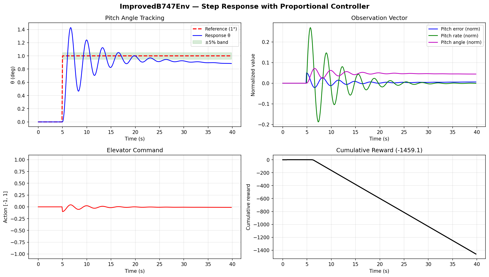

# Урок 9 -- Среды моделирования и симуляции

## 1. Обзор

TensorAeroSpace включает набор сред (environments), совместимых с Gymnasium,
для управления продольным движением самолетов, ракет и спутников. Каждая среда
реализует стандартный интерфейс `gym.Env` (`reset`, `step`, `render`) и может
быть создана как по имени класса, так и через `gym.make(env_id)`.

Среды делятся на два семейства:

| Семейство | Соглашение об именах | Пространства наблюдений/действий | Награда | Назначение |
|---|---|---|---|---|
| **Legacy** | `LinearLongitudinal*` | физические единицы, 2-D столбцовые вектора `(n, 1)` | отрицательная MSE | Классическое управление, IHDP, ПИД-регуляторы |
| **Improved** | `Improved*` / `*Normalized` | нормализованные `[-1, 1]`, плоские 1-D вектора | LQR-подобная формированная награда с терминацией | Обучение RL-агентов (PPO, SAC, TD3, ...) |

**Правило выбора:** используйте Legacy-среды, когда нужен прямой доступ к
модели пространства состояний и физическим единицам. Используйте Improved-среды
при обучении нейросетевой политики.

---

## 2. Полный каталог сред

### 2.1 Legacy-среды

| Env ID | Класс | Транспортное средство | Состояния по умолчанию | obs dim | act dim |
|---|---|---|---|---|---|
| `LinearLongitudinalB747-v0` | `LinearLongitudinalB747` | Boeing 747 | theta, q | 2 | 1 |
| `LinearLongitudinalF16-v0` | `LinearLongitudinalF16` | F-16 Fighting Falcon | alpha, q | 2 | 1 |
| `LinearLongitudinalF4C-v0` | `LinearLongitudinalF4C` | F-4C Phantom II | theta, q, alpha, V | 4 | 1 |
| `LinearLongitudinalX15-v0` | `LinearLongitudinalX15` | X-15 (экспериментальный) | theta, q | 2 | 1 |
| `LinearLongitudinalUAV-v0` | `LinearLongitudinalUAV` | Беспилотник (БПЛА) | theta, q | 2 | 1 |
| `LinearLongitudinalUltrastick-v0` | `LinearLongitudinalUltrastick` | Ultrastick-25e | theta, q | 2 | 1 |
| `LinearLongitudinalLAPAN-v0` | `LinearLongitudinalLAPAN` | Самолет LAPAN | theta, q | 2 | 1 |
| `LinearLongitudinalELVRocket-v0` | `LinearLongitudinalELVRocket` | Ракета-носитель ELV | w, q, theta | 3 | 1 |
| `LinearLongitudinalMissileModel-v0` | `LinearLongitudinalMissileModel` | Ракета | theta, q | 2 | 1 |
| `GeoSat-v0` | `GeoSatEnv` | Геостационарный спутник | rho, theta, omega | 3 | 1 |
| `ComSat-v0` | `ComSatEnv` | Спутник связи | rho, rho_dot, theta_dot | 3 | 1 |

### 2.2 Improved-среды (для обучения с подкреплением)

| Env ID | Класс | Транспортное средство | obs dim | act dim |
|---|---|---|---|---|
| `ImprovedB747-v0` | `ImprovedB747Env` | Boeing 747 | 4 | 1 |
| `ImprovedX15-v0` | `ImprovedX15Env` | X-15 | 4 | 1 |
| `ImprovedELV-v0` | `ImprovedELVEnv` | Ракета-носитель ELV | 4 | 1 |
| `ImprovedLAPAN-v0` | `ImprovedLAPANEnv` | Самолет LAPAN | 4 | 1 |
| `ImprovedMissile-v0` | `ImprovedMissileEnv` | Ракета | 4 | 1 |
| `ImprovedComSat-v0` | `ImprovedComSatEnv` | Спутник связи | 4 | 1 |
| `ImprovedUltrastick-v0` | `ImprovedUltrastickEnv` | Ultrastick-25e | 5 | 2 |
| `F4CPitchNormalized-v0` | `F4CPitchEnvNormalized` | F-4C Phantom II | 4 | 1 |

---

## 3. Legacy-среды: подробности

### 3.1 Модель пространства состояний

Каждая Legacy-среда оборачивает дискретную линейную модель вида:

```
x(t+1) = A x(t) + B u(t)
y(t)   = C x(t)
```

где `x` -- вектор состояния, `u` -- управляющее воздействие (отклонение руля
высоты, тяга и т.д.), `y` -- измеряемый выход. Матрицы `A`, `B`, `C`
загружаются из соответствующего модуля `aerospacemodel`.

### 3.2 Форма наблюдений

Legacy-среды возвращают наблюдения в виде **двумерных столбцовых векторов** с
формой `(n, 1)`, где `n` -- число состояний. Учитывайте это при подаче
наблюдений в нейронную сеть -- возможно, потребуется предварительно их
развернуть (`flatten`).

### 3.3 Основные параметры

| Параметр | Описание |
|---|---|
| `initial_state` | Начальный вектор состояния (список столбцовых векторов, например `[[0], [0]]`) |
| `reference_signal` | Целевая траектория, форма `(n_tracked, n_steps)` |
| `number_time_steps` | Длина горизонта моделирования |
| `state_space` | Список имен переменных состояния для наблюдения |
| `output_space` | Список имен выходных переменных |
| `tracking_states` | Подмножество состояний, используемых для вычисления награды |
| `reward_func` | Пользовательская функция награды (необязательно) |
| `dt` | Шаг дискретизации (по умолчанию 0.01 с) |

### 3.4 Пример -- отслеживание ступенчатого сигнала на F-16

```python
import numpy as np
import gymnasium as gym
import matplotlib.pyplot as plt

from tensoraerospace.utils import generate_time_period, convert_tp_to_sec_tp
from tensoraerospace.signals.standard import unit_step

# Временная сетка
dt = 0.01
tp = generate_time_period(tn=20, dt=dt)
tps = convert_tp_to_sec_tp(tp, dt=dt)
number_time_steps = len(tp)

# Ступенчатый сигнал 5 градусов для угла атаки, начиная с t=5 с
reference = np.reshape(
    unit_step(degree=5, tp=tp, time_step=5, output_rad=True),
    [1, -1],
)

# Создание среды
env = gym.make(
    "LinearLongitudinalF16-v0",
    number_time_steps=number_time_steps,
    initial_state=[[0], [0], [0]],
    reference_signal=reference,
    state_space=["theta", "alpha", "q"],
    output_space=["theta", "alpha", "q"],
    tracking_states=["alpha"],
)

obs, info = env.reset()

# Моделирование без управления (разомкнутый контур)
states = [obs.flatten()]
for _ in range(number_time_steps - 1):
    action = np.array([[0.0]])  # нулевое управление
    obs, reward, terminated, truncated, info = env.step(action)
    states.append(obs.flatten())
    if terminated or truncated:
        break

states = np.array(states)
time = np.array(tps[: len(states)])

# Построение графика угла атаки
plt.figure(figsize=(10, 5))
plt.plot(time, np.rad2deg(states[:, 1]), label="alpha (град)")
plt.plot(time, np.rad2deg(reference[0, : len(time)]), "--r", label="задание")
plt.xlabel("Время (с)")
plt.ylabel("Угол атаки (град)")
plt.title("F-16: реакция без управления на ступенчатое задание")
plt.legend()
plt.grid(True)
plt.show()
```

---

## 4. Improved-среды: подробности

### 4.1 Принципы проектирования

Improved-среды специально разработаны для обучения RL-агентов и обладают
следующими свойствами:

* **Нормализованные пространства.** Наблюдения и действия лежат в `[-1, 1]`.
  Среда внутренне масштабирует значения в/из физических единиц.
* **Плоские 1-D вектора.** Наблюдения возвращаются как массивы формы
  `(obs_dim,)`, а не столбцовые вектора -- готовы для стандартных нейросетей.
* **LQR-подобная формированная награда.** Функция награды -- взвешенная сумма
  ошибки отслеживания, демпфирования скорости, затрат управления и
  гладкости.
* **Безопасная терминация.** Эпизод завершается досрочно (с большим
  отрицательным штрафом), если объект превышает физические ограничения,
  такие как максимальный угол тангажа или угловая скорость.

### 4.2 Разбор -- ImprovedB747Env

`ImprovedB747Env` оборачивает продольную модель Boeing 747:

| Компонент | Детали |
|---|---|
| **Вектор состояния** | `[u, w, q, theta]` (скорость, вертикальная скорость, угл. скорость тангажа, угол тангажа) в единицах СИ |
| **Наблюдение** | `[pitch_error, pitch_rate, pitch_angle, prev_action]` -- все нормализованы в `[-1, 1]` |
| **Действие** | Нормализованное отклонение руля высоты, одно число в `[-1, 1]` (соответствует +/-25 град.) |
| **Награда** | `-( w_pitch * e_pitch^2 + w_q * e_q^2 + w_action * |u| + w_smooth * |du| + w_jerk * |d2u| )` |
| **Терминация** | `|theta| > 20 град.` или `|q| > 5 град./с` -- штраф -100 |
| **Усечение** | Эпизод завершается после `number_time_steps` шагов |

### 4.3 Параметры конструктора

```python
ImprovedB747Env(
    initial_state,                       # [u, w, q, theta] в единицах СИ
    reference_signal,                    # форма (1, n_steps), радианы
    number_time_steps,                   # горизонт
    dt=0.01,                             # шаг времени (с)
    initial_elevator_deg=0.0,            # плавный старт
    use_initial_action_on_first_step=True,
    reward_mode="step_response",         # или "tracking"
    survival_bonus=0.0,                  # бонус за каждый шаг без терминации
    completion_bonus=0.0,                # бонус за завершение эпизода
    early_termination_penalty=0.0,       # доп. штраф при досрочной терминации
    early_termination_penalty_per_step=0.0,
    include_reference_in_obs=False,      # добавляет 2 доп. наблюдения если True
)
```

### 4.4 Пример -- пропорциональный регулятор на B747

```python
import numpy as np
import gymnasium as gym
import matplotlib.pyplot as plt

from tensoraerospace.utils import generate_time_period, convert_tp_to_sec_tp
from tensoraerospace.signals.standard import unit_step

dt = 0.01
tp = generate_time_period(tn=20, dt=dt)
tps = convert_tp_to_sec_tp(tp, dt=dt)
number_time_steps = len(tp)

# Ступенька 3 градуса при t=2 с
reference = np.reshape(
    unit_step(degree=3, tp=tp, time_step=2, output_rad=True),
    [1, -1],
)

env = gym.make(
    "ImprovedB747-v0",
    initial_state=[0.0, 0.0, 0.0, 0.0],
    reference_signal=reference,
    number_time_steps=number_time_steps,
    dt=dt,
)

obs, info = env.reset()

observations = [obs.copy()]
rewards = []
actions = []

for step in range(number_time_steps - 1):
    # Простое пропорциональное управление: action = -K_p * pitch_error
    # obs[0] -- нормализованная ошибка тангажа
    pitch_error = obs[0]
    action = np.array([-2.0 * pitch_error], dtype=np.float32)
    action = np.clip(action, -1.0, 1.0)

    obs, reward, terminated, truncated, info = env.step(action)
    observations.append(obs.copy())
    rewards.append(reward)
    actions.append(action[0])

    if terminated or truncated:
        break

observations = np.array(observations)
time = np.array(tps[: len(observations)])

fig, axes = plt.subplots(3, 1, figsize=(10, 10), sharex=True)

axes[0].plot(time, observations[:, 0], label="ошибка тангажа (норм.)")
axes[0].set_ylabel("Нормализованная ошибка")
axes[0].set_title("ImprovedB747Env -- Пропорциональный регулятор")
axes[0].legend()
axes[0].grid(True)

axes[1].plot(time, observations[:, 2], label="угол тангажа (норм.)")
axes[1].set_ylabel("Нормализованный тангаж")
axes[1].legend()
axes[1].grid(True)

axes[2].plot(time[: len(actions)], actions, label="действие (норм.)")
axes[2].set_xlabel("Время (с)")
axes[2].set_ylabel("Нормализованное действие")
axes[2].legend()
axes[2].grid(True)

plt.tight_layout()
plt.show()

print(f"Длина эпизода: {len(observations)} шагов")
print(f"Суммарная награда: {sum(rewards):.2f}")
```

---




## 5. Эталонные сигналы

Модуль `tensoraerospace.signals.standard` предоставляет готовые генераторы
эталонных сигналов для задач отслеживания. Все функции принимают массив
времени `tp` (создается через `generate_time_period`) и возвращают 1-D массив
той же длины.

### 5.1 Доступные сигналы

| Функция | Описание | Ключевые параметры |
|---|---|---|
| `unit_step` | Ступенчатая функция | `degree`, `time_step`, `output_rad` |
| `sinusoid` | Базовая синусоида | `frequency`, `amplitude` |
| `sinusoid_vertical_shift` | Синусоида со смещением | `frequency`, `amplitude`, `vertical_shift` |
| `constant_line` | Постоянное значение | `value_state` |
| `ramp` | Линейная рампа | `slope`, `time_start` |
| `pulse` | Прямоугольный импульс | `amplitude`, `time_start`, `width` |
| `square_wave` | Периодический меандр | `frequency`, `amplitude`, `duty_cycle` |
| `sawtooth` | Пилообразный сигнал | `frequency`, `amplitude` |
| `triangular_wave` | Треугольный сигнал | `frequency`, `amplitude` |
| `chirp` | Частотная развертка | `f0`, `f1`, `amplitude`, `method` |
| `doublet` | Дублет (пара импульсов) | `amplitude`, `time_start`, `width` |
| `multi_step` | Множественные ступеньки | `step_times`, `step_values` |
| `exponential` | Экспоненциальный выход | `amplitude`, `time_constant`, `time_start` |
| `gaussian_pulse` | Гауссов импульс | `amplitude`, `center`, `width` |
| `multisine` | Сумма синусоид | `frequencies`, `amplitudes`, `phases` |
| `damped_sinusoid` | Затухающие колебания | `frequency`, `amplitude`, `damping` |

### 5.2 Примеры кода

```python
import numpy as np
from tensoraerospace.utils import generate_time_period
from tensoraerospace.signals.standard import (
    unit_step, sinusoid_vertical_shift, chirp, multi_step, doublet
)

dt = 0.01
tp = generate_time_period(tn=20, dt=dt)

# Ступенчатый сигнал: 5 градусов при t=3 с (выход в радианах)
sig_step = unit_step(tp=tp, degree=5, time_step=3, output_rad=True)

# Синусоида с вертикальным смещением
sig_sine = sinusoid_vertical_shift(
    tp=tp, frequency=0.2, amplitude=0.05, vertical_shift=0.05
)

# Чирп: развертка частоты от 0.1 Гц до 1.0 Гц
sig_chirp = chirp(tp=tp, f0=0.1, f1=1.0, amplitude=0.08)

# Множественные ступеньки: лестничное задание
sig_multi = multi_step(
    tp=tp,
    step_times=[2, 6, 10, 15],
    step_values=[0.05, 0.03, -0.04, 0.02],
)

# Дублет: классический маневр для анализа устойчивости
sig_doublet = doublet(
    tp=tp, amplitude=np.deg2rad(3), time_start=5.0, width=2.0
)
```

Для использования любого сигнала в качестве задания среды, приведите его к
форме `(1, -1)`:

```python
reference = np.reshape(sig_step, [1, -1])
```

---


## 6. Пользовательская настройка сред

### 6.1 Изменение параметров моделирования

Как Legacy, так и Improved-среды принимают `dt` (шаг времени) и
`number_time_steps` (горизонт). Общее время моделирования равно
`number_time_steps * dt`.

```python
# 30-секундное моделирование с частотой 50 Гц
dt = 0.02
tp = generate_time_period(tn=30, dt=dt)
number_time_steps = len(tp)
```

### 6.2 Пользовательские начальные состояния

Для Legacy-сред начальные состояния задаются столбцовыми векторами:

```python
# F-16 с начальным углом атаки 2 градуса
initial_state = [[0], [np.deg2rad(2)], [0]]
```

Для Improved-сред состояния -- плоские массивы в единицах СИ:

```python
# B747 с малой начальной угловой скоростью тангажа
initial_state = [0.0, 0.0, np.deg2rad(0.5), 0.0]  # [u, w, q, theta]
```

### 6.3 Пользовательские функции награды (Legacy-среды)

Legacy-среды принимают параметр `reward_func`. Функция получает текущее
состояние, эталонный сигнал и номер шага:

```python
def custom_reward(state, ref_signal, ts, action=None):
    """Штрафует колебания через добавление штрафа за скорость."""
    if ref_signal.ndim == 2 and ref_signal.shape[1] > ts:
        ref_at_ts = ref_signal[:, ts].flatten()
    else:
        ref_at_ts = ref_signal.flatten()
    tracking_error = np.mean((state.flatten() - ref_at_ts) ** 2)
    rate_penalty = 0.1 * np.sum(state.flatten() ** 2)
    return float(-(tracking_error + rate_penalty))

env = gym.make(
    "LinearLongitudinalB747-v0",
    initial_state=[[0], [0]],
    reference_signal=reference,
    number_time_steps=number_time_steps,
    reward_func=custom_reward,
)
```

### 6.4 Режимы награды в Improved-средах

Improved B747 поддерживает два режима:

* `"step_response"` (по умолчанию) -- включает специфичные для ступенчатого
  сигнала термы формирования: перерегулирование, время установления и
  колебания. Лучше всего подходит для обучения на ступенчатых заданиях.
* `"tracking"` -- универсальный режим, использующий только базовую
  квадратичную функцию стоимости. Используйте для синусоидальных, чирп-
  и других не ступенчатых эталонных сигналов.

```python
env = gym.make(
    "ImprovedB747-v0",
    initial_state=[0.0, 0.0, 0.0, 0.0],
    reference_signal=reference,
    number_time_steps=number_time_steps,
    reward_mode="tracking",
)
```

---

## 7. Доступ к внутренним данным модели

Legacy-среды предоставляют доступ к базовой аэрокосмической модели через
`env.unwrapped.model`. Это дает возможность получить историю состояний и
управляющих воздействий, а также использовать встроенное построение
графиков.

### 7.1 Основные методы

| Метод | Описание |
|---|---|
| `model.get_state(name, to_deg=False)` | Получить историю состояния в виде массива |
| `model.get_control(name, to_deg=False)` | Получить историю управления в виде массива |
| `model.plot_transient_process(name, time, ref, lang="rus", to_deg=True)` | Построить график состояния и задания |

### 7.2 Пример кода

```python
import numpy as np
import gymnasium as gym
import matplotlib.pyplot as plt

from tensoraerospace.utils import generate_time_period, convert_tp_to_sec_tp
from tensoraerospace.signals.standard import unit_step

dt = 0.01
tp = generate_time_period(tn=20, dt=dt)
tps = convert_tp_to_sec_tp(tp, dt=dt)
number_time_steps = len(tp)

reference = np.reshape(
    unit_step(degree=5, tp=tp, time_step=5, output_rad=True),
    [1, -1],
)

env = gym.make(
    "LinearLongitudinalB747-v0",
    number_time_steps=number_time_steps,
    initial_state=[[0], [0]],
    reference_signal=reference,
    state_space=["theta", "q"],
    output_space=["theta", "q"],
    tracking_states=["theta"],
)

obs, _ = env.reset()
for i in range(number_time_steps - 1):
    action = np.array([0.5])  # постоянное управление рулем высоты
    obs, reward, terminated, truncated, info = env.step(action)
    if terminated or truncated:
        break

# Доступ к базовой модели
model = env.unwrapped.model

# Получение истории состояний
theta_deg = model.get_state("theta", to_deg=True)
q_deg = model.get_state("q", to_deg=True)

# Получение истории управления
stab_hist = model.get_control("stab", to_deg=True)

# Встроенное построение графиков
model.plot_transient_process(
    "theta",
    time=np.array(tps),
    ref_signal=reference[0],
    lang="rus",
    to_deg=True,
    figsize=(10, 5),
)
```

---

## 8. Векторизованные среды

Для эффективного параллельного обучения `ImprovedB747VecEnvTorch` запускает
`N` независимых симуляций B747 в рамках одной пакетной тензорной операции.
Поддерживаются CPU и CUDA.

```python
from tensoraerospace.envs import ImprovedB747VecEnvTorch

vec_env = ImprovedB747VecEnvTorch(
    num_envs=64,
    number_time_steps=2000,
    dt=0.01,
    device="cpu",        # или "cuda"
)

obs, info = vec_env.reset()
# Форма obs: (64, 4) -- пакет из 64 наблюдений

for _ in range(2000):
    actions = vec_env.action_space_sample()  # случайные действия, форма (64, 1)
    obs, rewards, terminated, truncated, info = vec_env.step(actions)
    # Форма rewards: (64,)
```

Векторизованная среда также поддерживает **рандомизацию сигналов** --
автоматическое создание разнообразных ступенчатых, синусоидальных и рамповых
эталонных сигналов для каждой подсреды, чтобы агент не запоминал одну
конкретную траекторию.

---

## 9. Сравнительная таблица сред

| Env ID | Объект | obs | act | Награда | Терминация | Рекомендуемые агенты |
|---|---|---|---|---|---|---|
| `LinearLongitudinalB747-v0` | B747 | 2 | 1 | -MSE | лимит времени | PID, IHDP, LQR |
| `LinearLongitudinalF16-v0` | F-16 | 2 | 1 | -MSE | лимит времени | PID, IHDP, LQR |
| `LinearLongitudinalF4C-v0` | F-4C | 4 | 1 | -MSE | лимит времени | PID, IHDP, LQR |
| `LinearLongitudinalX15-v0` | X-15 | 2 | 1 | -MSE | лимит времени | PID, IHDP, LQR |
| `LinearLongitudinalUAV-v0` | БПЛА | 2 | 1 | -MSE | лимит времени | PID, IHDP, LQR |
| `LinearLongitudinalUltrastick-v0` | Ultrastick | 2 | 1 | -MSE | лимит времени | PID, IHDP, LQR |
| `LinearLongitudinalLAPAN-v0` | LAPAN | 2 | 1 | -MSE | лимит времени | PID, IHDP, LQR |
| `LinearLongitudinalELVRocket-v0` | ELV | 3 | 1 | -MSE | лимит времени | PID, IHDP, LQR |
| `LinearLongitudinalMissileModel-v0` | Ракета | 2 | 1 | -MSE | лимит времени | PID, IHDP, LQR |
| `GeoSat-v0` | ГеоСпутник | 3 | 1 | -MSE | лимит времени | PID, LQR |
| `ComSat-v0` | КомСпутник | 3 | 1 | -MSE | лимит времени | PID, LQR |
| `ImprovedB747-v0` | B747 | 4 | 1 | LQR-формир. | огр. тангажа/скорости | PPO, SAC, TD3 |
| `ImprovedX15-v0` | X-15 | 4 | 1 | LQR-формир. | огр. тангажа/скорости | PPO, SAC, TD3 |
| `ImprovedELV-v0` | ELV | 4 | 1 | LQR-формир. | огр. тангажа/скорости | PPO, SAC, TD3 |
| `ImprovedLAPAN-v0` | LAPAN | 4 | 1 | LQR-формир. | огр. тангажа/скорости | PPO, SAC, TD3 |
| `ImprovedMissile-v0` | Ракета | 4 | 1 | LQR-формир. | огр. тангажа/скорости | PPO, SAC, TD3 |
| `ImprovedComSat-v0` | КомСпутник | 4 | 1 | LQR-формир. | огр. состояний | PPO, SAC, TD3 |
| `ImprovedUltrastick-v0` | Ultrastick | 5 | 2 | LQR-формир. | огр. тангажа/скорости | PPO, SAC, TD3 |
| `F4CPitchNormalized-v0` | F-4C | 4 | 1 | LQR-формир. | огр. тангажа/скорости | PPO, SAC, TD3 |

---

## 10. Что дальше

В следующем уроке мы используем Improved-среды для **обучения первого
RL-агента** с помощью PPO и SAC из библиотеки агентов TensorAeroSpace. Мы
научимся настраивать гиперпараметры, отслеживать процесс обучения и оценивать
полученный автопилот по сравнению с классическими базовыми методами.
