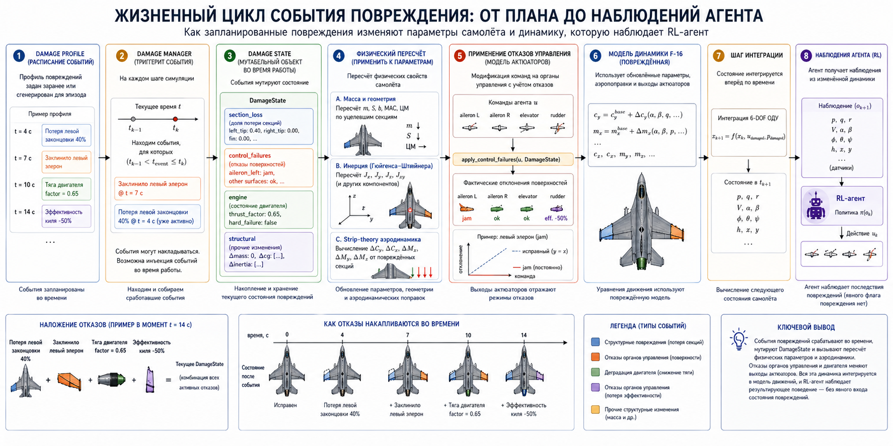
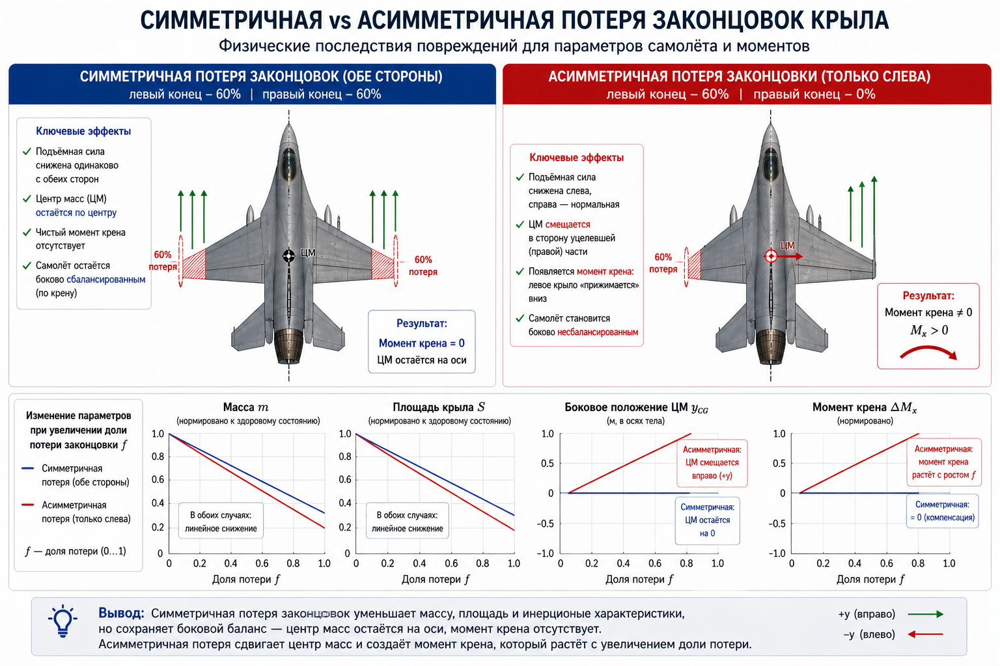

# Реализация и примеры — повреждения F-16

Эта страница описывает устройство кода подсистемы повреждений и содержит
проработанные примеры. Краткий обзор и быстрый старт — на странице
[Моделирование повреждений ЛА](aircraft-damage-modeling.md). Все формулы
вынесены в отдельный документ
[Математика моделирования повреждений](aircraft-damage-modeling-math.md).

## Архитектура и физическая модель

Реализация находится в директории
`tensoraerospace/aerospacemodel/f16/nonlinear/damage/`. Подробный проектный
документ (вне основной навигации) лежит по пути
`docs/superpowers/specs/2026-04-28-aircraft-damage-modeling-design.md` —
доступен в исходниках репозитория.

Ключевые особенности:

- **Параметрический пересчёт геометрии** — при каждом событии повреждения
  масса, площадь крыла, размах, средняя аэродинамическая хорда (MAC), центр
  масс и тензор инерции пересчитываются из секционных вкладов по теореме
  Гюйгенс-Штейнер.
- **Аэродинамические поправки по strip-theory (полосовой теории)** — каждая
  секция вносит пропорциональный вклад в утраченные подъёмную силу, лобовое
  сопротивление и момент при повреждении. Приближённая точность ~10–20 % по
  сравнению с методом вихревой решётки (VLM, Vortex Lattice Method) —
  считается приемлемой для RL-обучения и быстрых FDM-симуляций, но не для
  сертификационного моделирования.
- **Асимметричные повреждения требуют угловой модели 6-DoF** с
  `split_stab=True` (4-компонентное управление: `[stab_left, stab_right,
  aileron, rudder]` — отдельный канал на каждый полустабилизатор плюс
  объединённые элероны и руль направления).
  Симметричные повреждения работают как в продольной, так и в угловой модели.
- **Бит-в-бит идентичный базовый вариант** — без `damage_profile` поведение
  среды байт-в-байт совпадает с неповреждённым базовым вариантом. Существующие
  тесты, обученные агенты и сохранённые траектории работают без изменений.

## Как работает модель повреждения

Подсистема превращает F-16 в кусочно-нестационарный объект управления.
Она устроена из трёх связанных слоёв: **посекционная геометрия**,
**состояние повреждений**, эволюционирующее по запланированным событиям,
и **физический пересчёт во время выполнения**, который кормит обновлёнными
параметрами и аэродинамическими дельтами уже существующие ОДУ F-16.

Диаграмма ниже показывает, как запланированное событие проходит через всю
цепочку — от `DamageProfile` до наблюдения, доступного агенту:



### Слой 1 — Посекционная геометрия

ЛА разбивается на 13 именованных секций (6 сегментов крыла + 2 половины
стабилизатора + киль + 3 рулевые поверхности + фюзеляж). Каждая секция
несёт данные, нужные для вычисления её собственного вклада в полные
характеристики ЛА: положение (`span_position`, `aero_x_arm`, `cg_local`),
размеры (`area`, `chord`, `sweep`), массово-инерционные свойства (`mass`,
локальная `inertia_local`) и аэродинамические коэффициенты
(`cl_alpha_contribution`, `cd0_contribution`).


Данные секций декларативно лежат в файле
`tensoraerospace/aerospacemodel/f16/nonlinear/damage/data/f16_geometry.yaml`
и загружаются в объект `BaseGeometry` через `load_f16_geometry()`.
Геометрия откалибрована так, что сумма посекционных вкладов соответствует
существующему baseline `F16AngularParameters` с точностью ~1 % по массе и
площади и ~5 % по тензору инерции — см. калибровочные тесты в
`tests/aerospacemodel/f16_damage/presets_test.py`.

### Слой 2 — DamageState и события

`DamageState` — это мутабельный runtime-объект, описывающий текущее
состояние каждой секции, каждой рулевой поверхности и двигателя. Хранит
четыре вложенных состояния:

- `section_loss: dict[str, float]` — доля в `[0, 1]` каждой секции,
  которая отсутствует.
- `control_failures: dict[str, ControlFailure]` — режимы отказа по
  поверхностям (`jam`, `efficiency_loss`, `lost`, `free_floating`).
- `engine: EngineState` — `thrust_factor` и флаг `hard_failure`.
- `structural: StructuralState` — дополнительные дельты массы / ЦМ /
  инерции, не привязанные к конкретной секции (например, сброс груза,
  обледенение).

`DamageProfile` — это список записей `DamageEvent`, каждая запланирована
на конкретное `trigger_time`. `DamageManager` (принадлежит среде)
обрабатывает расписание на каждом шаге:

```python
def update(self, t_current, t_previous):
    triggered = [
        e for e in self.profile.events
        if t_previous < e.trigger_time <= t_current
    ]
    for ev in triggered:
        self._apply_event(ev)        # мутирует DamageState
    if triggered:
        apply_to_params(self.params, self.geometry, self.state)
    return triggered
```

События могут накладываться (комбинированные отказы), а одноразовое
событие можно инжектировать в рантайме через
`damage_manager.inject_event(...)` — полезно для RL-курикулумов, где
повреждение сэмплируется поэпизодно.


### Слой 3 — Физический пересчёт во время выполнения

Когда срабатывает хотя бы одно событие, последовательно выполняются три
физических вычисления (полные формулы — в
[математическом документе](aircraft-damage-modeling-math.md)):

**(а) Пересчёт массы и геометрии.** Посекционные массы масштабируются на
$(1 - f_s)$, и параметры ЛА `m`, площадь крыла `S`, размах `b`, MAC `bA`
и координаты ЦМ пересчитываются массово-взвешенным агрегированием.
Симметричная потеря законцовок оставляет ЦМ центрированным; асимметричная
— сдвигает его в сторону уцелевшего полукрыла. См.
[Эффективная масса и центр масс](aircraft-damage-modeling-math.md#эффективная-масса-и-центр-масс)
и [Аэродинамические агрегаты](aircraft-damage-modeling-math.md#аэродинамические-агрегаты).

**(б) Пересчёт инерции через Гюйгенса–Штейнера.** Для каждой уцелевшей
секции с эффективной массой $m^{eff}_s$ применяется теорема параллельных
осей, дающая полные $J_{xx}, J_{yy}, J_{zz}, J_{xy}$ относительно текущего
ЦМ ЛА. Конвенция $J_{xy}$ (а не $J_{xz}$) как активного off-diagonal члена
— особенность данной body-frame записи F-16. Полный вывод — в разделе
[Тензор инерции через теорему Гюйгенса–Штейнера](aircraft-damage-modeling-math.md#тензор-инерции-через-теорему-гюйгенса-штейнера).


График выше показывает, как `m`, `S`, `Jx` и `cg_y` эволюционируют в
зависимости от доли потери законцовки. Симметричная потеря (синяя) спадает
линейно, не возмущая ЦМ; асимметричная (красная) вводит сдвиг ЦМ,
растущий с `f`.

**(в) Strip-theory аэродинамические поправки.** Каждая секция вносит
свой собственный аддитивный дельта-вклад в шесть коэффициентов ЛА поверх
базовых табличных значений: $\Delta C_y, \Delta C_x, \Delta C_z, \Delta M_x,
\Delta M_y, \Delta M_z$. Дельты момента включают плечо секции, поэтому
потеря одной законцовки производит результирующий момент крена, а
симметричная потеря компенсируется. Все формулы — в разделе
[Strip-theory дельты аэродинамических коэффициентов](aircraft-damage-modeling-math.md#strip-theory-дельты-аэродинамических-коэффициентов).


Две панели показывают эту двойственность. **Слева**: симметричная потеря
законцовки уменьшает `Cy` пропорционально — при `α = 10°` и 60 %
двусторонней потери `ΔCy ≈ -0.10`, т.е. ~12 % от здоровой подъёмной силы.
**Справа**: асимметричная (только левая) потеря порождает дельту момента
крена `ΔMx`, масштабирующуюся и с `α`, и с `f` — это та физика, что стоит
за догфайт-сценарием в `example/f16_damage_dogfight_demo.py`.

Концептуальный спутник ниже собирает ту же физику в единое side-by-side
сравнение: симметричная потеря сохраняет балансировку и снижает только
подъёмную силу, а асимметричная — дополнительно вносит сдвиг ЦМ и
момент крена, растущий с долей потери.



### Складываем всё вместе — что видит агент

Как только повреждение становится активным, каждый шаг ОДУ F-16
подхватывает поправки через единственный хук:

```python
# внутри f16_ode_6dof
cy = get_cy(...) + delta_cy(α, β, geo, damage_state)
mx = get_mx(...) + delta_mx(α, β, geo, damage_state)
# ... и т.д. для cx, cz, my, mz
```

Команды актюатору также проходят через `apply_control_failures(u, state)`
перед попаданием в интегратор, так что заклиненная рулевая поверхность
выдаёт нетривиальный выход независимо от команды агента. Поэтому агенту
не нужен явный вход состояния повреждений: динамика, которую он наблюдает,
**и есть** повреждённый объект управления.

### Визуальный спутник — 3D-просмотрщик в браузере

Та же структура flight log, которая кормит аналитические графики, также
подаётся в интерактивный WebGL-просмотрщик. С `render_mode="3d_web"` у
среды вызов `env.render()` после эпизода открывает self-contained HTML в
браузере (или возвращает inline HTML в Jupyter):

```python
env = NonlinearAngularF16(..., render_mode="3d_web", damage_profile=profile)
env.reset()
for _ in range(N):
    env.step(action)
env.render()  # → вкладка браузера или ячейка Jupyter
```

См. [Рецепт 16 — Интерактивный 3D-просмотрщик](../cookbook/16_3d_viewer.md)
для пошагового примера.

### Проработанный пример — потеря законцовки в полёте

`example/f16_damage_dogfight_demo.py` запускает угловую модель F-16 с
`damage_profile=WING_STRIKE_LEFT_TIP` (полная потеря `left_tip` на
t = 10 с). С нулевой командой РУС траектория чётко показывает асимметрию
— до повреждения ЛА держит горизонтальный полёт; после повреждения
развивается момент крена и `ω_x` растёт до нескольких °/с за секунды.


Панель угловой скорости крена `ω_x` — самая прямая демонстрация: в
здоровом прогоне она держится в нуле, но после t = 10 с повреждённый
прогон ускоряется — это в точности дисбаланс момента, продуцируемый
`delta_mx` в strip-theory слое. Угловая скорость тангажа `ω_z` и руль
высоты остаются в pre-damage диапазонах, потому что потеря не связана с
осью тангажа. Канал α показывает небольшой дрейф по мере уменьшения
коэффициента подъёмной силы.

## Встроенные сценарии

Семь готовых `DamageProfile`-констант, импортируемых напрямую из
`tensoraerospace.aerospacemodel.f16.nonlinear.damage`:

| Пресет | Время срабатывания | Эффект |
|--------|--------------------|--------|
| `WING_STRIKE_LEFT_TIP` | t=10 с | Полная потеря левой законцовки крыла |
| `WING_STRIKE_LEFT_HALF` | t=10 с | Левая законцовка + 50% средней секции |
| `ELEVATOR_JAM_NEUTRAL` | t=5 с  | Оба полустабилизатора заклинены в нейтральном положении |
| `ELEVATOR_JAM_PITCH_UP` | t=5 с | Оба заклинены на +10° |
| `RUDDER_LOST` | t=5 с | Руль направления утерян |
| `ENGINE_FLAMEOUT` | t=5 с | Остановка двигателя (тяга = 0) |
| `BIRDSTRIKE_COMPOUND` | t=5 с | 20% правого крыла + 70% потери мощности двигателя |

### AIDI-пресеты (AIDI = Adaptive Incremental Dynamic Inversion)

Дополнительно из того же модуля доступны три параметризованные функции,
повторяющие сценарии повреждений из работы Ul Haq et al. 2026 («Adaptive
Incremental Dynamic Inversion для управления повреждённой F-16») — они
возвращают `DamageProfile` с настраиваемыми параметрами:

```python
from tensoraerospace.aerospacemodel.f16.nonlinear.damage import (
    stab_efficiency_step,
    aileron_efficiency_loss_schedule,
    rudder_total_loss,
)

# Одношаговая потеря эффективности стабилизатора (mu = доля сохранённой эффективности)
profile_a = stab_efficiency_step(t_inject=5.0, mu=0.25, surface="stab_left")

# Расписание прогрессивной потери эффективности элерона
profile_b = aileron_efficiency_loss_schedule(
    t_start=2.0, dt_between=1.0,
    levels=(1.0, 0.75, 0.5, 0.25, 0.0),
    surface="aileron_left",
)

# Полная потеря руля направления — типичный «худший случай» из статьи
profile_c = rudder_total_loss(t_inject=10.0)
```

См. также готовый пример в `example/reinforcement_learning/example_aidi_damage_f16.ipynb`.

## Пользовательские сценарии

```python
from tensoraerospace.aerospacemodel.f16.nonlinear.damage import (
    DamageEvent, DamageProfile,
)

profile = DamageProfile(events=[
    DamageEvent(8.0, "section_loss",
                payload={"section": "right_mid", "loss_fraction": 0.4},
                label="right_mid_40pct"),
    DamageEvent(15.0, "engine_failure",
                payload={"thrust_factor": 0.3}),
])
```

Каждое событие — это `DamageEvent(trigger_time, event_type, payload, label=None, duration=None)`.
Поле `label` используется в `info["damage_events_triggered"]` и в логе для
читаемости (если не задано — подставляется `event_type`). Поле `duration`
зарезервировано для будущих временных эффектов и в текущей версии
игнорируется (повреждения постоянны).

### Типы событий и payload

#### `section_loss`

```python
payload = {"section": str, "loss_fraction": float}
```

`loss_fraction` ∈ [0, 1] (значения вне диапазона будут клиппированы).
Допустимые имена секций для F-16:

| Группа | Имена секций |
|--------|-------------|
| Крыло (6) | `left_root`, `left_mid`, `left_tip`, `right_root`, `right_mid`, `right_tip` |
| Стабилизатор (2) | `stab_left`, `stab_right` |
| Киль | `vtail` |
| Рулевые поверхности | `rudder`, `aileron_left`, `aileron_right` |
| Фюзеляж | `fuselage_main` |

Замечание: `fuselage_main` принимается API, но физически потеря фюзеляжа
бессмысленна (катастрофическая потеря массы). Она в основном существует
для калибровки массового баланса и обычно не используется в сценариях.

#### `control_failure`

```python
payload = {"surface": str, "mode": str, ...}  # доп. поля зависят от mode
```

Допустимые поверхности: `stab_left`, `stab_right`, `aileron_left`,
`aileron_right`, `rudder`. Допустимые режимы:

| Режим | Дополнительные поля payload | Эффект |
|-------|----------------------------|--------|
| `jam` | `jam_position_rad: float` | Поверхность зафиксирована в указанном положении (рад), команда агента игнорируется |
| `efficiency_loss` | `efficiency: float ∈ [0, 1]` | Команда умножается на `efficiency` |
| `lost` | — | Поверхность не реагирует на команду (выход = 0) |
| `free_floating` | — | То же, что `lost` (поверхность болтается, выход = 0) |

#### `engine_failure`

```python
payload = {"thrust_factor": float, "hard_failure": bool}
```

`thrust_factor` ∈ [0, 1] — множитель тяги; `hard_failure=True` принудительно
обнуляет тягу независимо от множителя. Оба поля опциональны (можно задавать
только одно).

#### `structural_change`

```python
payload = {
    "mass_delta_kg": float,
    "cg_shift_m": tuple[float, float, float],
    "inertia_delta": tuple[float, float, float, float],  # ΔJx, ΔJy, ΔJz, ΔJxy
}
```

Все поля опциональны и применяются аддитивно (несколько событий
накапливаются). Используется для эффектов, не привязанных к конкретной
секции: сброс груза/подвески, обледенение, горение топлива.

### Инжекция событий в рантайме

Помимо предзаданного `DamageProfile`, можно инжектировать одноразовые
события прямо в ходе симуляции — полезно, например, для curriculum-RL.
`trigger_time` задаётся в абсолютном симуляционном времени (с момента
старта эпизода):

```python
from tensoraerospace.aerospacemodel.f16.nonlinear.damage import DamageEvent

# в callback или в цикле обучения, t_now — текущее время симуляции
event = DamageEvent(
    trigger_time=t_now + 0.5,            # сработает через 0.5 с
    event_type="section_loss",
    payload={"section": "left_tip", "loss_fraction": 0.5},
    label="injected_left_tip",
)
env.unwrapped.damage_manager.inject_event(event)
```

Инжектированные события — single-fire: после срабатывания удаляются из очереди.

## Случайные профили для обучения с подкреплением

```python
from tensoraerospace.aerospacemodel.f16.nonlinear.damage import (
    RandomDamageProfileGenerator,
)

generator = RandomDamageProfileGenerator(
    event_types=["section_loss", "control_failure", "engine_failure"],
    time_range=(5.0, 25.0),
    severity_range=(0.1, 1.0),
    num_events_range=(1, 2),
    seed=42,
    sections=("left_tip", "right_tip", "stab_left", "stab_right"),  # необязательный
)

profile = generator.sample()
obs, info = env.reset(options={"damage_profile": profile})
```

Параметры конструктора:

- `event_types: list[str]` — какие типы событий разрешено сэмплировать
  (`"section_loss"`, `"control_failure"`, `"engine_failure"`).
- `time_range: (float, float)` — равномерный диапазон `trigger_time`.
- `severity_range: (float, float)` — диапазон `loss_fraction` для
  `section_loss` (по умолчанию `(0.1, 1.0)`).
- `num_events_range: (int, int)` — сколько событий в одном профиле
  (по умолчанию `(1, 1)`).
- `sections: tuple[str, ...]` — какие секции допустимы для `section_loss`.
  По умолчанию: `("left_tip", "left_mid", "right_tip", "right_mid", "stab_left", "stab_right")`
  — то есть только «теряемые» секции крыла и стабилизатора (без корней,
  киля и фюзеляжа).
- `seed: int | None` — для воспроизводимости.

Для `control_failure` поверхности и режимы выбираются равномерно из
встроенного списка; для `efficiency_loss` коэффициент сэмплируется из
$[0.2, 0.9]$, для `jam` — из $[-0.15, 0.15]$ рад.

## Что среда возвращает в `info`

Когда `damage_profile` или `damage_observable` активны, словарь `info`,
возвращаемый из `env.step(action)` (но не `env.reset()`), содержит:

- `info["damage_state"]` — полный JSON-снимок текущего `DamageState`
  (поля `section_loss`, `control_failures`, `engine`, `structural`).
  Заполняется **на каждом шаге**.
- `info["damage_events_triggered"]` — список меток (`label`, либо
  `event_type` если `label=None`) событий, сработавших на этом шаге.
  Присутствует **только** в шагах со срабатываниями.

Дополнительно среда аккумулирует историю в полях
`env.unwrapped.damage_events_log` (хронология событий) и
`damage_state_log` (снапшоты состояния в моменты изменений) — они
используются 3D-просмотрщиком и удобны для оффлайн-анализа.

### Колбэк на событие повреждения

Можно зарегистрировать колбэк, вызываемый сразу после применения каждого
события (полезно для логирования в TensorBoard или WandB):

```python
def on_damage(event, state):
    print(f"[t={event.trigger_time}] {event.label or event.event_type}")

env = NonlinearAngularF16(
    ...,
    damage_profile=profile,
    damage_event_callback=on_damage,
)
```

## Наблюдаемые повреждения

По умолчанию агент не наблюдает состояние повреждений — он должен
самостоятельно выявлять ухудшение динамики. Передайте `damage_observable=True`,
чтобы расширить вектор наблюдений долями потерь **всех** секций (включая
стабилизатор, киль, рулевые поверхности и фюзеляж — итого 13 для F-16) и
скалярным `engine.thrust_factor`:

```python
env = NonlinearAngularF16(
    initial_state=np.zeros(14),
    number_time_steps=2000,
    damage_profile=profile,
    damage_observable=True,
    split_stab=True,
)
```

Раскладка наблюдения: `[14 базовых элементов состояния, f_s для каждой
секции в порядке geo.section_names(), thrust_factor]`. Базовые 14 элементов
— это вектор состояния угловой 6-DoF F-16 (см.
[Нелинейная 6-DoF угловая](f16_nonlinear_angular.md)). Если включён
`track_altitude=True`, базовая часть растёт с 14 до 16, а итог становится
`16 + N_sections + 1`. Для F-16 в стандартной конфигурации это `14 + 13 + 1 = 28`.

Можно также включать `damage_observable=True` и **без** `damage_profile`
— агент тогда увидит постоянные нули в полях повреждений и единицу в
`thrust_factor`, но размерность observation останется такой же, что
полезно для обучения «универсальных» политик с фиксированной
размерностью входа.

## Сброс повреждений между эпизодами

`env.reset()` очищает все повреждения и восстанавливает базовые параметры.
Для переопределения профиля в каждом эпизоде:

```python
obs, info = env.reset(options={"damage_profile": new_profile})
```

Это стандартный паттерн для обучения с подкреплением со случайными повреждениями.

## Адаптивные RL-агенты при повреждениях

В репозитории есть два сквозных примера, демонстрирующих онлайн-адаптивные
RL-агенты в 60-секундной миссии с инжектированным на t=20 с повреждением.
Оба используют **одинаковый** сценарий — симметричную потерю 30% обеих
законцовок крыла через настоящий `DamageProfile` API — что позволяет
сравнивать их «один к одному».

| Пример | Путь | Формат |
|--------|------|--------|
| iADP (Incremental ADP) | `example/reinforcement_learning/example_iadp_damage_f16.py` | исполняемый скрипт |
| ET-DHP (Event-Triggered DHP) | `example/reinforcement_learning/example_etdhp_damage_f16.py` | исполняемый скрипт |
| ET-DHP (notebook-версия) | `example/reinforcement_learning/example_etdhp_damage_f16.ipynb` | Jupyter-ноутбук |
| AIDI (Adaptive Incremental Inversion) | `example/reinforcement_learning/example_aidi_damage_f16.ipynb` | Jupyter-ноутбук |

### Общий сценарий

* Среда: `NonlinearLongitudinalF16-v0` в глобальном триме
  `(α* = +4.92°, δₑ* = -4.45°)`.
* Команда: 0.8 °/с (iADP) или 3° (ET-DHP) синусоида по угловой скорости
  тангажа / α с прогревом 2 с.
* Профиль повреждения:

  ```python
  DamageProfile(events=[
      DamageEvent(20.0, "section_loss",
                  payload={"section": "left_tip", "loss_fraction": 0.30}),
      DamageEvent(20.0, "section_loss",
                  payload={"section": "right_tip", "loss_fraction": 0.30}),
  ])
  ```

  В момент t=20 с среда пересчитывает `m`, `S`, `bA`, `Jx/Jy/Jz/Jxy` из
  посекционных вкладов, а продольная ОДУ подхватывает
  $\Delta C_y = -\sum_s C_{l\alpha,s}\,\alpha\,f_s\,A_s/S_{base}$
  из strip-theory.

### iADP — closed-form политика + RLS-идентификация ОУ

```python
from tensoraerospace.aerospacemodel.f16.nonlinear.damage import (
    DamageEvent, DamageProfile,
)
from tensoraerospace.agent.iadp import IADPAgent, IADPConfig

profile = DamageProfile(events=[
    DamageEvent(20.0, "section_loss",
                payload={"section": "left_tip", "loss_fraction": 0.30}),
    DamageEvent(20.0, "section_loss",
                payload={"section": "right_tip", "loss_fraction": 0.30}),
])

env = gym.make(
    "NonlinearLongitudinalF16-v0",
    number_time_steps=6002,
    initial_state=[alpha_trim, 0.0, stab_trim, 0.0],
    reference_signal=...,
    state_space=["alpha", "wz", "stab", "dstab"],
    control_space=["stab"],
    use_reward=False,
    dt=0.01,
    integrator="euler",
    control_bias=stab_trim_deg,
    damage_profile=profile,
).unwrapped
```

iADP (Incremental Approximate Dynamic Programming) использует RLS
(Recursive Least Squares — рекурсивный метод наименьших квадратов) с
фиксированным забыванием для онлайн-отслеживания локальной инкрементальной
модели $\tilde{F}, \tilde{G}$, после чего получает оптимальное управление
в замкнутой форме:

$$\Delta\delta_t = -(R + \gamma\,\tilde{G}^T \tilde{P} \tilde{G})^{-1}\big[R\,\delta_{t-1} + \gamma\,\tilde{G}^T \tilde{P} X_t + \gamma\,\tilde{G}^T \tilde{P} \tilde{F} \Delta X_t\big]$$

Поскольку RLS видит новый объект управления через невязки сразу после
срабатывания повреждения, `G̃` устанавливается за десятки миллисекунд —
никакой детекции отказа или переключения режимов не требуется.

**Пример вывода:**

```
=== Baseline (no damage) ===
Pre-damage RMSE  (5 s ≤ t < 20 s):  0.0701 °/s
Post-damage RMSE (22 s ≤ t ≤ 60 s): 0.0663 °/s

=== With damage (30% bilateral wing-tip loss at t=20s) ===
Pre-damage RMSE  (5 s ≤ t < 20 s):  0.0701 °/s
Post-damage RMSE (22 s ≤ t ≤ 60 s): 0.0703 °/s   ← деградация незаметна
G̃ at t = 19.5 s: -0.00013                        ← усиление до повреждения
G̃ at t = 25.0 s: -0.00017                        ← RLS ещё сходится
G̃ at t = end:    +0.00010                        ← новая стабильная оценка
Damage events triggered:
  t=19.99s : left_tip_30pct_loss
  t=19.99s : right_tip_30pct_loss
```

Post-damage RMSE (0.0703 °/с) практически идентичен baseline без
повреждения (0.0663 °/с). iADP продолжает отслеживать синусоидальную
команду без детекции отказа — RLS наблюдает новое усиление через невязки,
а closed-form политика подстраивается.

### ET-DHP — event-triggered actor/critic с замороженной NN-моделью ОУ

```python
from tensoraerospace.agent.et_dhp import ETDHPAgent, ETDHPConfig

cfg = ETDHPConfig(
    actor_hidden=(24, 24), critic_hidden=(24, 24), model_hidden=(24, 24),
    Q=[10.0, 0.1, 0.0, 0.0], R=[1.0], gamma=0.95,
    u_bound=2.0, rho=0.2, trigger_floor=0.1,
    seed=0,
)
agent = ETDHPAgent(n_state=4, n_control=1,
                   state_transform=state_transform, config=cfg)
agent.fit_plant_model(states_arr, actions_arr, next_states_arr)  # offline
```

ET-DHP (Event-Triggered Dual Heuristic Programming) использует три
нейросети: модель ОУ (plant), актёр (actor) и косостейт-критик
(costate critic). NN-модель ОУ **обучается оффлайн на здоровом ЛА** и
замораживается. Липшицев event-trigger запускает обновление actor/critic
только когда ошибка слежения превышает порог.

**Пример вывода:**

```
=== Baseline (no damage) ===
Pre-damage  (5–20 s):    MAE=0.094°  RMSE=0.114°
Post-damage (22–60 s):   MAE=0.166°  RMSE=0.235°
Triggers:                56 pre, 261 post

=== With damage (30% bilateral wing-tip loss at t=20s) ===
Pre-damage  (5–20 s):    MAE=0.210°  RMSE=0.268°
Post-damage (22–60 s):   MAE=0.702°  RMSE=0.913°   ← деградация ≈4×
Triggers:                219 pre, 547 post           ← 2× рост после повреждения
Damage events:
  t=19.99s : left_tip_30pct_loss
  t=19.99s : right_tip_30pct_loss
```

Качество слежения после повреждения деградирует до ~0.9° RMSE (vs ~0.24°
без повреждения). Event-trigger корректно реагирует на изменение объекта
управления — число триггеров примерно удваивается после t=20 с — но
actor/critic в одиночку не могут полностью компенсировать, потому что
замороженная NN-модель ОУ имеет устаревшие якобианы `F = ∂f/∂x`,
`G = ∂f/∂u`, не соответствующие повреждённой динамике.

### iADP vs ET-DHP при повреждении — сравнение

| | iADP | ET-DHP |
|---|---|---|
| Плант-модель | RLS, онлайн | Нейросеть, заморожена оффлайн |
| Латентность адаптации | ~10 мс (одно обновление RLS) | Эпизоды (градиентные шаги actor/critic) |
| Сигнал детекции | Сдвиг `G̃` в RLS | Всплеск числа триггеров |
| Post-damage RMSE | ≈ baseline (без деградации) | ~4× baseline |
| Trade-off | Сильная адаптация, нужен PE-прогрев (Persistence of Excitation — возбуждающая входная динамика) | Робастность через event-trigger, но NN-модель ОУ надо переобучить на повреждённых данных для полного восстановления |

### Возможные расширения

- **Онлайн-обновление NN-модели ОУ для ET-DHP**: периодически вызывать
  `agent.fit_plant_model(...)` на скользящем окне последних переходов,
  делая модель объекта управления онлайн-обучаемой.
- **Политики с явной информацией о повреждениях**: передать
  `damage_observable=True` среде, чтобы вектор наблюдений включал доли
  потерь по секциям и коэффициент тяги — актёр сможет напрямую
  обусловливаться состоянием повреждений.
- **Curriculum-обучение**: совместить `RandomDamageProfileGenerator` с
  поэпизодным `env.reset(options={"damage_profile": ...})`, чтобы агент
  увидел распределение сценариев повреждения в ходе обучения.
