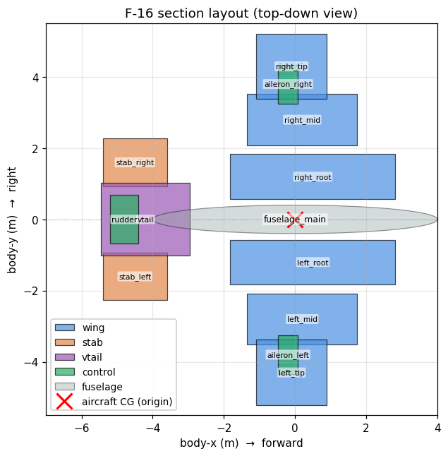
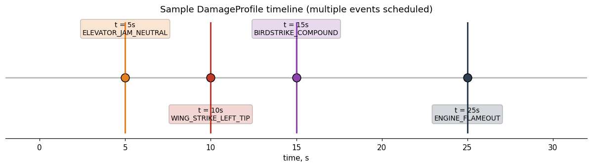
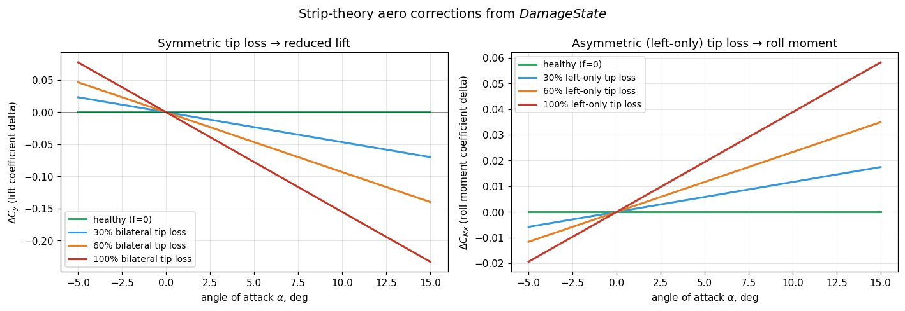

# Моделирование повреждений ЛА

Подсистема повреждений превращает F-16 из неизменного объекта управления
в **объект с переменной во времени динамикой**. Она позволяет планировать
отказы в ходе симуляции — потерю законцовки крыла, заклинивание рулевых
поверхностей, отказ двигателя, структурные изменения — и среда пересчитывает
массу, тензор инерции, аэродинамические коэффициенты и эффективность рулевых
поверхностей в реальном времени. Управляющий агент с момента срабатывания
события повреждения сталкивается с уже другим объектом управления.

В настоящее время поддерживается только для **нелинейной модели F-16**
(продольная и 6-DoF угловая). Один и тот же `damage_profile` API подключается
к обоим вариантам среды и к любому контроллеру / RL-агенту, который их
использует — см. секцию **Адаптивные RL-агенты при повреждениях** ниже с двумя
проработанными примерами (iADP и ET-DHP).

## Быстрый старт

```python
import numpy as np

from tensoraerospace.aerospacemodel.f16.nonlinear.damage import (
    WING_STRIKE_LEFT_TIP,
)
from tensoraerospace.envs.f16.nonlinear_angular import NonlinearAngularF16

env = NonlinearAngularF16(
    initial_state=np.zeros(14),
    number_time_steps=2000,
    damage_profile=WING_STRIKE_LEFT_TIP,
    split_stab=True,
)
obs, _ = env.reset()
for _ in range(2000):
    obs, r, term, trunc, info = env.step(np.zeros(4))
    if info.get("damage_events_triggered"):
        print(info["damage_events_triggered"])
```

Готовый к запуску пример находится в файле `example/f16_damage_dogfight_demo.py`.

## Как работает модель повреждения

Подсистема превращает F-16 в кусочно-нестационарный объект управления.
Она устроена из трёх связанных слоёв: **посекционная геометрия**,
**состояние повреждений**, эволюционирующее по запланированным событиям,
и **физический пересчёт во время выполнения**, который кормит обновлёнными
параметрами и аэродинамическими дельтами уже существующие ОДУ F-16.

### Слой 1 — Посекционная геометрия

ЛА разбивается на 13 именованных секций (6 сегментов крыла + 2 половины
стабилизатора + киль + 3 рулевые поверхности + фюзеляж). Каждая секция
несёт данные, нужные для вычисления её собственного вклада в полные
характеристики ЛА: положение (`span_position`, `aero_x_arm`, `cg_local`),
размеры (`area`, `chord`, `sweep`), массово-инерционные свойства (`mass`,
локальная `inertia_local`) и аэродинамические коэффициенты
(`cl_alpha_contribution`, `cd0_contribution`).



Данные секций декларативно лежат в файле
`tensoraerospace/aerospacemodel/f16/nonlinear/damage/data/f16_geometry.yaml`
и загружаются в объект `BaseGeometry` через `load_f16_geometry()`.
Геометрия откалибрована так, что сумма посекционных вкладов соответствует
существующему baseline `F16AngularParameters` с точностью ~1 % по массе и
площади и ~5 % по тензору инерции — см. калибровочные тесты в
`tests/aerospacemodel/f16_damage/presets_test.py`.

### Слой 2 — DamageState и события

`DamageState` — это мутабельный runtime-объект, описывающий текущее
состояние каждой секции, каждой рулевой поверхности и двигателя. Хранит
четыре вложенных состояния:

- `section_loss: dict[str, float]` — доля в `[0, 1]` каждой секции,
  которая отсутствует.
- `control_failures: dict[str, ControlFailure]` — режимы отказа по
  поверхностям (`jam`, `efficiency_loss`, `lost`, `free_floating`).
- `engine: EngineState` — `thrust_factor` и флаг `hard_failure`.
- `structural: StructuralState` — дополнительные дельты массы / ЦМ /
  инерции, не привязанные к конкретной секции (например, сброс груза,
  обледенение).

`DamageProfile` — это список записей `DamageEvent`, каждая запланирована
на конкретное `trigger_time`. `DamageManager` (принадлежит среде)
обрабатывает расписание на каждом шаге:

```python
def update(self, t_current, t_previous):
    triggered = [
        e for e in self.profile.events
        if t_previous < e.trigger_time <= t_current
    ]
    for ev in triggered:
        self._apply_event(ev)        # мутирует DamageState
    if triggered:
        apply_to_params(self.params, self.geometry, self.state)
    return triggered
```

События могут накладываться (комбинированные отказы), а одноразовое
событие можно инжектировать в рантайме через
`damage_manager.inject_event(...)` — полезно для RL-курикулумов, где
повреждение сэмплируется поэпизодно.



### Слой 3 — Физический пересчёт во время выполнения

Когда срабатывает хотя бы одно событие, последовательно выполняются три
физических вычисления:

**(а) Пересчёт массы и геометрии.** Посекционные массы масштабируются на
`(1 - f_s)`, и параметры ЛА `m`, площадь крыла `S`, размах `b`, MAC `bA` и
координаты ЦМ пересчитываются массово-взвешенным агрегированием.
Симметричная потеря законцовок оставляет ЦМ центрированным;
асимметричная — сдвигает его в сторону уцелевшего полукрыла.

**(б) Пересчёт инерции через Гюйгенса-Штейнера.** Для каждой уцелевшей
секции с эффективной массой `m_s_eff` теорема параллельных осей даёт:

$$J_{xx,\text{ЛА}} = \sum_s \Bigl[I_{xx,s} \cdot (1-f_s) + m_s^{eff} \cdot \bigl((y_s - y_{cg})^2 + (z_s - z_{cg})^2\bigr)\Bigr]$$

с аналогичными формами для `Jyy`, `Jzz` и off-diagonal `Jxy`. Знак
`+m·rx·ry` в формуле параллельных осей для `Jxy` корректен для
конвенции связанных осей в этом коде (где `Jxy`, а не `Jxz`, является
активным off-diagonal членом в `f16_ode_6dof`; см.
`F16AngularParameters.Jxy = 1331.4`).


График выше показывает, как `m`, `S`, `Jx` и `cg_y` эволюционируют в
зависимости от доли потери законцовки. Симметричная потеря (синяя) спадает
линейно, не возмущая ЦМ; асимметричная (красная) вводит сдвиг ЦМ,
растущий с `f`.

**(в) Strip-theory аэродинамические поправки.** Каждая секция вносит
свой собственный аддитивный дельта-вклад в коэффициенты ЛА поверх базовых
табличных коэффициентов. Для подъёмной силы:

$$\Delta C_y \;=\; -\sum_s c_{l\alpha,s} \cdot \alpha \cdot f_s \cdot \frac{\text{area}_s}{S_{\text{base}}}$$

и аналогично для лобового сопротивления (`ΔCx`, с дополнительным членом
от рваных кромок, пик при `f = 0.5`), боковой силы (`ΔCz`, доминирует
киль) и трёх коэффициентов момента (`ΔMx, ΔMy, ΔMz`). Дельты момента
включают плечо секции: момент крена `ΔMx ∝ Δподъёмная_сила × y_arm`, так
что потеря одной законцовки производит результирующий момент крена, а
симметричная потеря компенсируется.



Две панели показывают эту двойственность. **Слева**: симметричная потеря
законцовки уменьшает `Cy` пропорционально — при `α = 10°` и 60 %
двусторонней потери `ΔCy ≈ -0.10`, т.е. ~12 % от здоровой подъёмной силы.
**Справа**: асимметричная (только левая) потеря порождает дельту момента
крена `ΔMx`, масштабирующуюся и с `α`, и с `f` — это та физика, что стоит
за догфайт-сценарием в `example/f16_damage_dogfight_demo.py`.

### Складываем всё вместе — что видит агент

Как только повреждение становится активным, каждый шаг ОДУ F-16
подхватывает поправки через единственный хук:

```python
# внутри f16_ode_6dof
cy = get_cy(...) + delta_cy(α, β, geo, damage_state)
mx = get_mx(...) + delta_mx(α, β, geo, damage_state)
# ... и т.д. для cx, cz, my, mz
```

Команды актюатору также проходят через `apply_control_failures(u, state)`
перед попаданием в интегратор, так что заклиненная рулевая поверхность
выдаёт нетривиальный выход независимо от команды агента. Поэтому агенту
не нужен явный вход состояния повреждений: динамика, которую он наблюдает,
**и есть** повреждённая плант-модель.

### Проработанный пример — потеря законцовки в полёте

`example/f16_damage_dogfight_demo.py` запускает угловую модель F-16 с
`damage_profile=WING_STRIKE_LEFT_TIP` (полная потеря `left_tip` на
t = 10 с). С нулевой командой РУС траектория чётко показывает асимметрию
— до повреждения ЛА держит горизонтальный полёт; после повреждения
развивается момент крена и `ω_x` растёт до нескольких °/с за секунды.


Панель угловой скорости крена `ω_x` — самая прямая демонстрация: в
здоровом прогоне она держится в нуле, но после t = 10 с повреждённый
прогон ускоряется — это в точности дисбаланс момента, продуцируемый
`delta_mx` в strip-theory слое. Угловая скорость тангажа `ω_z` и руль
высоты остаются в pre-damage диапазонах, потому что потеря не связана с
осью тангажа. Канал α показывает небольшой дрейф по мере уменьшения
коэффициента подъёмной силы.

## Встроенные сценарии

| Пресет | Время срабатывания | Эффект |
|--------|--------------------|--------|
| `WING_STRIKE_LEFT_TIP` | t=10 с | Полная потеря левой законцовки крыла |
| `WING_STRIKE_LEFT_HALF` | t=10 с | Левая законцовка + 50% средней секции |
| `ELEVATOR_JAM_NEUTRAL` | t=5 с  | Оба полустабилизатора заклинены в нейтральном положении |
| `ELEVATOR_JAM_PITCH_UP` | t=5 с | Оба заклинены на +10° |
| `RUDDER_LOST` | t=5 с | Руль направления утерян |
| `ENGINE_FLAMEOUT` | t=5 с | Остановка двигателя (тяга = 0) |
| `BIRDSTRIKE_COMPOUND` | t=5 с | 20% правого крыла + 70% потери мощности двигателя |

Импортировать из `tensoraerospace.aerospacemodel.f16.nonlinear.damage`.

## Пользовательские сценарии

```python
from tensoraerospace.aerospacemodel.f16.nonlinear.damage import (
    DamageEvent, DamageProfile,
)

profile = DamageProfile(events=[
    DamageEvent(8.0, "section_loss",
                payload={"section": "right_mid", "loss_fraction": 0.4}),
    DamageEvent(15.0, "engine_failure",
                payload={"thrust_factor": 0.3}),
])
```

Доступные типы событий:

- `section_loss` — payload `{"section": str, "loss_fraction": float в [0,1]}`
- `control_failure` — payload `{"surface": str, "mode": str, ...специфично для режима}`
  Режимы: `"jam"` (с `jam_position_rad`), `"efficiency_loss"` (с `efficiency`), `"lost"`, `"free_floating"`
- `engine_failure` — payload `{"thrust_factor": float, "hard_failure": bool}`
- `structural_change` — payload `{"mass_delta_kg": float, "cg_shift_m": tuple, "inertia_delta": tuple}`

## Случайные профили для обучения с подкреплением

```python
from tensoraerospace.aerospacemodel.f16.nonlinear.damage import (
    RandomDamageProfileGenerator,
)

generator = RandomDamageProfileGenerator(
    event_types=["section_loss", "control_failure"],
    time_range=(5.0, 25.0),
    severity_range=(0.1, 1.0),
    num_events_range=(1, 2),
    seed=42,
)

profile = generator.sample()
obs, info = env.reset(options={"damage_profile": profile})
```

## Наблюдаемые повреждения

По умолчанию агент не наблюдает состояние повреждений — он должен
самостоятельно выявлять ухудшение динамики. Передайте `damage_observable=True`,
чтобы расширить вектор наблюдений долями потерь секций крыла и коэффициентом
тяги двигателя:

```python
env = NonlinearAngularF16(
    initial_state=np.zeros(14),
    number_time_steps=2000,
    damage_profile=profile,
    damage_observable=True,
    split_stab=True,
)
```

Размер вектора наблюдений увеличивается с 14 до `14 + N_sections + 1` элементов.

## Адаптивные RL-агенты при повреждениях

В репозитории есть два сквозных примера, демонстрирующих онлайн-адаптивные
RL-агенты в 60-секундной миссии с инжектированным на t=20 с повреждением.
Оба используют **одинаковый** сценарий — симметричную потерю 30% обеих
законцовок крыла через настоящий `DamageProfile` API — что позволяет
сравнивать их «один к одному».

| Пример | Путь | Формат |
|--------|------|--------|
| iADP (Incremental ADP) | `example/reinforcement_learning/example_iadp_damage_f16.py` | исполняемый скрипт |
| ET-DHP (Event-Triggered DHP) | `example/reinforcement_learning/example_etdhp_damage_f16.py` | исполняемый скрипт |
| ET-DHP (notebook-версия) | `example/reinforcement_learning/example_etdhp_damage_f16.ipynb` | Jupyter-ноутбук |

### Общий сценарий

* Среда: `NonlinearLongitudinalF16-v0` в глобальном триме
  `(α* = +4.92°, δₑ* = -4.45°)`.
* Команда: 0.8 °/с (iADP) или 3° (ET-DHP) синусоида по угловой скорости
  тангажа / α с прогревом 2 с.
* Профиль повреждения:

  ```python
  DamageProfile(events=[
      DamageEvent(20.0, "section_loss",
                  payload={"section": "left_tip", "loss_fraction": 0.30}),
      DamageEvent(20.0, "section_loss",
                  payload={"section": "right_tip", "loss_fraction": 0.30}),
  ])
  ```

  В момент t=20 с среда пересчитывает `m`, `S`, `bA`, `Jx/Jy/Jz/Jxy` из
  посекционных вкладов, а продольная ОДУ подхватывает
  `Δcy = -Σ cl_α_s · α · f_s · area_s/S_base` из strip-theory.

### iADP — closed-form политика + RLS-идентификация плант-модели

```python
from tensoraerospace.aerospacemodel.f16.nonlinear.damage import (
    DamageEvent, DamageProfile,
)
from tensoraerospace.agent.iadp import IADPAgent, IADPConfig

profile = DamageProfile(events=[
    DamageEvent(20.0, "section_loss",
                payload={"section": "left_tip", "loss_fraction": 0.30}),
    DamageEvent(20.0, "section_loss",
                payload={"section": "right_tip", "loss_fraction": 0.30}),
])

env = gym.make(
    "NonlinearLongitudinalF16-v0",
    number_time_steps=6002,
    initial_state=[alpha_trim, 0.0, stab_trim, 0.0],
    reference_signal=...,
    state_space=["alpha", "wz", "stab", "dstab"],
    control_space=["stab"],
    use_reward=False,
    dt=0.01,
    integrator="euler",
    control_bias=stab_trim_deg,
    damage_profile=profile,
).unwrapped
```

iADP использует RLS с фиксированным забыванием для онлайн-отслеживания
локальной инкрементной модели `F̃, G̃`, после чего получает оптимальное
управление в замкнутой форме:

$$\Delta\delta_t = -(R + \gamma\,\tilde{G}^T \tilde{P} \tilde{G})^{-1}\big[R\,\delta_{t-1} + \gamma\,\tilde{G}^T \tilde{P} X_t + \gamma\,\tilde{G}^T \tilde{P} \tilde{F} \Delta X_t\big]$$

Поскольку RLS видит новую плант-модель через невязки сразу после
срабатывания повреждения, `G̃` устанавливается за десятки миллисекунд —
никакой детекции отказа или переключения режимов не требуется.

**Пример вывода:**

```
=== Baseline (no damage) ===
Pre-damage RMSE  (5 s ≤ t < 20 s):  0.0701 °/s
Post-damage RMSE (22 s ≤ t ≤ 60 s): 0.0663 °/s

=== With damage (30% bilateral wing-tip loss at t=20s) ===
Pre-damage RMSE  (5 s ≤ t < 20 s):  0.0701 °/s
Post-damage RMSE (22 s ≤ t ≤ 60 s): 0.0703 °/s   ← деградация незаметна
G̃ at t = 19.5 s: -0.00013                        ← усиление до повреждения
G̃ at t = 25.0 s: -0.00017                        ← RLS ещё сходится
G̃ at t = end:    +0.00010                        ← новая стабильная оценка
Damage events triggered:
  t=19.99s : left_tip_30pct_loss
  t=19.99s : right_tip_30pct_loss
```

Post-damage RMSE (0.0703 °/с) практически идентичен baseline без
повреждения (0.0663 °/с). iADP продолжает отслеживать синусоидальную
команду без детекции отказа — RLS наблюдает новое усиление через невязки,
а closed-form политика подстраивается.

### ET-DHP — event-triggered actor/critic с замороженной plant NN

```python
from tensoraerospace.agent.et_dhp import ETDHPAgent, ETDHPConfig

cfg = ETDHPConfig(
    actor_hidden=(24, 24), critic_hidden=(24, 24), model_hidden=(24, 24),
    Q=[10.0, 0.1, 0.0, 0.0], R=[1.0], gamma=0.95,
    u_bound=2.0, rho=0.2, trigger_floor=0.1,
    seed=0,
)
agent = ETDHPAgent(n_state=4, n_control=1,
                   state_transform=state_transform, config=cfg)
agent.fit_plant_model(states_arr, actions_arr, next_states_arr)  # offline
```

ET-DHP использует три нейросети: модель ОУ (plant), актёр (actor) и
костейт-критик (costate critic). Plant-сеть **обучается оффлайн на
здоровом ЛА** и замораживается. Лишпицев event-trigger запускает обновление
actor/critic только когда ошибка слежения превышает порог.

**Пример вывода:**

```
=== Baseline (no damage) ===
Pre-damage  (5–20 s):    MAE=0.094°  RMSE=0.114°
Post-damage (22–60 s):   MAE=0.166°  RMSE=0.235°
Triggers:                56 pre, 261 post

=== With damage (30% bilateral wing-tip loss at t=20s) ===
Pre-damage  (5–20 s):    MAE=0.210°  RMSE=0.268°
Post-damage (22–60 s):   MAE=0.702°  RMSE=0.913°   ← деградация ≈4×
Triggers:                219 pre, 547 post           ← 2× рост после повреждения
Damage events:
  t=19.99s : left_tip_30pct_loss
  t=19.99s : right_tip_30pct_loss
```

Качество слежения после повреждения деградирует до ~0.9° RMSE (vs ~0.24°
без повреждения). Event-trigger корректно реагирует на изменение плант-модели —
число триггеров примерно удваивается после t=20 с — но actor/critic в одиночку
не могут полностью компенсировать, потому что замороженная plant-сеть имеет
устаревшие якобианы `F = ∂f/∂x`, `G = ∂f/∂u`, не соответствующие повреждённой
динамике.

### iADP vs ET-DHP при повреждении — сравнение

| | iADP | ET-DHP |
|---|---|---|
| Плант-модель | RLS, онлайн | Нейросеть, заморожена оффлайн |
| Латентность адаптации | ~10 мс (одно обновление RLS) | Эпизоды (градиентные шаги actor/critic) |
| Сигнал детекции | Сдвиг `G̃` в RLS | Всплеск числа триггеров |
| Post-damage RMSE | ≈ baseline (без деградации) | ~4× baseline |
| Trade-off | Сильная адаптация, нужен PE-прогрев | Робастность через event-trigger, но plant NN надо переобучить на повреждённых данных для полного восстановления |

### Возможные расширения

- **Онлайн-обновление plant-NN для ET-DHP**: периодически вызывать
  `agent.fit_plant_model(...)` на скользящем окне последних переходов,
  делая plant-сеть онлайн-обучаемой.
- **Политики с явной информацией о повреждениях**: передать
  `damage_observable=True` среде, чтобы вектор наблюдений включал доли
  потерь по секциям и коэффициент тяги — актёр сможет напрямую
  обусловливаться состоянием повреждений.
- **Curriculum-обучение**: совместить `RandomDamageProfileGenerator` с
  поэпизодным `env.reset(options={"damage_profile": ...})`, чтобы агент
  увидел распределение сценариев повреждения в ходе обучения.

## Архитектура и физическая модель

Реализация находится в директории
`tensoraerospace/aerospacemodel/f16/nonlinear/damage/`. Проектный документ
расположен по пути
`docs/superpowers/specs/2026-04-28-aircraft-damage-modeling-design.md`.

Ключевые особенности:

- **Параметрический пересчёт геометрии** — при каждом событии повреждения
  масса, площадь крыла, размах, средняя аэродинамическая хорда (MAC), центр
  масс и тензор инерции пересчитываются из секционных вкладов по теореме
  Гюйгенс-Штейнер.
- **Аэродинамические поправки по strip-theory (полосовой теории)** — каждая
  секция вносит пропорциональный вклад в утраченные подъёмную силу, лобовое
  сопротивление и момент при повреждении. Приближённая точность ~10–20 % по
  сравнению с методом вихревой решётки (VLM).
- **Асимметричные повреждения требуют угловой модели 6-DoF** с
  `split_stab=True` (4-компонентное управление: `[stab_left, stab_right, ail, dir]`).
  Симметричные повреждения работают как в продольной, так и в угловой модели.
- **Бит-в-бит идентичный базовый вариант** — без `damage_profile` поведение
  среды байт-в-байт совпадает с неповреждённым базовым вариантом. Существующие
  тесты, обученные агенты и сохранённые траектории работают без изменений.

## Сброс повреждений между эпизодами

`env.reset()` очищает все повреждения и восстанавливает базовые параметры.
Для переопределения профиля в каждом эпизоде:

```python
obs, info = env.reset(options={"damage_profile": new_profile})
```

Это стандартный паттерн для обучения с подкреплением со случайными повреждениями.

## Ограничения

- Линейная модель F-16, B-747 и другие модели пока не поддерживаются.
- Аэродинамические поправки не учитывают влияние скоса потока и срывных
  течений сверх того, что уже закодировано в базовых таблицах данных.
- Упругость крыла / аэроупругие эффекты не моделируются.
- Каскадные отказы (когда одно событие вызывает другое) пока не реализованы;
  их следует явно планировать в профиле повреждений.
