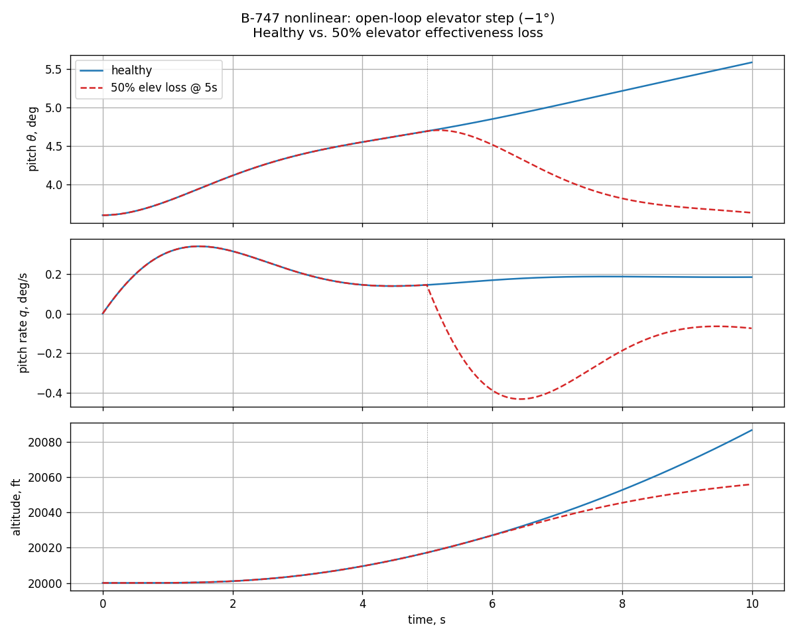

# B-747: примеры использования

Практические рецепты для модулей
[`tensoraerospace.aerospacemodel.b747.nonlinear`](#nonlinear) и
[`tensoraerospace.aerospacemodel.b747.nonlinear.damage`](#damage). Все
примеры самодостаточные. Теория — в
[Boeing 747-100 (нелинейная 6-DoF)](b747_nonlinear.md).

---

## Nonlinear 6-DoF { #nonlinear }

### 1. Trim cruise на любой высоте/скорости

`trim(h, V)` решает систему (u̇, ẇ, q̇) = 0 методом Newton-Raphson и
возвращает `TrimResult` с `(α, δ_e, δ_T)` плюс готовый 12-state
вектор для модели.

```python
import numpy as np
from tensoraerospace.aerospacemodel.b747.nonlinear import (
    NonlinearB747, B747Configuration, trim,
)

# Cruise at FL200 (20 000 ft), V=400 KTAS ≈ 674 ft/s
result = trim(altitude_ft=20_000.0, V_ft_s=674.0)
print(f"α = {np.rad2deg(result.alpha_rad):+.2f}°")
print(f"δ_e = {np.rad2deg(result.elevator_rad):+.2f}°")
print(f"δ_T = {result.throttle:.3f}")

# Trim-state можно сразу подать в модель
m = NonlinearB747(x0=result.to_state(), dt=0.01, integrator="rk4")
u_trim = np.array([result.elevator_rad, 0.0, 0.0, result.throttle])

for _ in range(500):  # 5 с
    m.run_step(u_trim)
print(f"После 5 с: V={m.airspeed_ft_s:.1f} ft/s, h={m.altitude_ft:.1f} ft")
# Должно быть V≈674, h≈20000 — trim удерживается с миллиметровой точностью
```

### 2. Стартовать из одной из 10 опубликованных точек

```python
from tensoraerospace.aerospacemodel.b747.nonlinear import (
    B747_FLIGHT_CONDITIONS, NonlinearB747, initial_state_from_fc,
)

fc6 = B747_FLIGHT_CONDITIONS[5]  # FC6: 20 kft × M=0.65, α₀=2.5°
print(f"FC6: h={fc6.altitude_ft} ft, M={fc6.mach}, V={fc6.V_ft_s} ft/s")

m = NonlinearB747(
    x0=initial_state_from_fc(fc6),
    dt=0.01, integrator="rk4",
)
```

### 3. Pitch-up маневр под elevator

```python
import numpy as np
from tensoraerospace.aerospacemodel.b747.nonlinear import (
    NonlinearB747, B747_FLIGHT_CONDITIONS, initial_state_from_fc,
)

fc4 = B747_FLIGHT_CONDITIONS[3]  # SL × M=0.65
m = NonlinearB747(x0=initial_state_from_fc(fc4), dt=0.01, integrator="rk4")

# δ_e = -2° → нос вверх (signed convention CR-2144: C_mδe < 0)
u = np.array([np.deg2rad(-2.0), 0.0, 0.0, 0.4])
for _ in range(300):  # 3 с
    m.run_step(u)

s = m.current_state
alpha = np.rad2deg(np.arctan2(s[2], s[0]))
print(f"После 3 с: α={alpha:+.2f}°, θ={np.rad2deg(s[7]):+.2f}°, "
      f"q={np.rad2deg(s[4]):+.2f} deg/s, climb={m.altitude_ft:+.0f} ft")
```

### 4. Координированный поворот (rudder + aileron)

```python
import numpy as np
from tensoraerospace.aerospacemodel.b747.nonlinear import (
    NonlinearB747, B747_FLIGHT_CONDITIONS, initial_state_from_fc,
)

fc4 = B747_FLIGHT_CONDITIONS[3]
m = NonlinearB747(x0=initial_state_from_fc(fc4), dt=0.01, integrator="rk4")

u = np.array([
    0.0,
    np.deg2rad(2.0),    # δ_a > 0 — крен вправо
    np.deg2rad(-1.0),   # δ_r < 0 — компенсация adverse yaw
    0.4,
])
for _ in range(500):
    m.run_step(u)

s = m.current_state
print(f"Bank φ = {np.rad2deg(s[6]):+.2f}°, heading ψ = {np.rad2deg(s[8]):+.2f}°")
# Должны видеть положительный крен и медленный поворот вправо
```

### 5. Доступ к истории через `get_state` / `get_control`

```python
import matplotlib.pyplot as plt
import numpy as np
from tensoraerospace.aerospacemodel.b747.nonlinear import (
    NonlinearB747, B747_FLIGHT_CONDITIONS, initial_state_from_fc,
)

fc4 = B747_FLIGHT_CONDITIONS[3]
m = NonlinearB747(x0=initial_state_from_fc(fc4), dt=0.01, integrator="rk4")

# 0.2-секундный elevator-импульс
for k in range(500):
    de = np.deg2rad(-3.0) if 100 <= k < 120 else 0.0
    m.run_step(np.array([de, 0.0, 0.0, 0.4]))

theta_deg = m.get_state("theta", to_deg=True)
q_deg_s = m.get_state("q", to_deg=True)
de_log = m.get_control("de")

t = np.arange(len(theta_deg)) * m.dt
fig, axes = plt.subplots(3, 1, figsize=(9, 6), sharex=True)
axes[0].plot(t, np.rad2deg(de_log)); axes[0].set_ylabel(r"$\delta_e$, °")
axes[1].plot(t, q_deg_s);            axes[1].set_ylabel(r"$q$, °/с")
axes[2].plot(t, theta_deg);          axes[2].set_ylabel(r"$\theta$, °")
axes[2].set_xlabel("время, с")
plt.tight_layout(); plt.show()
```

### 6. Сравнение интеграторов Euler vs RK4

```python
import numpy as np
from tensoraerospace.aerospacemodel.b747.nonlinear import (
    NonlinearB747, B747_FLIGHT_CONDITIONS, initial_state_from_fc,
)

fc = B747_FLIGHT_CONDITIONS[3]
results = {}
for integ in ("euler", "rk4"):
    m = NonlinearB747(
        x0=initial_state_from_fc(fc), dt=0.05, integrator=integ,
    )
    u = np.array([np.deg2rad(-2.0), 0.0, 0.0, 0.4])
    for _ in range(200):  # 10 с большим шагом
        m.run_step(u)
    results[integ] = m.current_state

print(f"Δθ_euler = {np.rad2deg(results['euler'][7]):.4f}°")
print(f"Δθ_rk4   = {np.rad2deg(results['rk4'][7]):.4f}°")
# RK4 устойчивее на крупных dt
```

---

### 7. End-to-end smoke-демо (`example/aircraft/example_b747_nonlinear.py`)

Рабочий скрипт, демонстрирующий полный цикл: trim, открытое управление,
эффект damage. Запуск:

```bash
poetry run python example/aircraft/example_b747_nonlinear.py
```

Результат: trim в FL200, healthy elevator −1° step → Δθ = +1.98° за
10 с; тот же эталон с 50% потерей elevator после t=5 с — Δθ ≈ +1.10°
(ровно половина healthy-отклика, т.к. μ=0.5).



---

## Damage subsystem { #damage }

### 1. Готовый пресет — 50% потеря elevator

```python
import gymnasium as gym
import numpy as np
import tensoraerospace  # регистрирует env

from tensoraerospace.aerospacemodel.b747.nonlinear.damage import (
    ELEVATOR_50PCT_LOSS,
)

env = gym.make(
    "NonlinearB747-v0",
    flight_condition_id=4,
    number_time_steps=1000,
    damage_profile=ELEVATOR_50PCT_LOSS,
)
obs, _ = env.reset()

trim_u = np.array([0.0, 0.0, 0.0, 0.32])
for k in range(1000):
    obs, _, _, trunc, info = env.step(trim_u)
    if "damage_events_triggered" in info:
        print(f"t = {k*0.01:.2f} с: {info['damage_events_triggered']}")
        print(f"  μ = {info['damage_state']['mu']}")
        break
    if trunc:
        break
```

### 2. Кастомное событие — заклинивание elevator на −2°

```python
from tensoraerospace.aerospacemodel.b747.nonlinear.damage import (
    DamageProfile, SurfaceJamEvent,
)

# Hard-over elevator на t=15 с
profile = DamageProfile(events=[
    SurfaceJamEvent(
        trigger_time=15.0, surface="elevator",
        jam_value=-0.0349,  # -2°
        label="elevator_hardover",
    ),
])
```

### 3. Постепенный износ rudder

```python
from tensoraerospace.aerospacemodel.b747.nonlinear.damage import (
    DamageProfile, SurfaceEffectivenessDecay,
)

# Гидравлическая утечка: rudder теряет до 30% эффективности с τ=8 с
leak = DamageProfile(events=[
    SurfaceEffectivenessDecay(
        trigger_time=2.0,
        surface="rudder",
        tau=8.0,
        mu_floor=0.3,
        label="rudder_hydraulic_leak",
    ),
])
```

### 4. Runtime injection — событие по триггеру

```python
import numpy as np

from tensoraerospace.aerospacemodel.b747.nonlinear.damage import (
    SurfaceEffectivenessEvent,
)
from tensoraerospace.envs.b747_nonlinear import NonlinearB747Env

env = NonlinearB747Env(flight_condition_id=4, number_time_steps=1000)
env.reset()

trim_u = np.array([0.0, 0.0, 0.0, 0.32])
for k in range(1000):
    if k == 300:
        # Внезапный отказ aileron в момент t=3 с
        env.damage_manager = env.damage_manager or _make_manager()
        env.damage_manager.inject_event(
            SurfaceEffectivenessEvent(
                trigger_time=3.0, surface="aileron", mu=0.0,
                label="aileron_failure",
            )
        )
    env.step(trim_u)
```

> Если ваш env создан без `damage_profile`, нужно создать manager на
> лету или передать пустой профиль через `reset(options=...)`.

### 5. Логирование событий через callback

```python
import numpy as np
from tensoraerospace.aerospacemodel.b747.nonlinear.damage import (
    AILERON_TOTAL_LOSS,
)
from tensoraerospace.envs.b747_nonlinear import NonlinearB747Env

events_log = []

def on_damage(event, state):
    events_log.append({
        "label": event.label,
        "surface": event.surface,
        "all_mu": dict(state.mu),
    })

env = NonlinearB747Env(
    flight_condition_id=4, number_time_steps=1000,
    damage_profile=AILERON_TOTAL_LOSS,
    damage_event_callback=on_damage,
)
env.reset()
trim_u = np.array([0.0, 0.0, 0.0, 0.32])
for _ in range(1000):
    env.step(trim_u)
print(events_log)
```

### 6. Подмена профиля через `reset(options=...)`

```python
import numpy as np
from tensoraerospace.aerospacemodel.b747.nonlinear.damage import (
    AILERON_TOTAL_LOSS, ELEVATOR_50PCT_LOSS, RUDDER_HYDRAULIC_LEAK,
)
from tensoraerospace.envs.b747_nonlinear import NonlinearB747Env

env = NonlinearB747Env(flight_condition_id=4, number_time_steps=500)

scenarios = [ELEVATOR_50PCT_LOSS, AILERON_TOTAL_LOSS, RUDDER_HYDRAULIC_LEAK]
for sc in scenarios:
    env.reset(options={"damage_profile": sc})
    # ... запустить эпизод; разные сценарии в одном loop'e
```

### 7. Полный flameout — engine-out

```python
import numpy as np
from tensoraerospace.aerospacemodel.b747.nonlinear.damage import (
    ENGINE_FLAMEOUT,
)
from tensoraerospace.envs.b747_nonlinear import NonlinearB747Env

env = NonlinearB747Env(
    flight_condition_id=4, number_time_steps=2000,
    damage_profile=ENGINE_FLAMEOUT,
)
env.reset()
# Trim throttle игнорируется после t=15 с — throttle заклинивает на 0
for _ in range(2000):
    obs, _, _, trunc, info = env.step(np.array([0.0, 0.0, 0.0, 0.32]))
    if trunc:
        break
print(f"Финальная скорость: {np.linalg.norm(obs[:3]):.1f} ft/s")
```

### 8. Отказ одного двигателя с асимметричной тягой

```python
import numpy as np
from tensoraerospace.aerospacemodel.b747.nonlinear import trim
from tensoraerospace.aerospacemodel.b747.nonlinear.damage import (
    LEFT_OUTER_ENGINE_FAILURE,
)
from tensoraerospace.envs.b747_nonlinear import NonlinearB747Env

r = trim(altitude_ft=20_000.0, V_ft_s=674.0)
trim_action = np.array([float(r.elevator_rad), 0., 0., float(r.throttle)])

env = NonlinearB747Env(
    trim_at=(20_000.0, 674.0), number_time_steps=3000, dt=0.01,
    damage_profile=LEFT_OUTER_ENGINE_FAILURE,
)
obs, _ = env.reset()
for _ in range(3000):
    obs, _, _, trunc, _ = env.step(trim_action)
    if trunc:
        break
print(f"Финальный psi  : {np.rad2deg(obs[8]):+.1f}°  (отрицательное = нос влево)")
print(f"Финальный phi  : {np.rad2deg(obs[6]):+.1f}°  (крен в сторону мёртвого двигателя)")
print(f"Финальная V    : {np.linalg.norm(obs[:3]):.1f} ft/s")
```

### 9. Два двигателя на одном крыле — максимум асимметрии

```python
from tensoraerospace.aerospacemodel.b747.nonlinear.damage import (
    LEFT_TWO_ENGINES_OUT,
)

env = NonlinearB747Env(
    trim_at=(20_000.0, 674.0), number_time_steps=2500, dt=0.01,
    damage_profile=LEFT_TWO_ENGINES_OUT,
)
# ...тот же loop что и выше; наблюдается значительно больший yaw / roll...
```

### 10. Кастомный отказ — частичная потеря тяги

```python
from tensoraerospace.aerospacemodel.b747.nonlinear.damage import (
    DamageProfile, EngineFailureEvent,
)

# Двигатель 4 (правый внешний) падает до 30% тяги в t = 6 с —
# имитирует повреждённый компрессор или попадание птицы.
profile = DamageProfile(events=[
    EngineFailureEvent(
        trigger_time=6.0, engine_id=4, thrust_fraction=0.3,
        label="engine_4_partial",
    ),
])
```

### 11. Заклинивание закрылок в крейсе

```python
import numpy as np
from tensoraerospace.aerospacemodel.b747.nonlinear import B747Configuration
from tensoraerospace.aerospacemodel.b747.nonlinear.damage import (
    FLAPS_JAMMED_LANDING,
)
from tensoraerospace.envs.b747_nonlinear import NonlinearB747Env

# Чистый крейс на FL200 — в t=5с закрылки механически заклинивает на 30°.
# Аэродинамика переключается на LANDING-производные: резкий рост подъёма
# и сопротивления, штатной тяги уже не хватает — самолёт задирает нос и
# теряет скорость. Регулятору нужно дать ручку «от себя» и убрать тягу.
env = NonlinearB747Env(
    trim_at=(20_000.0, 674.0), number_time_steps=1500, dt=0.02,
    damage_profile=FLAPS_JAMMED_LANDING,
    config=B747Configuration.NOMINAL,
)
env.reset()
# ...здесь должно быть закрытое управление...
print(env.damage_manager.state.flap_jam_config)  # B747Configuration.LANDING после t=5с
```

### 12. Кастомный сценарий — закрылки застряли на 20°

```python
from tensoraerospace.aerospacemodel.b747.nonlinear import B747Configuration
from tensoraerospace.aerospacemodel.b747.nonlinear.damage import (
    DamageProfile, FlapJamEvent,
)

# Лётчик выпустил закрылки для захода, но они отказываются идти дальше
# 20° (POWER_APPROACH). Самолёт сядет, но с ухудшенными x-stics.
profile = DamageProfile(events=[
    FlapJamEvent(
        trigger_time=4.0,
        jammed_config=B747Configuration.POWER_APPROACH,
        label="flaps_stuck_at_20deg_approach",
    ),
])
```

---

## Связанные

* [Boeing 747-100 (нелинейная 6-DoF)](b747_nonlinear.md) — теория,
  CR-2144 reference, equations и валидация модели.
* [Aircraft Damage Modeling](aircraft-damage-modeling.md) — общий
  концепт damage subsystem (F-16 версия).
* `example/reinforcement_learning/example_dsac_b747.ipynb` —
  обучение DSAC на pitch-tracking (использует B-747 модель).
