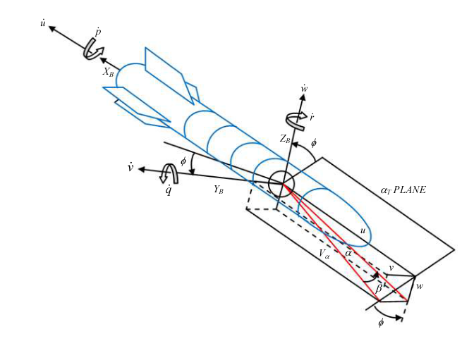

# Ракета‑носитель ELV — продольная динамика

ELV (Expendable Launch Vehicle) — ракета‑носитель для выведения полезной нагрузки на орбиту. Реализован продольный канал полёта как линейная модель в пространстве состояний и совместимая среда Gymnasium.

{ width=800 }

<div class="grid cards" markdown>

-   :material-rocket-launch-outline: **Быстрый старт**

    Запустите среду или модель за минуты.

    [:octicons-arrow-right-24: К примеру](#быстрый-старт)

-   :material-cog-outline: **API модели**

    Документация Python‑класса модели ELV.

    [:octicons-arrow-right-24: К API](#python-api)

-   :material-gamepad-variant-outline: **Среда Gymnasium**

    Готовая среда для RL‑агентов.

    [:octicons-arrow-right-24: К среде](#python-api)

-   :material-book-open-variant: **Теория**

    Уравнения состояния и численные параметры.

    [:octicons-arrow-right-24: К модели](#математическая-модель)

</div>

## Как устроен объект управления

Модель задана в пространстве состояний:

\[\dot{x} = A x + B u, \quad y = C x + D u\]

Где:

\[
 x = \begin{bmatrix} w & q & \theta \end{bmatrix}^{\top}, \quad
 u_{in} = \eta
\]

Типовая структура матриц:

\[
\begin{bmatrix}
\dot{w} \\
\dot{q} \\
\dot{\theta}
\end{bmatrix}
=
\begin{bmatrix}
z_w & z_q & z_{\theta} \\
m_w & m_q & m_{\theta} \\
0 & 0 & 1
\end{bmatrix}
\begin{bmatrix} w \\ q \\ \theta \end{bmatrix}
 +
\begin{bmatrix} z_{\eta} \\ m_{\eta} \\ 0 \end{bmatrix} \eta
\]

=== "Переменные"

    - **w**: нормальная скорость, м/с
    - **q**: угловая скорость тангажа, рад/с
    - **θ**: тангаж, рад
    - **η**: управляющее воздействие (орган тангажа), рад

=== "Коэффициенты"

    - **z_w, z_q, z_θ** — частные производные нормальной силы \(Z\) по \(w, q, \theta\)
    - **m_w, m_q, m_θ** — частные производные момента тангажа \(M\) по \(w, q, \theta\)
    - **z_η, m_η** — частные производные по управляющему воздействию \(\eta\)

!!! note "О единицах измерения"
    Углы и угловые скорости — в радианах. Методы API позволяют работать в градусах.

## Математическая модель {#математическая-модель}

$$
\dot{x} = A x + B u, \qquad y = C x + D u
$$

Численные матрицы (пример линеаризации):

\[
\begin{bmatrix}
\dot{w} \\
\dot{q} \\
\dot{\theta}
\end{bmatrix}
=
\begin{bmatrix}
-100.858 & 1 & -0.1256 \\
14.7805 & 0 & 0.01958 \\
0 & 1 & 0 
\end{bmatrix}
\begin{bmatrix}
w \\
q \\
\theta 
\end{bmatrix}
 +
\begin{bmatrix}
0 \\
3.4558 \\
20.42
\end{bmatrix}
\eta
\]

### Производные (численные значения)

- **Матрица A (производные):**

  | Коэффициент | Значение |
  |-------------|----------|
  | z_w | -100.858 |
  | z_q | 1.0 |
  | z_θ | -0.1256 |
  | m_w | 14.7805 |
  | m_q | 0.0 |
  | m_θ | 0.01958 |

- **Вход η (столбец B):**

  | Коэффициент | Значение |
  |-------------|----------|
  | z_η | 0.0 |
  | m_η | 3.4558 |

!!! tip "Ограничения привода"
    По умолчанию применяются предельные значения управления:

    - Максимальная величина: \(\pm 25^\circ\)
    - Максимальная скорость изменения: \(60^\circ/\text{s}\)

    Внутренние вычисления — в радианах; ограничения переводятся эквивалентно.

## Источники

1. Aliyu, Bhar & Funmilayo, A. & Okwo, Odooh & Sholiyi, Olusegun. (2019). State‑Space Modelling of a Rocket for Optimal Control System Design. Journal of Aircraft and Spacecraft Technology. 3. 128‑137. 10.3844/jastsp.2019.128.137. [Ссылка](https://www.researchgate.net/publication/335917723_State-Space_Modelling_of_a_Rocket_for_Optimal_Control_System_Design)
2. Aliyu, Bhar. (2011). Expendable Launch Vehicle Flight Control — Design & Simulation with Matlab/Simulink. [Ссылка](https://www.researchgate.net/publication/301790480_Expendable_Launch_Vehicle_Flight_Control-Design_Simulation_with_MatlabSimulink)

## Награда

Функция награды по умолчанию возвращает отрицательную абсолютную ошибку отслеживания угла тангажа:

$$r_t = -|\theta(t) - \theta_{\text{ref}}(t)|$$

Чем выше награда (ближе к 0), тем лучше качество отслеживания. Пользовательская функция награды может быть передана через параметр `reward_func`.

## Быстрый старт {#быстрый-старт}

=== "Gymnasium"

    ```python
    import gymnasium as gym
    import numpy as np

    from tensoraerospace.envs import LinearLongitudinalELVRocket
    from tensoraerospace.utils import generate_time_period
    from tensoraerospace.signals.standard import unit_step

    dt = 0.01
    tp = generate_time_period(tn=20, dt=dt)
    number_time_steps = len(tp)
    reference_signals = unit_step(degree=5, tp=tp, time_step=10, output_rad=True).reshape(1, -1)

    env = gym.make(
        'LinearLongitudinalELVRocket-v0',
        number_time_steps=number_time_steps,
        initial_state=[[0],[0],[0]],
        reference_signal=reference_signals,
    )

    state, info = env.reset()
    for _ in range(200):
        action = np.array([[0.1]])
        state, reward, terminated, truncated, info = env.step(action)
        if terminated or truncated:
            break
    ```

=== "Только модель"

    ```python
    import numpy as np
    from tensoraerospace.aerospacemodel import ELVRocket

    dt = 0.01
    number_time_steps = 200

    x0 = np.array([0.0, 0.0, 0.0])  # [w, q, theta]

    model = ELVRocket(
        x0=x0,
        number_time_steps=number_time_steps,
        selected_state_output=["w", "q", "theta"],
        dt=dt,
    )

    for t in range(number_time_steps - 1):
        u = np.array([[0.05]])  # управление (рад)
        x_next = model.run_step(u)
    ```

## Python API

=== "Модель"

    ::: tensoraerospace.aerospacemodel.elv.ELVRocket

=== "Среда Gymnasium"

    ::: tensoraerospace.envs.elv.LinearLongitudinalELVRocket