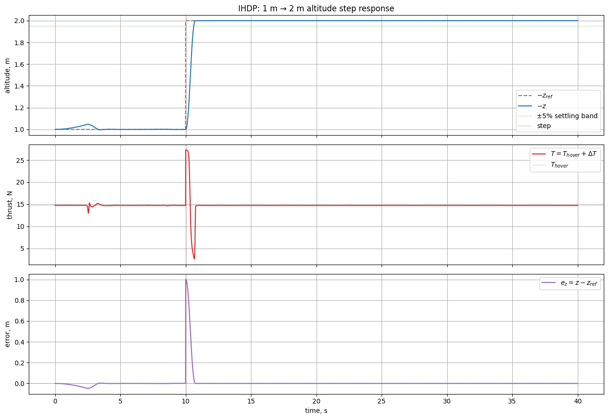
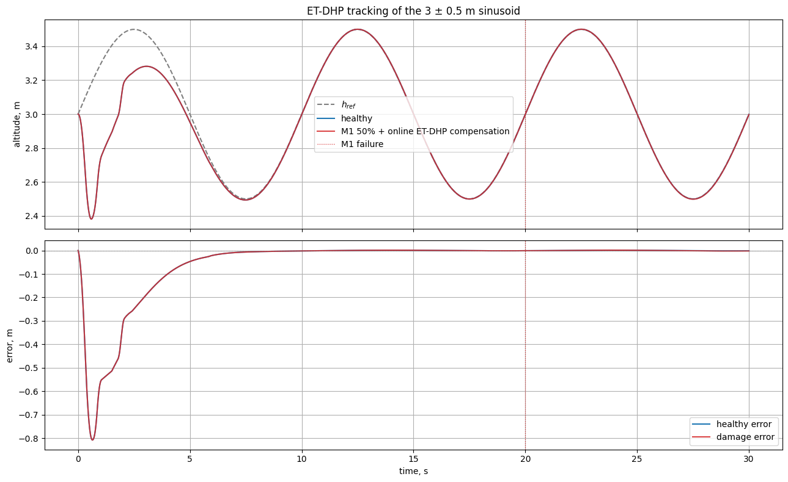
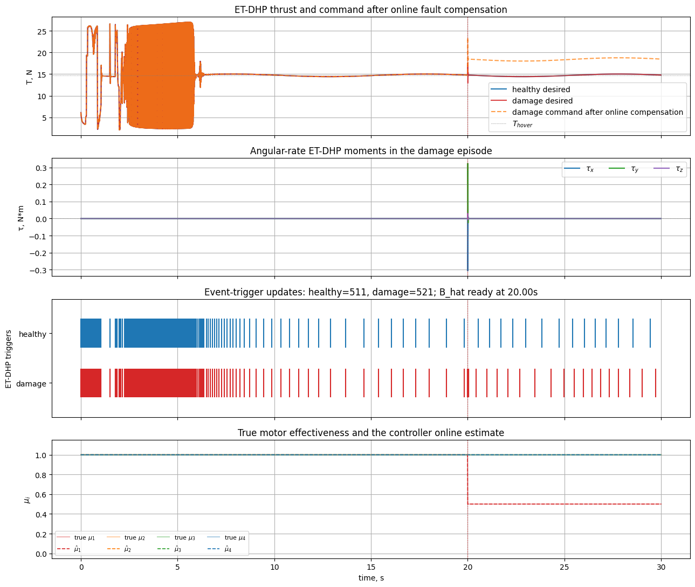

# Quadrotor: примеры использования

Практические рецепты для модулей
[`tensoraerospace.aerospacemodel.quadrotor.nonlinear`](#nonlinear) и
[`tensoraerospace.aerospacemodel.quadrotor.damage`](#damage). Все
примеры самодостаточные — копируются и запускаются как есть. Для
теоретического описания модели см.
[Quadrotor (нелинейный 6-DoF)](quadrotor_nonlinear.md).

---

## Nonlinear 6-DoF { #nonlinear }

### 1. Базовый hover на месте

Простейший случай: квадрокоптер удерживается в точке `(0, 0, 0)` за
счёт постоянной тяги, равной `m·g`. RK4-интегратор делает это с
машинной точностью.

```python
import numpy as np

from tensoraerospace.aerospacemodel.quadrotor.nonlinear import NonlinearQuadrotor

m = NonlinearQuadrotor(x0=np.zeros(12), dt=0.01, integrator="rk4")
u_hover = np.array([m.hover_thrust, 0.0, 0.0, 0.0])  # T, τ_x, τ_y, τ_z

for _ in range(1000):  # 10 секунд
    m.run_step(u_hover)

print(f"max |state| после 10 с: {np.max(np.abs(m.current_state)):.2e}")
# → ≈ 0 (точное равновесие)
```

### 2. Свободное падение (без тяги)

С нулевой тягой и линейным drag’ом квадрокоптер достигает терминальной
скорости `v∞ = m·g / k_dz`. Аналитическое решение:

$$
z(t) = v_\infty t + v_\infty \tau (e^{-t/\tau} - 1), \qquad \tau = m / k_{dz}.
$$

```python
import numpy as np

from tensoraerospace.aerospacemodel.quadrotor.nonlinear import NonlinearQuadrotor

m = NonlinearQuadrotor(x0=np.zeros(12), dt=0.001, integrator="rk4")
T_zero = np.zeros(4)  # тяги нет

for _ in range(10_000):  # 10 секунд
    m.run_step(T_zero)

# Аналитика
mass, g, k_dz = m.param.m, m.param.g, m.param.kdz
v_inf = mass * g / k_dz
tau = mass / k_dz
z_pred = v_inf * 10.0 + v_inf * tau * (np.exp(-10.0 / tau) - 1.0)

z_real = m.current_state[2]  # NED: положительное z = вниз
print(f"z (модель)     = {z_real:.3f} м")
print(f"z (аналитика)  = {z_pred:.3f} м")
print(f"|разность|     = {abs(z_real - z_pred):.2e}")
# Совпадение до 6+ знаков после запятой
```

### 3. Наклон + P-регулятор по углу крена

Стартуем с креном 3° и компенсируем простым пропорциональным
регулятором по `phi`. Маленький `KP_PHI = -0.05` даёт критическое
демпфирование на этой инерции.

```python
import numpy as np

from tensoraerospace.aerospacemodel.quadrotor.nonlinear import (
    NonlinearQuadrotor,
    set_initial_state,
)

m = NonlinearQuadrotor(
    x0=set_initial_state(phi=np.deg2rad(3.0)),
    dt=0.005,
    integrator="rk4",
)

T_hover = m.hover_thrust
KP_PHI = -0.05
phi_log = []
for _ in range(2000):  # 10 секунд
    phi = m.current_state[6]
    tau_x = KP_PHI * phi
    m.run_step(np.array([T_hover, tau_x, 0.0, 0.0]))
    phi_log.append(phi)

phi_final = np.rad2deg(m.current_state[6])
print(f"Финальный крен: {phi_final:+.4f}°  (старт +3°)")
```

### 4. Сравнение интеграторов: Euler vs RK4

При малых `dt` оба интегратора сходятся к одному решению, но RK4
точнее на больших шагах. Тест: hover с возмущением 1 Н в `τ_x`.

```python
import numpy as np

from tensoraerospace.aerospacemodel.quadrotor.nonlinear import NonlinearQuadrotor

DT = 0.05  # сравнительно крупный шаг
N = 200    # 10 секунд

results = {}
for integ in ("euler", "rk4"):
    m = NonlinearQuadrotor(x0=np.zeros(12), dt=DT, integrator=integ)
    u = np.array([m.hover_thrust, 0.5, 0.0, 0.0])  # tau_x = 0.5 Н·м
    for _ in range(N):
        m.run_step(u)
    results[integ] = m.current_state

print(f"После 10 с с tau_x = 0.5 Н·м:")
print(f"  Euler:  phi = {np.rad2deg(results['euler'][6]):.4f}°")
print(f"  RK4:    phi = {np.rad2deg(results['rk4'][6]):.4f}°")
# RK4 даст более точный результат при том же dt
```

### 5. Кастомные параметры (другая масса, инерция, drag)

Замените `default_parameters()` на свой `QuadrotorParameters` для
моделирования другого аппарата.

```python
import numpy as np

from tensoraerospace.aerospacemodel.quadrotor.nonlinear import (
    NonlinearQuadrotor,
    QuadrotorParameters,
)

# Лёгкий racing-дрон 250 г с маленькой инерцией
custom = QuadrotorParameters(
    m=0.25,
    Jx=0.0008, Jy=0.0008, Jz=0.0015,
    arm_length=0.085,
    kdx=0.02, kdy=0.02, kdz=0.04,
    thrust_max=10.0,
)

m = NonlinearQuadrotor(x0=np.zeros(12), dt=0.005, integrator="rk4")
m.set_param(custom)

print(f"Тяга висения: {m.hover_thrust:.3f} Н  (масса {m.param.m} кг)")
# 0.25·9.81 = 2.4525 Н
```

### 6. Доступ к истории состояний и управлений

`ModelBase` хранит всю траекторию — её можно получить через
`get_state(name)` и `get_control(name)` (с автоконверсией единиц).

```python
import numpy as np
import matplotlib.pyplot as plt

from tensoraerospace.aerospacemodel.quadrotor.nonlinear import NonlinearQuadrotor

m = NonlinearQuadrotor(x0=np.zeros(12), dt=0.01, integrator="rk4")
T_hover = m.hover_thrust

# Импульс по τ_x длительностью 0.2 с
for k in range(500):
    tau_x = 0.3 if 100 <= k < 120 else 0.0
    m.run_step(np.array([T_hover, tau_x, 0.0, 0.0]))

phi_deg = m.get_state("phi", to_deg=True)
p_deg_s = m.get_state("p", to_deg=True)
tau_x_log = m.get_control("tau_x")

t = np.arange(len(phi_deg)) * m.dt

fig, axes = plt.subplots(3, 1, figsize=(9, 6), sharex=True)
axes[0].plot(t, tau_x_log); axes[0].set_ylabel(r"$\tau_x$, Н·м")
axes[1].plot(t, p_deg_s);  axes[1].set_ylabel(r"$p$, °/с")
axes[2].plot(t, phi_deg);  axes[2].set_ylabel(r"$\varphi$, °")
axes[2].set_xlabel("время, с")
plt.tight_layout(); plt.show()
```

### Связанный notebook: `example_ihdp_quadrotor.ipynb`

Тот же сценарий PD-трекинга высоты, расширенный до полноценного
ступенчатого отклика IHDP с benchmark-метриками. Эталонная высота: 1
м → 2 м в момент `t = 10 с`.



Зум на переходный процесс с отметками `rise_time` и `settling_time`
из `ControlBenchmark`:


### 7. Подъём на 2 м с PD-регулятором по высоте

Hover-режим расширен PD-обратной связью по `(z, w_b)`. Полный
квадрокоптер превращается в почти линейную систему по вертикали при
балансе attitude.

```python
import numpy as np

from tensoraerospace.aerospacemodel.quadrotor.nonlinear import NonlinearQuadrotor

m = NonlinearQuadrotor(x0=np.zeros(12), dt=0.01, integrator="rk4")
T_hover = m.hover_thrust
mass = m.param.m

z_ref = -2.0  # NED: целевая высота 2 м над стартовой плоскостью
KP, KD = 6.0, 6.0  # PD на (e_z, w_b)

# Внутренний контур по attitude (P на углы)
def attitude_torques(state):
    phi, theta = state[6], state[7]
    p, q, r = state[9], state[10], state[11]
    return np.array([
        -0.05 * p - 0.30 * phi,
        -0.05 * q - 0.30 * theta,
        -0.05 * r,
    ])

for _ in range(800):  # 8 секунд
    s = m.current_state
    e_z = s[2] - z_ref
    dT = mass * (KP * e_z + KD * s[5])
    T = T_hover + np.clip(dT, -10.0, 10.0)
    m.run_step(np.array([T, *attitude_torques(s)]))

print(f"Финальная высота: {-m.current_state[2]:.4f} м (цель 2.0 м)")
# Ожидаемое значение ≈ 2.000 м с точностью до миллиметра
```

---

## Damage subsystem { #damage }

### Связанный notebook: `example_etdhp_quadrotor_damage.ipynb`

Synus-трекинг высоты с ET-DHP-агентом, имеющим online-обновляемую
plant-network. В момент `t = 20 с` срабатывает отказ `M1 = 50%`,
plant-network адаптирует свою оценку $\hat\mu$ за несколько event-trigger
обновлений, и контроллер компенсирует асимметрию командой увеличенной тяги:



Деталированный 4-панельный анализ — тяга, моменты, события триггера
и оценка эффективности моторов:



### 1. Готовый пресет: 50% потеря мотора (Lu 2019)

Самый простой способ воспроизвести канонический FTC-сценарий —
импортировать готовый профиль и передать его в среду через `damage_profile`.

```python
import gymnasium as gym
import numpy as np

import tensoraerospace  # регистрирует gym-среду
from tensoraerospace.aerospacemodel.quadrotor.damage import LU_M1_50PCT_LOSS

env = gym.make(
    "NonlinearQuadrotor-v0",
    initial_state=np.zeros(12),
    number_time_steps=1000,
    damage_profile=LU_M1_50PCT_LOSS,
)

obs, _ = env.reset()
T_hover = env.unwrapped.model.hover_thrust
for k in range(1000):
    obs, _, _, trunc, info = env.step(np.array([T_hover, 0.0, 0.0, 0.0]))
    if "damage_events_triggered" in info:
        print(f"t = {k*0.01:.2f} с — сработали события: {info['damage_events_triggered']}")
        print(f"  μ моторов: {info['damage_state']['mu']}")
    if trunc:
        break
```

### 2. Кастомный отказ: M2 теряет 70% эффективности на t=3 с

Соберите свой `DamageProfile` из любых событий — это просто список.

```python
import numpy as np
import gymnasium as gym

import tensoraerospace  # регистрирует gym-среду
from tensoraerospace.aerospacemodel.quadrotor.damage import (
    DamageProfile,
    RotorDamageEvent,
)

profile = DamageProfile(events=[
    RotorDamageEvent(trigger_time=3.0, rotor_id=1, mu=0.3, label="m2_70pct_loss"),
])

env = gym.make("NonlinearQuadrotor-v0", initial_state=np.zeros(12),
               number_time_steps=500, damage_profile=profile)
env.reset()
# ... запускаем симуляцию (см. пример выше)
```

### 3. Полный отказ нескольких моторов в разные моменты

```python
from tensoraerospace.aerospacemodel.quadrotor.damage import (
    DamageProfile, RotorLossEvent,
)

profile = DamageProfile(events=[
    RotorLossEvent(trigger_time=2.0, rotor_id=0, label="m1_lost"),
    RotorLossEvent(trigger_time=4.0, rotor_id=2, label="m3_lost"),  # неуправляемый
])
```

`RotorLossEvent` — это shorthand для `mu = 0`. После `t = 4 с` остаётся
два рабочих ротора (M2 и M4), что физически означает полную потерю
управляемости в X-конфигурации.

### 4. Постепенный износ: экспоненциальное затухание μ

Модель износа `μ̇ = −(1/τ)(μ − μ_floor)` стартует в момент
`trigger_time` и экспоненциально стремит эффективность ротора к
`mu_floor`. Полезно для long-endurance симуляций.

```python
from tensoraerospace.aerospacemodel.quadrotor.damage import (
    DamageProfile, MotorEfficiencyDecay,
)

# Мотор 3 деградирует с постоянной времени 8 с до 30% эффективности
wear = DamageProfile(events=[
    MotorEfficiencyDecay(
        trigger_time=2.0,
        rotor_id=2,
        tau=8.0,
        mu_floor=0.3,
        label="m3_wear",
    ),
])
```

Через `t ≈ 3·τ ≈ 24` с `μ` достигнет ~`mu_floor + 0.05 (1 - mu_floor)` — это
характерное время «выхода» на установившееся повреждение.

### 5. Inject events в runtime (single-fire)

Помимо профиля можно «впрыснуть» событие на лету — например, в ответ
на детектор аномалий. Каждое injected событие срабатывает один раз
и сбрасывается на `env.reset()`.

```python
import numpy as np
from tensoraerospace.aerospacemodel.quadrotor.damage import RotorLossEvent
from tensoraerospace.envs.quadrotor import NonlinearQuadrotorEnv

env = NonlinearQuadrotorEnv(
    initial_state=np.zeros(12),
    number_time_steps=1000,
    action_space="virtual",
    damage_profile=None,  # заранее ничего не известно
)
env.reset()
T_hover = env.model.hover_thrust

for k in range(1000):
    if k == 300:  # внезапно — потеря M4 на t = 3 с
        env.damage_manager.inject_event(
            RotorLossEvent(trigger_time=3.0, rotor_id=3, label="emergency_m4_loss")
        )
    obs, _, _, trunc, info = env.step(np.array([T_hover, 0.0, 0.0, 0.0]))
```

### 6. Логирование событий через callback

Параметр `damage_event_callback=f(event, state)` вызывается каждый раз,
когда сработало событие. Удобно для TensorBoard/Weights & Biases.

```python
import numpy as np

from tensoraerospace.aerospacemodel.quadrotor.damage import LANZON_M1_LOSS
from tensoraerospace.envs.quadrotor import NonlinearQuadrotorEnv

events_log = []

def on_damage(event, state):
    events_log.append({
        "label": event.label,
        "rotor": event.rotor_id,
        "mu_after": float(state.mu[event.rotor_id]),
        "all_mu": state.mu.copy(),
    })

env = NonlinearQuadrotorEnv(
    initial_state=np.zeros(12),
    number_time_steps=1000,
    action_space="virtual",
    damage_profile=LANZON_M1_LOSS,
    damage_event_callback=on_damage,
)
env.reset()
# ... запуск
print(events_log)
```

### 7. Чтение состояния повреждений в info-dict

После каждого `env.step(...)` `info` содержит снимок состояния всех
4 моторов и эффективные/командные `ω²` (если активен damage_manager).

```python
import numpy as np
from tensoraerospace.aerospacemodel.quadrotor.damage import WEAR_DEGRADATION_M3
from tensoraerospace.envs.quadrotor import NonlinearQuadrotorEnv

env = NonlinearQuadrotorEnv(
    initial_state=np.zeros(12),
    number_time_steps=2500,
    action_space="virtual",
    damage_profile=WEAR_DEGRADATION_M3,
)
obs, _ = env.reset()
T_hover = env.model.hover_thrust
mu_history = []
for k in range(2500):
    obs, _, _, trunc, info = env.step(np.array([T_hover, 0.0, 0.0, 0.0]))
    mu_history.append(info["damage_state"]["mu"].copy())
    if trunc:
        break

import numpy as np
mu_arr = np.array(mu_history)
print(f"Финальные μ: {mu_arr[-1]}")
# μ_3 → 0.30, остальные = 1.0
```

### 8. Damage в `rotor` режиме action_space

Если контроллер выдаёт rotor-level команды `[ω₁², ω₂², ω₃², ω₄²]`,
включите `action_space="rotor"`. Среда применит `μ` к команде до
повторной композиции в `(T, τ)` для интегратора.

```python
import gymnasium as gym
import numpy as np

import tensoraerospace
from tensoraerospace.aerospacemodel.quadrotor.damage import LU_M1_50PCT_LOSS

env = gym.make(
    "NonlinearQuadrotor-v0",
    initial_state=np.zeros(12),
    number_time_steps=500,
    action_space="rotor",
    damage_profile=LU_M1_50PCT_LOSS,
)
obs, _ = env.reset()
# В hover-режиме все 4 ротора имеют одинаковый ω² = T_hover / (4·k_T)
T_hover = 1.5 * 9.81
omega2_hover = T_hover / (4 * env.unwrapped.allocator.k_T)
action = np.full(4, omega2_hover)

for k in range(500):
    obs, _, _, trunc, info = env.step(action)
```

### 9. Сброс и переиспользование среды

`env.reset()` обнуляет все μ, очищает injected события, но сохраняет
профиль. Можно прогонять несколько эпизодов с одним и тем же отказом.

```python
from tensoraerospace.aerospacemodel.quadrotor.damage import LANZON_M1_LOSS
from tensoraerospace.envs.quadrotor import NonlinearQuadrotorEnv
import numpy as np

env = NonlinearQuadrotorEnv(
    initial_state=np.zeros(12),
    number_time_steps=1000,
    action_space="virtual",
    damage_profile=LANZON_M1_LOSS,
)

for episode in range(3):
    env.reset()
    print(f"Эпизод {episode}: μ перед стартом = {env.damage_manager.state.mu}")
```

### 10. Подмена профиля через `reset(options=...)`

Можно менять профиль без пересоздания среды — это удобно для
multi-task обучения, где разные эпизоды содержат разные сценарии
отказа.

```python
from tensoraerospace.aerospacemodel.quadrotor.damage import (
    LANZON_M1_LOSS, LU_M1_50PCT_LOSS, WEAR_DEGRADATION_M3,
)
from tensoraerospace.envs.quadrotor import NonlinearQuadrotorEnv
import numpy as np

env = NonlinearQuadrotorEnv(
    initial_state=np.zeros(12),
    number_time_steps=1000,
    action_space="virtual",
)

scenarios = [LANZON_M1_LOSS, LU_M1_50PCT_LOSS, WEAR_DEGRADATION_M3]
for sc in scenarios:
    env.reset(options={"damage_profile": sc})
    # ... запустить эпизод; разные scenarios в одном loop’е
```

---

## См. также

* [Quadrotor (нелинейный 6-DoF)](quadrotor_nonlinear.md) — теория, СК,
  уравнения и валидация модели.
* `example/reinforcement_learning/incremental_adp/example_ihdp_quadrotor.ipynb` —
  online-IHDP на ступенчатом отклике по высоте.
* `example/reinforcement_learning/incremental_adp/example_etdhp_quadrotor_damage.ipynb`
  — ET-DHP с offline-предобученной plant-network в сценарии отказа M1.
