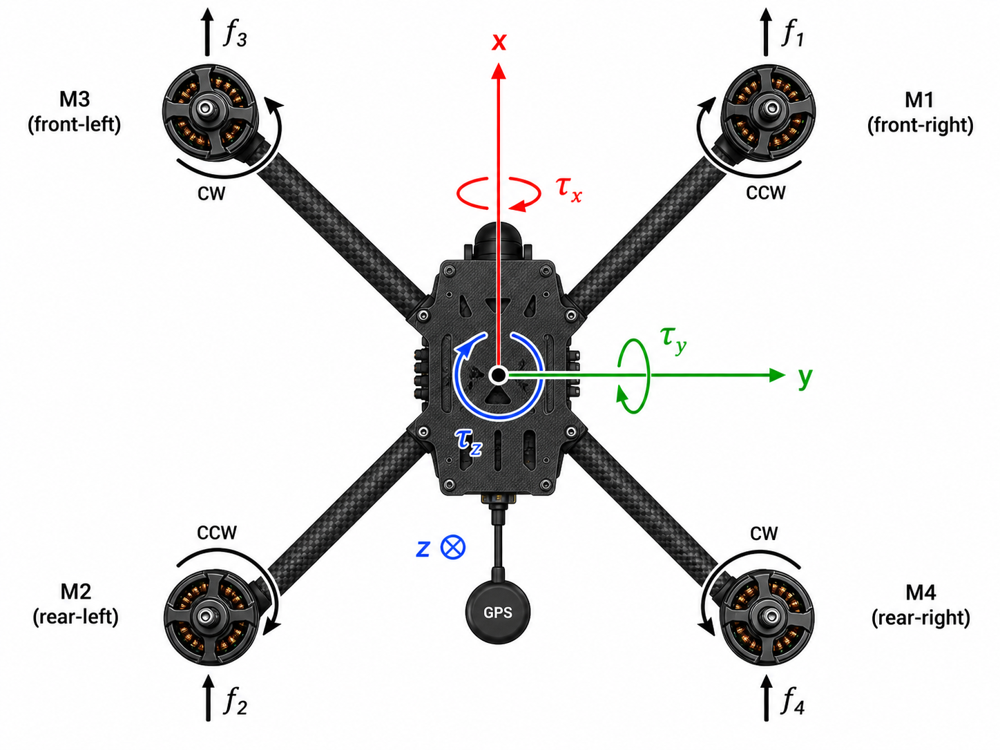

# Quadrotor / multirotor UAV — нелинейная 6-DoF динамика

Модель квадрокоптера с жёстким каркасом (rigid-body) в полной 6-DoF
формулировке: 12 состояний (положение, скорость, ориентация, угловые
скорости), 4 управляющих входа (общая тяга + три момента в связанной
СК). Реализована на чистом Python/NumPy с интеграторами Эйлера и RK4.
Подходит для PID-стабилизации, MPC слежения по траектории, и для
адаптивных RL-критиков (iADP, AIDI, AA-INDI) — особенно для сценариев
с отказами роторов.



<div class="grid cards" markdown>

-   :material-rocket-launch-outline: **Быстрый старт**

    Прогоните 10-секундный hover в три строки.

    [:octicons-arrow-right-24: К примеру](#быстрый-старт)

-   :material-cog-outline: **API модели**

    `NonlinearQuadrotor` — Python-класс 6-DoF динамики.

    [:octicons-arrow-right-24: К API](#python-api)

-   :material-book-open-variant: **Математика**

    Уравнения движения, конвенции NED / связанной СК.

    [:octicons-arrow-right-24: К теории](#математическая-модель)

-   :material-test-tube: **Тесты-примеры**

    Hover, свободное падение, гироскопическая связь.

    [:octicons-arrow-right-24: К проверкам](#валидация)

</div>

## Параметры эталонной модели (справочно)

Эталон — типовой исследовательский квадрокоптер класса AscTec
Hummingbird / Pelican, ≈1.5 кг, плечо 22.5 см. Эти числа — **дефолт**
в `QuadrotorParameters.default_parameters()`; их можно переопределить
для других платформ (DJI F450, Crazyflie, X4-frame и т.д.).

| Параметр | Значение |
|----------|----------|
| Масса $m$, кг | 1.5 |
| Момент инерции $J_x = J_y$, кг·м² | 0.0211 |
| Момент инерции $J_z$, кг·м² | 0.0366 |
| Длина плеча, м | 0.225 |
| Линейный body-drag $k_{dx}=k_{dy}$, Н·с/м | 0.10 |
| Линейный body-drag $k_{dz}$, Н·с/м | 0.20 |
| Максимальная общая тяга, Н | 30 (≈ 2:1 thrust-to-weight) |
| Максимальный момент по оси, Н·м | 1.5 |

## Системы координат и состояние

В модели используются две правые ортогональные системы координат:

- **Связанная (body-fixed):** $x$ — вперёд, $y$ — вправо, $z$ — вниз.
  Это совпадает с NED при горизонтальной ориентации.
- **Земная (NED, north-east-down):** $x$ — север, $y$ — восток,
  $z$ — вниз. Гравитация направлена по $+z$.

Преобразование «связанная → земная» — стандартная матрица поворота с
последовательностью углов Эйлера ZYX (321: рысканье → тангаж → крен).

Вектор состояния и управляющее воздействие:

$$
\mathbf{x} = \begin{bmatrix}
x_e & y_e & z_e &
u_b & v_b & w_b &
\phi & \theta & \psi &
p & q & r
\end{bmatrix}^\top, \qquad
\mathbf{u} = \begin{bmatrix} T & \tau_x & \tau_y & \tau_z \end{bmatrix}^\top.
$$

=== "Переменные"

    - **$x_e, y_e, z_e$** — положение в земной СК (NED), м.
    - **$u_b, v_b, w_b$** — скорость в связанной СК, м/с.
    - **$\phi, \theta, \psi$** — углы крена, тангажа, рысканья (Эйлер ZYX), рад.
    - **$p, q, r$** — угловые скорости в связанной СК, рад/с.
    - **$T$** — общая тяга вдоль $-z$ связанной СК (вверх при горизонтали), Н.
    - **$\tau_x, \tau_y, \tau_z$** — моменты в связанной СК (крен, тангаж, рыскание), Н·м.

=== "Уровень абстракции управления"

    Управляющий вектор $\mathbf{u}$ — это **уже выходы** allocation-блока
    (motor mixing). Маппинг 4 оборотов роторов $\omega_i$ в $(T, \tau)$
    зависит от конфигурации (X / +) и не входит в эту модель —
    он реализуется отдельным хелпером (или внутри RL-агента).

!!! note "Сингулярность Эйлера"
    При $|\theta| = \pi/2$ возникает gimbal lock: множитель
    $1/\cos\theta$ в кинематике углов уходит в бесконечность. Для
    манёвров с большим тангажом используйте кватернионную форму (в
    данной модели не реализована — задача будущего расширения).

## Математическая модель

Объединённая система ОДУ имеет четыре блока: кинематика положения,
динамика скорости, кинематика углов Эйлера, динамика угловых
скоростей.

### 1. Кинематика положения

$$
\dot{\mathbf{r}}_e = R_{eb}(\phi,\theta,\psi)\,\mathbf{v}_b,
$$

где $R_{eb}$ — матрица поворота из связанной в земную СК (ZYX 321):

$$
R_{eb} = \begin{bmatrix}
c_\theta c_\psi & s_\phi s_\theta c_\psi - c_\phi s_\psi & c_\phi s_\theta c_\psi + s_\phi s_\psi \\
c_\theta s_\psi & s_\phi s_\theta s_\psi + c_\phi c_\psi & c_\phi s_\theta s_\psi - s_\phi c_\psi \\
-s_\theta & s_\phi c_\theta & c_\phi c_\theta
\end{bmatrix}
$$

(сокращения $c_\bullet = \cos\bullet$, $s_\bullet = \sin\bullet$).

### 2. Динамика скорости (связанная СК)

Уравнение Ньютона в связанной СК с учётом вращения, силы тяжести,
тяги и линейного аэродинамического сопротивления:

$$
m\,\dot{\mathbf{v}}_b
\;=\;
R_{be}\,\mathbf{F}_{\text{grav},e}
\;+\;
\mathbf{F}_{\text{thrust},b}
\;-\;
D\,\mathbf{v}_b
\;-\;
\boldsymbol\omega \times m\,\mathbf{v}_b,
$$

где:

- $\mathbf{F}_{\text{grav},e} = [0, 0, m g]^\top$ — сила тяжести в NED ($+z$ — вниз),
- $\mathbf{F}_{\text{thrust},b} = [0, 0, -T]^\top$ — тяга вдоль $-z$ связанной,
- $D = \mathrm{diag}(k_{dx}, k_{dy}, k_{dz})$ — диагональная матрица drag,
- $\boldsymbol\omega = [p, q, r]^\top$.

### 3. Кинематика углов Эйлера (ZYX 321)

$$
\begin{bmatrix} \dot\phi \\ \dot\theta \\ \dot\psi \end{bmatrix}
=
\begin{bmatrix}
1 & s_\phi t_\theta & c_\phi t_\theta \\
0 & c_\phi & -s_\phi \\
0 & s_\phi / c_\theta & c_\phi / c_\theta
\end{bmatrix}
\begin{bmatrix} p \\ q \\ r \end{bmatrix},
$$

где $t_\theta = \tan\theta$.

### 4. Динамика угловых скоростей (Newton-Euler)

С диагональным тензором инерции $\mathbf{J} = \mathrm{diag}(J_x, J_y, J_z)$:

$$
\boxed{\;
\begin{aligned}
\dot p &= \bigl(\tau_x + (J_y - J_z)\,q\,r\bigr) / J_x, \\
\dot q &= \bigl(\tau_y + (J_z - J_x)\,p\,r\bigr) / J_y, \\
\dot r &= \bigl(\tau_z + (J_x - J_y)\,p\,q\bigr) / J_z.
\end{aligned}
\;}
$$

Слагаемые $(J_i - J_j)\,\omega_i\,\omega_j$ — гироскопическая связь
осей (Эйлеровы перекрёстные члены).

## Быстрый старт

```python
import numpy as np

from tensoraerospace.aerospacemodel.quadrotor.nonlinear import NonlinearQuadrotor

# Hover на месте при нулевой начальной точке
m = NonlinearQuadrotor(
    x0=np.zeros(12),
    dt=0.01,
    integrator="rk4",
)

# T = m·g удерживает аппарат в равновесии
u_hover = np.array([m.hover_thrust, 0.0, 0.0, 0.0])

for _ in range(1000):  # 10 секунд
    m.run_step(u_hover)

print(f"Финальное состояние (max |x|): {np.max(np.abs(m.current_state)):.2e}")
# → ≈ 0 (точное равновесие при RK4)
```

### Hover с возмущением и маленьким моментом крена

```python
import numpy as np

from tensoraerospace.aerospacemodel.quadrotor.nonlinear import (
    NonlinearQuadrotor,
    set_initial_state,
)

# Стартуем с лёгким наклоном в 3°
m = NonlinearQuadrotor(
    x0=set_initial_state(phi=np.deg2rad(3.0)),
    dt=0.005,
    integrator="rk4",
)

# Тяга баланса + небольшая отрицательная крен-команда (компенсация)
T_hover = m.hover_thrust
for k in range(2000):
    tau_x = -0.05 * m.current_state[6]   # P-обратная связь по phi
    u = np.array([T_hover, tau_x, 0.0, 0.0])
    m.run_step(u)

phi_final = np.rad2deg(m.current_state[6])
print(f"Финальный угол крена: {phi_final:.4f}°")
```

### Хелпер для смены начального состояния

```python
from tensoraerospace.aerospacemodel.quadrotor.nonlinear import set_initial_state

# Стартовое положение: 5 м над землёй (NED z = -5), наклон по тангажу 5°
x0 = set_initial_state(z_e=-5.0, theta=np.deg2rad(5.0))
```

## Валидация

Корректность ОДУ подтверждена пятью аналитическими тестами в
`tests/aerospacemodel/quadrotor_test.py`:

| Тест | Проверка | Допуск |
|------|----------|--------|
| Hover-равновесие | $T = m\,g$, нулевые моменты → состояние не меняется за 10 с | $\max\|x\| < 10^{-9}$ |
| Свободное падение без drag | $z_e(t) = \tfrac{1}{2}g\,t^2$ | $\delta < 10^{-3}$ |
| Свободное падение с drag | $z(t) = v_\infty t + v_\infty\tau(e^{-t/\tau} - 1)$ | $\delta < 10^{-3}$ |
| Single-step roll-torque | $p \approx \tau_x \cdot dt / J_x$ | $\delta < 10^{-9}$ |
| Гироскопическая связь | $\dot p = (J_y-J_z)\,q\,r / J_x$ при $q=r=1$ | $\delta < 10^{-12}$ |

Плюс 6 sanity-проверок: размерности входов, accumulation истории,
поддержка обоих интеграторов (Euler + RK4), валидация ошибочного имени
интегратора.

## Allocation (mixer): связь между виртуальным управлением и роторами

Базовая модель `NonlinearQuadrotor` принимает виртуальный вектор
$(T, \tau_x, \tau_y, \tau_z)$ — это уровень, на котором работают
PID/MPC/RL-контроллеры. Для воспроизведения **отказов на уровне
ротора** (что необходимо для FTC-сценариев из Lu 2019, Wang 2019,
Lanzon 2015) есть `XConfigAllocator` — двунаправленный mixer:

$$
\begin{bmatrix} T \\ \tau_x \\ \tau_y \\ \tau_z \end{bmatrix}
=
\underbrace{
\begin{bmatrix}
k_T   &  k_T  &  k_T  &  k_T   \\
-k_T a &  k_T a&  k_T a& -k_T a \\
k_T a & -k_T a&  k_T a& -k_T a \\
k_M   &  k_M  & -k_M  & -k_M
\end{bmatrix}
}_{M\ \text{(X-config, PX4)}}
\begin{bmatrix} \omega_1^2 \\ \omega_2^2 \\ \omega_3^2 \\ \omega_4^2 \end{bmatrix}
$$

где $a = L/\sqrt 2$, $L$ — длина плеча, $k_T$ — thrust coefficient,
$k_M$ — yaw-torque coefficient. Матрица full-rank → инверсия
существует.

```python
from tensoraerospace.aerospacemodel.quadrotor import default_allocator

alloc = default_allocator()  # k_T=7.5e-6, k_M≈0.016·k_T, arm=0.225
v = alloc.mix(omega_squared)         # 4 ω² → [T, τ]
omega2 = alloc.unmix(v)              # [T, τ] → 4 ω² (может быть < 0 для нереализуемых v)
omega2 = alloc.saturate(omega2, 0, 1000)  # клип до физических ограничений
```

Среда `NonlinearQuadrotor-v0` поддерживает **два режима** подачи действия:

```python
# Режим "virtual" (default): action = [T, τ_x, τ_y, τ_z]
env = gym.make("NonlinearQuadrotor-v0", initial_state=np.zeros(12),
               number_time_steps=1000, action_space="virtual")

# Режим "rotor": action = [ω₁², ω₂², ω₃², ω₄²], env применяет allocator
env = gym.make("NonlinearQuadrotor-v0", initial_state=np.zeros(12),
               number_time_steps=1000, action_space="rotor")
```

Без damage_profile оба режима эквивалентны (round-trip mix↔unmix).

## Подсистема повреждений (rotor-level events)

Для воспроизведения канонических FTC-сценариев из литературы доступна
event-driven система отказов на уровне ротора. Каждый ротор имеет
коэффициент эффективности $\mu_i \in [0, 1]$, и среда применяет
$\omega^2_{i,\text{eff}} = \mu_i \cdot \omega^2_{i,\text{cmd}}$ перед
mixing'ом обратно в $(T, \tau)$.

Три типа событий:

| Событие | Семантика | Источник |
|---------|-----------|----------|
| `RotorDamageEvent(rotor_id, mu)` | Мгновенная потеря эффективности на ротор $i$ | Lu et al. 2019 |
| `RotorLossEvent(rotor_id)` | Полный отказ ($\mu = 0$) | Lanzon et al. 2015 |
| `MotorEfficiencyDecay(rotor_id, tau, mu_floor)` | Экспоненциальный износ $\dot\mu = -(1/\tau)(\mu - \mu_\text{floor})$ | gradual wear |

Три готовых пресета: `LANZON_M1_LOSS`, `LU_M1_50PCT_LOSS`,
`WEAR_DEGRADATION_M3`. Импорт из
`tensoraerospace.aerospacemodel.quadrotor.damage`.

```python
from tensoraerospace.aerospacemodel.quadrotor.damage import LANZON_M1_LOSS

env = gym.make("NonlinearQuadrotor-v0", initial_state=np.zeros(12),
               number_time_steps=2000, damage_profile=LANZON_M1_LOSS)
obs, _ = env.reset()
T_hover = 1.5 * 9.81
for k in range(2000):
    obs, r, term, trunc, info = env.step(np.array([T_hover, 0, 0, 0]))
    if "damage_events_triggered" in info:
        print(f"t={k*0.01}s: {info['damage_events_triggered']}")
```

Без `damage_profile` среда бит-в-бит идентична baseline (rotor-effectiveness
$\mu = 1$ для всех 4 моторов).

## Ограничения текущей версии

1. **Эйлеровы углы (ZYX 321)** — модель страдает gimbal-lock'ом при
   $|\theta| = \pi/2$. Для акробатических манёвров (loops, flips)
   нужна кватернионная форма — задача будущего расширения.
2. **Линейный drag** только — нет квадратичного по скорости (значимо
   на крейсерских >10 м/с) и нет blade-flap aerodynamics.
3. **Симметричная X-конфигурация** в allocator'е — для
   несимметричных рам (Y, H, гексакоптер) потребуется отдельный
   allocator.
4. **Простой column-clip saturation** — нет thrust-priority allocation
   (Faessler 2017) для случаев насыщения, когда нужно сохранить
   приоритет одного канала над другим.

## Источники

### Динамика и системы координат

- **Stevens, B. L., Lewis, F. L., Johnson, E. N.** (2015). *Aircraft
  Control and Simulation*, 3rd ed. Wiley. — основная методологическая
  база для 6-DoF rigid-body уравнений в связанной СК (NED frame, ZYX
  Euler convention).
- **PX4 Airframe Reference**: [Quadrotor X](https://docs.px4.io/main/en/airframes/airframe_reference.html#quadrotor-x)
  — конвенция нумерации моторов и направлений вращения,
  использованная в `XConfigAllocator`.

### Параметры эталонной платформы

- **AscTec Hummingbird / Pelican research-class quadrotors** — типовые
  значения $m \approx 1.5$ кг, $J_x = J_y \approx 0.021$ кг·м²,
  $J_z \approx 0.037$ кг·м², плечо 22.5 см. Платформы широко
  используются в академических FTC-работах по UAV.

### FTC-сценарии (источники для damage subsystem и пресетов)

- **Lu, P., Yu, B., van Kampen, E.-J., Chu, Q. P.** (2019).
  *Quadrotor Fault Tolerant Incremental Sliding Mode Control driven by
  Sliding Mode Disturbance Observers*. Aerospace Science and Technology,
  87:417–430. [DOI: 10.1016/j.ast.2019.03.001](https://doi.org/10.1016/j.ast.2019.03.001)
  — multiplicative effectiveness loss на роторах, основа для пресета
  `LU_M1_50PCT_LOSS` и события `RotorDamageEvent`. **129 цитирований**.
- **Wang, X., van Kampen, E.-J., Chu, Q. P.** (2019). *Quadrotor
  fault-tolerant incremental nonsingular terminal sliding mode control*.
  Aerospace Science and Technology, 95:105514.
  [DOI: 10.1016/j.ast.2019.105514](https://doi.org/10.1016/j.ast.2019.105514)
  — параллельная работа с terminal sliding mode; та же модель отказов.
- **Lanzon, A., Freddi, A., Longhi, S.** (2015). *Active fault-tolerant
  control for quadrotors subjected to a complete rotor failure*.
  IEEE/RSJ IROS 2015. [DOI: 10.1109/IROS.2015.7354046](https://doi.org/10.1109/IROS.2015.7354046)
  — экстремальный сценарий полной потери ротора (spin-mode
  recovery), основа для `LANZON_M1_LOSS` и `RotorLossEvent`.

### Связанные топики в TensorAeroSpace

- [Моделирование повреждений ЛА (F-16)](aircraft-damage-modeling.md) —
  более развитая damage-подсистема для самолётов с strip-theory и
  пересчётом тензора инерции через теорему Гюйгенса-Штейнера.
- [AIDI](../agent/aidi.md) — адаптивная INDI-подобная архитектура,
  применимая к данной модели quadrotor для отказоустойчивого
  управления.
- [iADP](../agent/iadp.md), [IM-GDHP](../agent/imgdhp.md) — онлайн-
  адаптивные критики, восстанавливающиеся после изменений в плант-
  модели за десятки миллисекунд.

## Python API

::: tensoraerospace.aerospacemodel.quadrotor.nonlinear.NonlinearQuadrotor

::: tensoraerospace.aerospacemodel.quadrotor.nonlinear.params.QuadrotorParameters

::: tensoraerospace.aerospacemodel.quadrotor.nonlinear.dynamics.quadrotor_ode_6dof

::: tensoraerospace.aerospacemodel.quadrotor.allocation.XConfigAllocator

::: tensoraerospace.aerospacemodel.quadrotor.damage.events.RotorDamageEvent

::: tensoraerospace.aerospacemodel.quadrotor.damage.events.RotorLossEvent

::: tensoraerospace.aerospacemodel.quadrotor.damage.events.MotorEfficiencyDecay

::: tensoraerospace.aerospacemodel.quadrotor.damage.manager.RotorDamageManager

::: tensoraerospace.envs.quadrotor.NonlinearQuadrotorEnv
