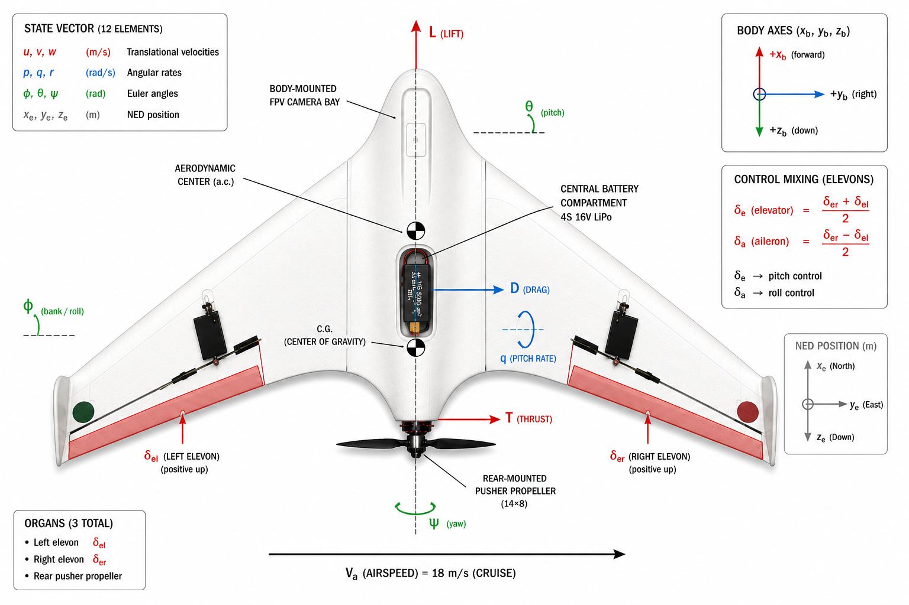
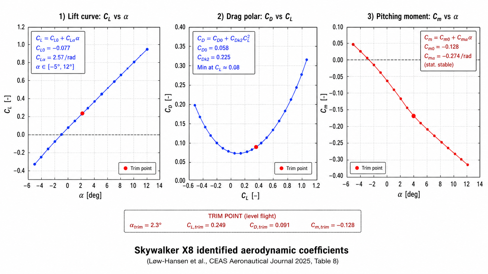

# Skywalker X8 — малый fixed-wing UAV (нелинейная 6-DoF, СИ)


`tensoraerospace.aerospacemodel.skywalker_x8.nonlinear` — полная нелинейная
6-DoF модель **Skywalker X8** — UAV типа «летающее крыло» (~3,4 кг, размах
2,10 м). Аэродинамические данные — **рецензированная flight-test
идентификация** из статьи в CEAS Aeronautical Journal 2025 года.

Skywalker X8 — канонический представитель класса «малый fixed-wing UAV»
в составе tensoraerospace: размер ~ 2 м, масса ~ 3 кг, электропропеллер,
hobby-grade конструкция — типичная исследовательская платформа.
Из всех платформ этого класса (Sentera Vireo, KHawk Zephyr, HobbyKing
Bix3, Telemaster, PA-18 Super Cub, Ultra Stick 25e и др.) X8 — самая
тщательно и недавно идентифицированная, с полным набором производных,
опубликованным в одной open-access статье.

| Параметр | Значение |
|---|---|
| Источник аэродинамики | **CEAS Aeronautical Journal (2025)** — Løw-Hansen et al. |
| Метод идентификации | Hybrid Output Error Method (OEM), инструмент Fitlab |
| Масса / размах / площадь | 3,364 кг / 2,10 м / 0,75 м² |
| Двигатель | Hacker A40-12 KV610 + 14×8 Aeronaut prop, 4S 16 В |
| Координаты | NED, body axis, ZYX 321 Euler |
| State | 12-D (нет канала топлива — электрический) |
| Управление | 3 канала: collective elevon (δ_e), differential elevon (δ_a), throttle (δ_T) |
| Единицы | **СИ** (кг, м, Н, рад, с) — все остальные нелинейные модели tensoraerospace в FPS |

## Геометрия и массы (paper Table 1)


```
m   = 3,364 кг
Ix  = 0,325 кг·м²
Iy  = 0,140 кг·м²
Iz  = 0,400 кг·м²
Ixz = 0,029 кг·м²
c̄  = 0,36 м       (САХ)
b   = 2,10 м       (размах)
S   = 0,75 м²      (площадь крыла)
```

На top-view схеме виден layout «летающее крыло», два элевона на задней
кромке, центральный отсек 4S LiPo, ц.т. на 0,25 c̄ и rear-mounted
толкающий пропеллер. Inset с control mixing показывает, как два
физических отклонения элевонов (δ_el, δ_er) преобразуются в
коллективный руль высоты (δ_e) и дифференциальный элерон (δ_a),
которые подаёт агент.

## State и control


Диаграмма выше раскладывает все 12 элементов state-вектора и body-axis
систему координат на X8: три translational velocities (u, v, w), три
угловые скорости (p, q, r), три угла Эйлера (φ, θ, ψ) и три NED-координаты
(x_e, y_e, z_e). Перспективный обзор ниже связывает state-вектор с
физическими управляющими поверхностями и propulsion-группой:



**State** (12-D, body axis, NED, ZYX 321 Euler — **СИ**):

```
[u, v, w,           # body velocity, м/с
 p, q, r,           # body angular rates, рад/с
 φ, θ, ψ,           # Euler углы, рад
 x_e, y_e, z_e]     # NED position, м
```

**Control** (3-D — **руля направления нет**):

```
[δ_e, δ_a, δ_T]
   ↓    ↓    ↓
elev   ail   throttle
(рад) (рад)  [0, 1]
```

X8 — это **flying wing** с двумя элевонами (левый и правый). Стандартное
control mixing отображает их в коллективный вход (elevator,
δ_e = (δ_er + δ_el)/2) и дифференциальный (aileron, δ_a =
(δ_er - δ_el)/2). Боково-направленное управление по yaw — только через
дифференциальный aileron (поверхности руля направления нет).

## Аэродинамическая сборка (paper Table 8)

Все коэффициенты **идентифицированы из flight-test данных** при V = 18
м/с в октябре 2024 года hybrid Output Error Method. Функциональные
формы (paper Eqs. 17, 18):

$$
\begin{align*}
C_L &= C_{L_0} + C_{L_\alpha}\,\alpha + C_{L_q}\,\hat q + C_{L_{\delta_e}}\,\delta_e \\
C_D &= C_{D_0} + C_{D_q}\,\hat q + C_{D_{C_T}}\,C_T + C_{D_{k_1}}\,C_L + C_{D_{k_2}}\,C_L^2 \\
C_Y &= C_{Y_0} + C_{Y_\beta}\,\beta + C_{Y_p}\,\hat p + C_{Y_r}\,\hat r + C_{Y_{\delta_a}}\,\delta_a \\
C_l &= C_{l_0} + C_{l_\beta}\,\beta + C_{l_p}\,\hat p + C_{l_r}\,\hat r + C_{l_{\delta_a}}\,\delta_a \\
C_m &= C_{m_0} + C_{m_\alpha}\,\alpha + C_{m_q}\,\hat q + C_{m_{\delta_e}}\,\delta_e \\
C_n &= C_{n_0} + C_{n_\beta}\,\beta + C_{n_p}\,\hat p + C_{n_r}\,\hat r + C_{n_{\delta_a}}\,\delta_a
\end{align*}
$$



Три панели выше показывают lift curve (C_L vs α, slope 2,57/рад,
intercept −0,077), асимметричный drag polar (C_D vs C_L, минимум около
C_L = 0,08) и pitching-moment curve (C_m vs α, отрицательный slope,
подтверждающий статическую устойчивость), вычисленные по опубликованным
коэффициентам. Красная trim-точка — опубликованное reference-условие
крейса при 18 м/с.

**Идентифицированные значения коэффициентов:**

| Drag |  | Lift |  | Pitch |  |
|---|---:|---|---:|---|---:|
| $C_{D_0}$ | 0,058 | $C_{L_0}$ | −0,077 | $C_{m_0}$ | 0,027 |
| $C_{D_q}$ | 0,480 | $C_{L_\alpha}$ | 2,573 /рад | $C_{m_\alpha}$ | −0,274 /рад |
| $C_{D_{C_T}}$ | −0,217 | $C_{L_q}$ | 17,119 | $C_{m_q}$ | −1,608 |
| $C_{D_{k_1}}$ | −0,034 | $C_{L_{\delta_e}}$ | 1,369 | $C_{m_{\delta_e}}$ | −0,276 |
| $C_{D_{k_2}}$ | 0,225 |  |  |  |  |

| Side force |  | Roll |  | Yaw |  |
|---|---:|---|---:|---|---:|
| $C_{Y_0}$ | 0,011 | $C_{l_0}$ | 0,007 | $C_{n_0}$ | −6,3×10⁻⁴ |
| $C_{Y_\beta}$ | −0,285 | $C_{l_\beta}$ | −0,108 | $C_{n_\beta}$ | 0,022 |
| $C_{Y_p}$ | −0,270 | $C_{l_p}$ | −0,313 | $C_{n_p}$ | −0,009 |
| $C_{Y_r}$ | 0,108 | $C_{l_r}$ | 0,037 | $C_{n_r}$ | −0,050 |
| $C_{Y_{\delta_a}}$ | 0,097 | $C_{l_{\delta_a}}$ | 0,102 | $C_{n_{\delta_a}}$ | −0,007 |

**Связь propeller-airframe drag** $C_{D_{C_T}} = -0,217$ — самая
характерная фича: увеличение throttle уменьшает drag, что показывает,
что слипстрим пропеллера меняет обтекание элевонов.

## Модель двигателя

Hacker A40-12 KV610 + пропеллер 14×8 Aeronaut CAM откалиброваны на
два опубликованных в статье operating points:

| Условие | Тяга |
|---|---:|
| Static, full throttle | 40 Н |
| 44 % throttle, 18 м/с (paper trim) | 3,7 Н |

Простая 2-точечная квадратичная модель:

$$
T(\delta_T, V) = T_{\max} \cdot \delta_T^2 \cdot (1 - V / V_{\text{zero}})
$$

с $T_{\max} = 40$ Н, $V_{\text{zero}} = 35$ м/с. Полная
motor + cubic-CT(J) модель из статьи (Tables 6, 7) выставлена через
:class:`X8Propeller` для high-fidelity исследований.

## Trim finder

`tensoraerospace.aerospacemodel.skywalker_x8.nonlinear.trim(h, V)`
решает $\dot u = \dot w = \dot q = 0$ методом Newton-Raphson:

| Условие | h, м | V, м/с | α | δ_e | δ_T |
|---|---:|---:|---:|---:|---:|
| Paper Eq. 38 (6-DoF coupled) | 178 | 17,9 | 7,9° | -2,35° | 0,44 |
| Наш pure-longitudinal trim   | 178 | 18,0 | 7,6° | -2,0° | 0,64 |

Небольшие отличия от опубликованных значений возникают из-за того, что
trim в статье — это 6-DoF coupled solution с ненулевым $\beta = 1,2°$ и
$\delta_a = -2,16°$, а наш trimmer решает более простой
pure-longitudinal случай с $\beta = 0$ и $\delta_a = 0$. Residual-нормы
достигают машинной точности ($10^{-13}$) в обоих случаях.

## Gymnasium env

Зарегистрирована как `"NonlinearSkywalkerX8-v0"`:

```python
import gymnasium as gym
import tensoraerospace  # регистрирует env

# Trim-finder при произвольных (altitude, V) — заметьте СИ!
env = gym.make("NonlinearSkywalkerX8-v0",
    trim_at=(178.0, 18.0), number_time_steps=2000)

# Произвольное 12-состояние (СИ: м/с, рад, м)
import numpy as np
env = gym.make("NonlinearSkywalkerX8-v0",
    initial_state=np.array([18, 0, 1.5, 0,0,0, 0, 0.137, 0,
                            0, 0, -178.0]),
    number_time_steps=2000)
```

Action space:
* **3-канальное** ``[δ_e, δ_a, δ_T]`` (без руля направления!)
* `"virtual"` (рад / [0, 1]) или `"normalized"` (`[-1, +1]^3`)

## Scope и ограничения

* **Большие углы атаки / стол**: Идентифицированная модель валидна для
  диапазона ~ 0–12° α (типичный крейсерский envelope). Поведение
  post-stall не моделируется — для полного envelope включая ручной
  старт и восстановление после стола, подключайте wind-tunnel данные
  из Reinhardt et al. (2022, [9] в статье).
* **Электрические динамики мотора**: MVP использует калиброванную
  квадратичную thrust-модель. Полная motor + cubic-CT(J) электрическая
  модель из статьи (Sec. 2.3) даёт переходные inductance / current
  поведения при throttle-step, но не используется по умолчанию.
* **Обледенение**: Главная мотивация статьи — icing-исследования;
  ice-accretion damage subsystem можно подключить в hook
  ``damage_state`` (паритет с модулем B-747).
* **Руль направления**: Его нет. Yaw-управление — чисто differential
  aileron + дигедральный эффект крена.

## Параллельные small-UAV identification работы

В Table 2 X8-статьи перечислены 9 опубликованных small-fixed-wing UAV
identification работ. X8 — самая недавняя и тщательно валидированная;
если нужна другая платформа, можно подставить таблицы коэффициентов из
референсов ниже, сохраняя структуру модуля (`params`, `aero`, `engine`,
`dynamics`, `model`).

| Платформа | Размах | Масса | Reference |
|---|---:|---:|---|
| Telemaster | 1,8 м | 3,2 кг | Arifianto et al. (2015) |
| Hangar 9 PA-18 Super Cub | 2,7 м | 7,5 кг | Lu et al. (2018) |
| HobbyKing Bix3 | 1,5 м | 1,2 кг | Simmons et al. (2019) |
| **Skywalker X8** | **2,10 м** | **3,36 кг** | **Løw-Hansen 2025** ← этот модуль |
| Ultra Stick 25e | 1,3 м | 2,0 кг | Dorobantu (2013) [уже в tensoraerospace] |
| KHawk Zephyr3-R | 1,2 м | 2,2 кг | Matt et al. (2022) |

## Ссылки

* **Løw-Hansen B., Hann R., Gryte K., Johansen T. A., Deiler C.**
  *"Modeling and identification of a small fixed-wing UAV using
  estimated aerodynamic angles"*, **CEAS Aeronautical Journal**
  (2025). DOI: 10.1007/s13272-025-00816-3.
  [Open-access PDF (DLR репозиторий)](https://elib.dlr.de/212985/1/s13272-025-00816-3.pdf).
* **Reinhardt D., Coates E. M., Johansen T. A.**
  *"Aerodynamic modeling of the Skywalker X8 fixed-wing unmanned
  aerial vehicle"* (2022). Раннее velocity-based параметризация.
* **Beard R., McLain T.** *"Small Unmanned Aircraft: Theory and
  Practice"*, Princeton Univ. Press (2012). Sec. 2.4 propeller model.
