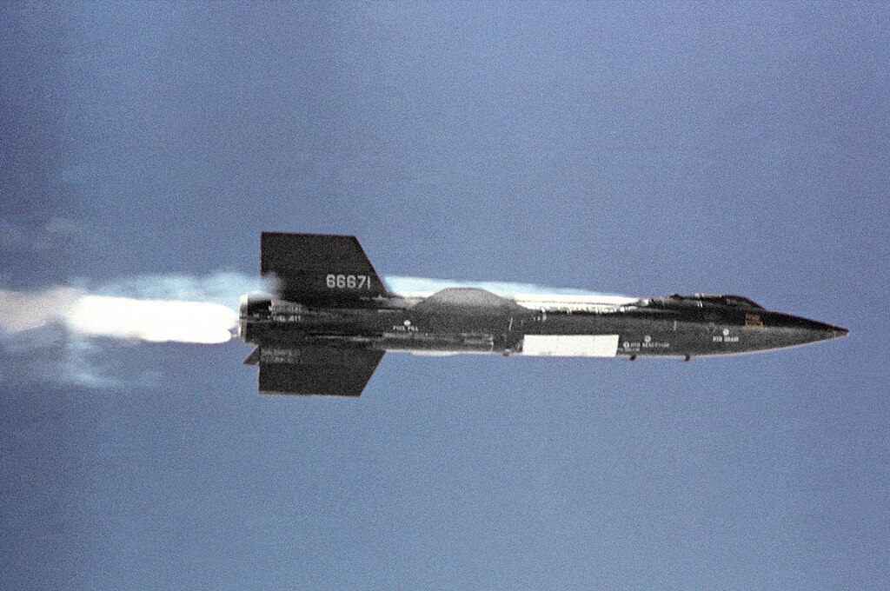

# North American X‑15 — продольная динамика

Экспериментальный ракетоплан X‑15 для исследований гиперзвукового полёта. Страница оформлена по аналогии с ELV: быстрый старт, математика, производные и API.



<div class="grid cards" markdown>

-   :material-rocket-launch-outline: **Быстрый старт**

    Запустите среду или модель за минуты.

    [:octicons-arrow-right-24: К примеру](#быстрый-старт)

-   :material-cog-outline: **API модели**

    Документация Python‑класса X‑15.

    [:octicons-arrow-right-24: К API](#python-api)

-   :material-gamepad-variant-outline: **Среда Gymnasium**

    Готовая среда для RL‑агентов.

    [:octicons-arrow-right-24: К среде](#python-api)

-   :material-book-open-variant: **Теория**

    Уравнения состояния и численные параметры.

    [:octicons-arrow-right-24: К модели](#математическая-модель)

</div>

## Как устроен объект управления

Модель задана в пространстве состояний:

\[\dot{x} = A x + B u, \quad y = C x + D u\]

Где:

\[
 x = \begin{bmatrix} u & \alpha & q & \theta \end{bmatrix}^{\top}, \quad
 u_{in} = \eta
\]

!!! note "О единицах измерения"
    Углы и угловые скорости — в радианах. Методы API поддерживают выдачу в градусах.

## Математическая модель {#математическая-модель}

$$
\dot{x} = A x + B u, \qquad y = C x + D u
$$

Численные матрицы (пример линеаризации):

\[
\begin{bmatrix}
\dot{u} \\
\dot{\alpha} \\
\dot{q} \\
\dot{\theta}
\end{bmatrix}
=
\begin{bmatrix}
-0.0087 & -0.0190 & 0 & -32.174 \\
0.0117 & -0.3110 & 1936 & 0 \\
0.000471 & -0.0067 & -0.1820 & 0 \\
0 & 0 & 1 & 0 
\end{bmatrix}
\begin{bmatrix}
u \\
\alpha \\
q \\
\theta 
\end{bmatrix}
 +
\begin{bmatrix}
0.0129 \\
-0.1844 \\
-0.0001225 \\
0
\end{bmatrix}
\eta
\]

### Производные (численные значения)

- **Матрица A (производные):**

  | Коэффициент | Значение |
  |-------------|----------|
  | x_u | -0.0087 |
  | x_α | -0.0190 |
  | x_q | 0 |
  | x_θ | -32.174 |
  | z_u | 0.0117 |
  | z_α | -0.3110 |
  | z_q | 1936 |
  | z_θ | 0 |
  | m_u | 0.000471 |
  | m_α | -0.0067 |
  | m_q | -0.1820 |
  | m_θ | 0 |

- **Вход η (столбец B):**

  | Коэффициент | Значение |
  |-------------|----------|
  | x_η | 0.0129 |
  | z_η | -0.1844 |
  | m_η | -0.0001225 |

## Источники

1. Heffley R. K., Jewell W. F. Aircraft handling qualities data. – NASA, 1972. № AD‑A277031.
2. Etkin B., Reid L. D. Dynamics of flight. – New York : Wiley, 1959. – Т. 2

## Награда

Функция награды по умолчанию возвращает отрицательную абсолютную ошибку отслеживания угла тангажа:

$$r_t = -|\theta(t) - \theta_{\text{ref}}(t)|$$

Чем выше награда (ближе к 0), тем лучше качество отслеживания. Пользовательская функция награды может быть передана через параметр `reward_func`.

## Быстрый старт {#быстрый-старт}

=== "Gymnasium"

```python
import gymnasium as gym 
import numpy as np

from tensoraerospace.envs import LinearLongitudinalX15
from tensoraerospace.utils import generate_time_period
from tensoraerospace.signals.standart import unit_step

dt = 0.01
tp = generate_time_period(tn=20, dt=dt)
number_time_steps = len(tp)
reference_signals = unit_step(degree=5, tp=tp, time_step=10, output_rad=True).reshape(1, -1)

env = gym.make(
    'LinearLongitudinalX15-v0',
    number_time_steps=number_time_steps, 
    initial_state=[[0],[0],[0],[0]],
    reference_signal=reference_signals,
)
state, info = env.reset()
for _ in range(200):
    action = np.array([[0.1]])
    state, reward, terminated, truncated, info = env.step(action)
    if terminated or truncated:
        break
```

=== "Только модель"

```python
import numpy as np
from tensoraerospace.aerospacemodel import LongitudinalX15

dt = 0.01
number_time_steps = 200

x0 = np.array([0.0, 0.0, 0.0, 0.0])

model = LongitudinalX15(
    x0=x0,
    number_time_steps=number_time_steps,
    selected_state_output=["u", "alpha", "q", "theta"],
    dt=dt,
)

for t in range(number_time_steps - 1):
    u = np.array([[0.05]])
    x_next = model.run_step(u)
```

## Python API

=== "Модель"

::: tensoraerospace.aerospacemodel.x15.LongitudinalX15

=== "Среда Gymnasium"

::: tensoraerospace.envs.x15.LinearLongitudinalX15
