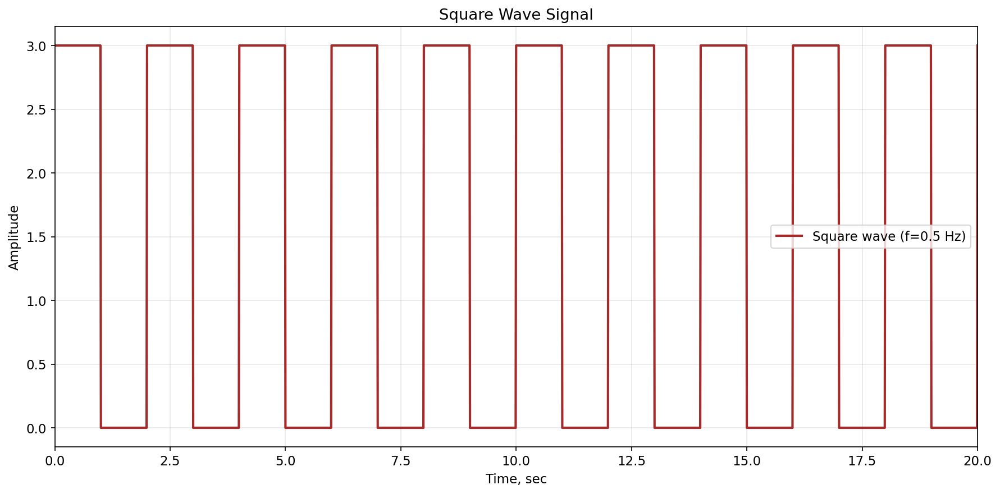
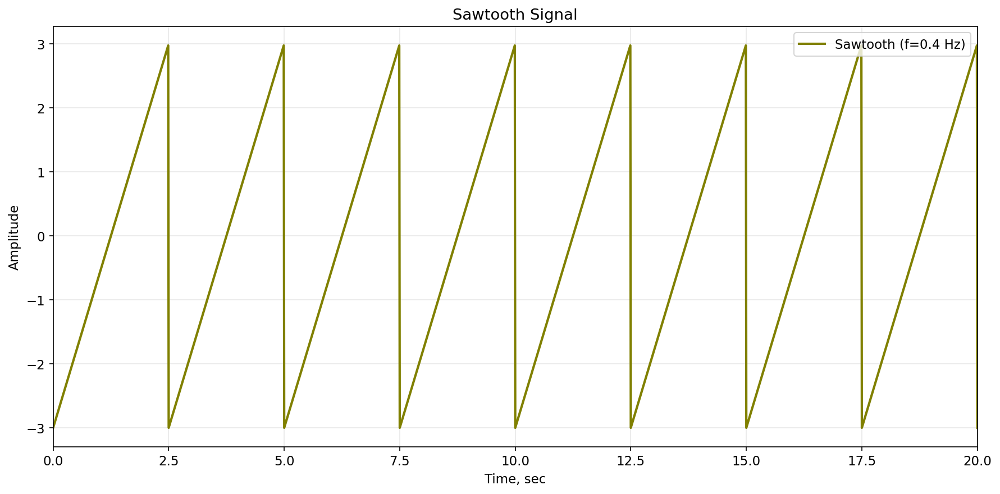
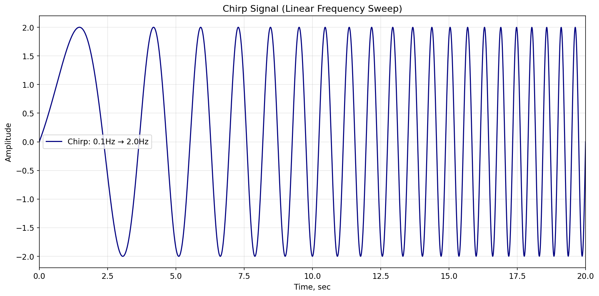
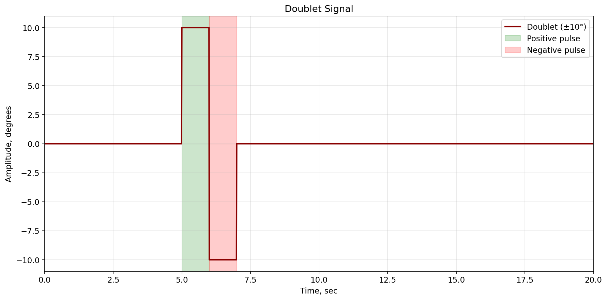
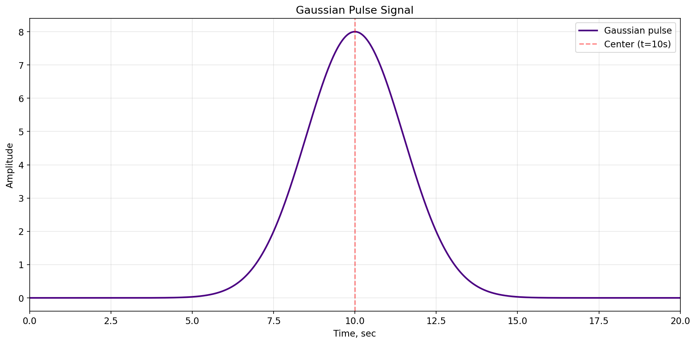
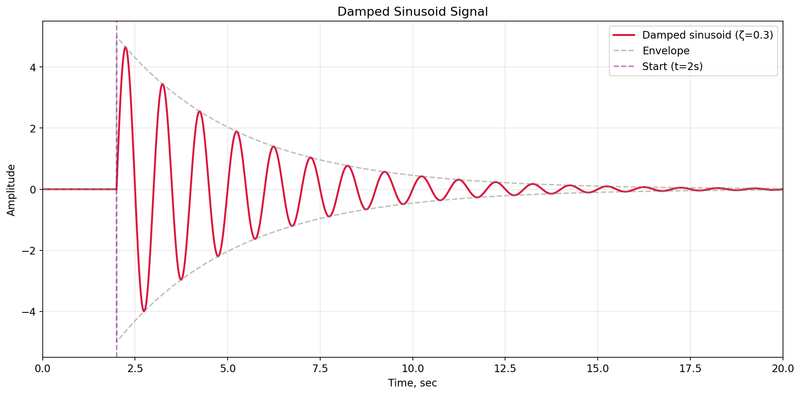

Сигналы
=======

TensorAeroSpace предоставляет **17 типов сигналов** для комплексного тестирования и анализа систем.

Базовые сигналы
---------------

Ступенчатый сигнал
~~~~~~~~~~~~~~~~~~

.. autofunction:: tensoraerospace.signals.standard.unit_step

**Пример**

.. code-block:: python

    from tensoraerospace.utils import generate_time_period
    from tensoraerospace.signals.standard import unit_step

    dt = 0.01
    tp = generate_time_period(tn=20)
    tp_unit = unit_step(degree=5, tp=tp, time_step=10, output_rad=False)

.. image:: img/unit_step.png
        :alt: Сгенерированный ступенчатый сигнал

Линейный сигнал (Ramp)
~~~~~~~~~~~~~~~~~~~~~~~

.. autofunction:: tensoraerospace.signals.standard.ramp

**Пример**

.. code-block:: python

    from tensoraerospace.utils import generate_time_period
    from tensoraerospace.signals.standard import ramp

    tp = generate_time_period(tn=20)
    signal = ramp(tp, slope=0.5, time_start=2.0)

.. image:: img/ramp.png
        :alt: Линейный сигнал

Импульсный сигнал
~~~~~~~~~~~~~~~~~

.. autofunction:: tensoraerospace.signals.standard.pulse

**Пример**

.. code-block:: python

    from tensoraerospace.utils import generate_time_period
    from tensoraerospace.signals.standard import pulse

    tp = generate_time_period(tn=20)
    signal = pulse(tp, amplitude=5.0, time_start=5.0, width=3.0)

.. image:: img/pulse.png
        :alt: Импульсный сигнал

Константный сигнал
~~~~~~~~~~~~~~~~~~

.. autofunction:: tensoraerospace.signals.standard.constant_line

**Пример**

.. code-block:: python

    from tensoraerospace.utils import generate_time_period
    from tensoraerospace.signals.standard import constant_line

    tp = generate_time_period(tn=20)
    signal = constant_line(tp, value_state=3.0)

.. image:: img/constant_line.png
        :alt: Константный сигнал

Периодические сигналы
---------------------

Синусоидный сигнал
~~~~~~~~~~~~~~~~~~

.. autofunction:: tensoraerospace.signals.standard.sinusoid

**Пример**

.. code-block:: python

    from tensoraerospace.utils import generate_time_period
    from tensoraerospace.signals.standard import sinusoid

    dt = 0.01
    tp = generate_time_period(tn=20)
    tp_sinusoid = sinusoid(tp=tp, amplitude=10, frequency=0.01)

.. image:: img/sinusoid.png
        :alt: Синусоидный сигнал

Синусоида со смещением
~~~~~~~~~~~~~~~~~~~~~~~

.. autofunction:: tensoraerospace.signals.standard.sinusoid_vertical_shift

**Пример**

.. code-block:: python

    from tensoraerospace.utils import generate_time_period
    from tensoraerospace.signals.standard import sinusoid_vertical_shift

    tp = generate_time_period(tn=20)
    signal = sinusoid_vertical_shift(tp, frequency=0.5, amplitude=2.0, vertical_shift=5.0)

.. image:: img/sinusoid_vertical_shift.png
        :alt: Синусоида со смещением

Прямоугольный сигнал
~~~~~~~~~~~~~~~~~~~~

.. autofunction:: tensoraerospace.signals.standard.square_wave

**Пример**

.. code-block:: python

    from tensoraerospace.utils import generate_time_period
    from tensoraerospace.signals.standard import square_wave

    tp = generate_time_period(tn=20)
    signal = square_wave(tp, frequency=0.5, amplitude=3.0, duty_cycle=0.5)

Треугольный сигнал
~~~~~~~~~~~~~~~~~~

.. autofunction:: tensoraerospace.signals.standard.triangular_wave

**Пример**

.. code-block:: python

    from tensoraerospace.utils import generate_time_period
    from tensoraerospace.signals.standard import triangular_wave

    tp = generate_time_period(tn=20)
    signal = triangular_wave(tp, frequency=0.3, amplitude=4.0)

.. image:: img/triangular_wave.png
        :alt: Треугольный сигнал

Пилообразный сигнал
~~~~~~~~~~~~~~~~~~~

.. autofunction:: tensoraerospace.signals.standard.sawtooth

**Пример**

.. code-block:: python

    from tensoraerospace.utils import generate_time_period
    from tensoraerospace.signals.standard import sawtooth

    tp = generate_time_period(tn=20)
    signal = sawtooth(tp, frequency=0.4, amplitude=3.0)

Сложные сигналы
---------------

Чирп-сигнал
~~~~~~~~~~~

.. autofunction:: tensoraerospace.signals.standard.chirp

**Пример**

.. code-block:: python

    from tensoraerospace.utils import generate_time_period
    from tensoraerospace.signals.standard import chirp

    tp = generate_time_period(tn=20)
    signal = chirp(tp, f0=0.1, f1=2.0, amplitude=2.0, method='linear')

Дублет
~~~~~~

.. autofunction:: tensoraerospace.signals.standard.doublet

**Пример**

.. code-block:: python

    import numpy as np
    from tensoraerospace.utils import generate_time_period
    from tensoraerospace.signals.standard import doublet

    tp = generate_time_period(tn=20)
    signal = doublet(tp, amplitude=np.deg2rad(10), time_start=5.0, width=1.0)

Мульти-шаговый сигнал
~~~~~~~~~~~~~~~~~~~~~

.. autofunction:: tensoraerospace.signals.standard.multi_step

**Пример**

.. code-block:: python

    from tensoraerospace.utils import generate_time_period
    from tensoraerospace.signals.standard import multi_step

    tp = generate_time_period(tn=20)
    signal = multi_step(tp, step_times=[2, 5, 8, 12, 16], step_values=[1, 2, -1, 3, -2])

.. image:: img/multi_step.png
        :alt: Мульти-шаговый сигнал

Экспоненциальный сигнал
~~~~~~~~~~~~~~~~~~~~~~~

.. autofunction:: tensoraerospace.signals.standard.exponential

**Пример**

.. code-block:: python

    from tensoraerospace.utils import generate_time_period
    from tensoraerospace.signals.standard import exponential

    tp = generate_time_period(tn=20)
    signal = exponential(tp, amplitude=10.0, time_constant=2.0, time_start=3.0)

.. image:: img/exponential.png
        :alt: Экспоненциальный сигнал

Гауссов импульс
~~~~~~~~~~~~~~~

.. autofunction:: tensoraerospace.signals.standard.gaussian_pulse

**Пример**

.. code-block:: python

    from tensoraerospace.utils import generate_time_period
    from tensoraerospace.signals.standard import gaussian_pulse

    tp = generate_time_period(tn=20)
    signal = gaussian_pulse(tp, amplitude=8.0, center=10.0, width=1.5)

Мульти-синусоидальный сигнал
~~~~~~~~~~~~~~~~~~~~~~~~~~~~

.. autofunction:: tensoraerospace.signals.standard.multisine

**Пример**

.. code-block:: python

    import numpy as np
    from tensoraerospace.utils import generate_time_period
    from tensoraerospace.signals.standard import multisine

    tp = generate_time_period(tn=20)
    signal = multisine(tp, frequencies=[0.2, 0.5, 1.0, 1.5], 
                       amplitudes=[2.0, 1.5, 1.0, 0.5],
                       phases=[0, np.pi/4, np.pi/2, np.pi])

.. image:: img/multisine.png
        :alt: Мульти-синусоидальный сигнал

Затухающая синусоида
~~~~~~~~~~~~~~~~~~~~

.. autofunction:: tensoraerospace.signals.standard.damped_sinusoid

**Пример**

.. code-block:: python

    from tensoraerospace.utils import generate_time_period
    from tensoraerospace.signals.standard import damped_sinusoid

    tp = generate_time_period(tn=20)
    signal = damped_sinusoid(tp, frequency=1.0, amplitude=5.0, damping=0.3, time_start=2.0)

Случайные сигналы
-----------------

Случайный сигнал по частоте и амплитуде
~~~~~~~~~~~~~~~~~~~~~~~~~~~~~~~~~~~~~~~

.. autofunction:: tensoraerospace.signals.random.full_random_signal

**Пример**

.. code-block:: python

    from tensoraerospace.signals.random import full_random_signal

    signal = full_random_signal(0, 0.01, 20, (-0.5, 0.5), (-0.5, 0.5))

.. image:: img/full_random.png
        :alt: Случайный сигнал по частоте и амплитуде
