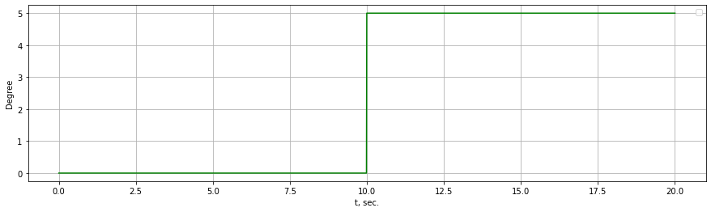
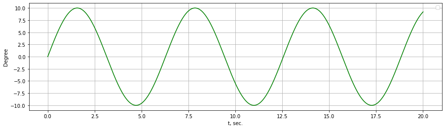
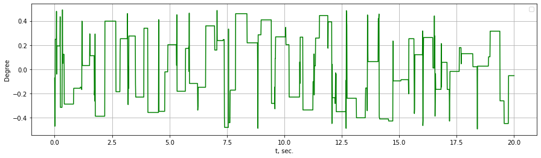

Сигналы
=======

Ступенчатый сигнал
------------------

.. autofunction:: tensorairspace.signals.standart.unit_step

**Пример**

.. code-block:: python

    from tensorairspace.utils import generate_time_period
    from tensorairspace.signals.standart import unit_step

    dt = 0.01
    tp = generate_time_period(tn=20)
    tp_unit = unit_step(degree=5, tp=tp, time_step=10, output_rad=False)

Синусоидный сигнал
------------------

.. autofunction:: tensorairspace.signals.standart.sinusoid

**Пример**

.. code-block:: python

    from tensorairspace.utils import generate_time_period
    from tensorairspace.signals.standart import sinusoid

    dt = 0.01
    tp = generate_time_period(tn=20)
    tp_sinusoid = sinusoid(tp=tp, amplitude=10, frequency=0.01)

Случайный сигнал по частоте и амплитуде
---------------------------------------

.. autofunction:: tensorairspace.signals.random.full_random_signal

**Пример**

.. code-block:: python

    from tensorairspace.signals.random import full_random_signal

    signal =  full_random_signal(0,0.01,20, (-0.5, 0.5), (-0.5, 0.5))

