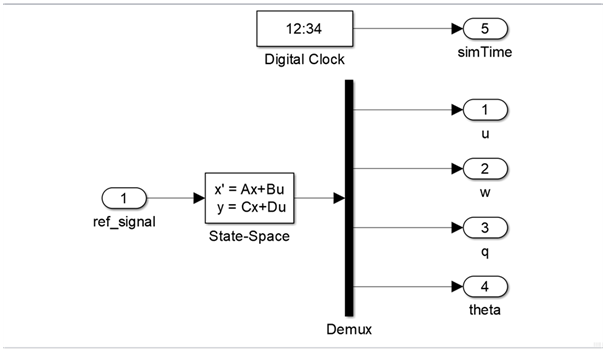

Создание объекта управления в симулнке
======================================

Для создания ОУ в ПО Simulink:

#. В рабочее поле были добавлены элементы из библиотеки Simulink:

        * Simulink/Continuous/State-Space

        * Simulink/Sources/Digital Clock

        * Simulink/Comonly Used Block/In1

        * Simulink/Comonly Used Block/Out1

#. Блоки In1/Out1 были переименованы в соответствующие названия.

#. В State-Space были заданы следующие параметры (для удобства работы использовали MATLAB Scripts)

	.. image:: img/sim_ss.png
  		:width: 400
  		:alt: Блок Stae-Space

#. Был создан MATLAB Script со следующим кодом:

	.. code-block:: matlab
		clear;

		flag = 1;s

		% Инициализцаия параметров
		[A,B,C,D] = b747_model(flag);

		init = [0 -0.0 -0.0 0];
		ref_signal = -0.10;

		% Время начала/конца/шага времени моделирования
		t_s = 0;
		t_e = 500;
		dt = 0.1;

		% Запуск Simulink модели
		simOut = sim('aircraft_sim.slx');

		y = simOut.get('yout');

		u = y.getElement(1).Values.Data;
		w = y.getElement(2).Values.Data;
		q = y.getElement(3).Values.Data;
		theta = y.getElement(4).Values.Data;
		t = y.getElement(5).Values.Data;