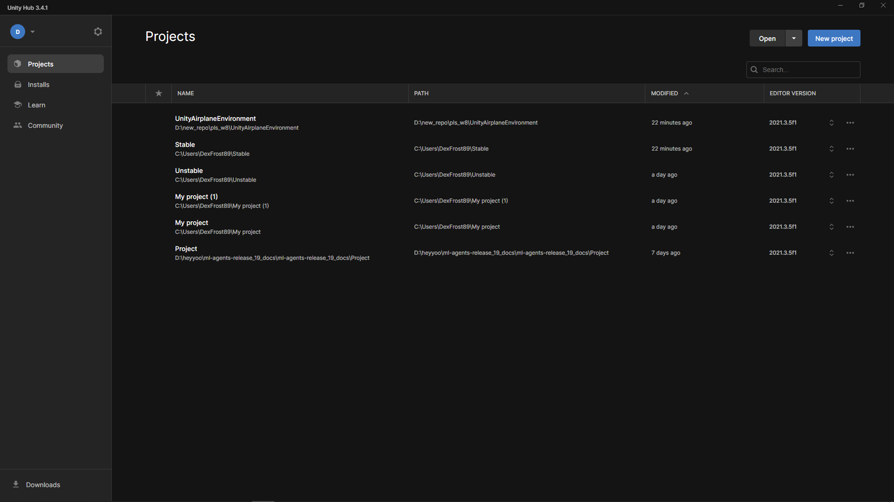
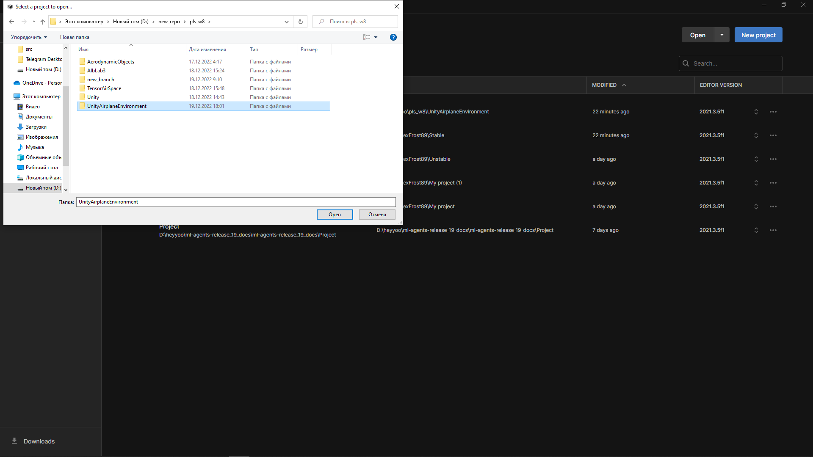
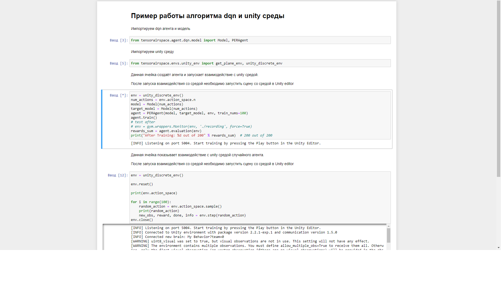
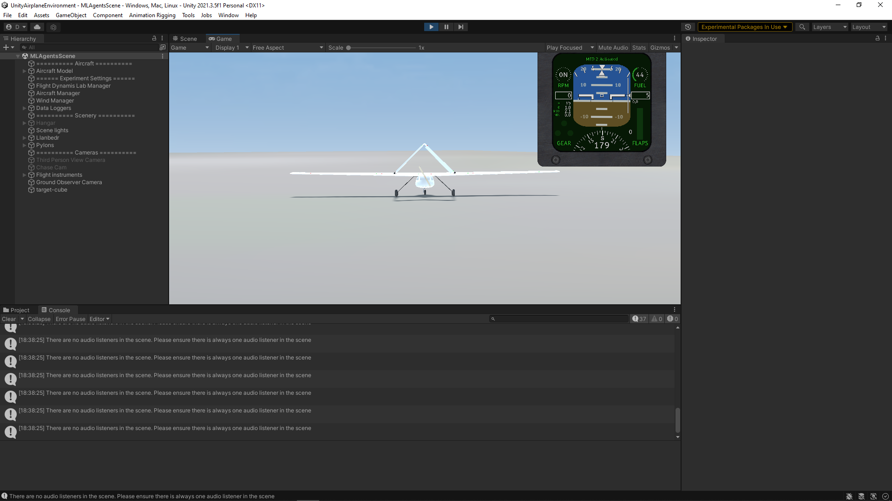

Использование unity среды
=========

Для установки клонируйте репозиторий

.. code:: shell

    git clone git@github.com:TensorAirSpace/UnityAirplaneEnvironment.git

Установите пакет для работы с unity ml agents

.. code:: shell

    pip install gym==0.20.0 gym-unity==0.28.0

Установите Unity hub по ссылке

- https://unity.com/download

Скачайте и установите версию Unity 2021.3.5f1 по ссылке

- https://unity.com/releases/editor/archive

Откройте проект в unity hub. Для этого нажмите на кнопку open и найдите
репозиторий на диске. Затем нажмите на кнопку open в папке репозитория.

Затем откройте проект в unity hub.

Для запуска примера взаимодействия агента dqn необходимо установить основной проект
TensorAirSpace. В папке example необходимо выбрать ноутбук example_dqn.ipynb

Последовательно выполните ячейки.

Когда на 3й ячейке появится надпись

[INFO] Listening on port 5004. Start training by pressing the Play button in the Unity Editor.

Запустите среду нажав на кнопку запуска в среде unity

Необходимо дождаться окончания работы со средой.

Для взаимодействия со средой была сделана функция получающая gym обертку нашей unity
среды и класс обёртка для агентов с дискретным пространством действий.

.. autoclass:: tensorairspace.envs.unity_env.get_plane_env
  :members:
  :inherited-members:

.. autoclass:: tensorairspace.envs.unity_env.unity_discrete_env
  :members:
  :inherited-members:

