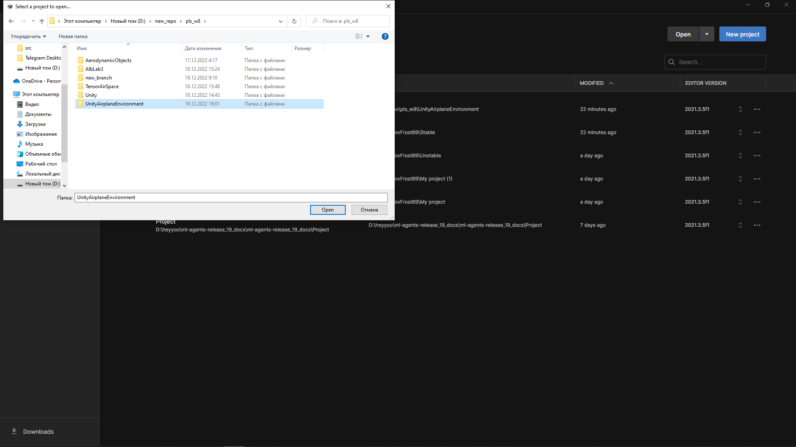

# Настройка Unity среды

> Быстрый и наглядный гайд по запуску Unity‑среды и подключению из Python (TensorAeroSpace + ML‑Agents).

<div class="grid cards" markdown>

-   :material-rocket-launch-outline: **Быстрый старт**

    Клонируйте проект, установите зависимости, откройте сцену и запустите.

    [:octicons-arrow-right-24: Перейти](#быстрый-старт)

-   :material-cube-outline: **Сборка среды (Build)**

    Как собрать standalone и запуститься в headless‑режиме.

    [:octicons-arrow-right-24: Перейти](#сборка-среды-build)

-   :material-connection: **Подключение из Python**

    Пример через `gym-unity`: Build и (опционально) Editor.

    [:octicons-arrow-right-24: Перейти](#подключение-из-python)

-   :material-lifebuoy: **Troubleshooting**

    Частые проблемы и как их решить.

    [:octicons-arrow-right-24: Перейти](#частые-проблемы-и-решения)

</div>

---

## Что понадобится

- **Unity Hub** и **Unity 2021.3.5f1** (протестировано)
- **Python 3.8+** (рекомендуется 3.10–3.11) с `pip`
- Доступ к репозиторию `UnityAirplaneEnvironment`

!!! note "Совместимость версий"
    Примеры основаны на связке Unity 2021.3.5f1 + `gym-unity==0.28.0`. Для других версий сверяйтесь с документацией ML‑Agents.

---

## Быстрый старт {#быстрый-старт}

### 1) Клонирование репозитория

```shell
git clone git@github.com:tensoraerospace/UnityAirplaneEnvironment.git
cd UnityAirplaneEnvironment
```

!!! info "HTTPS альтернатива"
    ```shell
    git clone https://github.com/TensorAeroSpace/UnityAirplaneEnvironment.git
    ```

### 2) Python‑зависимости

Установите пакеты для связи Unity и Python:

```shell
pip install gym==0.20.0 gym-unity==0.28.0 mlagents_envs==0.28.0
```

!!! tip "Изолированная среда"
    Рекомендуем использовать `venv`/`conda`.

### 3) Установка Unity

- Установите Unity Hub: `https://unity.com/download`
- В Hub добавьте редактор **Unity 2021.3.5f1**: `https://unity.com/releases/editor/archive`

!!! warning "Важно"
    Используйте указанную версию редактора. Несовпадение может привести к ошибкам пакетов/сцен.

### 4) Открытие проекта в Unity Hub

1) Запустите Unity Hub → «Open» → укажите каталог проекта.  
2) Выберите проект и откройте его.

{ width=800 }
{ width=800 }
{ width=800 }

### 5) Выбор сцены и запуск

Откройте в Unity Editor: `Assets/AlbLab3/Scenes/MLAgentsScenes` → например, `MLAgentsScene`.

{ width=800 }

Нажмите ▶ (Play) — сцена должна стартовать без ошибок.

!!! success "Готово"
    Если Play запускается и агенты активируются — можно переходить к подключению из Python.

---

## Сборка среды (Build) {#сборка-среды-build}

Рекомендуется для стабильных запусков и headless‑режима:

1) В Unity: File → Build Settings…  
2) Выберите платформу (Windows/Mac/Linux), добавьте сцену в список «Scenes In Build».  
3) (Опционально) Player Settings → включите «Run In Background».  
4) Нажмите «Build» и укажите путь (например, `./Builds/AirplaneEnv/AirplaneEnv`).

!!! note "Headless"
    Для серверов и CI используйте build без графики и параметр `no_graphics=True` при инициализации среды из Python.

---

## Подключение из Python {#подключение-из-python}

=== "Build"

```python
from gym_unity.envs import UnityToGymWrapper
from mlagents_envs.environment import UnityEnvironment

# Путь к собранной среде
env_path = "./Builds/AirplaneEnv/AirplaneEnv"
unity_env = UnityEnvironment(file_name=env_path, no_graphics=True)
env = UnityToGymWrapper(unity_env, uint8_visual=False)

obs = env.reset()
done = False
total_reward = 0.0

while not done:
    action = env.action_space.sample()
    obs, reward, done, info = env.step(action)
    total_reward += reward

print("Episode reward:", total_reward)
env.close()
```

=== "Editor (опционально)"

```python
from gym_unity.envs import UnityToGymWrapper
from mlagents_envs.environment import UnityEnvironment

# Подключение к Editor: запустите сцену в Play и позвольте подключение
unity_env = UnityEnvironment(file_name=None)
env = UnityToGymWrapper(unity_env, uint8_visual=False)

obs = env.reset()
action = env.action_space.sample()
obs, reward, done, info = env.step(action)
env.close()
```

!!! info "Editor vs Build"
    - Editor удобен для отладки, подключение не всегда стабильно.  
    - Build предпочтителен для экспериментов/серверов (без графики).

---

## Частые проблемы и решения {#частые-проблемы-и-решения}

- **Несовпадение версий пакетов**  
  Убедитесь, что установлены совместимые версии: `gym==0.20.0`, `gym-unity==0.28.0`, `mlagents_envs==0.28.0`.

- **Сцена не запускается (Editor)**  
  Проверьте консоль Unity, установленные пакеты в `Packages/manifest.json`, добавление сцены в Build Settings.

- **Python не видит среду**  
  Проверьте путь `file_name` к сборке (для Build) либо что Editor находится в Play (для Editor).  
  На Linux убедитесь, что бинарник отмечен как исполняемый (`chmod +x`).

- **Проблемы с портами**  
  Если порт занят, закройте другие инстансы среды/Editor. Перезапустите Python‑процесс.

---

## Что дальше

- Запускайте примеры и агентов в TensorAeroSpace (см. разделы «Модели» и «Агенты»)
- Интегрируйте Unity‑среду в бенчмарки/скрипты обучения
- Пишите свои контроллеры и награды, собирайте сцены под задачи
