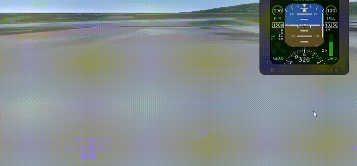
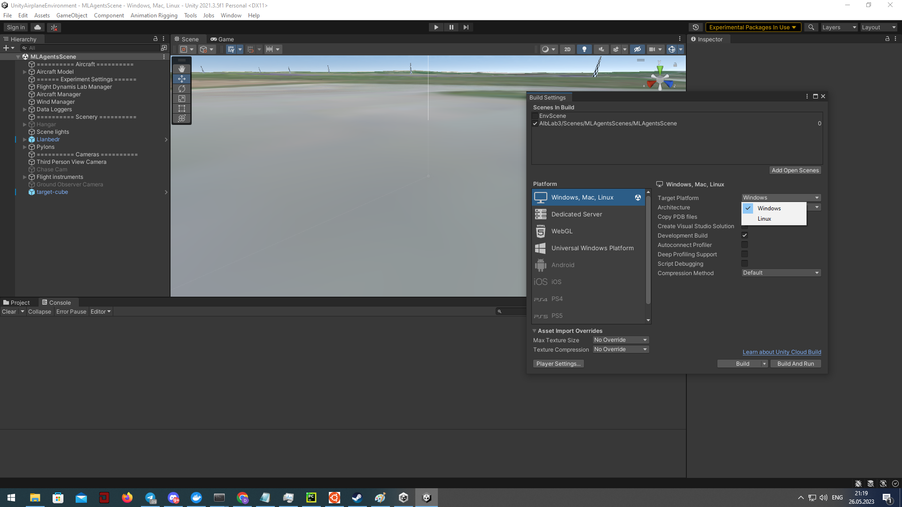
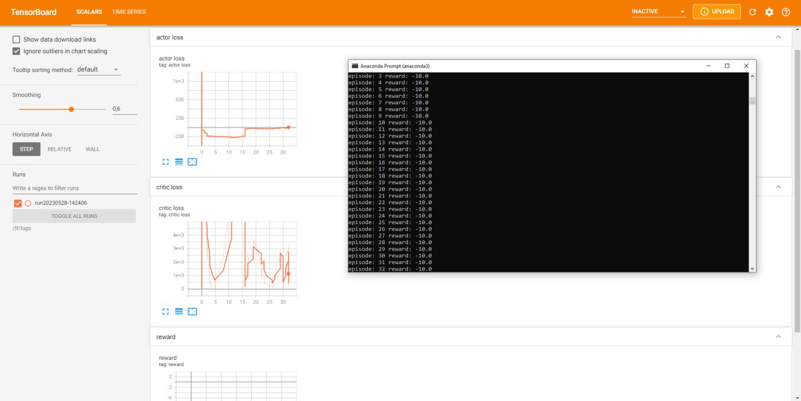

# Unity среда

UnityAirplaneEnvironment — учебная Unity‑среда для задач обучения с подкреплением на самолёте: готовые сцены с усложнениями, настраиваемая физика и удобная Python‑обёртка под `gym`.

- **Готовые сцены**: базовая, птицы, обледенение, дождь, ветер
- **Управление и физика**: `AircraftManager`, аэро‑модули, конфиги экспериментов
- **Python API**: `get_plane_env` и `unity_discrete_env` (дискретизация 3^7 действий)
- **Масштабирование**: Docker, GPU, параллельные воркеры

## Быстрый старт

1. Соберите Unity build → [Сборка среды в Unity](#сборка-среды-в-unity)
2. Запустите и проверьте Python‑обёртку → [Взаимодействие с Python](#взаимодействие-с-python)
3. Запустите обучение A3C в контейнере → [Запуск в Docker (GPU/CPU, распределённо)](#запуск-в-docker-gpucpu-распределённо)

Исходники: [tensoraerospace/UnityAirplaneEnvironment](https://github.com/tensoraerospace/UnityAirplaneEnvironment)

## Компоненты среды

Для моделирования движения самолёта используются следующие компоненты:

| Компонент | Назначение | Где используется/параметры |
| --- | --- | --- |
| Rigidbody | Физический компонент в центре масс. Определяет массу и динамику. | Применяется к объекту центра масс ЛА |
| CentreOfGravity | Маркер центра масс летательного аппарата. | Ставится на центр масс ЛА |
| AeroBody | Расчёт аэродинамики для частей ЛА. Указывает группу и ссылку на `Rigidbody`. | На каждом элементе (крылья, фюзеляж и т. п.) |
| AeroGroup | Коллекция ссылок на все `AeroBody` самолёта. | На управляющем объекте ЛА |
| Thruster | Прикладывает тягу в корректной точке. | На пропеллер/двигатель |
| Elevator | Управляемые поверхности: рули, закрылки и т. д. | На подвижных частях крыла/оперения |
| AircraftManager | Физика и управление самолётом. Обрабатывает каналы управления. | Отдельный объект сцены |
| FlightDynamicsFlightManager | Ссылки на самолёт, центр масс, `AircraftManager` и конфигурацию эксперимента (ветер, стартовая поза и др.). | Отдельный объект сцены |

### Каналы управления (AircraftManager)

| Канал | Описание | Диапазон |
| --- | --- | --- |
| Thrust | Тяга двигателя | Нормализованный: [-1, 1]; в дискретной обёртке: {-1, 0, 1} |
| Aileron | Элероны | [-1, 1] / {-1, 0, 1} |
| Elevator | Руль высоты | [-1, 1] / {-1, 0, 1} |
| ElevatorTrim | Триммер руля высоты | [-1, 1] / {-1, 0, 1} |
| Rudder | Руль направления | [-1, 1] / {-1, 0, 1} |
| FlapUp | Поднять закрылки | Тоггл/импульс |
| FlapDown | Опустить закрылки | Тоггл/импульс |

!!! note
    В дискретной обёртке `unity_discrete_env` семимерное действие кодируется как одно целое число: 3 значения на канал ⇒ всего 3^7 действий.

## Сцены Unity

Для обучения подготовлено 5 сцен (1 базовая и 4 с усложнениями). Сцены находятся по пути `UnityAirplaneEnvironment/Assets/AlbLab3/Scenes`.

???+ info "MLAgentsScene — базовая"
    Базовая сцена со стандартными настройками самолёта.

???+ info "MLAgentsSceneBirds — птицы"
    Периодически к самолёту прикладывается случайная сила.

    Настройка: компонент `Birds` на объекте `AircraftManager` (`Impact` и интервал). Точки приложения — случайно крылья или нос. Величина — в диапазоне `(Impact, 2 × Impact)`.

    

???+ info "MLAgentsSceneCold — обледенение"
    Двигатель ограничен по мощности, возможна «остановка» тяги; органы управления могут замерзать.

    Настройка: поле `MaxThrust` в `AircraftManager`; компонент `Cold` задаёт интервалы «заморозки» (на экране — надпись «controls frozen»).

    

???+ info "MLAgentsSceneRain — дождь"
    Постоянный вертикальный вектор силы, направленный вниз.

    Настройка: компонент `Rain` (поле `Impact`).

    

???+ info "MLAgentsSceneWind — ветер"
    Параметры задаются в `UnityAirplaneEnvironment/Assets/AlbLab3/Experiment Settings/ml_agent_wind.asset` (скорость `Wind speed`, направления `Wind Azimuth` и `Wind Elevator`). В примере: скорость 10, `Wind Elevator` = 30.

    

!!! note
К самолёту применяется ускорение свободного падения g = 9.81.

## Взаимодействие с Python

Ниже — минимальный пример получения `gym`-обёртки Unity-среды и опциональной дискретизации действий:

    from tensoraerospace.envs.unity_env import get_plane_env, unity_discrete_env

    # Путь к собранной Unity-сцене (пример для Linux)
    UNITY_BUILD_PATH = "/path/to/linux_build/build.x86_64"

    # Если среда запускается как отдельный процесс/сервер, задайте server=True и уникальный worker
    env = get_plane_env(UNITY_BUILD_PATH, server=True, worker=0)

    # Для дискретного пространства действий используйте обёртку
    env = unity_discrete_env(env)

    obs = env.reset()
    done = False
    total_reward = 0.0
    while not done:
        action = env.action_space.sample()
        obs, reward, done, info = env.step(action)
        total_reward += reward

    env.close()

!!! tip
    Если вы запускаете несколько копий среды параллельно, задавайте уникальный `worker` для каждого процесса и используйте `server=True`.

## Сборка среды в Unity

1. В Unity откройте меню File → Build Settings.

   

2. Выберите сцену, целевую платформу и нажмите Build.

   

3. Укажите папку для сборки исполняемого файла.

## Запуск в Docker (GPU/CPU, распределённо)

Преимущества распределённого обучения на GPU: высокая производительность, естественный параллелизм (например, в A3C), ускорение обучения и возможность более крупных моделей. Для эффективной работы потребуется организация обмена и синхронизации между процессами/устройствами.

Пример Dockerfile c установленными зависимостями и запуском TensorBoard:

<!-- markdownlint-disable MD046 -->
```dockerfile
FROM tensorflow/tensorflow:2.4.0-gpu-jupyter

RUN pip install gym==0.20.0 scipy==1.5.4 gym-unity==0.28.0
RUN mkdir /tf/logs
COPY a3c_example.py /tf

ENTRYPOINT tensorboard --logdir /tf/logs --port 8889 --host 0.0.0.0 & python a3c_example.py
```
<!-- markdownlint-enable MD046 -->

Скрипт обучения (A3C, несколько воркеров через `worker_id`):

<!-- markdownlint-disable MD046 -->
```python
from tensoraerospace.envs.unity_env import get_plane_env, unity_discrete_env
from tensoraerospace.agent.a3c import Agent, setup_global_params

def env_function(worker_id):
    # /tf/linux_build/build.x86_64 — путь к собранному Unity-окружению внутри контейнера
    return get_plane_env("/tf/linux_build/build.x86_64", server=True, worker=worker_id)

actor_lr = 0.0005
critic_lr = 0.001
gamma = 0.99
hidden_size = 128
update_interval = 1

max_episodes = 100

setup_global_params(actor_lr, critic_lr, gamma, hidden_size, update_interval, max_episodes)

agent = Agent(env_function, gamma)
agent.train()
```
<!-- markdownlint-enable MD046 -->

Запуск контейнера с пробросом библиотеки и сборки Unity:

=== "Linux / macOS"

    ```bash
    docker run --gpus all \
      -v "$PWD/tensoraerospace:/tf/tensoraerospace" \
      -v "$PWD/linux_build:/tf/linux_build" \
      -p 8889:8889 \
      unity_docker
    ```

=== "Windows"

    ```bash
    docker run --gpus all \
      -v C:\\Users\\<USER>\\Projects\\TensorAeroSpace\\tensoraerospace:/tf/tensoraerospace \
      -v C:\\Users\\<USER>\\Projects\\TensorAeroSpace\\linux_build:/tf/linux_build \
      -p 8889:8889 \
      unity_docker
    ```

!!! warning
    Для GPU внутри контейнера необходим `nvidia-container-toolkit`. На Windows используйте абсолютные пути в `-v`.

## Пример запуска обучения


