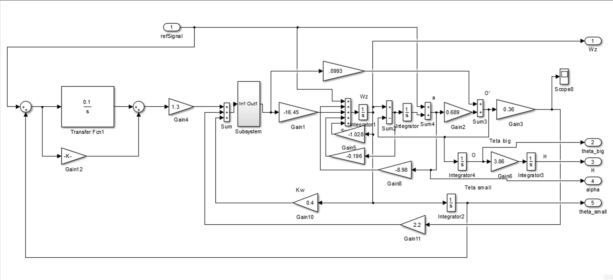

# TensorAeroSpace 

[](./README.md)
[](./README.ru-ru.md)

[](https://tensoraerospace.readthedocs.io/en/latest/?badge=latest)


**TensorAeroSpace** is a set of control objects, OpenAI Gym simulation environments, and Reinforcement Learning (RL) algorithm implementations.

## Launch

Quick installation

```bash
git clone  https://github.com/tensoraerospace/tensoraerospace.git
poetry install
```

Launching a Docker image

```bash
docker build -t tensor_aero_space .  --platform=linux/amd64
docker run -v example:/app/example -p 8888:8888 -it tensor_aero_space
```

## Examples

All examples for launching and working with the TensorAeroSpace library are located in the `./example` folder.

## Agents

**TensorAeroSpace** contains such control algorithms and RL algorithms as:

| Name  | Export to HuggingFace  |
|---|:-------------:|
| IHDP (Incremental Heuristic Dynamic Programming) |  ❌ |
| DQN (Deep Q Learning)  |   ❌ |
| SAC (Soft Actor Critic) | ✅   |
| A3C (Asynchronous Advantage Actor-Critic) | ❌ |
| PPO (Proximal Policy Optimization ) |  ✅  |
| MPC (Model Predictive Control) | ✅   |
| A2C (Advantage Actor-Critic) with NARX Critic | ❌  |
| A2C (Advantage Actor-Critic) |  ✅  |
| PID (proportional–integral–derivative controller)  |  ✅  |

 
## Control Objects

- General Dynamics F-16 Fighting Falcon
- Boeing-747
- ELV (Expendable Launch Vehicle)
- Rocket model
- McDonnell Douglas F-4C
- North American X-15
- Geostationary satellite
- Communication satellite
- LAPAN Surveillance Aircraft (LSU)-05 UAV
- Ultrastick-25e UAV
- UAV in State Space
- UAV in Unity environment


## Simulation Environments

### Unity Ml-Agents


**TensorAeroSpace** is capable of working with the ML-Agents system.

An example environment for launching can be found in the repository [UnityAirplaneEnvironment](https://github.com/TensorAeroSpace/UnityAirplaneEnvironment)

The documentation includes examples on setting up the network and working with the DQN agent.

### Matlab Simulink

**TensorAeroSpace** contains examples of working with Simulink models.



The documentation provides examples on assembling and compiling the Simulink model into operational code that can be implemented in the [OpenAI Gym](https://github.com/openai/gym) simulation environment.

### State Space Matrices

**TensorAeroSpace** includes control objects implemented as state space matrices.
