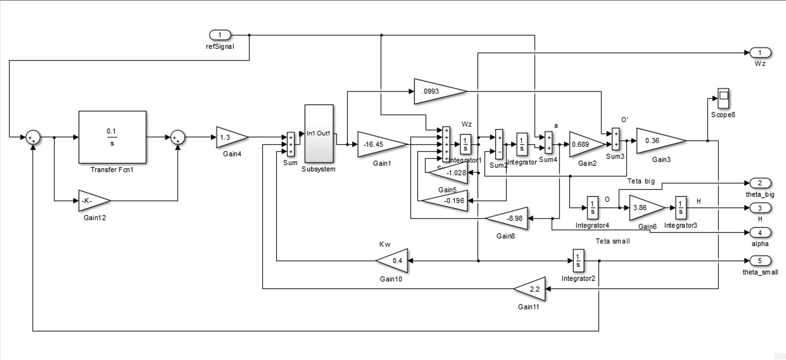

# 🚀 TensorAeroSpace

<div align="center">

[](./README.md)
[](./README.ru-ru.md)
[](https://tensoraerospace.readthedocs.io/en/latest/?badge=latest)
[](https://huggingface.co/TensorAeroSpace)
[](https://deepwiki.com/TensorAeroSpace/TensorAeroSpace)
[](https://www.python.org/downloads/)
[](LICENSE)
[](https://github.com/tensoraerospace/tensoraerospace/stargazers)
[](https://coveralls.io/github/TensorAeroSpace/TensorAeroSpace?branch=develop)


**Advanced Aerospace Control Systems & Reinforcement Learning Framework**

*A comprehensive Python library for aerospace simulation, control algorithms, and reinforcement learning implementations*

[📖 Documentation](https://tensoraerospace.readthedocs.io/) • [🚀 Quick Start](#-quick-start) • [💡 Examples](./example/) • [🤝 Contributing](CONTRIBUTING.md)

</div>

---

## 🌟 Overview

**TensorAeroSpace** is a cutting-edge Python framework that combines aerospace engineering with modern machine learning. It provides:

- 🎯 **Control Systems**: Advanced control algorithms including PID, MPC, and modern RL approaches
- ✈️ **Aerospace Models**: High-fidelity aircraft and spacecraft simulation models
- 🎮 **OpenAI Gym Integration**: Ready-to-use environments for reinforcement learning
- 🧠 **RL Algorithms**: State-of-the-art reinforcement learning implementations
- 🔧 **Extensible Architecture**: Easy to extend and customize for your specific needs

## 🧭 Applied Use Cases

1. **Autonomous Flight Vehicle Control** — stabilization, trajectory tracking, attitude control for aircraft, UAVs, and experimental vehicles.
2. **Rocket & Spacecraft Systems Control** — modeling and control of launch vehicles, satellites in various orbital classes, trajectory optimization.
3. **Hybrid Control Systems** — design and tuning of controllers combining classical and intelligent control methods.
4. **Algorithm Optimization & Benchmarking** — automated hyperparameter tuning, comparative analysis of control algorithms, quality metrics visualization.
5. **Simulation Platform Integration** — interfacing with game engines, CAD/CAE systems, model import/export between environments.
6. **Reliability Analysis & Diagnostics** — failure mode investigation, control system robustness assessment, training data preparation.

## 🚀 Quick Start

### ✅ Minimum Technical Requirements

| Component | Minimum | Recommended |
| --- | --- | --- |
| **OS** | Linux x86_64, Windows 10, macOS 13 | Ubuntu 22.04 LTS / Windows 11 |
| **CPU** | 4 cores, AVX | 8+ cores, AVX2/FMA |
| **RAM** | 8 GB | 16–32 GB for RL/Simulink |
| **GPU** | Optional | NVIDIA RTX with ≥8 GB VRAM for SAC/DSAC/PPO, CUDA 12.2 support |
| **Python** | 3.10–3.12 | 3.11/3.12 |
| **Additional** | Git, Poetry or pip, Docker (optional) | MATLAB/Simulink R2022b+ (for simulink-example), Unity 2021.3.5f1/2023.2.20f1 |

### 📦 Installation

#### Using Poetry (Recommended)
```bash
git clone https://github.com/tensoraerospace/tensoraerospace.git
cd tensoraerospace
poetry install
```

#### Using pip
```bash
pip install tensoraerospace
```

#### 🐳 Docker
The image starts **JupyterLab by default** (see `Dockerfile` CMD).

**Ubuntu / Linux (bash):**

```bash
docker build -t tensoraerospace . --platform=linux/amd64
docker run --rm -it -p 8888:8888 \
  -v "$(pwd)/example:/app/example" \
  tensoraerospace

# Optional: enable NVIDIA GPU inside the container
docker run --rm -it --gpus all -p 8888:8888 \
  -v "$(pwd)/example:/app/example" \
  tensoraerospace
```

**Windows (PowerShell):**

```powershell
docker build -t tensoraerospace . --platform=linux/amd64
docker run --rm -it -p 8888:8888 `
  -v "${PWD}\example:/app/example" `
  tensoraerospace

# Optional: enable NVIDIA GPU inside the container
docker run --rm -it --gpus all -p 8888:8888 `
  -v "${PWD}\example:/app/example" `
  tensoraerospace
```
> Open the printed URL (default `http://127.0.0.1:8888`) and navigate to `example/quickstart.ipynb` to run the SAC walkthrough inside Docker.

### 🏃‍♂️ Quick Examples

> 💡 **Interactive walkthrough**: open the [Quickstart notebook](./example/quickstart.ipynb) to run the SAC B747 benchmark flow end-to-end inside Jupyter/VS Code.

#### 🚀 Pretrained SAC Agent (Boeing 747)

Run a pretrained Soft Actor-Critic agent on Boeing 747 pitch control:

<div align="center">


</div>

**Command line:**
```bash
python example/reinforcement_learning/sac-b747-render.py \
    --render \
    --dt 0.1 \
    --tn 200 \
    --repo TensorAeroSpace/sac-b747 \
    --device cuda  # Optional: 'cuda', 'mps', or 'cpu' (auto-detects if not specified)
```

> 📖 **See full tutorial**: [SAC B747 Documentation](https://tensoraerospace.readthedocs.io/en/latest/example/agent/sac/example-sac-b747/)

---

#### 🎛️ PID Controller (F-16)

```python
import gymnasium as gym
import numpy as np

from tensoraerospace.agent.pid import PID
from tensoraerospace.utils import generate_time_period
from tensoraerospace.signals.standart import unit_step

# Simulation setup
dt = 0.01
tp = generate_time_period(tn=10, dt=dt)  # 10 seconds
N = len(tp)

# Reference signal for alpha tracking (5 deg step in radians)
reference = unit_step(
    degree=5, tp=tp, time_step=100, output_rad=True
).reshape(1, -1)

# Create F-16 longitudinal environment
env = gym.make(
    'LinearLongitudinalF16-v0',
    number_time_steps=N,
    initial_state=[[0], [0]],
    reference_signal=reference,
    use_reward=False,
)

# PID controller with tuned coefficients
pid = PID(
    env,
    kp=-14.290139135229715,
    ki=-8.240470780203491,
    kd=-1.2991634935096958,
    dt=dt
)

obs, info = env.reset()
for t in range(N - 1):
    setpoint = reference[0, t]
    alpha = float(obs[0])
    u = pid.select_action(setpoint, alpha)
    action = np.array([[float(u)]], dtype=np.float32)
    obs, reward, terminated, truncated, info = env.step(action)
    if terminated or truncated:
        break
```

## 🤖 Supported Algorithms

| Algorithm | Type | HuggingFace Export | Status |
|-----------|------|:------------------:|:------:|
| **IHDP** | Incremental Heuristic Dynamic Programming | ❌ | ✅ |
| **DQN** | Deep Q-Learning | ❌ | ✅ |
| **DDPG** | Deep Deterministic Policy Gradient | ❌ | ✅ |
| **SAC** | Soft Actor-Critic | ✅ | ✅ |
| **DSAC** | Distributional Soft Actor-Critic | ✅ | ✅ |
| **A3C** | Asynchronous Advantage Actor-Critic | ❌ | ✅ |
| **PPO** | Proximal Policy Optimization | ✅ | ✅ |
| **GAIL** | Imitation Learning (Adversarial) | ❌ | ✅ |
| **MPC** | Model Predictive Control | ✅ | ✅ |
| **A2C** | Advantage Actor-Critic | ✅ | ✅ |
| **A2C-NARX** | A2C with NARX Critic | ❌ | ✅ |
| **PID** | Proportional-Integral-Derivative | ✅ | ✅ |

## ✈️ Aircraft & Spacecraft Models

<details>
<summary><b>🛩️ Fixed-Wing Aircraft</b></summary>

- **General Dynamics F-16 Fighting Falcon** - High-fidelity fighter jet model
- **Boeing 747** - Commercial airliner dynamics
- **McDonnell Douglas F-4C Phantom II** - Military aircraft model
- **North American X-15** - Hypersonic research aircraft

</details>

<details>
<summary><b>🚁 UAVs & Drones</b></summary>

- **LAPAN Surveillance Aircraft (LSU)-05** - Indonesian surveillance UAV
- **Ultrastick-25e** - RC aircraft model
- **Generic UAV State Space** - Configurable UAV dynamics

</details>

<details>
<summary><b>🚀 Rockets & Satellites</b></summary>

- **ELV (Expendable Launch Vehicle)** - Launch vehicle dynamics
- **Generic Rocket Model** - Customizable rocket simulation
- **Geostationary Satellite** - Orbital mechanics simulation
- **Communication Satellite** - ComSat dynamics and control

</details>

## 🎮 Simulation Environments

### 🎯 Unity ML-Agents Integration

<div align="center">


</div>

TensorAeroSpace seamlessly integrates with Unity ML-Agents for immersive 3D simulations:

- 🎮 **3D Visualization**: Real-time 3D aircraft simulation
- 🔄 **Real-time Training**: Train agents in realistic environments
- 📊 **Rich Sensors**: Camera, LiDAR, and physics-based sensors
- 🌍 **Custom Environments**: Build your own aerospace scenarios

> 📁 **Example Environment**: [UnityAirplaneEnvironment](https://github.com/TensorAeroSpace/UnityAirplaneEnvironment)

### 🔧 MATLAB Simulink Support



- 📐 **Model Import**: Convert Simulink models to Python
- ⚡ **High Performance**: Compiled C++ integration
- 🔄 **Bidirectional**: MATLAB ↔ Python workflow
- 📊 **Validation**: Cross-platform model validation

### 📊 State Space Matrices

Mathematical foundation for control system design:

- 🧮 **Linear Models**: State-space representation
- 🎛️ **Control Design**: Modern control theory implementation
- 📈 **Analysis Tools**: Stability, controllability, observability
- 🔄 **Linearization**: Nonlinear model linearization

## 📚 Examples & Tutorials

Explore our comprehensive example collection in the [`./example`](./example/) directory:

| Category | Description | Notebooks |
|----------|-------------|-----------|
| 🚀 **Quick Start** | Basic usage and concepts | [`quickstart.ipynb`](./example/quickstart.ipynb) |
| 🤖 **Reinforcement Learning** | RL algorithm implementations | [`reinforcement_learning/`](./example/reinforcement_learning/) |
| 🎛️ **Control Systems** | PID, MPC controllers | [`pid_controllers/`](./example/pid_controllers/), [`mpc_controllers/`](./example/mpc_controllers/) |
| ✈️ **Aircraft Models** | Environment examples | [`environments/`](./example/environments/) |
| 🔧 **Optimization** | Hyperparameter tuning | [`optimization/`](./example/optimization/) |

## 🛠️ Development & Contributing

We welcome contributions! Please see our [Contributing Guide](CONTRIBUTING.md) for details.

### 🏗️ Development Setup

```bash
git clone https://github.com/tensoraerospace/tensoraerospace.git
cd tensoraerospace
poetry install --with dev
poetry run pytest  # Run tests
```

### 🧪 Testing

```bash
# Run all tests
poetry run pytest

# Run specific test category
poetry run pytest tests/envs/
poetry run pytest tests/agents/
```

## 📖 Documentation

- 📚 **Full Documentation**: [tensoraerospace.readthedocs.io](https://tensoraerospace.readthedocs.io/)
- 🚀 **API Reference**: Detailed API documentation
- 📝 **Tutorials**: Step-by-step guides
- 💡 **Examples**: Practical use cases

## 🤝 Community & Support

- 💬 **Discussions**: [GitHub Discussions](https://github.com/tensoraerospace/tensoraerospace/discussions)
- 🐛 **Issues**: [Bug Reports](https://github.com/tensoraerospace/tensoraerospace/issues)
- 📧 **Contact**: [Email Support](mailto:support@tensoraerospace.org)

## 📄 License

This project is licensed under the MIT License - see the [LICENSE](LICENSE) file for details.

## 🙏 Acknowledgments

- OpenAI Gym team for the excellent RL framework
- Unity ML-Agents team for 3D simulation capabilities
- The aerospace engineering community for domain expertise
- All contributors who make this project possible

---

<div align="center">

**⭐ Star us on GitHub if you find TensorAeroSpace useful! ⭐**

Made with ❤️ by the TensorAeroSpace team

</div>
