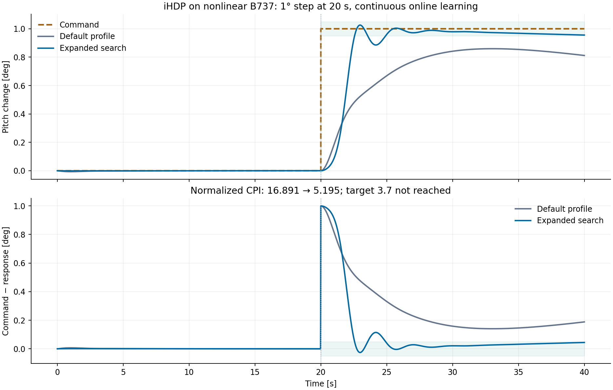

# Controller parameter audit and IHDP step search

## What changed

The declarative tuner previously rejected parameters outside a narrow default search space. Native controllers already supported many more settings. The SDK now accepts active fixed options and native constructor paths in `search_space`, including individual vector/matrix entries. `ControllerTuner.profile(name)` exposes the default space, available names and native paths. Aliases and native paths address the same underlying configuration; duplicate search destinations fail explicitly.

Automatic spaces were expanded for all eight profiles. Fixed settings remove their corresponding variables from the automatic space. Partial `initial_params` are supported; missing first-trial coordinates are sampled. Explicit native vector/architecture templates can be combined with sampled elements. No extra controller implementation is introduced in an example.

| Profile | Automatic dimensions | Default variables |
|---|---:|---|
| `iadp` | 6 | `gamma`, `forgetting`, `control_weight`, `track_weight`, `phi_init`, `policy_eval_every` |
| `imgdhp` | 8 | `actor_lr`, `critic_lr`, `history_length`, `track_weight`, `control_weight`, `config.gamma`, `config.beta_lambda`, `config.forgetting` |
| `et_dhp` | 7 | `actor_lr`, `critic_lr`, `rho`, `track_weight`, `control_weight`, `config.trigger_floor`, `config.gamma` |
| `ihdp` | 8 | `actor_lr`, `critic_lr`, `track_weight`, `gamma`, `hidden_size`, `excitation_amplitude`, `actor_settings.learning_rate_decay`, `critic_settings.learning_rate_decay` |
| `mpc` | 5 | `horizon`, `control_weight`, `track_weight`, `terminal_weight`, `lr` |
| `aa_indi` | 4 | `rate_gain`, `cutoff_hz`, `outer_gain`, `covariance_init` |
| `aidi` | 5 | `rate_gain`, `cutoff_hz`, `outer_gain`, `rls_cov_init`, `config.rls_sigma0` |
| `hdp` | 5 | `actor_lr`, `critic_lr`, `gamma`, `hidden_size`, `exploration_std` |

Additional settings beyond these defaults are listed in the JSON catalog and [English](../docs/en/optimization/optuna_based.md) / [Russian](../docs/ru/optimization/optuna_based.md) SDK documentation.

### Findings addressed

- **IHDP:** actor/critic architecture and activation, Q, gamma, learning schedules, training start, excitation, weight bounds and LS window are accessible. A selected small learning rate was raised by a larger hard-coded floor. Alpha-decay now caps the effective floor at the selected initial rate. The existing decay factors/minima and identification-window length are configurable in the native SDK and preserved in constructor/save settings. Defaults preserve the old decay/window for existing rates above their floors.
- **iADP:** native Q/R/gamma overrides are applied before solving the initial discounted Riccati prior; the initial value model and subsequent cost must use the same selected settings.
- **HDP:** custom utility weights were inactive under the native environment-cost mode. Searching/setting these weights now requires `dhp_use_env_cost=False`. Actor/critic episode cycles are also exposed; replay/target-network knobs are excluded because native HDP rejects them.
- **AA-INDI/AIDI:** outer gains, per-axis inner gains, filters, identification/forgetting/covariance, allocator settings and AA-INDI observer settings are exposed. AIDI's rate-command profile bypasses C*/roll/sideslip/speed guidance and PCH; their unused settings are deliberately not advertised.
- **IM-GDHP/ET-DHP:** native network, cost, model-identification/training, event, learning-schedule and regularization options can be selected without adding notebook-side algorithms.
- **MPC:** native stage/control/slew/terminal costs and solver settings supplement horizon tuning.

Native configuration is applied before construction. Environment time step, geometry, plant priors, physical bounds, state dimensions and seed are experiment inputs, not objective-search variables. IHDP cascaded/integral extensions, iADP sequential protocols and HDP expert baselines still require an explicit protocol through `AgentClass.optimize`; the declarative profiles retain their stated algorithms.

## Paper boundary

The IHDP cost, neural approximators and incremental least-squares model were checked against [Zhou et al., IMAV 2016](https://www.imavs.org/papers/2016/25.pdf), Eqs. 2, 7, 12 and 35–40. The actor/critic gradients and plant equations were not replaced. Configurable decay floors are implementation tuning, not paper-prescribed constants. A window length at least states + inputs is necessary for a full-rank fit but does not establish excitation. This change exposes the other methods' existing implementations; it is not a new reproduction of every source paper.

## Nonlinear B737 experiment

Trim: 10,000 ft, 600 ft/s; dt=0.02 s; duration=40 s. Command: theta +1° at 20 s. Online IHDP learning remains active. Native benchmark CPI is computed on the amplitude-normalized post-step trajectory; pre-step error is reported separately.

48 TPE trials, search seed 42, controller seed 0. Search used the eight automatic IHDP dimensions, target=3.7, **no hard CPI ceiling during exploration**. Physical envelope checks remained active. The user's notebook and its hard constraint were not changed. Baseline below is the current default profile, not a separate equally budgeted optimizer run; this is not a comparison of TPE versus annealing.

| Metric | Default profile | Selected parameters |
|---|---:|---:|
| Normalized CPI | 16.89105 | 5.19453 |
| Command-relative 5% settling, s | not reached | 4.92 |
| Command overshoot, % | 0 | 2.60 |
| Mean tail error, % of step | 17.776 | 4.185 |
| Maximum tail error, % of step | 18.810 | 4.424 |
| Maximum pre-step error, % of step | 0.679 | 0.075 |

CPI decreased by approximately 69.25%. **The requested CPI ceiling 3.7 remains unmet.** Replayed selected settings produce the same result; wider parameter access is not evidence of globally converged or robust control.



Selected settings:

```json
{
  "actor_lr": 0.06374612815071613,
  "critic_lr": 0.04380976918173126,
  "track_weight": 0.9561914158020121,
  "gamma": 0.981680703942566,
  "hidden_size": 20,
  "excitation_amplitude": 0.001011785071178507,
  "actor_settings.learning_rate_decay": 0.9992092515049984,
  "critic_settings.learning_rate_decay": 0.9984258495739259
}
```

### Additional cases without parameter reselection

| Controller seed | Step, deg | CPI | 5% settling, s | Command overshoot, % | Mean tail error, % |
|---:|---:|---:|---:|---:|---:|
| 0 | +1 | 5.1945 | 4.92 | 2.60 | 4.18 |
| 1 | +1 | 5.0127 | 5.12 | 1.02 | 4.19 |
| 2 | +1 | 6.0542 | not reached | 0.00 | 5.42 |
| 0 | -1 | 5.1750 | 5.02 | 2.73 | 3.93 |
| 0 | +0.5 | 6.2396 | 4.62 | 14.82 | 2.70 |

Seed 2 does not settle within the command band; the +0.5° case has larger overshoot. These are retained as limitations. The new search space improves this selected example but does not establish universal control quality. All these are healthy-aircraft pitch tests, not engine-failure validation.

## Verification

- **1813 tests passed:** optimization, agents, AA-INDI/AIDI and MPC suites.
- Regression checks exercise native parameter delivery, architecture/activation/Q/schedule/window settings, duplicate aliases, fixed templates with sampled elements, partial initialization, HDP cost mode, native learning-rate floors, analytical Riccati consistency, and LS identification of a known plant at three window lengths.
- Mypy: 17 source files passed; Ruff passed; expanded profile files pass Flake8.
- Strict MkDocs build passed for EN/RU.
- Structured experiment and catalog: [controller-parameter-audit.json](controller-parameter-audit.json); all 48 candidates: [controller-parameter-search.json](controller-parameter-search.json).
