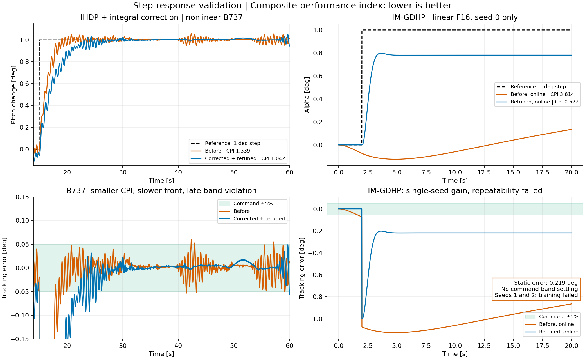

# IHDP / IM-GDHP: сверка со статьями и повторное обучение

## Последняя проверка: устранение смещения

**Пересчитанный результат, seed 0:** максимальная ошибка нулевого участка **0.000120°**, ошибка хвоста на 38 с **+0.000212°**, перерегулирование **4.50%**, установление в полосе задания **3.38 с**, **CPI 0.9237**. Все 12 проверок seed/амплитуда прошли условие точности 0.1% за последние пять секунд 60-секундного опыта. В последовательности команд конечные остатки больше: наибольшее среднее по последним пяти секундам около 0.00192°. Это измеренные ошибки конечного горизонта, а не утверждение о математически точном нуле для любого сигнала.

[Полный отчёт с сопоставлением при одинаковом горизонте](imgdhp-offset-fix.md). Ниже сохранены результаты предыдущих этапов, включая неудачные настройки.

Дата: 2026-09-19. База сравнения: `e0c57c2d27b7f4462e2e2b855f5e5c79b3b8585c`, ветка `fix/agent-runtime-bugs`.

## Обновление: ступенька на 20-й секунде

Основной опыт и короткие проверки амплитуд теперь длятся **38 с**, сохраняя 18 с после команды. Длительные прогоны сохраняют общую длительность 60 и 500 с. Единственное задание — α; параметры и 30 эпизодов обучения прежние. Онлайн-адаптация включена и до, и после скачка.

Результат выбранного seed 0 со ступенькой на 20-й секунде: ошибка последних 10% отсчётов **+0.01041°**, перерегулирование относительно команды **8.86%**, установление в полосе задания **4.34 с**, **CPI 2.0212**. Максимальная абсолютная ошибка начального нулевого участка — **0.11300°**. Время установления отсчитывается от ступеньки; неудачные проверки также сохранены в таблицах.

Основные условия после ступеньки: **FAIL**. Проверка нулевого участка (0.01°): **FAIL**.

| Команда, ° | Длительность, с | Ошибка хвоста, ° | Перерегулирование, % | Установление ±5%, с | CPI |
|---:|---:|---:|---:|---:|---:|
| 1 | 38 | +0.0104052 | 8.856 | 4.34 | 2.0212 |
| 2 | 38 | +0.1330715 | 2.501 | не достигнуто | 2.1194 |
| 1 | 60 | +0.0107780 | 8.856 | 4.34 | 2.0774 |
| 0.5 | 38 | -0.0453884 | 18.889 | не достигнуто | 1.8495 |
| -1 | 38 | -0.2174250 | 0.000 | не достигнуто | 2.9470 |

На 500 с ошибка хвоста **-0.00000003°**, CPI **4.7169**. Максимальный накопленный тангаж **283.9°**: это численная проверка фиксированной линеаризации.

Ниже сохранён исторический подбор со ступенькой на 2-й секунде; его значения и рисунок не заменяют пересчитанные результаты текущего ноутбука.

## Предыдущая настройка: единственное задание по α

[Полный отчёт по одноканальному подбору](imgdhp-alpha-only-tuning.md). Выбранный seed 0 на ступеньке 1° даёт ошибку последних 10% отсчётов **0.0071°**, перерегулирование **9.23%**, установление **4.38 с**. CPI **2.021** выше прежних 0.672: улучшена конкретная остаточная ошибка, а не весь показатель качества. В ноутбуке и уроках больше нет задания q. Проверки нулевого участка, других амплитуд и seed остаются неудовлетворительными; надёжность общей настройки не подтверждена. Ниже сохранены результаты предыдущих этапов аудита.

## Результаты предыдущего этапа

Исправлены подтверждённые расхождения с уравнениями статей. Основная оценка качества теперь — **ступенька и Composite performance index (CPI): меньше лучше**. IHDP с интегральной коррекцией на B737 снизил CPI с **1.339 до 1.042**, но стал медленнее на фронте. IM-GDHP на линейном F16 снизил онлайн-CPI с **3.814 до 0.672 только для seed 0**; seed 1 и 2 расходятся при обучении. **Надёжная настройка IM-GDHP для ступеньки пока не получена.** Проверку уравнений нельзя выдавать за доказательство качества и устойчивости регулятора.

[Сводные метрики и конфигурации](ihdp-imgdhp-paper-audit.json), [журнал исходного подбора](ihdp-imgdhp-tuning-trials.json) и [журнал обучения по α](ihdp-imgdhp-alpha-training-trials.json). Журналы вынесены в отдельные файлы без потери данных; сводный JSON указывает их имена в полях `tuning_trials_file` и `alpha_only_parameter_search.training_trials_file`.



## Повторная проверка после замечания о статической ошибке

**Конфигурация IM-GDHP отклонена.** Недобор 0.2187° на ступеньке 1° — это 21.87%, а не качественное слежение. В ноутбуке введены явные условия для этого примера: статическая ошибка ≤1% амплитуды, перерегулирование относительно задания ≤10%, установление в полосе ±5% не позднее 8 с. Эти инженерные цели не приписываются статье либо договору. Исходная конфигурация получает `CONTROL QUALITY: FAILED`.

Диагностика выявила:

- В сокращённой модели постоянная alpha=1° требует q≈0.591835°/с и руля≈−0.046887°. Штраф на q относительно нуля конфликтует с целью alpha. Это установившееся короткопериодическое движение с изменением тангажа, а не горизонтальный балансировочный полёт.
- В исходном обученном идентификаторе G0 для alpha имел знак +6.75e−6 rad/deg, тогда как непосредственная чувствительность дискретной модели равна −1.22e−6 rad/deg. Масштаб координат, возбуждение и скачки задания влияют на идентификацию; одной этой проверкой нельзя установить единственную причину ошибки.
- Начальная ковариация RLS теперь может задаваться положительной диагональю по регрессорам. Тест проверяет эквивалентность идентификации после смены единиц. `actor_bias_input` позволяет настраивать ba из Eq. (64); прежнее значение 0.01 сохранено по умолчанию. Формулы критика и актора не заменялись.

Повторный подбор не дал принятой политики. Например, без штрафа q и с масштабированным prior у seed 0 статическая ошибка снизилась до 0.00529°, но перерегулирование выросло до **58.37%**, CPI=11.83; seed 1 и 2 вышли за диагностический диапазон. Другие шаги, шумы, масштабы постоянного входа и вариант с наблюдением привода также не дали подтверждённого решения. Все пробы, включая провалы, сохранены в разделе `static_error_followup` JSON. Низкий CPI при большом недоборе больше не используется как основание принятия настройки.

Отдельное ограничение архитектуры заслуживает дальнейшей проверки: сеть Eq. (51) с нечётной tanh и без смещений имеет `J(-e)=-J(e)`, а её входной градиент — чётный. Такая сеть не может представлять ненулевую неотрицательную стоимость во всей симметричной области ошибок. Это математическое свойство выбранной архитектуры, **не доказательство причины конкретного недобора 21.87%** и не основание незаметно заменить опубликованный алгоритм. Вариант с другим критиком требует отдельного обозначения и проверки.

После изменений SDK: **2946 тестов прошли**, Ruff/mypy — 0 замечаний, Flake8 — прежние 30 замечаний сложности. Тесты SDK не заменяют проваленную проверку качества управления.

## Первичные источники и границы сравнения

1. Y. Zhou, E.-J. van Kampen, Q. P. Chu, **Incremental Model Based Heuristic Dynamic Programming for Nonlinear Adaptive Flight Control**, IMAV 2016 — [полный текст](https://www.imavs.org/papers/2016/25.pdf), в частности уравнение (12).
2. **Bo Sun**, E.-J. van Kampen, **Intelligent adaptive optimal control using incremental model-based global dual heuristic programming subject to partial observability**, Applied Soft Computing 103 (2021), 107153 — [DOI](https://doi.org/10.1016/j.asoc.2021.107153), [полный текст авторов](https://pure.tudelft.nl/ws/portalfiles/portal/90401508/1_s2.0_S1568494621000764_main.pdf). Проверены уравнения (31)–(38), (51)–(67), Algorithm 1 и настройки раздела 5.2.
3. TensorFlow-реализация IHDP, на которую ссылается проект: [joigalcar3/IHDP, commit bddfeb7](https://github.com/joigalcar3/IHDP/tree/bddfeb7736f32ec158b6b3f6fa3044b19c12b0e0). Проведено сравнение исходного кода. Это реализация José Ignacio de Alvear Cárdenas, **не опубликованный код авторов статьи Zhou**. Она также пропускает выходной масштаб SISO-градиента. Исполняемый эквивалент TensorFlow/PyTorch целиком не сравнивался.

Открытый код авторов статьи Sun для воспроизведения их эксперимента не найден. Для IM-GDHP выполнена сверка с первичными уравнениями, а не заявлено сравнение с недоступной авторской программой. Наши F16, частота, шумы, параметры и сигналы отличаются от эксперимента статьи; результаты ниже не являются воспроизведением её графиков или Монте-Карло.

## Исправления

| Компонент | Что было | Что исправлено / основание |
| --- | --- | --- |
| IHDP, SISO-актор | Градиент нормированного выхода использовался как градиент физического управления | В цепочку Eq. (12) добавлен выходной масштаб: `maximum_input` для tanh, удвоенный масштаб для sigmoid. MIMO уже учитывал его. |
| IHDP, МНК | `pinv(A.T @ A) @ A.T @ b` терял слабонаблюдаемые направления | Прямое `lstsq(A, b)`, без возведения числа обусловленности в квадрат. Начальные отсутствующие измерения заменены нулями вместо случайной фиктивной предыстории. |
| IHDP, стоимость | Полная Q некорректно попадала в диагональную операцию | Поддержаны вектор диагонали и полная симметричная положительно полуопределённая Q; перекрёстные члены сохраняются. |
| IM-GDHP, критик | Независимые головы J и lambda | Один скалярный критик без смещений; `lambda = dJ/de`, включая смешанные производные по весам, Eqs. (51), (52), (61). |
| IM-GDHP, вход | Вектор `[observation; reference; error]` без истории | Сети получают ошибку, идентификатор — измеренную историю приращений ошибки и управления, Eqs. (31)–(33). |
| IM-GDHP, цель производной | Использовалось только F | Полный якобиан `I + F0 + G0 @ dπ/de` и производная стоимости управления через актор, Eqs. (56)–(58). Стоимость и её производная используют одну и ту же фактически поданную команду. |
| IM-GDHP, обучение актора | Дополнительная одноступенчатая цель слежения и штраф приращения управления | Цель `0.5 * J(predicted_error_next)**2`, Eqs. (65)–(67); градиент проходит через G и аналитическую производную J. |
| IM-GDHP, порядок | Новый переход усваивался раньше формирования обучающих целей | Предсказание и цели по предыдущим параметрам, обновление сетей, затем RLS — Algorithm 1. |
| IM-GDHP, инициализация и шаги | Иная архитектура смещений и инициализации | Постоянный вход актора 0.01, без выходного смещения; веса `[-0.1, 0.1]`, начальные блоки F единичные, G нулевые; ограничение весов и настраиваемое убывание шагов из раздела 5.2. |
| Пример нелинейной идентификации | Ошибка «предсказания» считалась после усвоения того же измерения | Предсказание до обновления RLS; отдельно исключён стартовый прогрев из итоговой метрики. |

Множитель J в градиенте актора **сохранён**: он следует из квадратичной цели обеих статей. Его наличие само по себе не ошибка. Autograd использует точную производную выбранной симметричной активации tanh; численные параметры не копируют эксперимент авторов.

Дополнительные возможности явно отделены от базовых уравнений: Adam, дополнительные скрытые слои, сглаживание цели, несколько обновлений критика, прогрев и ограничение градиента настраиваются отдельно. В проверенном IM-GDHP используются SGD, один скрытый слой, прогрев и ограничение нормы градиента 5.

## Основная оценка: единичная ступенька и CPI

Используется `ControlBenchmark.benchmarking_step_response` без изменения формулы:

```text
CPI = 0.4 * ISE + 0.4 * ITAE + 0.2 * abs(overshoot_percent)
```

Ошибка и выход передаются в радианах, время — в секундах. Чем меньше CPI, тем лучше по этому составному критерию. Сравнение допустимо при одинаковых задании, единицах, dt и окне; CPI разных объектов ниже **не сравниваются между собой**.

Текущий `overshoot` внутри CPI измеряет превышение **конечного фактического выхода**, а не задания. Поэтому отдельно сохраняются `command_overshoot`, `command_settling_time` и статическая ошибка. Низкий CPI при недоборе заданного угла не означает качественного слежения. `None` означает отсутствие установления до конца окна, а не нулевое время.

| Объект и протокол | До | После исправлений и подбора | Ограничение |
| --- | ---: | ---: | --- |
| IHDP + интегральная коррекция, nonlinear B737: 1° тангажа при t=15 с, dt=0.02 с, окно 15–59.98 с | **1.338870** | **1.041738** | CPI ниже на 22.2%; поздние колебания покидают полосу ±5% задания. |
| Тот же B737, отдельное окно первых 15 с после ступеньки | 0.907397 | 0.670340 | Это другое окно. Время нарастания увеличилось с 2.60 до 5.04 с. |
| IM-GDHP, linear F16: 1° alpha при t=2 с, dt=0.01 с, 20-секундный опыт, **онлайн-обучение включено**, seed 0 | **3.814285** | **0.672195** | Статическая ошибка 0.2187°; нет установления в ±5% задания; ещё два seed не прошли обучение. |

### IHDP: параметры и физические величины

B737: `actor.learning_rate = 1.5 / 4 * 1.01`, `learning_rate_min = 0.001 / 4 * 1.01`, собственные seed актора/критика 47. Перед подбором исправление физического масштаба при старом шаге давало RMSE≈62.07° и неприемлемую траекторию. Деление шага на выходной масштаб возвращало прежнее поведение; дальнейший множитель 1.01 выбран по CPI полного окна. Проверены соседние шаги, веса стоимости и коэффициенты интегральной коррекции; неудачные пробы сохранены в JSON.

Перерегулирование относительно задания полного окна: 5.997% → 4.899%. Установление в ±5% задания: 44.18 с после ступеньки → **не достигнуто** до конца расчёта из-за позднего выхода из полосы. На 15-секундном окне библиотечное установление относительно конечного выхода: 4.98 → 10.32 с. Это конкретный компромисс составного индекса: уменьшение CPI не улучшило все составляющие переходного процесса.

На фиксированном диагностическом интервале 25–59.98 с RMSE тангажа: 0.01643° → 0.01094°. Этот интервал не доказывает факта установления. Максимальное отклонение высоты: 356.664 → 333.552 ft; скорости: 18.435 → 17.347 ft/s. Полная команда руля ограничена примерно 5.175°. Опыт регулирует тангаж, а не высоту; интегральная коррекция явно добавлена к базовому IHDP.

### IM-GDHP: перенастройка и неудачные повторения

Старый пример обучался 80 эпизодов на синусе и выбирал лучший checkpoint. Новый обучается **50 эпизодов на ступеньке**, сохраняя последние веса. Это сравнение прежнего примера с исправленным и перенастроенным; отдельный вклад формул, сигналов обучения и гиперпараметров здесь не изолирован. Оба итоговых CPI выше измерены на одинаковой ступеньке с продолжающейся адаптацией. Дополнительная диагностика без обновления весов: CPI 1.530021 → 0.671502; она не заменяет основной онлайн-тест.

Параметры нового урока: actor/critic `(16,)`, входы `[alpha_error, q_error]`, SGD, шаги **0.2 / 0.1**, множители **0.9997** на обновление, минимумы 1e-5, M=4, covariance=1e4, RLS forgetting=0.999, gamma=0.99, `obs_scale=180/pi`, `track_Q=[200,20]/scale²`, `beta_lambda=0.001/scale²`, предел команды ±3°. Шум первых двух эпизодов — 2°, далее 0.3°. Прогрев и ограничение градиента — явно включённые численные расширения. Малый `beta_lambda` приближает настройку к пределу HDP в Eq. (59), поэтому её результат **не подтверждает пользу сильного вклада производной GDHP**.

| Настройка | Seed 0, онлайн-CPI | Seed 1 | Seed 2 |
| --- | ---: | --- | --- |
| Шаги 0.2 / 0.1, decay 0.9997 — урок | 0.672195 | Абсолютный угол alpha>25° во втором эпизоде, шаг 670 | Абсолютный угол alpha>25° в третьем эпизоде, шаг 1057 |
| Шаги 0.1 / 0.1, decay 0.9995 | 2.270225 | Выход за диапазон во втором эпизоде, шаг 689 | CPI 15.010316 |
| Шаги 0.05 / 0.05, decay 0.9997 | 1.729132 | Выход за диапазон во втором эпизоде, шаг 701 | CPI 2.469620 |

Все провалы учитываются; ранний удачный эпизод не выбирается вместо конечной политики. Более умеренные шаги проблему повторяемости не устранили.

Для seed 0 в основном опыте перерегулирование относительно задания — 0%, статическая ошибка — **0.2187° (21.87% ступеньки)**, установления в ±5% нет. Библиотечные 1.10 с установления относятся к конечному фактическому выходу около 0.781°, а не к заданному 1°. Удлинение онлайн-прогона до 60 с не убирает смещение: CPI=2.994910 на другом окне, статическая ошибка≈0.2188°. При 2° ступеньке онлайн-CPI=0.891832 и смещение≈0.438°. Команда seed 0 не насыщается. **Пример оставлен как честный опыт настройки с видимыми ограничениями, не как готовая надёжная политика.**

### Вторичная диагностика: синусоидальное слежение

Эти числа не заменяют оценку переходного процесса.

- **IHDP + обратная модель, nonlinear F16:** на интервале 39.99–79.98 с RMSE 0.55853° → **0.10395°**, MAE 0.41935° → 0.07438°. После исправления градиента со старыми шагами RMSE была 12.57032°. Итоговые actor LR=`2 / 15 * 2`, минимум=`0.001 / 15 * 2`, Q=200, seed=47. Упреждение 0.85 с, усиление 1.55 — вне базового алгоритма статьи. В абляции MAE без упреждения 1.9108°, с упреждением 0.6729°, с усилением и Q=8 — 0.2231°, с Q=200 — 0.0744°. Нельзя приписывать весь выигрыш одному адаптивному актору.
- **IM-GDHP, отдельная настройка под синус:** RMSE 1.41220° у лучшей старой политики → 0.46553°, 0.46551°, 0.46710° у последних новых политик seed 0,1,2. На 60-секундном онлайн-прогоне seed 0 RMSE=0.35933°. Но на ступеньке у этой настройки CPI≈14.215, перерегулирование относительно задания≈71%, а на синусе команда около ограничения примерно 78% отсчётов. Эта настройка **не принята** как качественная по переходному процессу. Её параметры и все прогоны сохранены отдельно в JSON.

Выполнены три основных ноутбука с графиками: IHDP F16, IHDP B737 и IM-GDHP F16. В остальных связанных SISO-примерах пересчитаны шаги и очищены прежние результаты; эти ноутбуки не выдаются за повторно выполненные. MIMO-шаги B737-turn не масштабировались повторно.

## Физическая интерпретация и границы проверки

Матрицы, аэродинамические таблицы и уравнения `env/aerospacemodel` в этой работе не изменялись. Проверены конечность наблюдений/потерь, ограничения команд и численные траектории на выбранных режимах. Ограничение |alpha|≤25° — диагностический порог, не сертифицированная область полёта. Неудачные IM-GDHP-запуски показывают, что сохранение уравнений объекта само по себе не обеспечивает устойчивость замкнутого контура.

На нелинейном F16 для IM-GDHP проверялся **только идентификатор**: предсказание до усвоения измерения, после 200 отсчётов прогрева RMSE alpha≈5.31e-5 rad, q≈1.09e-4 rad/s. Эти числа не подтверждают качество нелинейной политики.

## Проверки

- **2933 passed**: `tests/agents`, `tests/envs`, `tests/aerospacemodel`.
- Независимые проверки цепочки физического SISO-градиента, полной Q, слабого направления МНК, аналитической lambda и смешанного градиента, обеих ветвей производной перехода, цели управления, восстановления скрытой системы второго порядка и точного продолжения checkpoint с историей M=3/убывающим шагом.
- Старый checkpoint IM-GDHP отклоняется с требованием переобучения; неверные расписания шагов проверяются явно.
- Ruff: 0; mypy: 0; Flake8: 30 прежних замечаний сложности, в пределах baseline.
- `mkdocs build --strict`: успешно для RU/EN. В уроках полный код публичного SDK; прежние несуществующие `IHDPConfig`/поля IM-GDHP удалены.
- Исторический материал IHDP/IM-GDHP vs PID помечен как устаревший: его секция IM-GDHP использовала необученный фиксированный актор с интегратором без `learn`. Его старые числа не подтверждают обучаемость или выполнение договора новой реализацией.

## Воспроизведение

Основные исполняемые уроки:

- [IHDP, nonlinear F16](../example/reinforcement_learning/incremental_adp/example_ihdp_nonlinear_f16.ipynb)
- [IHDP, nonlinear B737](../example/reinforcement_learning/incremental_adp/example_ihdp_nonlinear_b737.ipynb)
- [IM-GDHP, linear F16 control + nonlinear identification](../example/reinforcement_learning/incremental_adp/example_im_gdhp_nonlinear_f16.ipynb)

Ниже — команды проверки для CI/исследовательского отчёта; учебный код полностью приведён в ноутбуках и RU/EN-уроках.

```bash
OMP_NUM_THREADS=1 OPENBLAS_NUM_THREADS=1 MKL_NUM_THREADS=1 \
  PYTHONPATH=. .venv/bin/python scripts/validate_ihdp_imgdhp.py \
  --seeds 0 1 2 --episodes 50 --training-signal step --q-weight 20 \
  --gamma .99 --costate-ratio .001 --actor-lr .2 --critic-lr .1 \
  --decay .9997 --output /tmp/imgdhp-validation.json

OMP_NUM_THREADS=1 OPENBLAS_NUM_THREADS=1 MKL_NUM_THREADS=1 \
  .venv/bin/python -m pytest tests/agents tests/envs tests/aerospacemodel -q -o addopts=''

PATH="$PWD/.venv/bin:$PATH" .venv/bin/python scripts/ci_quality_gate.py flake8 ruff mypy
.venv/bin/python -m mkdocs build --strict --site-dir /tmp/tas-adaptive-docs
```

Команда IM-GDHP намеренно возвращает ненулевой код при зафиксированных неудачных seed и сохраняет их в JSON. Это не успешный тест устойчивости.

Для старой базы использован изолированный `git archive` указанного commit. NumPy/PyTorch seed=0, один поток; собственные seed актор/критик IHDP=47. Версии Python, NumPy, SciPy и PyTorch сохранены в JSON. HTML-визуализация `render()` при численной проверке пропущена через тег `skip-execution`; обучение, графики, метрики и абляция F16 выполнены.

Глобальная сходимость, отказоустойчивость, строгая наблюдаемость выбранного окна F16 и воспроизведение аэродинамики экспериментального объекта статьи этими проверками не доказаны. Remark 2 статьи Sun также отделяет численные опыты от доказательства устойчивости полностью онлайн-системы.
