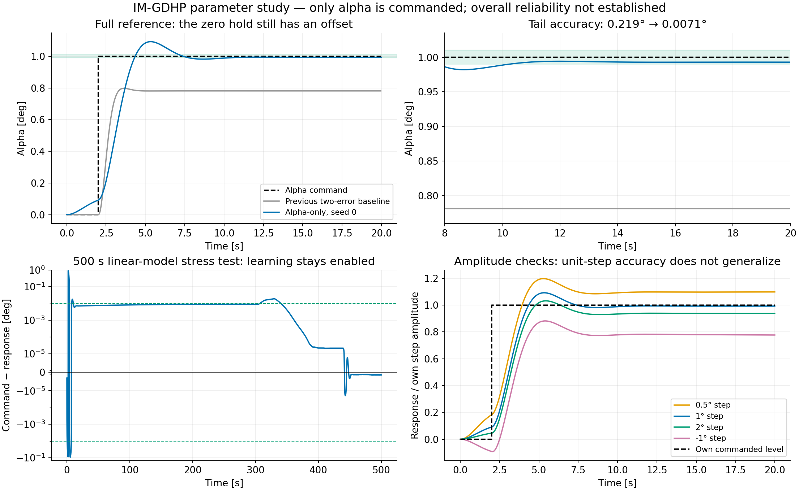

# IM-GDHP: подбор параметров при единственном задании по углу атаки

## Последняя проверка: устранение смещения

**Пересчитанный результат, seed 0:** максимальная ошибка нулевого участка **0.000120°**, ошибка хвоста на 38 с **+0.000212°**, перерегулирование **4.50%**, установление в полосе задания **3.38 с**, **CPI 0.9237**. Все 12 проверок seed/амплитуда прошли условие точности 0.1% за последние пять секунд 60-секундного опыта. В последовательности команд конечные остатки больше: наибольшее среднее по последним пяти секундам около 0.00192°. Это измеренные ошибки конечного горизонта, а не утверждение о математически точном нуле для любого сигнала.

[Полный отчёт с сопоставлением при одинаковом горизонте](imgdhp-offset-fix.md). Ниже сохранены результаты предыдущих этапов, включая неудачные настройки.

## Обновление: ступенька на 20-й секунде

Основной опыт и короткие проверки амплитуд теперь длятся **38 с**, сохраняя 18 с после команды. Длительные прогоны сохраняют общую длительность 60 и 500 с. Единственное задание — α; параметры и 30 эпизодов обучения прежние. Онлайн-адаптация включена и до, и после скачка.

Результат выбранного seed 0 со ступенькой на 20-й секунде: ошибка последних 10% отсчётов **+0.01041°**, перерегулирование относительно команды **8.86%**, установление в полосе задания **4.34 с**, **CPI 2.0212**. Максимальная абсолютная ошибка начального нулевого участка — **0.11300°**. Время установления отсчитывается от ступеньки; неудачные проверки также сохранены в таблицах.

Основные условия после ступеньки: **FAIL**. Проверка нулевого участка (0.01°): **FAIL**.

| Команда, ° | Длительность, с | Ошибка хвоста, ° | Перерегулирование, % | Установление ±5%, с | CPI |
|---:|---:|---:|---:|---:|---:|
| 1 | 38 | +0.0104052 | 8.856 | 4.34 | 2.0212 |
| 2 | 38 | +0.1330715 | 2.501 | не достигнуто | 2.1194 |
| 1 | 60 | +0.0107780 | 8.856 | 4.34 | 2.0774 |
| 0.5 | 38 | -0.0453884 | 18.889 | не достигнуто | 1.8495 |
| -1 | 38 | -0.2174250 | 0.000 | не достигнуто | 2.9470 |

На 500 с ошибка хвоста **-0.00000003°**, CPI **4.7169**. Максимальный накопленный тангаж **283.9°**: это численная проверка фиксированной линеаризации.

Проверка обновления: все 15 кодовых ячеек исполнены, единственное задание α меняется на отсчёте 2000 (20 с), полные уроки и кукбуки EN/RU синхронизированы, строгая сборка MkDocs прошла за 49.68 с.

Ниже сохранён исторический подбор со ступенькой на 2-й секунде; его значения и рисунок не заменяют пересчитанные результаты текущего ноутбука.

## Результат предыдущего подбора (ступенька на 2 с)

На единичной ступеньке у выбранного seed 0 остаточная ошибка снизилась с прежних **0.219° до 0.0071°**. Перерегулирование относительно команды — **9.23%**, установление в полосе ±5% — **4.38 с**. На 60 секундах ошибка **0.0076°**; на 500 секундах в фиксированной линейной модели — приблизительно **−0.0000014°**. Актор, критик и идентификатор продолжают обновляться. Сходимость немонотонна: около 329.39 с ошибка временно достигает 0.01906°. Последнее вхождение в полосу ±1% происходит через 338.35 с после ступеньки. Почти нулевой хвост не означает удержания точности 1% на всём горизонте.

**Общая надёжность не подтверждена.** Нулевое задание перед ступенькой отрабатывается с отклонением до 0.0912°, другие амплитуды не проходят требование к остаточной ошибке, один дополнительный seed даёт большую ошибку, другой выходит за диагностический диапазон при оценке ступеньки после обучения. Это результат локального подбора, а не готовая универсальная политика.

**CPI не улучшился:** 2.0208 вместо 0.6722 у прежнего двухканального примера. Уменьшилась конкретная статическая ошибка. Низкий CPI при недостижении задания не принимается за хороший переходный процесс; сначала проверяются точность, перерегулирование и установление относительно команды.

## Единственное задание и полный пример

В [исполняемом ноутбуке](../example/reinforcement_learning/incremental_adp/example_im_gdhp_nonlinear_f16.ipynb) оставлены `reference_size=1`, `tracking_indices=[0]`, `track_Q=(200 / scale**2,)`. Среда использует `tracking_states=["alpha"]`. Форма задания — `(1, T)`. Измеренная `q` сохраняется для диагностики и не поступает в эту политику. Задания `q_ref`, регулятора PID, интегральной надстройки и изменения математической модели нет.

Формулы IM-GDHP сохранены: скалярный критик и его аналитическая производная, актор с постоянным входом, RLS по истории. В [статье Sun и van Kampen (2021)](https://doi.org/10.1016/j.asoc.2021.107153), формула (64), величина постоянного входа является параметром; в эксперименте статьи она равна 0.01. Здесь подобрана 0.46. Шаг 0.01 с, параметры, прогрев и ограничение градиента отличаются от эксперимента статьи. Малый вес производной приближает критерий обучения к пределу HDP; результат не доказывает преимущество большого вклада costate.

## Параметры выбранного случая

| Параметр | Значение |
|---|---:|
| `actor_bias_input` | 0.46 |
| `actor_lr` | `2 / 0.46**2` ≈ 9.45180 |
| `critic_lr` | 0.01 |
| Снижение шага актор / критик | 0.99995 / 0.9997 |
| Нижняя граница обоих шагов | 0.00001 |
| `gamma` | 0.9 |
| `history_length` | 4 |
| `forgetting` | 0.999 |
| Физический вес ошибки α | 200 |
| Ширина скрытого слоя | 16 у обеих сетей |
| Ограничение команды | ±3° |
| Прогрев RLS / дополнительные шаги критика | 2000 / 1000 |
| Обучение | 30 × 12 с, постоянное α=1°, шум команды σ=0.1° |

Начальная диагональ RLS: четыре значения `1e4*(180/pi)**2` для приращений α и четыре `1e4` для приращений команды. Код в ноутбуке воспроизводит выбранный порядок вычислений. Сохраняются последние веса после 30 эпизодов; ранний лучший checkpoint не подставляется. Эпизоды оценки запускаются с копиями полного обученного состояния и включённым обучением.

## Одинаково определённые метрики

Шаг 0.01 с, команда меняется на второй секунде, если не оговорено другое. CPI рассчитывает библиотечный `ControlBenchmark` в радианах. Остаточная ошибка ниже — среднее `reference − response` за последние 10% отсчётов. В ноутбуке дополнительно показана штатная метрика `static_error` бенчмарка, у которой другое соглашение о выделении установившегося участка. Окно ошибки не включает весь переход. Проверяется и размах последних отсчётов, чтобы колебания не выдавались за нулевую ошибку.

| Ступенька, ° | Длительность, с | Остаточная ошибка, ° | Перерегулирование, % | Установление ±5%, с | CPI |
|---:|---:|---:|---:|---:|---:|
| 1 | 20 | +0.0071138 | 9.232 | 4.38 | 2.0208 |
| 1 | 60 | +0.0076479 | 9.232 | 4.38 | 2.1118 |
| 0.5 | 20 | -0.0491344 | 19.767 | не достигнуто | 1.8678 |
| 2 | 20 | +0.1241925 | 3.202 | не достигнуто | 2.1537 |
| -1 | 20 | -0.2221732 | 0.000 | не достигнуто | 2.9378 |
| 1 | 30 | +0.0087269 | 8.990 | 4.37 | 2.0120 |
| 1 | 500 | -0.0000014 | 9.232 | 4.38 | 6.1025 |

В строке 30 с команда подаётся на 10-й секунде; максимальное отклонение при предшествующем нулевом задании достигает 0.113°. CPI разных амплитуд и горизонтов напрямую не ранжируются. Отрицательная ошибка означает превышение заданного α.

## Повторяемость и физические ограничения

- Независимый повтор seed 0 воспроизвёл численно тот же единичный переход.
- Seed 1: остаточная ошибка на 20 с **0.3929°**, требуемая полоса не достигнута.
- Seed 2: выход за диагностический предел |α|=25° при оценке ступеньки после 30 завершённых эпизодов обучения. Результат не заменён ранним checkpoint.
- Перед положительной ступенькой есть ненулевой выход при задании 0°. Поэтому прохождение условий только после ступеньки не означает хорошее слежение за всем сигналом.
- Основная проверка использует линейный продольный F16. При удержании ненулевого α накапливается угол тангажа: 500 с показывают численное поведение фиксированной линеаризации, но не достоверность такого длительного манёвра реального самолёта. Нелинейный раздел ноутбука проверяет только идентификацию.

## Протокол поиска

Сохранены **53** завершённых записей исследовательских запусков обучения/дообучения, включая неудачные; **32** используют только ошибку α. Ранние двухканальные варианты оставлены в сыром журнале как история исследования; после уточнения задания они не входят в выбранное решение. Исследование согласованного задания q и изменения выходного масштаба не включено в ноутбук. Отдельная диагностика сброса истории на скачке команды также не меняет основной протокол.

Полные конфигурации, исходный код временных исследовательских запусков, результаты всех seed и длинные проверки находятся в разделе `alpha_only_parameter_search` файла [ihdp-imgdhp-paper-audit.json](ihdp-imgdhp-paper-audit.json); массив `training_trials` вынесен в [журнал обучения](ihdp-imgdhp-alpha-training-trials.json), указанный полем `training_trials_file`. Для воспроизведения выбранного случая достаточно полного SDK-кода ноутбука; временные пути в сыром журнале не являются его зависимостями.

## Проверка артефактов

Ноутбук полностью исполнен; неудачные опыты перехватываются и явно выводятся в таблицах. Ячейка 500-секундного расчёта дополнительно исполнена из точно воспроизведённого финального checkpoint после уточнения метрик и подписей шкалы. Проверены форма единственного задания, один вход политики/RLS/стоимости и независимость команды от измеренной q. В полном уроке и кукбуке на обоих языках присутствуют все ячейки кода ноутбука; пути ко всем графикам проверены. Строгая сборка MkDocs EN/RU прошла за 48.79 с.

Уравнения SDK и самолёта в этом этапе подбора не менялись. Максимальный |тангаж| основного линейного опыта составляет около 11.14°, а 500-секундного — 293.4°: последний нельзя интерпретировать как достоверный длительный полёт.
