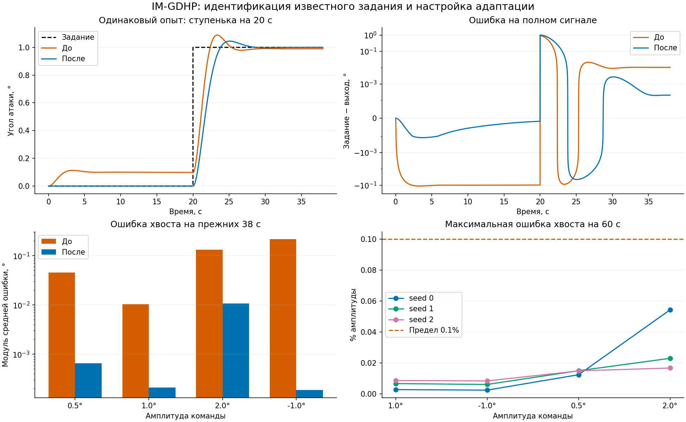

# IM-GDHP: устранение смещения на ступеньках F16

## Результат при прежнем горизонте

Ступенька α 0° → 1° на 20-й секунде, длительность 38 с, dt=0.01 с. Состояние самолёта в начале оценки нулевое; адаптация включена до и после команды. Математическая модель объекта не изменялась.

| Метрика | До | После |
|---|---:|---:|
| Максимальная ошибка до ступеньки, ° | 0.1130027 | 0.0001202777 |
| Средняя ошибка последних 10%, ° | 0.01040517 | 0.000211881 |
| Перерегулирование относительно команды, % | 8.855692 | 4.502054 |
| Установление ±5%, с после скачка | 4.34 | 3.38 |
| CPI ↓ | 2.021246 | 0.9236745 |

CPI уменьшился на **54.3%** при том же горизонте. Улучшение включает настройку и дополнительное обучение; это не сравнение при одинаковом бюджете обучения.

## Причины и сверка со статьёй

1. После обучения только на α=1° актор выдавал около −0.0448° руля при нулевой мгновенной ошибке. Эта выученная команда не подходила для удержания α=0°. В уравнении (64) статьи ненулевая команда при нулевой ошибке предусмотрена постоянным входом; само его наличие не является ошибкой реализации.
2. Эффективная скорость изменения этой команды была мала и различалась между seed. Подбор только численного `actor_lr` приводил к колебаниям. По малосигнальному виду (67) теперь выбирается одинаковая целевая чувствительность адаптации с учётом производных текущего актора, критика и идентификатора.
3. В прежнем опыте RLS получал скачок ошибки из-за ступеньки задания. Статья описывает непрерывное, кусочно дифференцируемое задание при неизвестной его динамике (раздел 3.3). При известной ступеньке разумно идентифицировать выход самолёта и вычитать следующее задание из прогноза. Это **явное расширение для известного задания**, а не объявление исходных уравнений статьи неверными.

Источник: [Sun, van Kampen (2021)](https://doi.org/10.1016/j.asoc.2021.107153), [рукопись авторов](https://pure.tudelft.nl/ws/portalfiles/portal/90401508/1_s2.0_S1568494621000764_main.pdf). Сохранены функции потерь актора/критика, аналитическая производная скалярного критика и порядок обновления идентификатора после сетей. PID и интегральный регулятор не добавлены.

## Что изменено

- `identifier_mode="output"` в SDK: RLS обучается на измеренном выходе; актор и критик используют `predicted_output - next_reference`. Старый режим `tracking_error` остаётся по умолчанию. Тесты отдельно проверяют, что скачки задания при одинаковой физической траектории не изменяют идентификатор.
- `retune_actor_inputs(...)` в SDK: преобразует входные веса актора, сохраняет команду при нулевой ошибке и согласует параметры checkpoint. Это операция настройки между опытами, а не переключение при скачке.
- Начальное обучение: прежние 30 эпизодов по 12 с на постоянном α=1° с шумом 0.1°.
- Следующий этап: локальная чувствительность обратной связи 0.25°/°, чувствительность адаптации 0.03°/(°·с), постоянный вход 30. Шаг SGD выводится из градиентов; все три seed используют одно правило.
- Дополнительный 60-секундный учебный эпизод α=0°. При последующей оценке самолёт начинается с нуля, а весь нулевой участок показан на графике.
- При оценке актор, критик и RLS продолжают обновляться. Параметры не сбрасываются и не переключаются в момент ступеньки.

## Проверка на разных амплитудах

В таблице сохранён прежний горизонт 38 с и добавлена оценка после затухания перехода на 60 с. На 60 с максимальная ошибка последних пяти секунд должна быть ≤0.1% амплитуды; среднее само по себе не используется для принятия колебательного ответа.

| Ступенька, ° | Ошибка хвоста на 38 с, ° | Ошибка хвоста на 60 с, ° | Максимум за последние 5 с, ° | Условие 0.1% |
|---:|---:|---:|---:|---|
| 2 | +0.0106379 | +0.0008716 | 0.0010862 | PASS |
| 1 | +0.0002119 | +0.0000220 | 0.0000278 | PASS |
| 0.5 | -0.0006496 | -0.0000496 | 0.0000619 | PASS |
| -1 | -0.0001863 | -0.0000202 | 0.0000243 | PASS |

## Повторяемость и переключения

Все **12** отдельных проверок (3 seed × 4 амплитуды) прошли позднюю точность 0.1%. Максимальное перерегулирование — около 5.27%. Независимые дополнительные команды −2°, −0.75°, 0.75°, 1.5° и 2.5° также проверены; после их оценки параметры не перенастраивались.

Последовательность `0 → 1 → 0 → −1 → 0.5 → −2 → 0` выполнена одним непрерывно адаптирующимся экземпляром без сбросов на переключениях. Максимальный модуль среднего за последние пять секунд участка — **0.001921°**, максимальный модуль отдельного отсчёта хвоста — **0.002538°**. Последний возврат к нулю имеет среднюю ошибку около **0.000910°**. Это конечные затухающие остатки, поэтому утверждение «точно нулевая ошибка на всех участках» было бы неверным.

Ступенька после 200 с нулевого задания завершилась ошибкой последних пяти секунд около **0.000021°**. На 500-секундной единичной ступеньке ошибка хвоста около **0.000009°**, CPI около **0.9270**, обучение остаётся включённым. Установившийся численный остаток не выдаётся за математический ноль.

## Контрольное отключение известного задания

При одинаковых обученных весах и настройке смена только режима идентификации с `output` на `tracking_error` для 38-секундной ступеньки дала CPI **10.308** вместо **0.924**; ошибка последних 3.8 с — около **4.282°**, выход не установился. Этот опыт показывает существенность обработки скачка известной команды, а не универсальное превосходство одного режима над постановкой статьи.

## Ограничения и воспроизведение

- Основные результаты относятся к линейному продольному F16. На длинных удержаниях накапливается тангаж; проверка 500 с не подтверждает физическую достоверность такого длительного нелинейного полёта.
- Результаты не доказывают устойчивость при произвольных начальных состояниях, шуме, отказах и частотах задания. Быстрый синус (амплитуда 2°, период 4 с) остаётся неудовлетворительным: RMSE за 12 с — 1.685°. Этот результат явно сохранён в ноутбуке; настройка решает смещение на ступеньках, но не задачу точного слежения за любым сигналом.
- Нелинейный раздел по-прежнему проверяет только идентификацию. Математическая модель самолёта и уравнения среды не изменялись.
- Полный воспроизводимый SDK-код: [ноутбук](../example/reinforcement_learning/incremental_adp/example_im_gdhp_nonlinear_f16.ipynb), [русский урок](../docs/ru/example/agent/imgdhp/example_imgdhp_nonlinear.md), [English lesson](../docs/en/example/agent/imgdhp/example_imgdhp_nonlinear.md).
- Все удачные и неудачные пробы, конфигурации, результаты контрольного отключения и исходники временных исследовательских запусков сохранены в `alpha_only_offset_correction` файла [аудита](ihdp-imgdhp-paper-audit.json). Временные файлы не являются зависимостями опубликованного ноутбука.

## Проверки

Все 16 кодовых ячеек ноутбука выполнены. **1498 тестов агентов прошли**; Ruff и mypy прошли. Полные уроки и кукбуки EN/RU синхронизированы с исполненными ячейками. Проверены схема и синтаксис ноутбука, наличие полного кода и изображений. Строгая сборка MkDocs EN/RU прошла за 52.19 с; `git diff --check` прошёл. Ограничение быстрого синуса явно указано в обоих языках.
