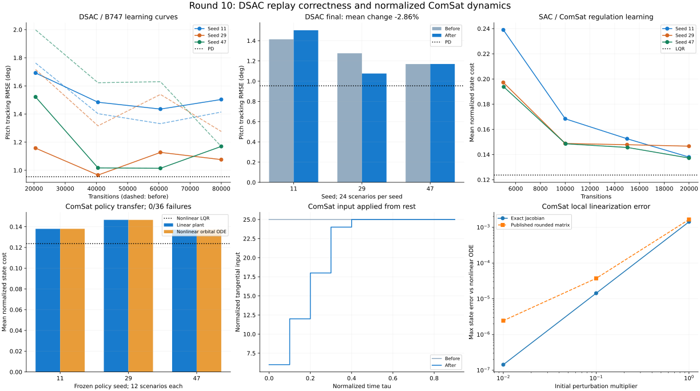

# Десятый проход: DSAC и нормализованная динамика ComSat

Дата: 17 сентября 2026. Ветка `fix/agent-runtime-bugs`.
Baseline — рабочее состояние после девятого прохода, сохранённое в
`/tmp/physics-policy-audit-round10/before`. Предыдущие изменения сохранены;
текущие правки не закоммичены.

## Результат

- Исправлены переходы replay, оценка без исследовательского шума и продолжение обучения DSAC.
- Исправлены координаты ComSat, применение ограниченной тяги в награде и лимит скорости изменения входа с первого шага.
- Python и MATLAB приведены к опубликованным коэффициентам. Документация теперь явно описывает безразмерные отклонения от орбиты.
- **2923 теста проходят; покрытие 21052 / 22620 = 93.07%.** Добавлено 42 случая: на baseline 40 падают, 2 являются контрольными. Тесты Ray отдельно не собираются из-за отсутствующего пакета `ray`.
- Проведено **9 обучений, 540 000 переходов**: 6 парных запусков DSAC по 80 000 и 3 запуска SAC/ComSat по 20 000. Все проверяемые потери и итоговые параметры конечны.
- DSAC: средняя RMSE 1.286403° → 1.249670° (-2.86%). Улучшение неодинаково по seed; у seed 11 ошибка выросла. PD остаётся точнее.
- ComSat: 0/36 выходов за заданные границы у итоговых политик и на линейной, и на независимой нелинейной модели. LQR остаётся точнее. Это конечные контрольные испытания, не доказательство общей сходимости.

[Метрики, кривые, параметры и SHA-256](physics-policy-validation-round10.json).



## Исправления агента

1. Скалярный и векторный сборщики копируют наблюдение **до** `env.step()`. Это защищает replay, если среда изменяет тот же буфер на месте. Отдельные регрессионные среды воспроизводят эту ошибку; используемый B747 не переиспользует буфер так, поэтому в его сравнении ошибка поля `state` равна нулю и до исправления.
2. При завершении скалярной среды учитываются `final_observation` / `terminal_observation`. Векторная среда с автоматическим reset использует доступное `final_observation` и маску его наличия. Истинное завершение обнуляет продолжение ценности, ограничение времени сохраняет его при доступном конечном наблюдении. При отсутствии конечного наблюдения автоматического reset применяется консервативная терминальная маска.
3. `evaluate=True` возвращает среднее действие без дополнительного шума и расходования случайных чисел Torch, даже если настроен `exploration_noise_std`.
4. Счётчики переходов и обновлений сохраняются между вызовами и в checkpoint; повторный скалярный `train()` не перезапускает прогрев и фазу целевых обновлений. Тест с реальными сетями сравнивает один вызов на два эпизода с двумя последовательными вызовами: policy, оба critic и целевые сети совпадают точно.
5. Исправлены `best_reward` без сохранения модели, обозначение ограничения `max_steps`, метрики до первого обновления и нормализованные границы векторного прогрева.

DSAC по-прежнему ожидает действия `[-1, 1]`. Векторный `warmup_steps` явно задаётся для каждого вызова. Старые checkpoint загружаются с нулевыми счётчиками. Replay, состояние среды и RNG не сохраняются: загрузка не гарантирует точное продолжение случайной траектории. IQN loss, риск и CAPS в этом проходе не изменялись.

## Исправления модели и среды

### Источник и физический смысл

Первоисточник: [Choudhary (2015), Design and Analysis of an Optimal Orbit Control for a Communication Satellite](https://www.naun.org/main/NAUN/communications/2015/a102006-085.pdf), уравнения (14)–(19).

Нормализация: `tau = t / sqrt(R/g)`, `rho = r/R`, `u2 = F2/(M*g)`.
Состояние линейной модели — `[delta_rho, delta_rho_prime, delta_theta_prime]`.
Публикация даёт `A[1,2] = 0.7757`, `A[2,1] = -0.01775`, `B[2] = 0.1513`.
В Python исправлено `0.7753 → 0.7757`, в MATLAB — десятичная ошибка
`-0.1775 → -0.01775`. Отрицательный коэффициент Python уже был верным.

Коэффициенты публикации округлены: максимальное расхождение с якобианом в
опубликованной округлённой рабочей точке равно 0.00040792.
Модель не принимает напрямую километры, метры в секунду, секунды и ньютоны.
Значения ±25 и 60 за единицу `tau` — унаследованные настройки симуляции,
не подтверждённые характеристики двигателей спутника.

### Изменения поведения

- `ImprovedComSatEnv` вычитает `nominal_rho` перед линейной динамикой и возвращает смещение во внешний `state`. Прежнее значение `6371` сохранено как совместимое **смещение координаты**, а не физический радиус. Для работы с отклонениями рекомендуется `nominal_rho=0`.
- При нулевом отклонении и входе равновесие теперь сохраняется для смещений 0, 6.6108 и 6371. Раньше смещение 6371 создавало ненулевое ускорение и приводило к завершению среды за 30 шагов `dt=0.1`.
- Ограничение изменения входа действует с первого шага относительно `initial_control`; больше нельзя мгновенно перейти от нуля к максимальной тяге.
- Награда, наблюдение предыдущего действия и телеметрия используют фактически приложенный вход после ограничения скорости изменения.
- В старой `ComSatEnv` диапазон действий совпадает с моделью (±25), ограничение времени обозначается как `truncated`.
- Проверяются конечность и размер состояния/входа, положительность шага, форма опорного сигнала. Начальное состояние копируется; некорректная команда не меняет время и состояние.

## Численная и физическая проверка ComSat

### Линейная динамика и ограничения входа

Независимый эталон — экспонента расширенной матрицы с постоянным входом на шаге;
ограничитель вычисляется отдельно. На `tau=10` подаются +25, затем −25, затем 0.001.
Это **численный стресс-тест вне малых орбитальных отклонений**, а не реалистичный манёвр спутника.

| dt (tau) | Максимальная ошибка до | После | Максимальная скорость изменения входа до → после |
|---|---:|---:|---:|
| 0.1 | 2.220e+01 | 1.279e-13 | 250.0 → 60.0 |
| 0.05 | 2.550e+01 | 2.842e-13 | 500.0 → 60.0 |
| 0.01 | 2.816e+01 | 1.990e-12 | 2500.0 → 60.0 |

При нулевом входе на `tau=100` для двух противоположных начальных отклонений
ошибка против DOP853 составляет 2.791e-12,
дрейф линейного инварианта `delta_theta_prime + 0.01775*delta_rho` —
7.091e-16.

### Независимые нелинейные орбитальные уравнения

Использованы `rho'=v`, `v'=rho*omega²-1/rho²`,
`omega'=-2*v*omega/rho+u2/rho`. Для проверки выбирается точное круговое равновесие
`rho0=6.6108`, `omega0=sqrt(1/rho0³)`. Интегратор DOP853: `rtol=1e-12`, `atol=1e-14`.

При уменьшении начального возмущения `[0.02,-0.004,0.002]` ошибка точной
линеаризации убывает квадратично. Для опубликованной матрицы остаётся также
погрешность округлённых коэффициентов. Проверены оба знака; таблица для положительного:

| Множитель начального возмущения | Ошибка точного якобиана | Ошибка опубликованной матрицы |
|---|---:|---:|
| 1 | 1.426e-03 | 1.656e-03 |
| 0.1 | 1.431e-05 | 3.726e-05 |
| 0.01 | 1.432e-07 | 2.438e-06 |

Дрейф нелинейного углового момента `rho²*omega` без тяги не превышает
1.092e-13.
Уравнения не включают атмосферу, другие небесные тела, J2, расход массы или калибровку приводов.

## Качество политик

### DSAC на неизменной модели B747

Один и тот же файл среды, подтверждённый SHA-256, используется до/после.
CPU, seed 11/29/47, 4 среды, `dt=0.05`, горизонт 10 s, 80 000 переходов,
случайные ступени задания ±4°. Сети 64, batch 128, 8 квантилей, embedding 32,
`alpha=0.01` без настройки энтропии, CAPS выключен, LR 0.0003.
Оценка: 24 фиксированные ступени ±2°/±4°, начало 0.5–1.5 s.
Нарушение — выход тангажа за ±20°. Проверки не расходуют обучающий RNG.

| Seed | RMSE до, ° | RMSE после, ° | Изменение | Выходы за границы после |
|---|---:|---:|---:|---:|
| 11 | 1.414019 | 1.503426 | +6.32% | 0 / 24 |
| 29 | 1.275873 | 1.075783 | -15.68% | 0 / 24 |
| 47 | 1.169318 | 1.169800 | +0.04% | 0 / 24 |

Средняя ошибка: 1.286403° → 1.249670°. Нулевое управление:
2.849257°, PD: 0.953801°.
Итоговые и промежуточные оценки до/после имеют 0 нарушений.
На seed 11 ошибка выросла; три seed не дают основания утверждать статистически
надёжный рост качества. Исправление семантики переходов необходимо независимо от краткосрочной метрики.

Непосредственный контроль replay на каждом обновлении: максимальная ошибка
`next_state` была 1.0, ошибка терминальной маски 1.0; после исправления обе равны 0.
Проверка охватывает наблюдаемые переходы, включая тайм-ауты с автоматическим reset.

### SAC на ComSat

Три обучения по 20 000 переходов, сети 64, batch 128, `alpha=0.01`, CPU.
Используется явная обёртка **задачи стабилизации**, а не встроенная награда
`ImprovedComSatEnv`: `dt=0.1 tau`, горизонт `10 tau`, вход ограничен ±0.05,
масштабы наблюдений `[0.05,0.01,0.01]`, награда
`-(xᵀQx + 0.001*(u/0.05)²)` с `Q=diag(400,5000,5000)` и штрафом 10 при выходе
за `[0.2,0.05,0.02]`. Обучающие отклонения равномерны в ±`[0.025,0.005,0.0025]`.
12 тестов: восемь комбинаций ±`[0.02,0.004,0.002]`, отдельно ±0.04 по радиусу
и ±0.004 по угловой скорости. Метрика ниже — средняя `xᵀQx`, без штрафа за управление.

| Seed | Линейная модель | Независимая нелинейная | Старый код с нулевым смещением | Выходы за границы на каждой модели |
|---|---:|---:|---:|---:|
| 11 | 0.137965 | 0.137995 | 0.137986 | 0 / 12 |
| 29 | 0.146633 | 0.146574 | 0.146665 | 0 / 12 |
| 47 | 0.137227 | 0.137201 | 0.137252 | 0 / 12 |

Средняя стоимость на новой линейной модели — 0.140608, на нелинейной —
0.140590. Нулевое управление: 1.645264;
LQR: 0.123691. Политики лучше нулевого управления,
но уступают LQR на 13.68% по этой метрике.
Начиная с первой промежуточной оценки около 5000 шагов выходов за границы нет;
до обучения политики давали соответственно 5, 4 и 5 нарушений из 12.

С теми же весами старый код со смещением 6371 нарушает границы во всех 36 случаях
уже на первом шаге из-за ложного ускорения. Старый код со смещением 0 даёт близкие
результаты: это отделяет исправление координат от небольшого изменения коэффициента.
Нелинейный контроль также использует **те же сохранённые веса**, без дообучения.

## Контроль остальных моделей

- `validate_physics.py` на baseline и текущем коде даёт точно одинаковые данные для quadrotor, транспортных самолётов, X8, Shadow и F16. В существующих транспортных сценариях остались недостижимые точки балансировки: отчёт не интерпретирует их как успешно найденное равновесие.
- Проверка среды F16 точно совпадает с девятым проходом.
- Политика F16 seed 11 из девятого прохода даёт точно те же 12 результатов: RMSE 0.962521°, 0 нарушений.
- Это контроль затронутых путей и указанных сценариев. Остальные семейства агентов в этом проходе заново не обучались.

## Проверки и воспроизводимость

- Pytest: 2923 passed, 14 warnings; 123.83 s. Исключён только `tests/optimization/ray_test.py`; отдельный запуск подтверждает `ModuleNotFoundError: ray`.
- Coverage: 93.06808134% строк всего пакета, порог 92% выполнен; модуль Ray остаётся в знаменателе.
- Baseline новых тестов: 40 failed / 2 passed. Финальная целевая серия: 47 passed, включая пять существовавших проверок старой среды.
- Quality gate: flake8 30 ≤ 30; Ruff 0; mypy 0; Bandit 82 ≤ 114, medium 59 ≤ 83, high 0. Baseline не ослаблялся.
- Black/isort: 10 изменённых Python-файлов проходят. `git diff --check` проходит.
- `mkdocs build --strict`: проходит за 55.87 s; оба примера ComSat выполнены.
- JSON-отчёт содержит SHA-256 исходников, снимков деревьев production Python, результатов и checkpoint. Полные логи и веса находятся в `/tmp/physics-policy-audit-round10`; сводные метрики и график сохранены в репозитории.

Пример повторения на текущем коде (отдельная директория вывода):

```bash
mkdir -p /tmp/comsat-dsac-repeat
OMP_NUM_THREADS=1 MKL_NUM_THREADS=1 MPLBACKEND=Agg .venv/bin/python scripts/validate_dsac_rollout.py --repo . --env-source tensoraerospace/envs/b747_vec_torch.py --seed 11 --frames 80000 --output /tmp/comsat-dsac-repeat/dsac.json
OMP_NUM_THREADS=1 MKL_NUM_THREADS=1 MPLBACKEND=Agg .venv/bin/python scripts/validate_comsat_physics.py --repo . --output /tmp/comsat-dsac-repeat/physics.json
OMP_NUM_THREADS=1 MKL_NUM_THREADS=1 MPLBACKEND=Agg .venv/bin/python scripts/validate_comsat_policy.py --repo . --seed 11 --frames 20000 --output /tmp/comsat-dsac-repeat/policy.json
OMP_NUM_THREADS=1 MKL_NUM_THREADS=1 MPLBACKEND=Agg .venv/bin/python scripts/validate_comsat_nonlinear.py --repo . --policy-results /tmp/comsat-dsac-repeat/policy.json --checkpoint /tmp/comsat-dsac-repeat/policy.pt --output /tmp/comsat-dsac-repeat/nonlinear.json
```
