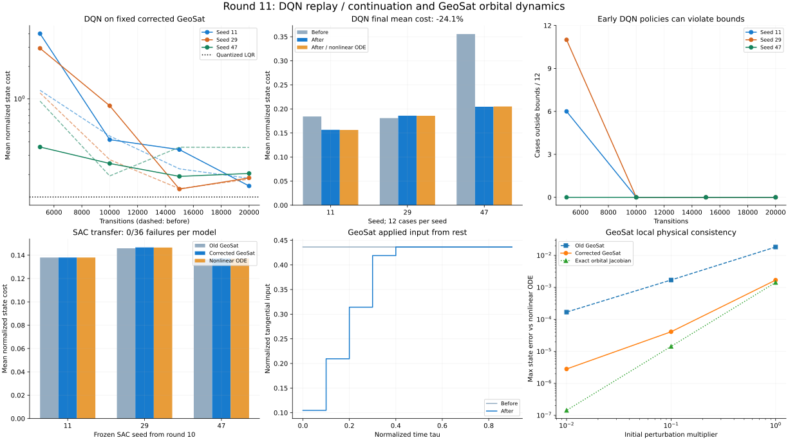

# Одиннадцатый проход: DQN/PER-NARX и GeoSat

Дата: 17 сентября 2026. Ветка `fix/agent-runtime-bugs`.
Сравнение выполнено со снимком рабочего состояния после десятого прохода:
`/tmp/physics-policy-audit-round11/before`. Предыдущие изменения сохранены. Правки не закоммичены.

## Результат

- Исправлены начальная целевая сеть DQN/PER-NARX, владение данными replay, конечные наблюдения, продолжение обучения и сериализация счётчиков DQN.
- В GeoSat исправлена десятичная ошибка коэффициента `−0.1774 → −0.01774`, действующая и в Python, и в MATLAB. Исправлены начальное ограничение изменения тяги и контракт среды.
- **2958 тестов проходят; покрытие 21098 / 22671 = 93.06%.** Все 35 новых регрессионных случаев падают на baseline и проходят после исправлений.
- На одной и той же исправленной модели средняя стоимость итоговой DQN-политики по трём seed: 0.240284 → 0.182342 (-24.11%). Seed 29 немного ухудшился.
- Итоговые DQN-политики: 0/36 нарушений на линейной и 0/36 на независимой нелинейной модели. Ранние политики могут нарушать границы; общей гарантии сходимости нет.
- Ранее обученные SAC-политики проверены без изменения весов: по 0/36 нарушений на старом GeoSat, исправленном GeoSat и независимой нелинейной модели.
- Контрольные результаты остальных моделей и сохранённой политики F16 точно совпали с предыдущим проходом.

[JSON: метрики, кривые, параметры и хеши](physics-policy-validation-round11.json).



## Что исправлено в агентах

1. **Начальная целевая Q-сеть.** Она получала независимые случайные веса. Теперь это отдельная копия online-сети, включая `LazyLinear`. Целевая сеть переведена в режим оценки. При загрузке восстанавливается именно сохранённая отстающая сеть, а не свежая копия online.
2. **Replay и переиспользуемые буферы.** `store_transition()` копирует оба состояния; сборщики дополнительно копируют исходное наблюдение до `env.step()`. Изменение буфера средой или последующий reset больше не переписывают старые переходы.
3. **Автоматический reset.** Если шаг возвращает `final_observation` / `terminal_observation`, в replay попадает оно. Только истинное завершение обнуляет продолжение ценности; тайм-аут сохраняет его.
4. **Повторное обучение.** `global_env_step` не обнуляется, расписание целевой сети использует накопленные шаги, прогрев определяется заполнением replay. Тест реальных сетей сравнивает 12 шагов с двумя вызовами по 6: online и target совпадают точно. Вызовы в тесте разделены на естественной границе эпизода.
5. **Checkpoint DQN.** Сохраняются шаги среды, обновления и число эпизодов. Старый формат поддержан с нулевыми счётчиками. Replay, состояние среды и RNG не сохраняются; точного продолжения случайной траектории после загрузки нет.
6. **SumTree.** Буфер ёмкостью один больше не уходит в бесконечную рекурсию при обновлении корня. Нулевая граница выборки не выбирает лист с нулевым приоритетом.
7. **Явное исследование.** `e_decay()` соблюдает `min_epsilon` и не включает исследование при явном `epsilon=0`. `train()` сохраняет прежнее постоянное epsilon. Убрана отладочная печать PER-NARX, соблюдается `verbose=False`.

Инициализация целевой сети соответствует [алгоритму DQN](https://deepmind-media.storage.googleapis.com/dqn/DQNNaturePaper.pdf). Разделение завершения и ограничения времени соответствует [контракту Gymnasium](https://gymnasium.farama.org/main/tutorials/handling_time_limits/).

## GeoSat: математическая модель и среда

### Десятичная ошибка и единицы

Первоисточник: [Hla et al. (2012), Implementation of a Communication Satellite Orbit Controller Design Using State Space Techniques](https://ajstd.ubd.edu.bn/journal/vol29/iss1/2/), сокращённая модель в уравнениях (61), (66), (70).
В ней приведён коэффициент `−0.01774`. В более ранней четырёхмерной записи статьи
встречается противоречащее ему `−0.1774`; проект перенёс его в трёхмерную модель.
Проверка производной `−2*omega0/rho0` независимо подтверждает порядок `−0.0177`.

Введены безразмерные `tau=t/sqrt(R/g)`, `rho=r/R`, `u2=F2/(M*g)`.
Физический смысл трёх состояний — отклонения радиуса, радиальной скорости и угловой скорости.
Исторические API-имена сохранены: `rho`, `theta`, `omega`. **`theta` здесь означает
радиальную скорость; углового положения в модели нет.** Документация и docstring это поясняют.

Оставшиеся коэффициенты сохранены: `A[1,0]=0.01036`, `A[1,2]=0.7753`, `B[2]=0.1512`.
Это округлённая локальная линеаризация, а не модель произвольного движения в СИ.
Собственная частота изменилась с 0.356620555 до
0.058256519 за единицу `tau`; прежняя была выше примерно в
6.12 раза.

### Исправления исполнения

- Ограничение скорости изменения входа действует с первого шага относительно `initial_control` (по умолчанию ноль). Начальная команда больше не обходит ограничитель.
- Сохранены численные пределы величины `pi*25/180` и скорости `pi*60/180` за единицу `tau`. Это прежние настройки симуляции; они не подтверждают реальные характеристики двигателя.
- Начальное состояние копируется; размер и конечность входа/состояния, шаг и горизонт проверяются. Ошибочная команда не меняет состояние и время.
- `GeoSatEnv` принимает `dt`, сохраняет его при reset, объявляет правильный диапазон действий и возвращает тайм-аут как `truncated=True`.
- Наблюдения следуют `output_space`; по умолчанию он наследует `state_space`. Box соответствует фактической размерности.
- Награда выбирает отслеживаемые компоненты из полного состояния модели, независимо от порядка и состава наблюдений. Один канал сохраняет прежнюю цель по первой отслеживаемой компоненте; несколько каналов дают среднюю абсолютную ошибку.
- Реализовано объявленное в API задание-функция: оно вычисляется в моменты `i*dt`. Проверены размеры и конечность задания.

## Физическая и численная проверка

### Линейные уравнения и приложенный вход

Эталон — независимая матричная экспонента расширенной системы с отдельно вычисленным
ограничителем. На `tau=10` подаются +1, затем −1 и 0. Это численный стресс-тест,
его полные команды могут выходить за область физических малых возмущений.

| dt | Максимальная ошибка состояния до | После | Максимальная скорость входа до → после |
|---|---:|---:|---:|
| 0.1 | 1.543e+00 | 1.332e-15 | 4.363323 → 1.047198 |
| 0.05 | 1.513e+00 | 2.665e-15 | 8.726646 → 1.047198 |
| 0.01 | 1.489e+00 | 7.105e-15 | 43.633231 → 1.047198 |

При нулевом входе, `tau=100`, двух противоположных начальных состояниях:
максимальная ошибка против DOP853 после исправления —
2.897e-12; дрейф линейного инварианта
`omega + 0.01774*rho` — 7.260e-16.

### Нелинейный орбитальный контроль

Независимо интегрируются `rho'=v`, `v'=rho*omega²−1/rho²`,
`omega'=−2*v*omega/rho+u2/rho` с DOP853 (`rtol=1e-12`, `atol=1e-14`).
Точное круговое равновесие: `rho0=6.6108`, `omega0=sqrt(1/rho0³)`.
При нулевом входе проверяется сохранение `rho²*omega`.
Начальное отклонение — множитель × `[0.02,−0.004,0.002]`, горизонт `tau=10`, оба знака.
Ниже положительный знак; полный набор есть в JSON.

| Множитель | Ошибка старой модели | Исправленной | Точного якобиана |
|---|---:|---:|---:|
| 1 | 1.831e-02 | 1.694e-03 | 1.426e-03 |
| 0.1 | 1.703e-03 | 4.104e-05 | 1.431e-05 |
| 0.01 | 1.690e-04 | 2.816e-06 | 1.432e-07 |

Ошибка точного якобиана уменьшается квадратично с амплитудой; для опубликованных
коэффициентов дополнительно остаётся округление. Нелинейный дрейф углового момента
не превышает 1.021e-13.
Проверка не включает J2, атмосферу, другие тела, расход массы и реальные характеристики тяги.

## Качество обученных политик

### Парное сравнение DQN

Seed 11/29/47, CPU, по 20 000 переходов. До/после используется один и тот же
исправленный файл GeoSat, SHA-256 совпадает. Физика в этом сравнении не меняется.

Задача стабилизации задана отдельной обёрткой: `dt=0.1 tau`, горизонт `10 tau`,
11 равномерных действий в `[-0.05,0.05]`, наблюдение из состояния с масштабами
`[0.05,0.01,0.01]` и последней тяги. Награда:
`−xᵀQx −0.001*(u/0.05)² −10*failure`, `Q=diag(400,5000,5000)`.
Это **не встроенная награда GeoSatEnv**. Нарушение: `abs(x)>[0.2,0.05,0.02]`.

Сеть 32×32; LR 0.0005, gamma 0.98, epsilon 0.8 постоянно, batch 64,
replay 512, обновление target через 1000 переходов. 12 фиксированных сценариев:
восемь сочетаний ±`[0.02,0.004,0.002]`, отдельно ±0.04 радиуса и ±0.004 угловой скорости.
Метрика — средняя `xᵀQx`, без штрафа за управление. Оценка не расходует обучающий RNG.

| Seed | Стоимость до | После | Те же веса на нелинейной модели | Изменение линейной метрики |
|---|---:|---:|---:|---:|
| 11 | 0.184287 | 0.156589 | 0.156315 | -15.03% |
| 29 | 0.180959 | 0.185911 | 0.185717 | +2.74% |
| 47 | 0.355606 | 0.204527 | 0.205044 | -42.48% |

Средняя стоимость 0.240284 → 0.182342 (-24.11%).
Нулевое управление: 1.644437; непрерывный LQR:
0.123722; LQR с теми же дискретными командами:
0.123745. Политики лучше нулевого управления,
но в среднем уступают LQR. Три seed не доказывают статистически надёжного превосходства.

**Промежуточные политики нестабильны в части сценариев:** после 5000 переходов
финальный вариант имел соответственно 6, 11 и 0 нарушений из 12. В последующих
проверках на 10 000, 15 000 и 20 000 переходах нарушений нет. В baseline на 5000
переходах было 2, 0 и 5 нарушений. Конечность потерь не означает безопасность каждой стадии обучения.

### Регрессия, найденная проверкой обучения

Пробный вариант автоматически вызывал `e_decay()` после каждого эпизода.
При одинаковых начальных параметрах epsilon быстро достигал 0.05; итоговые
стоимости были 0.490431, 0.229366, 1.356557,
у seed 47 — 3/12 нарушений. Это изменение **исключено из финального кода**.
Сохранено управление исследованием явным `e_decay()`.
Результаты и исходник пробного варианта архивированы в
`/tmp/physics-policy-audit-round11/candidate-automatic-decay`.

Всего выполнено девять обучений по 20 000 переходов: три baseline, три пробных
и три финальных. Все отслеживаемые потери и итоговые параметры конечны;
расходимость траекторий пробного варианта не скрыта этим критерием.

### Перенос уже обученных SAC-политик

Использованы **неизменённые веса ComSat seed 11/29/47 из десятого прохода**,
наблюдение и масштабы совпадают. Нового обучения SAC нет. Это проверка переноса
доступных политик между близкими моделями; она не заменяет проверку любых старых
checkpoint, обученных именно на ошибочном GeoSat.

| Seed | Старый GeoSat | Исправленный GeoSat | Независимая нелинейная модель |
|---|---:|---:|---:|
| 11 | 0.137988 | 0.137988 | 0.137995 |
| 29 | 0.145906 | 0.146676 | 0.146574 |
| 47 | 0.136223 | 0.137266 | 0.137201 |

По 0/36 нарушений на каждой модели. Средняя стоимость старый → исправленный GeoSat
изменяется на +0.432%; точные значения и траектории сохранены.

## Регрессия остальных объектов и проверка кода

- `validate_physics.py` даёт точно те же результаты, что в десятом проходе: quadrotor, транспортные самолёты, X8, Shadow и F16. Существующие недостижимые транспортные точки балансировки по-прежнему помечены как несошедшиеся.
- Сохранённая политика F16 seed 11 даёт точно те же 12 результатов: RMSE 0.962521°, 0 нарушений.
- Полный pytest: **2958 passed**, 14 warnings, 123.91 s. Ray исключён, поскольку пакет отсутствует в локальном окружении; модуль остаётся в знаменателе покрытия.
- 35 новых случаев: 35 failed на baseline; все проходят в полном финальном наборе.
- Два старых теста Беллмана теперь явно задают отстающую целевую сеть после конструктора; ожидаемые численные потери не ослаблены. Тест reset проверяет точную пару terminated/truncated для каждого типа среды.
- Quality gate: flake8 30 ≤ 30, Ruff 0, mypy 0, Bandit 82 ≤ 114 / medium 59 ≤ 83 / high 0. Пороговые файлы не изменялись.
- Black/isort проходят для девяти изменённых Python-файлов. `git diff --check` проходит.
- Строгая сборка MkDocs проходит за 55.30 s. Выполнены оба примера документации, `Gymnasium check_env`, сравнение функционального и массивного задания и проверки неверных конфигураций. Проверка Gymnasium предупреждает о неограниченном Box наблюдений; ошибок контракта нет.

Физически достоверны проверенные **малые безразмерные возмущения и перечисленные
сценарии**. Крупные манёвры, реальные спутниковые приводы, все семейства алгоритмов
и длительное орбитальное движение этим проходом не валидированы.

## Воспроизводимость

Полные логи, веса и снимок baseline: `/tmp/physics-policy-audit-round11`.
JSON содержит SHA-256 исходников, результатов, checkpoint и деревьев production Python.
В репозитории сохранены сводные данные и самостоятельный SVG.

```bash
mkdir -p /tmp/geosat-dqn-repeat
OMP_NUM_THREADS=1 MKL_NUM_THREADS=1 MPLBACKEND=Agg .venv/bin/python scripts/validate_geosat_physics.py --repo . --output /tmp/geosat-dqn-repeat/physics.json
OMP_NUM_THREADS=1 MKL_NUM_THREADS=1 MPLBACKEND=Agg .venv/bin/python scripts/validate_geosat_policy.py --repo . --plant-source tensoraerospace/aerospacemodel/geosat.py --seed 11 --output /tmp/geosat-dqn-repeat/dqn.json
OMP_NUM_THREADS=1 MKL_NUM_THREADS=1 MPLBACKEND=Agg .venv/bin/python scripts/validate_geosat_policy.py --repo . --plant-source tensoraerospace/aerospacemodel/geosat.py --seed 11 --checkpoint /tmp/geosat-dqn-repeat/dqn.pt --nonlinear --output /tmp/geosat-dqn-repeat/nonlinear.json
```
