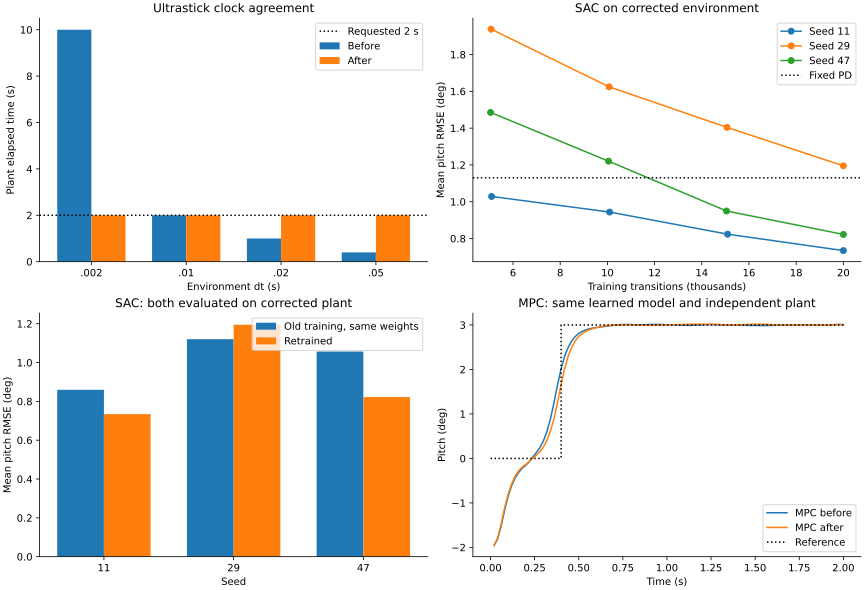

# Проверка физики и обученных политик — проход 12

Дата: 17 сентября 2026. Ветка: `fix/agent-runtime-bugs`.
Сравнение выполнено со снимком рабочего дерева до этого прохода; предыдущие исправления сохранены.

## Результат

- Исправлены ошибки MPC: сдвиг задания, рассогласование стоимости и управления, пропуск последнего обновления, отключение ограничений скорости при отсутствии `u_prev`.
- Исправлены часы среды Ultrastick, начальное ограничение руля, согласованность фактической команды с наградой и наблюдением, копирование исходного состояния и окончания эпизодов.
- **2983 теста проходят; покрытие 21125 / 22706 = 93.0371%.** Из 25 новых случаев 24 падали до исправлений; один проверяет ранее корректный вариант с известным предыдущим управлением.
- MPC на одной и той же обученной модели: средняя RMSE **0.304769° → 0.291965° (-4.20%)**, по 0/18 нарушений до и после.
- SAC на исправленной среде: итоговые политики дают 0/36 нарушений за 2 с и 0/36 за 10 с. Политики, обученные на старой среде, также прошли перенос без дообучения — по 0/36 на каждой длительности.
- У seed 29 переобучение немного ухудшило слежение относительно перенесённой политики. Общей гарантии сходимости нет.

[JSON: метрики, параметры, кривые и хеши](physics-policy-validation-round12.json).



## Исправления

### MPC

1. `x_ref` из N строк теперь задаёт цели для `x1…xN`. Раньше добавлялась последняя строка, затем при расчёте стоимости отбрасывалась первая цель.
2. При отсутствии ограничений `u_proj` ссылался на изменяемый параметр оптимизатора. Копия «лучшего» управления сохранялась после `opt.step()`, а стоимость — до него. Теперь копируются согласованные значения до обновления.
3. Последнее обновление оптимизатора оценивается отдельно. При одном шаге ограниченный MPC раньше возвращал нулевое исходное управление, даже если обновление улучшало решение.
4. Без `u_prev` ограничения скорости действуют между всеми последующими командами. Только первый шаг остаётся без известной исходной позиции.
5. Неконечные стоимость и градиент вызывают `RuntimeError` до выдачи управления и обновления warm start. Это обнаружение численной ошибки, а не резервный закон управления.

Аналитическая регрессия: `min (u−1)²+u²` после одного шага SGD даёт `u=0.5`, `J=0.5`.
Отдельный тест с чрезмерным шагом сохраняет исходное решение вместо ухудшения.
Ограничения должны оставаться совместимыми; универсальной проверки выполнимости MPC в этом проходе не добавлено.

### Модель и среды Ultrastick

1. `ImprovedUltrastickEnv(dt=...)` передаёт шаг модели. Раньше модель всегда использовала 0.01 с.
2. `initial_control=[elevator_rad, throttle]` задаёт исходное положение органов управления, по умолчанию нулевое. Ограничение скорости действует с первой команды и после reset.
3. Начальные параметры улучшенной среды ограничиваются её диапазонами ±15° и [0,1]. Положение модели, наблюдение и первый удерживаемый сигнал согласованы.
4. История действий, награда и `info` используют команду, действительно приложенную моделью после её ограничений.
5. Модель копирует исходное состояние; проверяет шаг времени, размеры и конечность состояния/команды. Некорректное действие не продвигает часы.
6. Горизонт старой среды возвращает `terminated=False, truncated=True`. Это позволяет агентам продолжать оценку ценности при ограничении времени.

Матрицы A/B/C/D не менялись. Публичный порядок состояний и выходов сохранён.

## Физическая проверка

[Ahmed et al. (2015), страница 6](https://www.hilarispublisher.com/open-access/modelling-of-a-small-unmanned-aerial-vehicle-2168-9695-1000126.pdf)
задаёт линейную модель около полёта со скоростью 17 м/с. Координата `−h` источника
преобразована в положительную высоту. В редуцированной модели столбец тяги нулевой.

Скрипт отдельно задаёт опубликованные коэффициенты и интегрирует непрерывное уравнение
методом DOP853 с `rtol=1e−12`, `atol=1e−13`; модель библиотеки использует дискретизацию
с удержанием команды. Независимый ограничитель начинает от нулевой позиции.
Для теста часов используется нулевое управление и матричная экспонента.

| dt, с | Старые часы при запросе 2 с | Новые часы, с | Старый максимум руля, °/с | Новый, °/с | Максимальная ошибка траектории после |
|---|---:|---:|---:|---:|---:|
| 0.002 | 10 | 2 | 15000 | 300 | 7.02e-14 |
| 0.01 | 2 | 2 | 3000 | 300 | 4.04e-14 |
| 0.02 | 1 | 2 | 1500 | 300 | 1.06e-13 |
| 0.05 | 0.4 | 2 | 600 | 300 | 4.63e-13 |

Абсолютный максимум ошибки в последнем столбце смешивает единицы пяти компонент;
это проверка численной эквивалентности, не оценка точности реального самолёта.
Большие команды 30°/−20° предназначены для стресс-теста ограничителя и выходят за
область строгой применимости линейной модели. Отдельные существующие тесты проверяют
малое постоянное отклонение, `dθ/dt=q`, демпфирование, кинематику высоты и производные
воздушных параметров около трима. Все проходят. Все полюса опубликованной матрицы
имеют отрицательную действительную часть.

Привод здесь дискретный: ограничивается изменение команды между отсчётами, затем
она удерживается весь шаг. Непрерывное движение сервопривода не моделируется.
Нелинейной валидации Ultrastick и сравнения с лётными измерениями этот проход не содержит.

## Обученная модель динамики и MPC

Для каждого seed 11/29/47 через `MPCAgent.train_dynamics()` обучен линейный слой 6→5,
предсказывающий приращение состояния. Данные: 4096 независимых случайных пар состояния
и приложенного управления из отдельно заданной опубликованной модели; 1024 других
примера используются только для проверки. Adam, LR 0.01, batch 128, 800 обновлений,
float64, нормализация задана явными масштабами, внутренние нормализаторы выключены.
Линейного слоя достаточно для этой задачи; это не проверка идентификации нелинейного объекта.

Максимальная ошибка предсказания на проверочных данных: до
7.77e-16 в нормированных координатах.
Loss и параметры конечны. Обученные модели практически совпадают, поэтому три seed
здесь не дают независимого свидетельства устойчивости к ошибке идентификации.

В сравнении оптимизаторов используются одинаковые веса и независимая матричная
экспонента объекта: dt=0.02 с, 100 шагов, горизонт MPC 10, Adam 8 итераций с LR 0.05,
руль ±5°, скорость 300°/с. Шесть сценариев: ступени тангажа ±3° с начальными ±2°,
а также начальные скорости тангажа ±5°/с. Полное состояние доступно регулятору.
Стоимость использует Q=`[0.001,0.001,1,0.05,0.001]`, R=0.02 и дополнительный
терминальный штраф с весом 1; масштабы состояния и сценарии сохранены в JSON.

| Показатель | До | После |
|---|---:|---:|
| Средняя RMSE, ° | 0.304769 | 0.291965 |
| Нарушения | 0/18 | 0/18 |
| Ошибка объявленной стоимости относительно заданного задания | 0.047037 | 2.07e-08 |

Небольшой остаток стоимости после исправления связан с возвращаемыми float32-массивами.
Максимальные тангаж/скорость после исправления: 3.018° / 19.946°/с. Максимальная скорость
руля 145.27°/с ниже заданного ограничения. Средняя RMSE фиксированного PD в этом
стенде 0.852499°, нулевого управления —
1.970298°.

## SAC: обучение, перенос и длинные эпизоды

Шесть обучений по 20 000 переходов: три seed на старой среде и три на исправленной.
SAC и его гиперпараметры не менялись: CPU, сеть 64×64, batch 128, replay 50 000,
alpha=0.01. Наблюдение и все составляющие награды штатные; для SAC награда умножается
на 100. Обе команды сохранены; действие тяги влияет на штрафы, но не на движение.

Обучение: dt=0.02 с, эпизод до 100 шагов, постоянное задание в ±3°, начальный тангаж
и скорость в ±2° и ±2°/с. В старой среде модель ошибочно проходила 1 с вместо заявленных
2 с, поэтому её собственную RMSE нельзя считать сравнением при одинаковом физическом времени.
Для основного сравнения **обе группы политик оцениваются на исправленной среде**.

12 фиксированных сценариев — все сочетания заданий ±3°, начального тангажа −2°/0°/+2°
и скорости ±2°/с. Граница нарушения: |тангаж|>10° или |скорость тангажа|>60°/с.
Оценка детерминированная, состояние генераторов случайных чисел обучения сохраняется.
Каждые примерно 5000 переходов повторяется оценка; метрики и кривые в JSON.

| Seed | Старые веса на исправленной среде, 2 с | Переобучение, 2 с | Старые веса, 10 с | Переобучение, 10 с |
|---|---:|---:|---:|---:|
| 11 | 0.859642 | 0.734389 | 0.452071 | 0.408211 |
| 29 | 1.120308 | 1.195113 | 0.895360 | 1.003377 |
| 47 | 1.056878 | 0.822185 | 0.659467 | 0.427092 |

Все числа в таблице — средняя эпизодная RMSE тангажа в градусах. Каждая группа и
длительность: **0/36 нарушений**. Средняя двухсекундная ошибка после переобучения
1.012276° → 0.917229° (-9.39%).
Seed 29 ухудшился; итог не доказывает статистически надёжное преимущество.

Нулевое управление на исправленной среде: 3.022733°;
фиксированный PD: 1.129942°. Seed 29 уступает этому PD.
В десятисекундной проверке максимальный |тангаж| всех перенесённых и новых политик
не превышал 3.31°, скорость — 28.07°/с. В ходе обучения все возвращённые loss и итоговые
веса конечны. Проверенные промежуточные детерминированные политики имели 0 нарушений.
Счётчик нарушений при случайном исследовании во время обучения не сохранялся;
утверждения о безопасном исследовании нет.

MPC и SAC используют разные награды, наблюдения, ограничения амплитуды и фильтрацию
руля. Их RMSE между собой не сравнивается как рейтинг алгоритмов.

## Регрессии и качество

- Полный доступный набор: 2983 passed, 14 warnings, 124.99 с; покрытие 93.0371%.
- В прошлом проходе было 93.0616%; текущее покрытие немного ниже из-за новых защитных ветвей.
- Ray не установлен; `tests/optimization/ray_test.py` исключён, как и в предыдущих проходах.
- Целевой набор: 170 passed. Оба окружения прошли `gymnasium.utils.env_checker.check_env`.
- Flake8: 30, в пределах baseline 30. Ruff: 0. Mypy: 0. Bandit: 82, medium 59, high 0 — в пределах baseline.
- Black/isort: 9 файлов. `git diff --check`: успешно. MkDocs strict: успешно, 57.14 с.
- Контрольные численные результаты quadrotor, транспортных самолётов, X8, Shadow и F16 точно совпали с отчётом прохода 11. Уже отмеченные недостижимые режимы трима не стали подтверждёнными режимами.
- Прежний checkpoint политики F16 из `/tmp/physics-policy-audit-round9/f16-retrained-11.pt` отсутствует. Повторная проверка этих весов не выполнена; прежние результаты не выданы за новый запуск.
- В текущем проходе изменены только три производственных Python-файла, перечисленные в JSON; остальные побайтно совпадают со снимком до прохода.

## Воспроизведение

```bash
PYTHONDONTWRITEBYTECODE=1 OMP_NUM_THREADS=1 MKL_NUM_THREADS=1 MPLBACKEND=Agg \
  .venv/bin/python scripts/validate_ultrastick_physics.py --repo "$PWD" --output /tmp/ultrastick-physics.json

PYTHONDONTWRITEBYTECODE=1 OMP_NUM_THREADS=1 MKL_NUM_THREADS=1 MPLBACKEND=Agg \
  .venv/bin/python scripts/validate_ultrastick_mpc.py --repo "$PWD" --seed 11 --output /tmp/ultrastick-mpc.json

PYTHONDONTWRITEBYTECODE=1 OMP_NUM_THREADS=1 MKL_NUM_THREADS=1 MPLBACKEND=Agg WANDB_MODE=offline HF_HUB_OFFLINE=1 \
  .venv/bin/python scripts/validate_ultrastick_policy.py --repo "$PWD" --seed 11 --output /tmp/ultrastick-sac.json

PYTHONDONTWRITEBYTECODE=1 OMP_NUM_THREADS=1 MKL_NUM_THREADS=1 MPLBACKEND=Agg \
  .venv/bin/python scripts/validate_ultrastick_policy.py --repo "$PWD" --seed 11 --duration 10 \
  --checkpoint /tmp/ultrastick-sac.pt --output /tmp/ultrastick-sac-long.json
```

Повторить seed 29 и 47. Для сравнения старого MPC передать `--repo` со снимком
и тот же `--checkpoint` обученной модели. Исходные логи и веса этого прохода:
`/tmp/physics-policy-audit-round12`; это временные артефакты. В JSON отчёта сохранены
метрики, параметры, выбранные траектории и SHA-256 исходников и артефактов.
