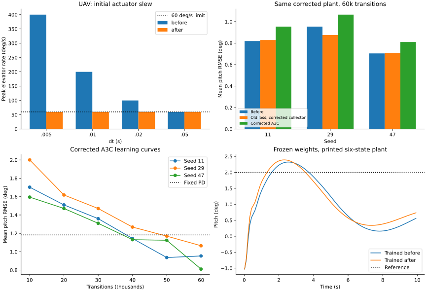

# Проверка физики и обученных политик — проход 13

17 сентября 2026. Ветка `fix/agent-runtime-bugs`. Baseline — снимок рабочего дерева
до этого прохода; предыдущие изменения сохранены.

## Итог

Исправлены ошибки A3C, физического контракта UAV и его истории/графиков.
**Проверка качества выявила регрессию A3C при прежних гиперпараметрах.**
Математическая корректность обновления подтверждена, но улучшения качества обучения
на выбранной задаче нет; это ограничение нельзя скрывать успешными тестами.

- **3016 тестов проходят, покрытие 93.0202%**
  (21150 / 22737 строк).
- 33 новых случая: 32 падали на baseline, один подтверждает ранее корректное многомерное действие.
- Численная физика UAV совпадает с независимым интегратором; матрицы A/B/C/D не менялись.
- Девять обучений A3C по 60 000 переходов: все loss и веса конечны, нарушений границ
  в обучении и проверенных промежуточных политиках не обнаружено.
- Средняя двухсекундная RMSE A3C **0.826050° → 0.943431° (+14.21%, хуже)**.
- Старые и новые веса: по 0/36 нарушений на десятисекундных эпизодах каждой из двух моделей.
- Контрольная физика других объектов и сохранённая SAC-политика Ultrastick точно совпали с прошлым проходом.

[JSON с метриками, кривыми, параметрами и SHA-256](physics-policy-validation-round13.json).



## Что исправлено в A3C

### Связь действия с преимуществом

Для одного канала управления `Normal.log_prob()` возвращал `(B,1)`, а преимущество
имело размер `(B,)`. Их произведение становилось `(B,B)`: действие одного перехода
получало преимущество другого. Вместо среднего произведения вычислялось произведение
средних. Это меняло градиент, хотя loss оставался конечным.

Теперь совместная вероятность действия имеет размер `(B,)` для любого числа каналов.
Исправлены и `Net.loss_func()`, и реальное обновление `push_and_pull()`; формы скалярных
действий и целевых значений приведены к оси пакета. Тест сравнивает общий loss и каждый
градиент со средним независимых одноэлементных расчётов, а также проверяет реальные
градиенты глобальной сети и метрики обновления. Это соответствует покомпонентному
кредиту переходам в [A3C](https://proceedings.mlr.press/v48/mniha16.html).

### Сборщик переходов

- Наблюдение копируется до `env.step()`, поэтому переиспользуемый буфер среды не переписывает прошлые состояния.
- При autoreset для bootstrap используются `final_observation` / `terminal_observation`.
- Старый Gym `TimeLimit.truncated` сохраняет bootstrap; истинное завершение отключает его.
- Последний переход эпизода учитывается в интервале обновления. Раньше выход из цикла пропускал увеличение локального счётчика.
- Исходное случайное действие сохраняется для вычисления likelihood; ограниченная команда передаётся объекту, как и раньше.

## Что исправлено в UAV

- Фактические единицы: руль в радианах, q в рад/с, theta в рад. Исправлены неверные подписи градусов.
- `action_space` теперь соответствует ±25° в радианах, вместо противоречивого диапазона ±60.
- Ограничение 60°/с действует с первой команды; исходная позиция задаётся `initial_control`, по умолчанию 0.
- Начальное состояние и задание копируются. Проверяются размеры/конечность команд и состояния, положительный конечный dt и горизонт.
- В среду добавлен согласованный с моделью `dt`. Функциональное задание получает время в секундах.
- `output_space` определяет наблюдения и их объявленный размер; по умолчанию используется `state_space`.
- Награда выбирает `tracking_states` из полного состояния, независимо от порядка или наличия этих каналов в наблюдении.
- Один канал задания сохраняет прежний смысл первого отслеживаемого состояния; несколько каналов дают среднюю абсолютную ошибку соответствующих состояний.
- Горизонт времени возвращает truncation, сохраняя продолжение ценности.
- `get_output()` больше не теряет последний записанный отсчёт. Временная ось графика согласована с историей.
- График скорости сохраняет м/с; убрано скрытое умножение на коэффициент узлов, которое также перезаписывало исходную историю через общий массив.

**Совместимость политик:** изменение `action_space` влияет на модели, нормализующие
действия через границы пространства. Их нужно повторно проверить со своим способом
масштабирования. Стенд ниже использует явное преобразование нормированной команды
в ±3°, поэтому он не подтверждает совместимость всех старых нормализаторов ±60.

## Физическая проверка

Источник: [Rauf et al. (2011), страницы 91–92](https://www.researchgate.net/profile/Humza-Akhtar-2/publication/224236200_Aerodynamic_modeling_and_state-space_model_extraction_of_a_UAV_using_DATCOM_and_Simulink/links/54f5588f0cf2ba615065aa7a/Aerodynamic-modeling-and-state-space-model-extraction-of-a-UAV-using-DATCOM-and-Simulink.pdf).
Четырёхмерная модель библиотеки совпадает с верхним блоком опубликованной продольной
матрицы и столбцом руля. Python выдаёт состояния (`C=I`), тогда как MATLAB преобразует
первые два выхода в воздушную скорость и угол атаки. Динамика состояния от C не зависит.

Коэффициенты заданы отдельно в валидаторе. Непрерывное уравнение интегрируется DOP853
с `rtol=1e−12`, `atol=1e−13`, независимым ограничителем и удержанием команды на шаге.
Команда: +2° первые 0.2 с, −2° следующие 0.2 с, затем ноль до 4 с. Начальное состояние
`[0.1, −0.05, 0.01, 0.02]` в м/с, м/с, рад/с, рад.

| dt, с | Скорость руля до, °/с | После, °/с | Максимальная ошибка траектории до | После |
|---|---:|---:|---:|---:|
| 0.005 | 400 | 60 | 1.831e-02 | 2.554e-15 |
| 0.01 | 200 | 60 | 1.540e-02 | 1.332e-15 |
| 0.02 | 100 | 60 | 1.028e-02 | 8.465e-16 |
| 0.05 | 60 | 60 | 4.497e-14 | 4.497e-14 |

Ошибка — максимум абсолютных разностей четырёх компонент с разными единицами;
это проверка численной эквивалентности, не точности реального самолёта.
Нулевой вход совпадает с матричной экспонентой до и после, с ошибкой до 3.72e−15.
Максимальные возмущения теста — менее 1.8° по тангажу и 8°/с по скорости.
Подтверждены `dθ/dt=q`, демпфирование q с коэффициентом −5.4722 с⁻¹ и гравитационный
столбец с нормой 9.799183 м/с².
Полюса редукции: −4.777889 ± 10.118415i и −0.049711 ± 0.643635i с⁻¹.

### Ограничения полного источника

Дополнительный тест сохраняет все шесть напечатанных состояний, включая высоту и
двигатель, при нулевом возмущении тяги. Его спектр содержит пару
**+0.011001 ± 0.631293i с⁻¹**. Это не совпадает с полюсами, перечисленными рядом в статье.
Использованы сами коэффициенты матрицы, без подгонки к объявленному спектру.
Такой тест проверяет чувствительность к отброшенным связям, но не служит
бесспорным физическим эталоном. Нелинейный самолёт и лётные измерения здесь не проверялись.

## Качество A3C и регрессия

### Протокол

CPU, один настоящий `Worker`, запущенный inline для воспроизводимости. Seed 11/29/47;
600 эпизодов по 100 шагов, dt=0.02 с, всего 60 000 переходов на запуск. Использованы
штатные сети A3C (по скрытому слою 256 для policy/value), SharedAdam LR=1e−4,
gamma=0.99, интервал обновления 10, штатная энтропия 0.005 и ограничение нормы
градиента 40. Во всех вариантах один и тот же исправленный UAV и среда.

Наблюдение: `[u, w, q/20°/с, theta/5°, (target−theta)/5°, applied_elevator/3°]`.
Действие ограничивается в [−1,1] и переводится в ±3°. Награда стенда:
`−((theta−target)/5°)² −0.01*(q/20°/с)² −0.002*(applied_elevator/3°)²`.
Это отдельная награда, не штатная абсолютная ошибка среды.

Начальные theta в ±1°, q в ±2°/с; постоянная цель в ±2°. Обучение использует полные
эпизоды, отдельно считая нарушения. Проверка: 12 сочетаний целей ±2°, начальных
углов −1°/0°/+1° и скоростей ±2°/с. Нарушение — |theta|>10° или |q|>60°/с.
Детерминированная политика использует среднее Normal. RNG обучения сохраняется
при оценках каждые 10 000 шагов. Метрика — средняя по эпизодам RMSE тангажа.

### Двухсекундное слежение

| Seed | Исходный A3C | Старый loss + исправленный сборщик | Полное исправление |
|---|---:|---:|---:|
| 11 | 0.819775 | 0.829109 | 0.954098 |
| 29 | 0.953981 | 0.876097 | 1.065331 |
| 47 | 0.704394 | 0.707208 | 0.810863 |

Исходный код делал 6540 обновлений, исправленный — 6000 на те же 60 000 переходов.
Поэтому проведён отдельный контроль: исправленный сборщик со старой формулой loss,
также 6000 обновлений. Его средняя RMSE 0.804138°;
исправленный градиент даёт +17.32% относительно этого контроля.
Таким образом, ухудшение нельзя объяснить только изменением числа обновлений.
Временный контроль не включён в производственный код.

Все три seed после исправлений уступают исходной версии при прежних настройках.
При этом итоговые политики лучше нулевого управления (2.007853°)
и выбранного фиксированного PD (1.183092°).
Гиперпараметры не подбирались отдельно под исправленную формулу.
**Восстановление прежней RMSE нового обучения остаётся нерешённым вопросом настройки;
этот проход подтверждает исправление формулы, а не прирост качества.**

Во всех девяти обучениях loss и параметры оставались конечными; во время обучения
0/600 нарушений на запуск, и ни одна из проверенных промежуточных детерминированных
политик не нарушила границы. Кривые имеют колебания: например, seed 11 немного
ухудшился между 50 000 и 60 000 шагами. Монотонная или общая сходимость не доказана.

### Сохранённые веса, 10 секунд без дообучения

Обе группы весов загружались в текущую реализацию сети; после исправления формулы
инференс сохранённых политик не меняется.

| Seed | Редукция, старые веса | Редукция, новые веса | Полная матрица, старые веса | Полная матрица, новые веса |
|---|---:|---:|---:|---:|
| 11 | 0.960101 | 1.101366 | 1.309994 | 1.359567 |
| 29 | 1.180527 | 1.265958 | 1.491417 | 1.599575 |
| 47 | 0.826919 | 0.914651 | 1.085380 | 1.144896 |

Каждая колонка — **0/36 нарушений**. Добавление отброшенных связей увеличивает ошибку;
на этом горизонте численной расходимости не обнаружено. За пределами этих начальных
условий и длительностей устойчивость не подтверждается.

## Проверки и воспроизводимость

- Итоговый полный прогон: 3016 passed, 14 warnings, 122.62 с; покрытие 93.0202%.
- В проходе 12 покрытие было 93.0371%; после защитных ветвей текущий показатель немного ниже.
- Ray не установлен: исключён `tests/optimization/ray_test.py`.
- Набор регрессий до исправлений: 32 failed, 1 passed. После исправлений все входят в успешный полный прогон.
- Gymnasium `check_env` прошёл для стандартных, переставленных и сокращённых наблюдений UAV.
- Flake8 30, Ruff 0, Mypy 0; Bandit 82/medium 59/high 0, все в пределах baseline.
- Black/isort проверены для 10 Python-файлов; `git diff --check` успешен. MkDocs strict собран за 55.09 с.
- Численные контрольные результаты quadrotor, транспортных самолётов, X8, Shadow и F16 точно совпали с проходом 12; прежние неудачные режимы трима не стали успешными.
- SAC Ultrastick seed 11 из прохода 12 с теми же весами дал полностью идентичные метрики и траектории: RMSE 0.734389°, 0/12 нарушений.
- Изменены четыре производственных Python-файла; остальные побайтно совпадают со снимком до прохода.
- Финальные правки истории/графиков внесены после обучений. AST методов инициализации, матриц и перехода модели совпадает с сохранённой версией, использованной в обучении.

```bash
PYTHONDONTWRITEBYTECODE=1 OMP_NUM_THREADS=1 MKL_NUM_THREADS=1 MPLBACKEND=Agg \
  .venv/bin/python scripts/validate_uav_physics.py --repo "$PWD" --output /tmp/uav-physics.json

PYTHONDONTWRITEBYTECODE=1 OMP_NUM_THREADS=1 MKL_NUM_THREADS=1 MPLBACKEND=Agg \
  .venv/bin/python scripts/validate_a3c_uav.py --repo "$PWD" --plant-repo "$PWD" \
  --seed 11 --output /tmp/a3c-uav.json

PYTHONDONTWRITEBYTECODE=1 OMP_NUM_THREADS=1 MKL_NUM_THREADS=1 MPLBACKEND=Agg \
  .venv/bin/python scripts/validate_a3c_uav.py --repo "$PWD" --plant-repo "$PWD" \
  --seed 11 --checkpoint /tmp/a3c-uav.pt --duration 10 --full-six-state \
  --output /tmp/a3c-uav-full.json
```

Повторить seed 29/47. Для baseline передать старую копию пакета в `--repo`, сохраняя
`--plant-repo` неизменным. Исходные логи/веса: `/tmp/physics-policy-audit-round13`.
Это временные файлы; основные метрики, параметры, выбранные траектории и хеши
сохранены в JSON отчёта. Проверки относятся к CPU и одному worker.
