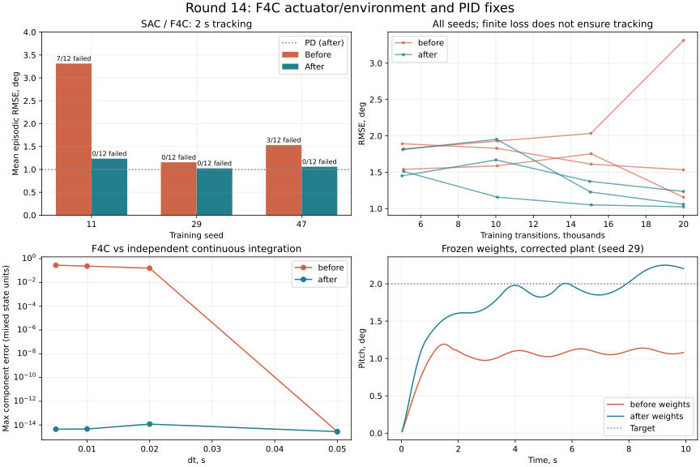

# Проверка физики и обученных политик — проход 14

17 сентября 2026. Ветка `fix/agent-runtime-bugs`. Сравнение со снимком рабочего дерева
до этого прохода; предыдущие изменения сохранены.

## Итог

Исправлены подтверждённые ошибки F4C и условного интегрирования PID.
**3071 тест проходит, покрытие 93.1006%**
(21199 / 22770 строк). Добавлено 55 случаев:
49 падали на исходной версии, 6 подтверждали уже корректные ветви.

В шести обучениях SAC по 20 000 переходов все проверенные loss и итоговые веса конечны.
На исправленной среде итоговая ошибка слежения уменьшилась
**2.000191° → 1.105918° (-44.71%)**, нарушения границ
в оценке — **10/36 → 0/36**. Новые веса на новой среде проходят и 10 секунд: **0/36**.
Это результат конкретного стенда; монотонная или общая сходимость не доказана.

[Полные метрики, траектории, параметры и SHA-256](physics-policy-validation-round14.json).



## Исправления

### Объект F4C

- Первый переход раньше принимал команду как начальное положение руля, обходя скорость привода. Теперь отсчёт идёт от `initial_control` (радианы, по умолчанию 0), в том числе после reset. Пределы остаются ±20° и 60°/с.
- Начальное состояние копируется; проверяются размер/конечность состояния и команды, положительный конечный dt и целый горизонт. Некорректный шаг не продвигает модель.
- `get_output` возвращает все записанные отсчёты до перехода, включая последний. График скорости больше не умножает м/с на коэффициент узлов и не портит исходную историю через общий массив.
- Документация единиц приведена к уравнениям Python: скорости в м/с, q в рад/с, theta в рад. Состояния — отклонения от режима, не абсолютная скорость полёта.

### Среды F4C

- `LinearLongitudinalF4C` ранее индексировал `[u,w,q,theta]` как `[theta,q,alpha,V]`; награда за тангаж фактически использовала u. Теперь tracking выбирается из полного состояния; наблюдения независимо выбираются `output_space`.
- Команды линейной среды по-прежнему в градусах. Размер пространства соответствует наблюдению; фиктивные имена alpha/V не объявляются вычисляемыми состояниями.
- Добавлен согласованный dt; функция задания получает секунды. Поддержаны несколько каналов задания, копирование исходных массивов и truncation по времени.
- Нормализованная среда использует фактическое положение привода после ограничений в наблюдении и штрафах энергии/плавности. Раньше она сообщала агенту запрошенную команду, хотя объект получал другой руль.
- Начальное положение задаётся физическому приводу. Проверки NaN/Inf/размера выполняются до clipping и изменения состояния.
- Ограничение q=10°/с теперь действительно завершает эпизод, как и theta=30°. `_last_reward` согласован с возвращённым штрафом; `info['elevator_deg']` показывает приложенное управление.

### PID

Условное интегрирование раньше запрещало любое изменение интеграла при насыщении.
Например, при integral=5, Ki=1, пределах ±2 и ошибке −1 выход навсегда оставался +2.
Теперь последовательность равна `[2,2,2,1,0]`: разрешено уменьшать насыщение.
Учитывается знак Ki и сторона несимметричной границы. Блокирование усиливающего
насыщение вклада сохранено. Это соответствует смыслу
[условного интегрирования](https://www.mathworks.com/help/simulink/slref/pidcontroller.html).

## Физическая проверка

Матрицы A/B/C/D Python не изменялись. Независимый расчёт использует отдельно записанные
коэффициенты документированной модели и DOP853 (`rtol=1e-12`, `atol=1e-13`), удержание
руля на каждом шаге и собственный дискретный ограничитель. Начальное состояние
`[0.2,-0.1,0.005,0.01]` (м/с, м/с, рад/с, рад); команда +2° до 0.2 с, −2° до 0.4 с,
далее ноль; горизонт 4 с.

| dt, с | Скорость до, °/с | После, °/с | Максимальная ошибка до | После |
|---|---:|---:|---:|---:|
| 0.005 | 400 | 60 | 2.828e-01 | 4.441e-15 |
| 0.01 | 200 | 60 | 2.382e-01 | 4.663e-15 |
| 0.02 | 100 | 60 | 1.588e-01 | 1.199e-14 |
| 0.05 | 60 | 60 | 2.776e-15 | 2.776e-15 |

Ошибка — максимум компонент с разными единицами, показатель численного совпадения.
Нулевой вход до и после совпадает с матричной экспонентой до 7.7e−15.
Полюса сохранены: −0.221789±1.343277i и −0.002585±0.076400i с⁻¹;
`dθ/dt=q` и гравитационный член −9.81 сохранены.

Дополнительный 10-секундный тест PID на F4C, с заранее накопленным интегралом −0.3,
целью +2°, пределом команды ±2° и Kp/Ki/Kd=−0.7/−0.4/−0.25, дал
RMSE 3.141763° → 2.819384°. Максимум тангажа 6.0993° → 5.3157°,
скорости 6.7434°/с → 6.2248°/с. Здесь сравниваются все исправления прохода вместе;
изолированное исправление PID подтверждается отдельным тестом разгрузки интеграла.

### Что не подтверждено физически

[NASA CR-2144](https://ntrs.nasa.gov/citations/19730003312) содержит данные F4C,
однако точное происхождение текущей Python-матрицы и соответствие заявленному режиму
M=0.6 / 35 000 ft в этом проходе не установлены. Старый MATLAB-файл содержит другие
коэффициенты: в частности, гравитацию 32.174 и скоростной член 1469.76 вместо
9.81 и 180. Это разные модели; простой перевод единиц не устраняет все различия.
Коэффициенты не подгонялись. Проверена численная и внутренняя согласованность Python,
не нелинейная динамика или лётные измерения. Пределы среды — настройки стенда,
а не сертифицированные ограничения реального F4C.

## Протокол обучения и качество

SAC без изменений алгоритма, CPU, seed 11/29/47, по 20 000 переходов до и после.
Скрытые слои 64, batch 128, replay 50 000, LR policy/critic=3e−4,
gamma=0.99, tau=0.005, alpha=0.01 без автоматической настройки.
Используются штатные наблюдения/награда `F4CPitchEnvNormalized`, награда умножена на 100;
изменения наблюдений, ограничителя и завершения рассматриваются совместно.
`use_initial_action_on_first_step=False`, dt=0.02, обучение на эпизодах до 2 с.
Случайные цели ±2°, начальные theta ±1°, q ±1°/с; u=w=0.

Оценка детерминированная, 12 комбинаций: цель ±2°, theta −1/0/+1°, q ±1°/с.
Одинаковая внешняя проверка в обеих версиях: нарушение при |theta|>10° или |q|>10°/с.
RMSE усредняется по эпизодам. **При нарушении эпизод останавливается: RMSE такого
эпизода рассчитана лишь до остановки; сравнивать её без числа нарушений нельзя.**
Промежуточные оценки каждые ~5000 шагов сохраняют RNG обучения. Настройки по seed
не подбирались и неудачные запуски не отбрасывались.

| Seed | RMSE до, ° | Нарушения | RMSE после, ° | Нарушения |
|---|---:|---:|---:|---:|
| 11 | 3.312554 | 7/12 | 1.235377 | 0/12 |
| 29 | 1.155651 | 0/12 | 1.023766 | 0/12 |
| 47 | 1.532368 | 3/12 | 1.058611 | 0/12 |

Нулевое управление даёт 2.012650°, выбранный PD после исправлений — 0.995416°,
оба 0/12 нарушений. **SAC после исправления всё ещё уступает этому PD по средней
двухсекундной RMSE**, хотя лучше исходного SAC во всех трёх seed.

Во время исследования среды были нарушения: до — 208/769 эпизодов, после — 11/605.
Численная расходимость не обнаружена: все loss при обновлениях и итоговые параметры
конечны. Максимальный critic loss после достигает 3.90e6 из-за терминального штрафа
−100, умноженного стендом на 100. Конечность такого loss не означает сходимость.
Кривые колеблются; все проверенные промежуточные новые политики дали 0/12 нарушений.

### Сохранённые веса, 10 секунд без дообучения

| Веса | Среда | Средняя RMSE, ° | Нарушения |
|---|---|---:|---:|
| before | before | 1.976783 | 21/36 |
| before | after | 1.929456 | 21/36 |
| after | before | 1.765918 | 23/36 |
| after | after | 0.634354 | 0/36 |

Старые веса на исправленной среде не становятся автоматически качественными:
seed 11/47 нарушали границы и до переноса (суммарно 21/36), seed 29 сохраняет 0/12.
Новые веса при возврате в старую среду дают 23/36 нарушений: одинаковая форма входа
не сохраняет смысл наблюдения положения руля. **Сохранённые политики нужно оценивать
на той версии среды, где они будут применяться.** Новые веса на новой среде дают
0/36 нарушений и среднюю RMSE 0.634354° на горизонте 10 с.

## Контроль других объектов и ограничения

- Контрольная физика quadrotor, B737/B747, X8, Shadow, F16 точно совпала с проходом 13. Прежние неудачные режимы трима не стали успешными.
- Сохранённая SAC-политика Ultrastick seed 11: метрики и траектории полностью совпали; RMSE 0.734389°, 0/12.
- Сохранённая A3C-политика UAV seed 11 на 10 с: полное совпадение, RMSE 1.101366°, 0/12.
- **Регрессия нового обучения A3C из прохода 13 (+14.2% RMSE) не устранена.** Здесь её алгоритм не менялся, повторное обучение A3C не проводилось.
- Три seed, малые начальные возмущения, CPU и горизонты до 10 с не доказывают устойчивость вне стенда или глобальную сходимость.

## Проверки и воспроизводимость

- Итог: 3071 passed, 14 warnings; покрытие 93.1006% (проход 13: 93.0202%). Ray не установлен, исключён `tests/optimization/ray_test.py`.
- 55 новых регрессий: на baseline 49 failed / 6 passed, на текущем коде все проходят.
- Gymnasium `check_env`: четыре конфигурации обеих сред F4C прошли.
- Flake8 30≤30, Ruff 0, Mypy 0; Bandit 82≤114, medium 59≤83, high 0.
- Black/isort: 11 изменённых Python-файлов; `git diff --check` прошёл. MkDocs strict: 54.69 с.
- Изменены три производственных Python-файла; остальные побайтно совпадают со снимком начала прохода.

```bash
PYTHONDONTWRITEBYTECODE=1 OMP_NUM_THREADS=1 MKL_NUM_THREADS=1 MPLBACKEND=Agg \
  .venv/bin/python scripts/validate_f4c_physics.py --repo "$PWD" --output /tmp/f4c-physics.json

PYTHONDONTWRITEBYTECODE=1 OMP_NUM_THREADS=1 MKL_NUM_THREADS=1 MPLBACKEND=Agg \
  .venv/bin/python scripts/validate_f4c_policy.py --repo "$PWD" --seed 11 --output /tmp/f4c-sac.json

PYTHONDONTWRITEBYTECODE=1 OMP_NUM_THREADS=1 MKL_NUM_THREADS=1 MPLBACKEND=Agg \
  .venv/bin/python scripts/validate_f4c_policy.py --repo "$PWD" --seed 11 \
  --checkpoint /tmp/f4c-sac.pt --duration 10 --output /tmp/f4c-sac-long.json
```

Повторить seed 29/47; для baseline передать сохранённую копию пакета в `--repo`.
Веса, исходные логи и снимок пакета находятся в `/tmp/physics-policy-audit-round14`;
это временные артефакты. Метрики, выбранные траектории и контрольные суммы сохранены
в JSON отчёта. Изменения этого прохода не закоммичены.
