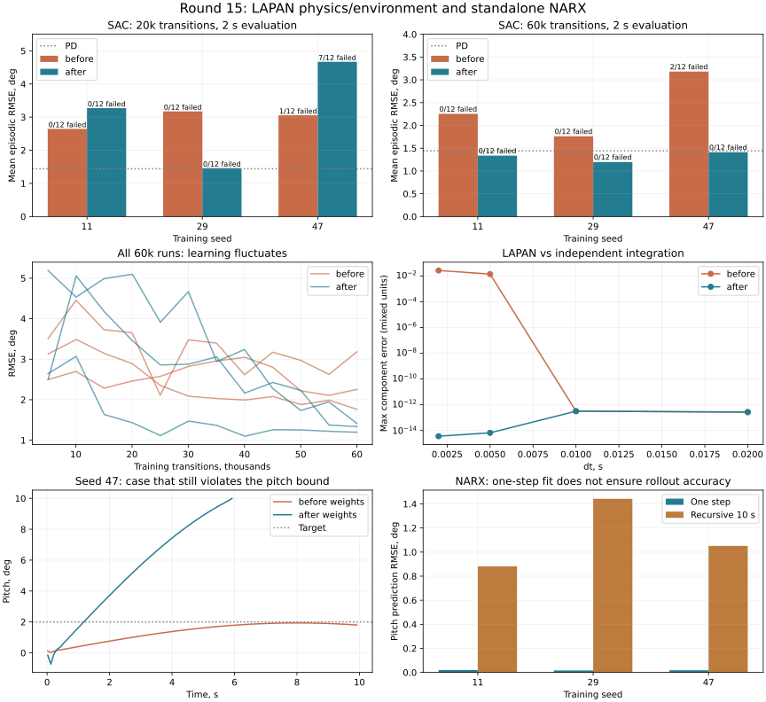

# Проверка физики и обученных моделей — проход 15

17 сентября 2026. Ветка `fix/agent-runtime-bugs`; baseline — снимок рабочего дерева
до этого прохода. Предыдущие исправления сохранены.

## Итог

Исправлены подтверждённые ошибки LAPAN и отдельной сети `agent/narx/model.py`.
**3126 тестов проходят, покрытие 93.2261%**
(21263 / 22808 строк).
55 новых случаев: на исходном коде 51 failed / 4 passed.

Результат обучения зависит от бюджета:

- SAC после 20 000 переходов: **2.957777° → 3.132858°**, изменение +5.92% (хуже), нарушения **1/36 → 7/36**.
- После обнаружения этого ухудшения обе версии дополнительно обучены с нуля по 60 000 переходов, без изменения настроек, для всех трёх seed. Результат **2.399198° → 1.315150°**, изменение -45.18%, нарушения **2/36 → 0/36**.
- Старые и новые результаты сохранены; улучшение при большем бюджете не отменяет короткую регрессию и нарушения во время обучения.
- На горизонте 10 с новые политики нарушили границы в **1/36** эпизодов против **9/36** у исходных. Устойчивость всех итоговых политик не подтверждена.
- NARX обучается пакетами и сохраняет одиночный прогноз с теми же весами. Небольшая ошибка одного шага не предотвращает накопление ошибки на длинной траектории.

[JSON с полными метриками, траекториями и SHA-256](physics-policy-validation-round15.json).



## Что исправлено

### LAPAN: объект и среды

- Скорость руля 300°/с действует с первой команды относительно `initial_control` в радианах (по умолчанию 0), включая reset. Предел самой модели ±40° сохранён.
- Начальное состояние копируется. Проверяются конечность/размер состояния и команды, положительный конечный dt и целый горизонт; некорректная команда не продвигает модель.
- Убрана потеря последнего отсчёта в `get_output`. График скорости сохраняет м/с, больше не умножает данные на коэффициент узлов и не меняет историю через общий массив.
- В линейной среде диапазон действий ±25 теперь действительно означает градусы, преобразуемые в радианы модели. Ранее 1 в этом диапазоне означал 1 радиан, а не 1°.
- Наблюдения выбираются `output_space`, награда — по `tracking_states` из полного состояния, независимо от порядка наблюдений. Поддержаны многоканальное/функциональное задание, dt в секундах, копирование начальных массивов и truncation по горизонту.
- Нормализованная среда использует фактический руль после ограничений в наблюдении и штрафах, сообщает `info['elevator_deg']`. Начальный руль задаёт реальное состояние привода. Проверяются команды до clipping; `_last_reward` учитывает терминальный штраф.
- Масштаб q=5°/с оставлен масштабом наблюдения/награды. Нормализованная среда по-прежнему завершается по тангажу 20°, не по q.

**Совместимость:** старые контроллеры линейной среды требуют проверки масштаба команд.
Нормализованные политики требуют повторной оценки из-за смысла предыдущего действия
и первого перехода. Совпадение форм тензоров не гарантирует поведение прежних весов.

### Отдельная NARX-сеть

`torch.cat(..., 0)` соединял примеры пакета вместо признаков и ломал обычный вход
`(B,input_size)` / `(B,output_size)`. Теперь соединение идёт по последней оси,
включая дополнительные ведущие измерения. Для одного примера результат сохранён.
Это соответствует назначению оси в [torch.cat](https://docs.pytorch.org/docs/stable/generated/torch.cat.html).

В legacy-вызове `train(prediction,target)` теперь проверяется равенство форм до
изменения градиентов/оптимизатора. Ранее `(B,1)` против `(B,)` могло неявно породить
сравнение всех примеров друг с другом. `.train(bool)` и `.eval()` работают как раньше.
Регрессии проверяют значения, все градиенты, реальный шаг Adam, сохранение/загрузку
и продолжение обучения. Архитектура и размер весов не изменялись.
Это отдельная сеть; реализации A2C-NARX и MPC-NARX здесь не менялись.

## Физическая проверка

Матрицы A/B совпали с опубликованными на странице 86
[Septiyana et al., 2020](https://ejournal.brin.go.id/ijoa/article/download/12529/9853).
Авторы рассматривают режим 30 м/с, 1000 ft. Матрицы A/B/C/D в коде не менялись.
Рассчитанные полюса −11.317169±22.331626i и −0.000888825±0.198399i с⁻¹
согласуются с таблицей 3-4 с точностью округления. Ранг управляемости 4.
Сохранены `dθ/dt=q` и гравитационный коэффициент −9.81 м/с².

Независимые коэффициенты в валидаторе интегрируются DOP853 с `rtol=1e−12`,
`atol=1e−13`, собственным дискретным ограничителем и удержанием руля на шаге.
Начальное состояние `[0.2,-0.1,0.005,0.01]` (м/с, м/с, рад/с, рад),
команда +2° первые 0.2 с, −2° следующие 0.2 с, затем ноль до 4 с.

| dt, с | Скорость до, °/с | После, °/с | Максимальная ошибка до | После |
|---|---:|---:|---:|---:|
| 0.002 | 1000 | 300 | 2.673e-02 | 3.643e-15 |
| 0.005 | 400 | 300 | 1.391e-02 | 6.689e-15 |
| 0.01 | 300 | 300 | 3.204e-13 | 3.204e-13 |
| 0.02 | 200 | 200 | 2.710e-13 | 2.710e-13 |

Максимум компонент ошибки имеет смешанные единицы; это численное сравнение,
не метрическая оценка реального самолёта. При более крупном dt команда уже
укладывалась в ограничение, поэтому эти траектории не изменились. Нулевой вход
до/после совпал с матричной экспонентой до 7.3e−15. В тесте тангаж оставался ниже
1.18°, скорость — ниже 18.7°/с. Пределы привода — настройки реализации, не
независимо подтверждённые пределы реального аппарата. Нелинейные/лётные данные
не проверялись; устойчивые полюса линейной модели не гарантируют замкнутую систему.

## SAC: качество и устойчивость

Всего 12 запусков, 480 000 переходов: по три seed 11/29/47 до/после для каждого
бюджета 20k и 60k. Алгоритм SAC не менялся. CPU, hidden=64, batch=128,
replay=50 000, policy/critic LR=3e−4, gamma=.99, tau=.005, alpha=.01 фиксированная.
Наблюдения/награда штатной `ImprovedLAPANEnv`, награда умножена на 100;
`use_initial_action_on_first_step=False`, dt=.02, эпизоды до 2 с.

Цели случайны в ±2°, начальный тангаж ±1°, q ±1°/с, u=w=0.
Оценка детерминированная: 12 сочетаний целей ±2°, theta −1/0/+1°, q ±1°/с.
В обеих версиях одна внешняя граница: |theta|>10° либо |q|>60°/с.
При нарушении эпизод прекращается; **RMSE такого эпизода относится только к префиксу
до остановки и должна рассматриваться вместе с числом нарушений**.
Оценки каждые ~5000 шагов сохраняют RNG обучения. Параметры по seed не подбирались.

| Бюджет | Seed | RMSE до, ° | Нарушения | RMSE после, ° | Нарушения |
|---|---:|---:|---:|---:|---:|
| 20k | 11 | 2.645793 | 0/12 | 3.271385 | 0/12 |
| 20k | 29 | 3.172658 | 0/12 | 1.459237 | 0/12 |
| 20k | 47 | 3.054880 | 1/12 | 4.667951 | 7/12 |
| 60k | 11 | 2.254229 | 0/12 | 1.336230 | 0/12 |
| 60k | 29 | 1.762143 | 0/12 | 1.197033 | 0/12 |
| 60k | 47 | 3.181224 | 2/12 | 1.412188 | 0/12 |

Нулевое управление: 2.000120°, выбранный фиксированный PD: 1.441529°, оба 0/12.
После 60k каждый новый seed точнее этого PD на двухсекундном тесте. После 20k
средний результат был хуже исходной версии; промежуточные политики также нарушали
границы. Это не монотонное улучшение и не доказанная общая сходимость.

Все loss при обновлениях и итоговые веса конечны. Максимальный critic loss
по расширенным запускам порядка 6.3e4 до / 4.2e4 после; это не основание считать
обучение физически безопасным. В 60k-запусках исследование среды дало
**110/1871 нарушений эпизодов до и 211/1859 после**, в том числе 168 у нового seed 47.
Качество итогового контроллера улучшилось, но нарушения в процессе обучения не
устранены. Награда, наблюдение и привод сравниваются совместно.

### Сохранённые веса после 60k, оценка 10 секунд

| Веса | Версия среды | Средняя RMSE, ° | Нарушения |
|---|---|---:|---:|
| before | before | 3.517100 | 9/36 |
| before | after | 2.624195 | 7/36 |
| after | before | 4.597383 | 25/36 |
| after | after | 2.114669 | 1/36 |

Оставшийся сбой новой политики: seed 47, цель +2°, начальные theta=0°, q=−1°/с.
Примерно через 5.9 с тангаж превышает границу 10°. Этот случай показан на графике.

Результаты переноса отличаются от оценки на своей среде. Никакого дообучения
при переносе не было. Эти проверки ограничены выбранными начальными условиями
и горизонтом; стабильность за их пределами не установлена.

## NARX: обучение динамике и накопление ошибки

Это идентификация объекта, **не обучение управляющей политики**. 10 000 независимых
пар для обучения и 2000 для проверки; нормированные состояния равномерны в ±1
с масштабами `[0.5 м/с, 0.1 м/с, 2°/с, 2°]`, управление ±0.5°.
Цели вычислены из опубликованных A/B, dt=.02. NARX(1,32,4), Adam=.01,
1000 обновлений, batch=128, seed 11/29/47. Все loss и веса конечны.

Старая сеть не выполняет пакетный forward. Поэтому для seed 11 выполнен отдельный
эталон обучения: stack независимых одиночных вызовов, те же данные/веса/пакеты.
Его ошибка одного шага 0.019701791° против 0.019701795° у исправленной сети;
различия соответствуют вычислениям float32. Это обход дефекта для сравнения,
а не успешный старый пакетный API.

Свободный прогноз без истинного состояния: 10 с, руль 0.2°·sin(2π·0.4·t),
начальный тангаж −1/0/+1°, остальные состояния ноль.

| Seed | RMSE theta одного шага, ° | Средняя RMSE свободного прогноза 10 с, ° | Макс. ошибка theta, ° |
|---|---:|---:|---:|
| 11 | 0.019702 | 0.881340 | 1.579815 |
| 29 | 0.016540 | 1.442577 | 2.395806 |
| 47 | 0.018138 | 1.051421 | 2.106110 |

**Модель накапливает заметную ошибку и не подтверждена для длинного горизонта
управления.** Повторная загрузка тех же весов в старый одиночный forward даёт
побайтно идентичные свободные траектории во всех трёх seed: исправление оси не
вызвало этот дрейф. Точность одного шага не заменяет рекурсивную валидацию.

## Контроль и воспроизводимость

- Контрольная физика quadrotor, B737/B747, X8, Shadow и F16 полностью совпала с проходом 14. Прежние неудачные режимы трима не стали успешными.
- Сохранённая SAC/F4C seed 11: метрики и траектории совпали, RMSE 1.235377°, 0/12.
- Сохранённая A3C/UAV seed 11, 10 с: полное совпадение, RMSE 1.101366°, 0/12.
- **Регрессия нового обучения A3C из прохода 13 (+14.2%) остаётся открытой.** Здесь A3C не переобучался и не менялся.
- 3126 passed, 14 warnings, 123.15 с; покрытие 93.2261% против 93.1006% в проходе 14. Ray не установлен, исключён `tests/optimization/ray_test.py`.
- Gymnasium `check_env` прошёл для четырёх конфигураций LAPAN. Flake8 30≤30, Ruff 0, Mypy 0; Bandit 82≤114, medium 59≤83, high 0.
- Black/isort: 10 Python-файлов; `git diff --check` пройден. MkDocs strict собран за 57.06 с.
- Изменены три производственных Python-файла; остальные побайтно совпадают со снимком начала прохода.

```bash
PYTHONDONTWRITEBYTECODE=1 OMP_NUM_THREADS=1 MKL_NUM_THREADS=1 MPLBACKEND=Agg \
  .venv/bin/python scripts/validate_lapan_physics.py --repo "$PWD" --output /tmp/lapan-physics.json

PYTHONDONTWRITEBYTECODE=1 OMP_NUM_THREADS=1 MKL_NUM_THREADS=1 MPLBACKEND=Agg \
  .venv/bin/python scripts/validate_lapan_policy.py --repo "$PWD" --seed 11 \
  --frames 60000 --output /tmp/lapan-sac.json

PYTHONDONTWRITEBYTECODE=1 OMP_NUM_THREADS=1 MKL_NUM_THREADS=1 MPLBACKEND=Agg \
  .venv/bin/python scripts/validate_lapan_policy.py --repo "$PWD" --seed 11 \
  --checkpoint /tmp/lapan-sac.pt --duration 10 --output /tmp/lapan-sac-long.json

PYTHONDONTWRITEBYTECODE=1 OMP_NUM_THREADS=1 MKL_NUM_THREADS=1 \
  .venv/bin/python scripts/validate_narx_lapan.py --repo "$PWD" --seed 11 --output /tmp/lapan-narx.json
```

Повторить seed 29/47. Для исходной версии передать baseline в `--repo`;
NARX до исправления требует `--scalar-reference` для эталонного обучения.
Снимок, веса и исходные логи — `/tmp/physics-policy-audit-round15` (временные файлы).
Метрики, выбранные траектории и хеши сохранены в JSON отчёта. Изменения не закоммичены.
