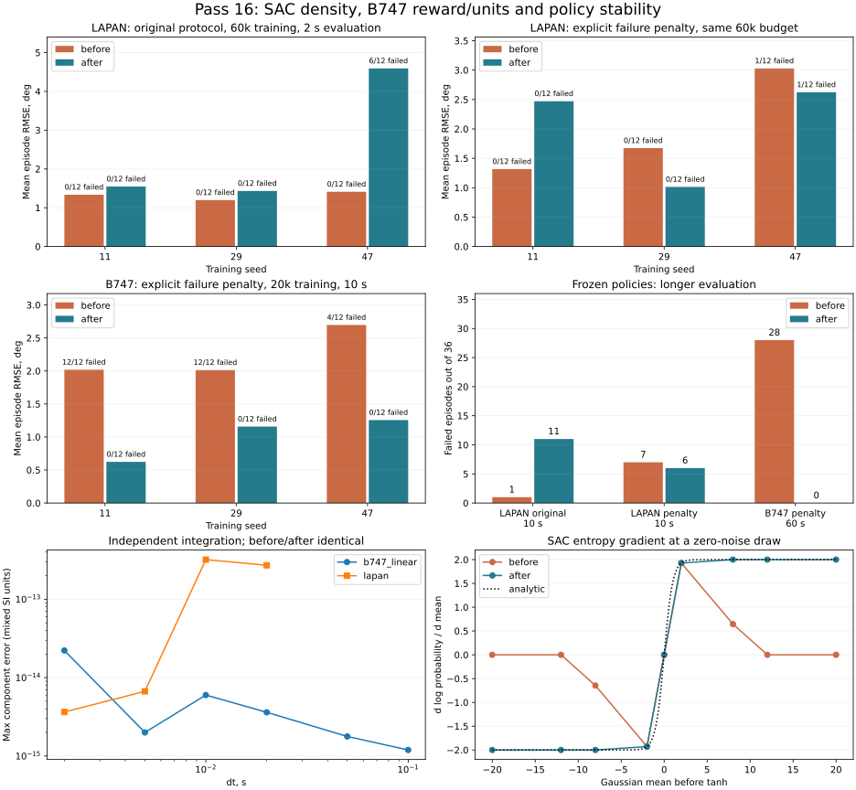

# Проверка физики и обученных политик — проход 16

17 сентября 2026. Ветка `fix/agent-runtime-bugs`. Baseline — снимок рабочего дерева
перед проходом (`/tmp/physics-policy-audit-round16/before`), включая исправления
проходов 1–15; это не чистый Git HEAD. Существующие изменения сохранены.

## Итог

Исправлены подтверждённые ошибки SAC и линейных модели/среды B747.
**3164 теста проходят, покрытие 93.2559%**
(21281 / 22820 строк).
Все 38 новых регрессионных случаев падали до исправлений и проходят после них.

- B747, одинаковый SAC и явный штраф за внешнюю границу, 20k переходов обучения:
  **2.243102° → 1.012398°; нарушения 28/36 → 0/36** на 10 с.
- Те же веса B747 на 60 с: **2.242056° → 0.960656°; нарушения 28/36 → 0/36**.
- **SAC/LAPAN: универсального улучшения нет.** При исходном протоколе 60k:
  1.315150° → 2.523479°; нарушения 0/36 → 6/36; результат хуже.
- С одинаковым явным штрафом: 2.005904° → 2.035914°; нарушения 1/36 → 1/36 на 2 с;
  3.060023° → 3.648157°; нарушения 7/36 → 6/36 на 10 с. Остались неустойчивые политики.
- Конечность loss и весов подтверждена в 22 новых запусках (840 000 переходов),
  но это не доказательство сходимости или физической безопасности обучения.

**Исправления нельзя представлять как отсутствие регрессий качества всех политик.**
Математическая ошибка SAC устранена; прежние настройки обучения LAPAN после
изменения требуют дальнейшей работы. NARX и A3C не изменялись: ранее обнаруженные
рекурсивный дрейф NARX и ухудшение обучения A3C остаются открытыми.

[JSON: все метрики, траектории и SHA-256](physics-policy-validation-round16.json).



## Исправления

### SAC: плотность ограниченной гауссовой политики

Для действия `a = bias + scale * tanh(z)` прежний код вычислял
`log(scale * (1 - tanh(z)**2) + 1e-6)`. При больших |z| float32 округляет tanh до
±1: градиент энтропии исчезает. Добавленная константа также искажает зависимость
плотности от физических единиц действия.

Теперь логарифм Якобиана вычисляется по `z` через устойчивую формулу с softplus;
`log(scale)` учитывается отдельно. Это соответствует
[TanhTransform в PyTorch](https://github.com/pytorch/pytorch/blob/main/torch/distributions/transforms.py)
и преобразованию плотности в [SAC](https://arxiv.org/abs/1801.01290).
Для z=20 и нулевого нормального шума производная log probability по среднему
должна быть около 2: раньше она была 0, теперь 2. Реальный Adam в новом тесте
выходит из начального насыщения ±12. Проверены float32/float64, отрицательное и
положительное насыщение, несколько действий и масштабы 1e−7, 1 и 25.
Нулевые/бесконечные интервалы действий отклоняются до обучения.

Архитектура, имена/формы параметров и детерминированный вывод не менялись.
Старые три политики LAPAN точно воспроизводят все прежние траектории на 2 и 10 с.
Случайные действия при одинаковых весах формируются прежним преобразованием;
log probability и следующие обновления весов меняются. Продолжение обучения
старого checkpoint поэтому не обязано повторять старый процесс оптимизации.

### Линейная среда B747

- Награда теперь сравнивает задание с `tracking_states` полного состояния в СИ,
  независимо от состава/порядка наблюдений. Раньше использовались все наблюдаемые
  состояния в градусах, хотя примеры передают задание в радианах. При цели 5°
  оптимизировалась величина около 0.087 градуса, а к тангажу добавлялся лишний q.
- Угловые наблюдения остаются в градусах/градусах в секунду; действия — в градусах.
  Начальные состояния, задание и состояния в callback награды — СИ.
- Размер Box соответствует `output_space`; многоканальное задание следует
  `tracking_states`. Один канал относится к первому отслеживаемому состоянию.
- По окончании массива задания удерживается его последний отсчёт. Прежний код
  разворачивал временную ось в вектор и менял смысл ошибки.
- Лимит времени выставляет `truncated=True`, а не `terminated=True`, согласно
  [Gymnasium](https://gymnasium.farama.org/tutorials/gymnasium_basics/handling_time_limits/).
  Это сохраняет bootstrap оценки будущей награды.
- Начальные массивы копируются. Неверные команды, состояния, dt и размеры истории
  отклоняются; неверная команда не меняет состояние и счётчики. Полная история
  вызывает понятную ошибку до изменения модели.
- Убрано дублирование преобразования наблюдений. В документации исправлена
  напечатанная матрица, чтобы она соответствовала существующему коду.

**Совместимость:** масштаб награды, её набор состояний и callback изменились.
Обработчики callback, ожидавшие полный вектор наблюдения в градусах, требуют
адаптации. Уравнения и пределы привода не менялись; готовые контроллеры сохраняют
траектории при тех же командах, но обучение на прежней ошибочной награде не
считается проверенным для корректного задания.

## Физическая проверка

В `aerospacemodel` изменена только валидация/копирование состояния линейного B747.
Матрицы A/B/C/D и расчёт перехода не менялись. Независимый DOP853 интегрирует
зафиксированные коэффициенты с `rtol=1e−12`, `atol=1e−13`, отдельным ограничителем
руля и удержанием входа на шаге. Начальное состояние `[0.2,-0.1,0.005,0.01]` в СИ;
команда +2° до 0.2 с, −2° до 0.4 с, далее ноль до 4 с.

Для B747 проверены dt=0.002/0.005/0.01/0.02/0.05/0.1 с. Максимальное расхождение
с независимым интегратором — 2.220e-14.
Предел положения ±25° и скорости 60°/с сохранён, включая первый шаг. Проверены
нулевой вход против exp(A·t), кинематика dθ/dt=q и гравитационный член −9.81.
Полюса модели приблизительно −0.371665±0.891971i и −0.003335±0.067416i с⁻¹.

LAPAN повторно проверен прежним валидатором, максимум ошибки
3.204e-13.
Все метрики и отсчёты обеих моделей **точно совпали до/после**. Контрольные
проверки нелинейных моделей из `validate_physics.py` также точно воспроизвели
проход 15; это утверждение о неизменности, а не об успешном trim всех режимов.

Ошибки компонент приведены в смешанных единицах СИ. Это численная проверка
реализации линейных уравнений, **не подтверждение соответствия реальному полёту**.
Для B747 коэффициенты зафиксированы из исходной реализации; их независимая
идентификация по лётным данным здесь не выполнена. Полюса линейного объекта
не доказывают устойчивость нелинейного замкнутого контура с обученной политикой.

## Эксперименты обучения

Везде seed 11/29/47, CPU, SAC hidden=64, batch=128, replay=50 000, LR actor/critic
3e−4, gamma=.99, tau=.005, фиксированная alpha=.01. Родной reward умножается на 100.
Никакой seed не исключался. Финальная политика берётся по фиксированному бюджету,
а не выбирается по лучшему контрольному результату. Состояния RNG сохраняются
при промежуточной оценке. Все loss проверены на каждом update, итоговые параметры
actor/critic/target — на конечность. Подбор параметров отдельно под seed не делался.

Цели ±2°, начальные theta −1/0/+1°, q ±1°/с, u=w=0: 12 сочетаний для оценки.
При обучении эти три величины равномерно случайны в тех же диапазонах.

**Важное ограничение метрики:** эпизод останавливается при нарушении границы.
RMSE такого эпизода измеряет только префикс до остановки. Её нельзя трактовать
как ошибку за полный горизонт и сравнивать без числа нарушений.

### Найденный недостаток прежнего проверочного протокола

Внешнее прекращение при нарушении огибающей помечалось как истинное terminal,
но не имело отдельного штрафа. При отрицательной по шагам награде раннее
завершение иногда выгоднее длительного полёта. Это возможный стимул для агента,
а не доказанная единственная причина каждого сбоя.

Исходные результаты сохранены. Добавлен явный параметр `--failure-penalty`:
при выходе за внешнюю границу применяется `min(native_reward, -penalty)` до
умножения на 100. Значение по умолчанию 0 воспроизводит прежний протокол;
дополнительное сравнение использует **100 для обеих версий**. Таким образом,
при нарушении reward не выше −10 000 после масштабирования.
Это свойство проверочного сценария, не изменение штатных наград LAPAN/B747.
Штраф не гарантирует безопасности и сам по себе не является доказательством
улучшения алгоритма. Результаты двух протоколов показаны раздельно.

### LAPAN: сравнение формулы SAC на неизменной среде

dt=.02 с, эпизоды обучения до 2 с, штатные четыре наблюдения ImprovedLAPANEnv,
нормированное действие ±1, первая команда не переопределяется.
Внешние границы: |theta|>10° или |q|>60°/с.
Бюджет 60 000 переходов на каждый запуск.

Исходный протокол (без дополнительного штрафа):

| Seed | RMSE до, ° | Нарушения | RMSE после, ° | Нарушения |
|---|---:|---:|---:|---:|
| 11 | 1.336230 | 0/12 | 1.546224 | 0/12 |
| 29 | 1.197033 | 0/12 | 1.432794 | 0/12 |
| 47 | 1.412188 | 0/12 | 4.591419 | 6/12 |

10 с с теми же весами: **2.114669° → 3.083903°; нарушения 1/36 → 11/36**.
Это регрессия качества, несмотря на исправленную формулу.
Исходные seed 29/47 повторно использованы из прохода 15; seed 11 переобучен
и **точно воспроизвёл** прежнюю кривую обучения и итоговые траектории.

Повтор с одинаковым штрафом за внешнюю границу:

| Seed | RMSE до, ° | Нарушения | RMSE после, ° | Нарушения |
|---|---:|---:|---:|---:|
| 11 | 1.316315 | 0/12 | 2.470767 | 0/12 |
| 29 | 1.672895 | 0/12 | 1.013993 | 0/12 |
| 47 | 3.028501 | 1/12 | 2.622981 | 1/12 |

10 с: **3.060023° → 3.648157°; нарушения 7/36 → 6/36**.
Обучение со штрафом: нарушения/эпизоды before: 101/1838; after: 59/1831.
Ни исходный, ни исправленный SAC не подтверждают общую сходимость на этих
настройках. У seed 47 остаются нарушения. Численная корректность плотности
не отменяет необходимости доработать постановку/настройки обучения LAPAN.

### B747: сравнение среды при одном и том же SAC

В обеих группах используется исправленный SAC из текущего дерева и одна
физическая модель. Меняется только файл среды через `--env-source`.
Это отделяет исправления награды/окончания эпизода от формулы SAC.
Нормализующий адаптер предоставляет `[error/20°, q/5°/s, theta/20°, applied_elevator/25°]`
с clipping в ±1 и масштабирует действие ±1 в ±25°. Задание остаётся в радианах.
Это явно заданный адаптер для эксперимента, не новое штатное API среды.

dt=.05 с, обучение 20 000 переходов, эпизоды до 10 с.
Внешние границы |theta|>10°, |q|>5°/с, одинаковы в обеих группах.
При исходном протоколе без штрафа: 2.018798° → 1.824213°; нарушения 36/36 → 34/36.
Небольшая RMSE аварийных коротких эпизодов не свидетельствует о хорошем слежении.

С явным одинаковым штрафом:

| Seed | RMSE до, ° | Нарушения | RMSE после, ° | Нарушения |
|---|---:|---:|---:|---:|
| 11 | 2.018798 | 12/12 | 0.623257 | 0/12 |
| 29 | 2.013226 | 12/12 | 1.157323 | 0/12 |
| 47 | 2.697283 | 4/12 | 1.256613 | 0/12 |

Нарушения во время обучения: before: 4125/4252; after: 35/325.
Фиксированный PD на 10 с: RMSE 0.579252°,
0/12 нарушений. Нулевой вход: 2.016854°,
0/12. Исправленные обученные политики не превосходят этот PD во всех seed.

Готовые веса без дообучения на горизонте **60 с**:

| Seed | RMSE до, ° | Нарушения | RMSE после, ° | Нарушения |
|---|---:|---:|---:|---:|
| 11 | 2.018798 | 12/12 | 0.450000 | 0/12 |
| 29 | 2.013226 | 12/12 | 1.134623 | 0/12 |
| 47 | 2.694145 | 4/12 | 1.297346 | 0/12 |

Итого 2.242056° → 0.960656°; нарушения 28/36 → 0/36. Для исправленной среды все эпизоды здесь
прошли полный горизонт. Это подтверждение на 36 выбранных сценариях линейной
модели; другие режимы, возмущения, нелинейная модель и реальный полёт не проверены.

## Автоматические проверки

- 3164 passed, 14 warnings; tests/optimization/ray_test.py исключён, Ray отсутствует.
- 38 новых регрессий: 12 SAC + 26 B747; все воспроизведены на исходной реализации.
- Покрытие 93.2559% против 93.2261% в проходе 15.
- Flake8 30 ≤ 30, Ruff 0, Mypy 0; Bandit 82 ≤ 114, medium 59 ≤ 83, high 0.
- Black/isort и git diff --check проходят. MkDocs --strict собран.
- Gymnasium check_env: четыре сочетания output_space/tracking_states проходят.
  Предупреждение о ненормированном legacy action Box ожидаемо: команды в градусах.

## Воспроизведение

Переменные окружения: `PYTHONDONTWRITEBYTECODE=1 OMP_NUM_THREADS=1 MKL_NUM_THREADS=1
MPLBACKEND=Agg WANDB_MODE=offline HF_HUB_OFFLINE=1`. Запускать из корня репозитория.
Подставить нужный seed 11/29/47 и **разные имена выходных файлов**.

```bash
.venv/bin/python scripts/validate_lapan_policy.py --repo . --seed 11 --frames 60000 --output /tmp/lapan-after.json
.venv/bin/python scripts/validate_lapan_policy.py --repo . --seed 11 --frames 60000 --failure-penalty 100 --output /tmp/lapan-after-penalty.json
.venv/bin/python scripts/validate_lapan_policy.py --repo . --seed 11 --checkpoint /tmp/lapan-after-penalty.pt --duration 10 --failure-penalty 100 --output /tmp/lapan-after-10s.json
.venv/bin/python scripts/validate_b747_linear_policy.py --repo . --env-source tensoraerospace/envs/b747.py --seed 11 --frames 20000 --failure-penalty 100 --output /tmp/b747-after.json
.venv/bin/python scripts/validate_b747_linear_policy.py --repo . --env-source tensoraerospace/envs/b747.py --seed 11 --checkpoint /tmp/b747-after.pt --duration 60 --failure-penalty 100 --output /tmp/b747-after-60s.json
.venv/bin/python scripts/validate_b747_linear_physics.py --repo . --output /tmp/b747-physics.json
.venv/bin/python scripts/validate_lapan_physics.py --repo . --output /tmp/lapan-physics.json
```

Для старого SAC заменить `--repo` на `/tmp/physics-policy-audit-round16/before`.
Для сравнения B747 оставить `--repo .` и заменить только `--env-source` на
`/tmp/physics-policy-audit-round16/before/tensoraerospace/envs/b747.py`.
Веса, полные логи и снимок находятся в `/tmp/physics-policy-audit-round16`;
JSON отчёта содержит метрики/траектории и хеши, включая использованные артефакты
прохода 15. Первые запуски B747 предшествовали извлечению общего преобразователя
наблюдений; их исходник сохранён как `b747-source-training.py`. Сохранённые веса
повторно воспроизвели траектории на окончательной реализации.
