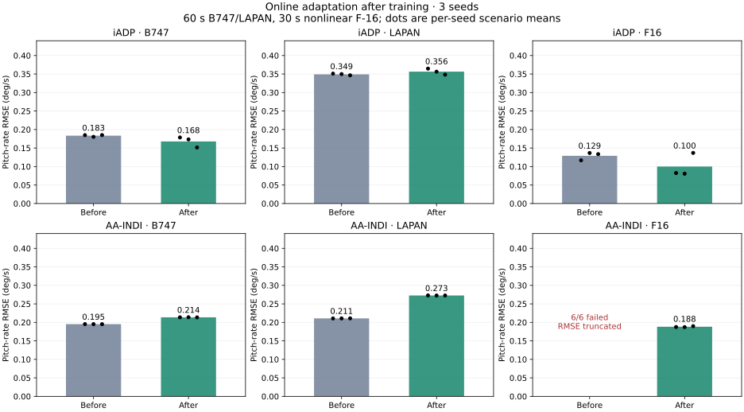

# Проверка адаптивного управления — проход 17

Дата: 2026-09-17. Ветка: `fix/agent-runtime-bugs`. Сравнение с копией рабочего дерева **до этого прохода**, а не с `origin/develop`; предыдущие исправления сохранены.

## Вывод

Исправлены согласование измерений и управления в iADP/AA-INDI, ограничения начального возбуждения и продолжение адаптации после загрузки. Исправленные агенты прошли **120/120 основных проверочных эпизодов** на B747, LAPAN и нелинейном F-16 без NaN/Inf и без выхода за заданные пределы состояния. Все 18 основных запусков обучения после исправлений завершились; до исправлений три запуска AA-INDI/F-16 остановились через 1,16–1,34 с.

На F-16 результат улучшился, но **на линейных объектах нет общего улучшения точности**. При прежних настройках AA-INDI ухудшил слежение на B747 и LAPAN, а продолжающееся обучение iADP на LAPAN хуже замороженной политики. Эти регрессии остаются открытыми. Конечность матриц и отсутствие выхода за границы не доказывают сходимость или лётную пригодность.



## Исправления

1. **iADP: начальное возбуждение обходило ограничение скорости.** Теперь возбуждение и политика используют одинаковые ограничения амплитуды и скорости `u_rate_limit * dt`.
2. **iADP: выдуманное первое приращение состояния.** После reset RLS ждёт два реальных перехода. Первый абсолютный переход остаётся в окне обучения функции ценности.
3. **Оба агента: команда считалась фактическим входом.** Добавлен необязательный `learn(..., applied_action=...)`; он используется для идентификации и следующего управления, у iADP также для стоимости. NaN/Inf и неверный размер отклоняются до изменения обучаемого состояния. Без аргумента сохраняется предположение о точном выполнении команды.
4. **AA-INDI: терялось первое измеренное ускорение.** Дифференциатор получает начальное измерение при первом `predict`; дальше он обновляется только в `learn`.
5. **AA-INDI: разные задержки в идентификаторе и законе управления.** Фактический вход проходит тот же НЧ-фильтр, что и ускорение. RLS использует согласованные приращения, а INDI — отфильтрованный базовый вход. Ограничение скорости отсчитывается от фактического входа.
6. **AA-INDI: PI-ошибка игнорировала поправку измерения.** Теперь она использует скорректированную угловую скорость.
7. **AA-INDI: checkpoint не сохранял всю историю переходов.** Сохраняются фильтр входа, предыдущие измерения и ожидающая команда. Продолжение с новыми checkpoint проверено с точным совпадением RLS. Старый checkpoint отдельно загружен и прошёл 100 переходов после reset; точное продолжение старого эпизода не обещается из-за отсутствующей истории.
8. **Среды B747/LAPAN:** `info["applied_action"]` возвращает фактическое отклонение руля после ограничений, в градусах. Контракт добавлен в `LinearLongitudinalB747` и `LinearLongitudinalLAPAN`, не во все среды библиотеки.

Для согласования задержек использован принцип одинаковой фильтрации ускорения и положения руля из [Smit, Pollack, van Kampen, 2022, стр. 9](https://repository.tudelft.nl/file/File_ecfb7bdb-4f5a-4e1f-9f7a-33a736f1c281). Инкрементальная постановка iADP сверена с [Konatala et al., 2024, уравнения 9–11](https://research.tudelft.nl/files/173498220/konatala_et_al_2024_flight_testing_reinforcement_learning_based_online_adaptive_flight_control_laws_on_cs_25_class.pdf). Это не воспроизведение всех подсистем опубликованных лётных контроллеров.

В документации исправлены завышенные утверждения об отказоустойчивости и наблюдаемости смещения датчика. `BiasEstimator` — сглаживание невязки, а не полноценный OTSEKF-HOSM. Постоянная добавка к единственному измеряемому сигналу сокращается в его разностях; независимого источника для её оценки здесь нет. В экспериментах эта эвристика отключена.

## Протокол

- **36 основных запусков обучения:** 2 версии × 2 агента × 3 объекта × seeds `11, 29, 47`. Дополнительно 2 запуска F-16 с `dt=0,01` вместо `0,02`. Всего **706,413 переходов** в учтённых опытах обучения/управления. Предварительные прогоны в это число не входят.
- B747/LAPAN: 30 с обучения, затем 8 эпизодов по 60 с: номинал, потеря 50% матрицы входа B с 15-й секунды, постоянная добавка к команде с 20-й секунды, шум измерения σ=0,005°/с. Каждый сценарий проверен с фиксированными и обновляемыми параметрами.
- F-16: 20 с обучения, затем 4 эпизода по 30 с: номинал и ослабление команды относительно трима на 50% с 15-й секунды, с фиксированными/обновляемыми параметрами. Ослабление команды — модель неисправности управления, **не повреждение аэродинамической поверхности**.
- Задание угловой скорости: сумма синусов 0,5°/с при 0,12 Гц и 0,15°/с при 0,31 Гц. Фаза второго синуса 0,2 на обучении и 0,7 при проверке. Это ограниченная проверка переноса, а не независимая широкая выборка манёвров.
- Начальная оценка G изменяется на ±20% по seed; iADP получает начальную P из дисконтированного DARE. Алгоритмы не обучаются с нуля без априорной информации. Полные настройки сохранены в JSON. НЧ-фильтр AA-INDI — 2 Гц.
- У F-16 сохранены нелинейные аэродинамические таблицы и сервопривод. Обратная связь — среднее начального/конечного положения руля за переход минус трим. Это трапецеидальная **аппроксимация** эффективного входа, не точное описание непрерывной динамики. Старая версия использует прежний API без обратной связи.
- Датчик выдаёт одну согласованную последовательность измерений: `learn(x[k+1])` и следующий `predict(x[k+1])` получают один и тот же шумовой отсчёт. В первоначальном вспомогательном прогоне это было нарушено; все 24 линейных запуска повторены с исправленным протоколом. В таблицах только повторные результаты.
- Для фиксированных политик продолжают обновляться история и фильтры; параметры RLS/ковариация/P восстанавливаются после `learn`. Поэтому оценка проверяет фиксированные параметры при корректной обработке измерений.
- Внешний останов: `|q| > 10°/с`; дополнительно `|theta| > 15°` для линейных моделей или `|alpha-alpha_trim| > 10°` для F-16. Отказы считаются независимо от reward среды. Учитываются все seeds, включая неудачное обучение.

## Качество управления

RMSE — среднее по эпизодам, °/с; меньше лучше. Сценарии усредняются с равным весом. «Фиксированные» параметры получены отдельным обучением соответствующей версии. Это не сравнение двух версий с одним старым checkpoint.

| Агент | Объект | RMSE с адаптацией, до → после | RMSE фиксированной политики, до → после | Выход за границы с адаптацией |
| --- | --- | --- | --- | --- |
| iadp | B747 | 0.18337 → 0.16780 | 0.05755 → 0.06807 | 0/12 → 0/12 |
| iadp | LAPAN | 0.34921 → 0.35648 | 0.15886 → 0.14838 | 0/12 → 0/12 |
| iadp | F16 | 0.12898 → 0.10001 | 0.16168 → 0.10007 | 0/6 → 0/6 |
| aaindi | B747 | 0.19519 → 0.21367 | 0.19576 → 0.20428 | 0/12 → 0/12 |
| aaindi | LAPAN | 0.21075 → 0.27266 | 0.20992 → 0.28982 | 0/12 → 0/12 |
| aaindi | F16 | неполные эпизоды → 0.18815 | неполные эпизоды → 0.19164 | 6/6 → 0/6 |

- **AA-INDI/F-16:** до исправления обучение сорвалось во всех трёх seeds; оценивались сохранённые префиксы такого обучения. Затем 10/12 проверок вышли за границы, включая 6/6 с адаптацией. После исправления обучение и все 12 проверок завершены. Усреднять RMSE коротких аварийных префиксов с полными эпизодами как равноценные нельзя, поэтому в таблице нет такого сравнения.
- **iADP/F-16:** RMSE с адаптацией 0,12898 → 0,10001°/с, снижение около 22,5%. Выходов за границы нет в обеих версиях.
- **Линейные модели:** iADP/B747 улучшился с адаптацией, но ухудшился с фиксированными параметрами. AA-INDI/LAPAN ухудшился примерно на 29%; AA-INDI/B747 — примерно на 9,5%. iADP/LAPAN с адаптацией немного ухудшился и заметно уступает собственной фиксированной политике. Улучшение корректности идентификатора не заменяет настройку всего замкнутого контура.
- Во всех основных опытах после исправлений матрицы конечны, минимальные собственные значения ковариаций положительны, оценка скалярной эффективности не меняла физический знак. Проверенный горизонт ограничен 60/30 с; поведение при длительном недостаточном возбуждении не установлено.
- **Чувствительность к dt:** на F-16/seed 11 все дополнительные 8 проверок при 0,01 с завершены. У AA-INDI RMSE с адаптацией близок к 0,02 с; у iADP он вырос примерно с 0,0825 до 0,2121°/с. Это отдельный риск настройки частоты обучения; число шагов окна и периодов обучения не переводилось в секунды. Такой опыт не является чистым тестом сходимости интегратора.

## Физика и интерфейсы сред

- Все **145 Python-файлов `aerospacemodel`** совпадают с началом прохода байт-в-байт.
- Фиксированные команды через **три нативные среды**, при `dt=0,02/0,01/0,005`, дают точно одинаковые состояния, наблюдения, reward и завершения до/после. Изменение служебной информации не меняет физический переход.
- B747 против независимого DOP853 по зафиксированным коэффициентам: максимальное покомпонентное расхождение **2,22×10⁻¹⁴**; LAPAN — **3,20×10⁻¹³**. Проверены нулевой вход, реакции на команды и ограничение скорости привода.
- F-16 RK4 против DOP853 с тем же аэродинамическим RHS: максимум абсолютной ошибки компоненты состояния в её единицах SI уменьшается **1,30×10⁻⁵ → 8,63×10⁻⁷ → 5,43×10⁻⁸** при уменьшении dt вдвое. Проверены пределы положения и скорости руля. Это проверка интегрирования и интерфейса, не независимая проверка аэродинамических таблиц.
- В валидаторе B747 убрана ошибочная ссылка на публикацию о LAPAN. Происхождение коэффициентов B747 внешне не подтверждено. Численная согласованность не доказывает соответствие реальному B747.

## Автоматические проверки

- Новые 20 регрессионных случаев воспроизводили ошибки до исправления и проходят после.
- Целевая группа адаптивных агентов: 99 passed.
- Полный доступный набор: **3184 passed**, 14 warnings. Исключён `tests/optimization/ray_test.py` из-за недоступного Ray.
- Покрытие: **93.24756%**, 21308 / 22851 строк; порог 92% выполнен. В проходе 16 было 93,25592%; увеличение числа проверок здесь не повысило общий процент.
- Bandit: 82 всего, 59 medium, 0 high; Flake8: 30; mypy: 0; Ruff: 0. Все существующие quality gates пройдены, baseline не ослаблялся.
- `mkdocs build --strict`: успешно. `git diff --check`: успешно.

## Воспроизведение и артефакты

Сводка, полные настройки, метрики каждого эпизода и SHA-256 исходников: [JSON](physics-policy-validation-round17.json). Исходные траектории, checkpoint и логи: `/tmp/physics-policy-audit-round17/`. Они не добавлены в Git; после очистки `/tmp` их нужно пересоздать. Старое рабочее дерево для парного сравнения сохранено в `before/` внутри этого каталога.

```bash
# Для before заменить --repo . на /tmp/physics-policy-audit-round17/before.
# Повторить для seeds 11,29,47, обоих агентов и обоих линейных объектов.
OMP_NUM_THREADS=1 MKL_NUM_THREADS=1 .venv/bin/python scripts/validate_adaptive_tracking.py --repo . --output /tmp/iadp-b747.json --agent iadp --plant b747 --seed 11
OMP_NUM_THREADS=1 MKL_NUM_THREADS=1 .venv/bin/python scripts/validate_adaptive_f16.py --repo . --output /tmp/aaindi-f16.json --agent aaindi --seed 11
.venv/bin/python scripts/validate_adaptive_env_physics.py --repo . --output /tmp/adaptive-env-physics.json
.venv/bin/python scripts/validate_b747_linear_physics.py --repo . --output /tmp/b747-physics.json
.venv/bin/python scripts/validate_lapan_physics.py --repo . --output /tmp/lapan-physics.json
```

Следующий приоритет: объяснить деградацию слежения AA-INDI на линейных моделях и iADP при продолжающемся обучении/изменении dt; затем расширить набор манёвров и длительность. Этот проход не перепроверяет все остальные семейства ADP и не закрывает ранее обнаруженные проблемы SAC/NARX/A3C.
