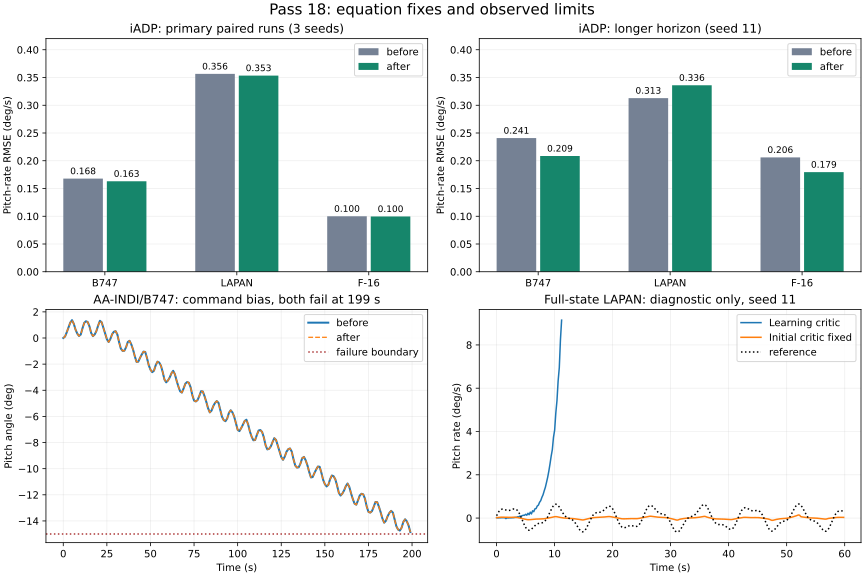

# Адаптивные алгоритмы: сверка со статьями и проверка — проход 18

Дата: 2026-09-17. Ветка: `fix/agent-runtime-bugs`. Базовая версия — рабочее дерево в конце прохода 17. Пользователь отдельно потребовал сверять предполагаемые ошибки с оригинальными публикациями до исправления.

## Результат

Исправлены два расхождения в формулах обучения, граница начальной идентификации и численная потеря информации в МНК. **120/120 основных эпизодов** после исправлений завершились без NaN/Inf и выхода за заданные границы. Полный набор: **3212 passed**, покрытие **93.24620%**.

Расширенные испытания выявили ограничения, которые короткая серия не показывала: AA-INDI/B747 с постоянным смещением команды выходит за границу тангажа в обеих версиях; полный набор состояний LAPAN с обучаемым критиком iADP также не обеспечивает устойчивость. Эти результаты сохранены и не включены в заявление об успехе основных 120 эпизодов.



## Сверка оригинала с реализацией

### iADP

Основание: [Konatala et al., AIAA 2024-2402](https://research.tudelft.nl/files/173498220/konatala_et_al_2024_flight_testing_reinforcement_learning_based_online_adaptive_flight_control_laws_on_cs_25_class.pdf), уравнение (10), рис. 2, раздел III.B и уравнение (12).

| Проверка | Вывод и действие |
| --- | --- |
| Цель обучения функции ценности | В статье используется модельное следующее состояние. Код сохранял измеренное. Теперь критик получает `X + F·ΔX + G·Δu`; измерение по-прежнему обучает RLS. Первый переход после reset использует измеренную цель из-за отсутствия истории. |
| Начальная идентификация | `model_learning_only_steps` раньше допускал обучение критика на возбуждающих командах. Теперь до конца этой фазы P и буфер критика не меняются. После неё RLS продолжает адаптацию; это не полный последовательный режим статьи с замороженной моделью. |
| Решение МНК | Формирование нормальных уравнений теряло разрешимые малые признаки. Прямое SVD-решение сохраняет ту же задачу, включая существующий ридж к нулю. |
| Стягивание P при слабых данных | Не объявлено ошибкой переноса. Ридж — локальное расширение; перенос центра регуляризации к прежней P изменил бы целевую функцию. Такой перенос не сделан. |
| Частота обновлений | Исправлена ошибка документации: 50 шагов при dt=0,01 — 2 Гц; 20 Гц требует 5 шагов. |

Выводы о сходимости требуют достаточного возбуждения и выполнения предпосылок модели. Отсутствие NaN само по себе этого не подтверждает.

### AA-INDI

Основание: [Atmaca, de Visser, van Kampen, AIAA 2026-1743](https://repository.tudelft.nl/file/File_ee9931f5-cf45-45a5-b5a3-0225b0f35da2), уравнения (54)–(57). Неверная атрибуция `Sun et al.` исправлена в коде и документации.

Код использовал экспоненциальное забывание и включал λ в знаменатель усиления. Теперь усиление вычисляется до забывания, а λ учитывает невязку и неопределённость прогноза:

```text
K = P φ / (1 + φᵀ P φ)
λ = clip(1 − ||ε||² / (Σ₀ (1 + φᵀ P φ)), λ_min, λ_max)
θ_next = θ + K εᵀ
P_next = (I − K φᵀ) P / λ
```

В API `Σ₀ = eps_sensitivity²`. Верхний предел λ меньше 1 и общий коэффициент забывания для нескольких выходов — расширения библиотеки. Старые checkpoint загружаются; настройки продолжающейся адаптации требуют повторной проверки.

Сохраняются существенные упрощения: агент идентифицирует приращения ускорения по приращениям входа, а не аэродинамические моменты; полноценный OTSEKF-HOSM отсутствует. Поэтому эти опыты не воспроизводят всю опубликованную архитектуру и её испытания на Flying-V.

### Численная реализация RLS

Независимый скалярный контроль: при начальной дисперсии `1e20`, регрессоре 1 и единичном весе измерения новая дисперсия должна быть практически 1. Обе реализации получали 0 из-за вычитания близких величин. Это именно численная ошибка; исправлена эквивалентной формой Joseph.

NaN/Inf во входах теперь отклоняются, а при переполнении обновление завершается исключением **до записи неконечных параметров**. Проверяется и допустимость начальной ковариации. При недостаточном возбуждении стандартное забывание всё ещё может неограниченно увеличивать ковариацию: ограничитель или иной закон забывания в этот проход не добавлялся. Переполнение теперь обнаруживается, но его математическая причина не устранена.

## Протокол испытаний

Основной протокол сохранён из [прохода 17](physics-policy-validation-round17.md): три seeds `11,29,47`, одинаковые параметры до/после, наблюдение q, обучение 30 с на линейных объектах и 20 с на F-16. Проверка: 60 с для B747/LAPAN, 30 с для F-16. Линейные сценарии — номинал, уменьшение B вдвое, постоянное смещение команды, шум измерения; F-16 — номинал и ослабление команды относительно трима вдвое. Каждый сценарий имеет фиксированный и адаптирующийся вариант параметров.

Для основной базовой версии использованы сохранённые результаты конца прохода 17. После исправлений обучение повторено. Длительные парные опыты выполнены заново на обеих версиях: **300 с B747/LAPAN и 120 с F-16**, seed 11. Также повторена чувствительность F-16 к dt=0,01; проведены диагностические отключения отдельных обновлений и прогоны с полным состоянием LAPAN.

Всего в этом проходе выполнено **43 новых запусков обучения/проверки**, **1,674,727 переходов**, включая диагностику и повторное контрольное воспроизведение. Кэшированные базовые результаты в это число не входят. Основные сценарии ограничивают `|q|` до 10°/с, `|theta|` до 15° на линейных моделях, а на F-16 — отклонение alpha от трима до 10°. Они не контролируют весь лётный диапазон скоростей и высот.

## Основные результаты

RMSE q, °/с, среднее по эпизодам с адаптацией; меньше лучше. Для фиксированных политик и каждого отдельного эпизода значения приведены в JSON.

| Агент | Объект | RMSE до → после | Выходы за границы до → после |
| --- | --- | --- | --- |
| iadp | B747 | 0.16780 → 0.16305 | 0/12 → 0/12 |
| iadp | LAPAN | 0.35648 → 0.35345 | 0/12 → 0/12 |
| iadp | F16 | 0.10001 → 0.09960 | 0/6 → 0/6 |
| aaindi | B747 | 0.21367 → 0.21367 | 0/12 → 0/12 |
| aaindi | LAPAN | 0.27266 → 0.27262 | 0/12 → 0/12 |
| aaindi | F16 | 0.18815 → 0.18814 | 0/6 → 0/6 |

Изменения AA-INDI в этой серии малы. У iADP есть небольшое улучшение средних показателей, но прежние проблемы качества LAPAN не закрыты. Эти результаты не дают основания обещать общее улучшение обучаемых политик.

## Длительные испытания

| Агент | Объект | RMSE до → после | Выходы за границы до → после |
| --- | --- | --- | --- |
| iadp | B747 | 0.24081 → 0.20857 | 0/4 → 0/4 |
| iadp | LAPAN | 0.31283 → 0.33600 | 0/4 → 0/4 |
| iadp | F16 | 0.20606 → 0.17948 | 0/2 → 0/2 |
| aaindi | B747 | 0.21445 → 0.21446 † | 1/4 → 1/4 |
| aaindi | LAPAN | 0.27264 → 0.27350 | 0/4 → 0/4 |
| aaindi | F16 | 0.18394 → 0.18393 | 0/2 → 0/2 |

† Значение включает неполный аварийный эпизод; его нельзя считать качеством полного горизонта.

- AA-INDI/B747 со смещением команды: адаптирующийся вариант выходит за `|theta|=15°` на **199,28 с** в обеих версиях; фиксированный — на **183,68 с**. Матрицы остаются конечными. Агент отслеживает угловую скорость; внешнего контура удержания тангажа в опыте нет. При этом отклонение скорости u достигает более 100 м/с — линейная модель уже далеко от номинального режима. Это демонстрация нарушения ограничений, а не физически достоверный прогноз такого полёта.
- iADP/LAPAN с адаптацией: средняя ошибка на длинном горизонте **0,31283 → 0,33600°/с**. Эта регрессия остаётся открытой, несмотря на небольшое улучшение короткого теста.
- Остальные длинные эпизоды завершены; численного переполнения и смены знака скалярной эффективности в них не было. Длинная серия использует только один seed.

## Диагностика полного состояния LAPAN

Отдельный опыт передаёт iADP все четыре состояния `[u,w,q,theta]`, сохраняя прежнюю цель q и её вес. Он исследует предпосылку наблюдаемости и не заменяет основной протокол. Используется один seed и номинальная модель для начального DARE.

- С обучаемым критиком обучение остановилось по границе состояния на **11,72 с до** и **13,24 с после**. Проверка сохранённых аварийных префиксов дала **5/8 отказов до и 8/8 после**. RMSE этих разнородных префиксов не используется для сравнения качества.
- С фиксированной начальной P после исправлений обучение 30 с и все **8/8** проверок по 60 с завершились; RLS продолжал работать. Средний RMSE при адаптации модели — **0,32887°/с**.
- Это локализует риск в обучении критика/его взаимодействии с моделью при данных настройках, но не доказывает одну конкретную причину. В регрессионной матрице 64 столбца; активных 25, численный ранг 15. Масштабы признаков сильно различаются. Требуются отдельная проверка возбуждения, нормализации и настройки; произвольная смена регуляризатора под видом исправления статьи не сделана.

## Физика и регрессионные проверки

- Все **145 Python-файлов `aerospacemodel`** совпадают с началом прохода. Код сред не менялся.
- Одинаковые команды через B747/LAPAN/F-16 при dt=0,02/0,01/0,005 дают точно те же состояния, наблюдения, reward и завершения, что в проходе 17.
- Независимое интегрирование линейных уравнений: максимальное покомпонентное расхождение B747 **2,22×10⁻¹⁴**, LAPAN **3,20×10⁻¹³**. F-16 RK4 против DOP853 с тем же RHS: **1,30×10⁻⁵ → 8,63×10⁻⁷ → 5,43×10⁻⁸** при уменьшении dt. Это численная проверка, не независимая идентификация аэродинамики.
- Добавлено **28 тестов**; 27 воспроизводят ошибки прежней версии, один дополняет проверку уже корректного отклонения отрицательной ковариации iADP. Целевая группа: **127 passed**.
- Полный набор: **3212 passed**, 14 warnings; исключён недоступный `tests/optimization/ray_test.py`.
- Покрытие **93.24620%** (21331/22876); порог 92% выполнен.
- Bandit: 82 всего / 59 medium / 0 high; Flake8: 30; mypy: 0; Ruff: 0. Все gates пройдены, baseline не ослаблялся. Документация `mkdocs build --strict` собрана.
- После выделения начальной model-only фазы основной iADP/B747/seed 11 повторён: траектории и метрики совпали точно. Во всех основных и длительных опытах эта фаза выключена (`model_learning_only_steps=0`).

## Артефакты и воспроизведение

[JSON: все метрики, настройки и SHA-256](physics-policy-validation-round18.json). Полные траектории, checkpoint, исходная копия `before/` и логи: `/tmp/physics-policy-audit-round18/`; базовые короткие результаты: `/tmp/physics-policy-audit-round17/`. Временные каталоги не добавлены в Git.

```bash
OMP_NUM_THREADS=1 MKL_NUM_THREADS=1 .venv/bin/python scripts/validate_adaptive_tracking.py --repo . --output /tmp/iadp-lapan.json --agent iadp --plant lapan --seed 11 --eval-duration 300
OMP_NUM_THREADS=1 MKL_NUM_THREADS=1 .venv/bin/python scripts/validate_adaptive_f16.py --repo . --output /tmp/aaindi-f16.json --agent aaindi --seed 11 --eval-duration 120
# Диагностика полного состояния; для сравнения добавить --freeze-critic.
OMP_NUM_THREADS=1 MKL_NUM_THREADS=1 .venv/bin/python scripts/validate_adaptive_tracking.py --repo . --output /tmp/iadp-fullstate.json --agent iadp --plant lapan --seed 11 --full-state
```

Приоритет следующего прохода: критик iADP на LAPAN, проверка информативности данных и физических границ сценариев. Общая сходимость адаптивного управления не подтверждена.
