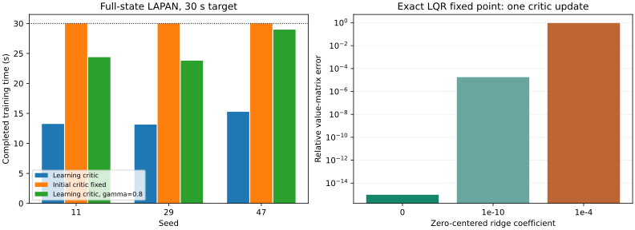

# Адаптивное управление: критик iADP и реальные наблюдения env — проход 19

Дата: 2026-09-17. Ветка `fix/agent-runtime-bugs`. Исходная версия — рабочее дерево после прохода 18. Формулы и предпосылки сверены с оригинальной статьёй до изменения алгоритма.

## Результат

Исправлены проверка допустимости квадратичной стоимости iADP, поведение замороженного критика и протокол измерений в экспериментах. **3236 тестов прошли**, покрытие **93.24974%**. Основные **120/120** проверочных эпизодов завершились. При допустимых настройках парные запуски до/после на B747, LAPAN и F-16 совпадают точно.

Общая сходимость не подтверждена: обучение критика iADP на полном состоянии LAPAN срывается на трёх seeds. Фиксация критика при продолжающейся идентификации проходит эти сценарии, но не является исправлением обучаемого алгоритма. Длительные AA-INDI/B747 по-прежнему выходят за предел тангажа при смещении команды.



## Что сверено со статьёй

Первичный источник: [Konatala et al., AIAA 2024-2402](https://research.tudelft.nl/files/173498220/konatala_et_al_2024_flight_testing_reinforcement_learning_based_online_adaptive_flight_control_laws_on_cs_25_class.pdf), формулы (3), (5), (10), (11), рис. 2, раздел III.B.

| Наблюдение | Классификация и действие |
| --- | --- |
| Конструктор принимал отрицательные, несимметричные и неконечные Q/R, а также gamma вне (0,1) | Нарушение предпосылок опубликованной квадратичной стоимости. Теперь отклоняются. Полуопределённые матрицы и нулевые веса разрешены. Независимая проверка конечными разностями подтверждает минимум формулы управления при допустимых весах. |
| При `policy_eval_blend=0` всё равно решался МНК | Ошибка режима библиотеки: формально замороженный критик мог завершиться исключением на плохо масштабированных данных. Теперь решение пропускается, P сохраняется, RLS продолжает работу. |
| Срыв полного iADP/LAPAN | Срыв сам по себе не объявлен ошибкой переноса статьи. Выполнены отдельные опыты с фиксированной моделью, фиксированным критиком, gamma и риджем. Новая формула стабилизации не вводилась. |
| Ранг 15 при 64 столбцах полной параметризации | Сам по себе не недостаток данных: три компоненты reference равны нулю, остаются пять активных переменных и 15 независимых симметричных произведений. Полноту ранга нужно оценивать в этой подзадаче. |
| Ридж меняет даже точное решение LQR | Это существующее расширение библиотеки к нулю, зависящее от масштаба признаков. Не исправлено произвольной заменой закона обучения. Документация уточнена. |

## Исправления протокола env ↔ agent

- Раньше `learn` получал новое состояние с шумом `noise[k]`, а следующий `predict` — то же состояние с `noise[k+1]`. Теперь оба используют один отсчёт измерения соответствующего момента времени. Четыре регрессионных теста воспроизводят ошибку прежнего протокола.
- Агент теперь получает наблюдения `reset/step`, а не напрямую состояние модели. Внутреннее состояние используется для независимых метрик и проверки отображения наблюдений.
- Адаптер явно переводит угловые наблюдения B747 из градусов в радианы; линейные скорости сохраняют м/с. LAPAN и F-16 уже возвращают угловые состояния в радианах. Команды линейных env остаются в градусах.
- Наблюдение сверяется с выбранными физическими состояниями; преждевременное завершение env теперь считается незавершённым испытанием с отдельной причиной.

Сравнение метрик с проходом 18 включает изменение протокола, поэтому небольшую разницу ошибок нельзя приписывать улучшению алгоритмов.

## Протокол запусков

Seeds `11,29,47`. Основная серия: 30 с обучения и 60 с проверки для B747/LAPAN; 20 с и 30 с для F-16. Линейные сценарии: номинал, B×0,5, постоянное смещение команды, шум измерения. F-16: номинал и ослабление команды относительно трима вдвое. Каждый сценарий проверяется с фиксированными и адаптирующимися параметрами.

Выполнено **43 завершённых запусков обучения/проверки**, **1,300,240 переходов**: 18 основных, 6 длительных, 13 диагностических на полном состоянии LAPAN и 6 парных повторов исходной/новой реализации. «Завершённый запуск» означает, что результат записан; аварийно остановленные траектории входят в число запусков и явно помечены. Дополнительно выполнены три физических проверки и аналитический контроль критика.

## Основная серия

RMSE угловой скорости q, °/с, усреднённый по эпизодам с адаптацией. Последний столбец учитывает оба режима — фиксированный и адаптирующийся. Во всех 18 основных обучениях достигнут заданный горизонт.

| Агент | Объект | RMSE | Завершено эпизодов |
| --- | --- | --- | --- |
| iadp | B747 | 0.16243 | 24/24 |
| iadp | LAPAN | 0.35769 | 24/24 |
| iadp | F16 | 0.09960 | 12/12 |
| aaindi | B747 | 0.21409 | 24/24 |
| aaindi | LAPAN | 0.26902 | 24/24 |
| aaindi | F16 | 0.18814 | 12/12 |

В трёх отдельных парных повторах iADP с одинаковым исправленным протоколом исходная и новая версии дали **точно одинаковые** траектории, параметры и метрики: новые проверки не меняют поведение допустимых конфигураций.

## Длинные проверки

Seed 11, горизонт проверки 300 с на линейных объектах и 120 с на F-16. Всего 38/40 эпизодов завершены.

| Агент | Объект | RMSE | Завершено эпизодов |
| --- | --- | --- | --- |
| iadp | B747 | 0.21392 | 8/8 |
| iadp | LAPAN | 0.35500 | 8/8 |
| iadp | F16 | 0.18279 | 4/4 |
| aaindi | B747 | 0.21489 | 6/8 |
| aaindi | LAPAN | 0.27046 | 8/8 |
| aaindi | F16 | 0.18393 | 4/4 |

AA-INDI/B747 со смещением команды нарушает `|theta|=15°`: **183,68 с** с фиксированными параметрами и **199,28 с** с адаптацией. Его RMSE включает аварийные префиксы и не описывает полный горизонт. Это прежний сбой сценария, а не новая регрессия. Контур управляет q без отдельного удержания угла тангажа; на этой длинной траектории изменение скорости превышает 100 м/с, выходя далеко за область малых отклонений линейной модели.

## Полное состояние LAPAN: раздельная диагностика

Вход агента `[u,w,q,theta]`, reference ненулевой только для q, прежние Q/R, начальные F/G/P из номинальной модели с вариацией G по seed. Это диагностический опыт с привилегированной инициализацией, а не обучение с нуля.

| Режим | Обучение | Проверка |
| --- | --- | --- |
| Обучаемые модель и критик, gamma=0,99 | Выход за угол тангажа на 13,24 / 13,14 / 15,28 с (seeds 11/29/47) | 24/24 эпизода нарушают границы |
| Фиксированная модель, обучаемый критик, seed 11 | 12,16 с до остановки | 8/8 нарушают границы |
| Фиксированный начальный критик, обучаемая модель, три seeds | 30/30 с во всех трёх запусках | 24/24 завершены |
| Обучаемый критик, gamma=0,8, три seeds | 24,38 / 23,80 / 28,98 с до остановки | 12/24 нарушают границы |
| Обучаемый критик, gamma=0,9, seed 11 | 15,52 с до остановки | 7/8 нарушают границы |
| Без риджа, seed 11 | 2,94 с до остановки | 8/8 нарушают границы |
| Фиксированный критик, длинный опыт, seed 11 | 120/120 с | 8/8 по 300 с завершены; средний RMSE при адаптации модели 0,31771°/с |

Оценки после неуспешного обучения используют сохранённый аварийный префикс; их RMSE нельзя сравнивать с качеством полностью обученной политики. Диагностика локализует риск в обновлении критика/его взаимодействии с данными, но не устанавливает единственную причину. Фиксация критика не заменяет проверку работоспособности его обучения.

## Независимая проверка критика

[Скрипт](../scripts/validate_iadp_lapan_critic.py) строит точную номинальную задачу LQR LAPAN с постоянной reference, вычисляет P по Риккати и независимо по Ляпунову. Затем формирует 300 независимых состояний на ограниченных масштабах и проверяет один шаг оценки той же политики. В этом опыте модель и политика точно известны; это проверка алгебры, не полётное обучение.

- Решения Риккати и Ляпунова различаются относительно на **1,05×10⁻¹⁴**.
- Ранг квадратичных признаков **15 из 15 независимых**.
- Без риджа шаг критика сохраняет точную P с ошибкой **1,03×10⁻¹⁵**, коэффициенты управления — **2,26×10⁻¹⁴**.
- Ридж `1e-10` даёт относительную ошибку P **1,78×10⁻⁵** в этой конкретной выборке.
- Ридж `1e-4` даёт около **94%** ошибки P даже при точных исходных данных. Это результат выбранных единиц и масштабов; он не доказывает, что такой коэффициент всегда непригоден. Отключение риджа в онлайн-опыте выше, напротив, ускорило срыв.

Этот контроль не воспроизводит полностью меняющуюся онлайн-политику, скользящее окно, оценённую модель и изменяющийся reference. Поэтому успешный результат не доказывает сходимость этих режимов.

## Физика и качество

- 145 файлов Python `aerospacemodel` и 28 файлов `envs` побайтно совпадают с началом прохода.
- Повтор фиксированных команд через B747/LAPAN/F-16 дал точно прежние состояния, наблюдения, reward и окончания эпизодов.
- Линейное независимое интегрирование: максимальное покомпонентное расхождение B747 **2,22×10⁻¹⁴**, LAPAN **3,20×10⁻¹³**. Для F-16 RK4 против DOP853 с тем же RHS: **1,30×10⁻⁵ → 8,63×10⁻⁷ → 5,43×10⁻⁸** при уменьшении dt. Это численная согласованность; независимого подтверждения лётной аэродинамики здесь нет.
- Добавлено **24 теста**: 19 на стоимость/критик, 5 на протокол. До исправления 17 проверок стоимости/заморозки падали; два теста проверяют уже корректную алгебру/разрешённые веса. Четыре проверки непрерывности измерений падали на старом протоколе; пятая проверяет новый адаптер единиц.
- **3236 passed**, 14 warnings. Исключён `tests/optimization/ray_test.py`. Покрытие **93.24974%** (21343/22888); порог 92% выполнен.
- Bandit: 82 всего, 59 medium, 0 high; Flake8: 30; mypy/Ruff: 0. Все действующие gates пройдены, baseline не ослаблялся. Новые скрипты и тесты отдельно прошли Ruff. Строгая сборка документации выполнена.

## Артефакты и воспроизведение

[JSON с метриками, конфигурациями и SHA-256](physics-policy-validation-round19.json). Полные траектории, посекундная диагностика, checkpoint и исходная копия: `/tmp/physics-policy-audit-round19/`. Полные результаты до этого прохода сохранены в [отчёте 18](physics-policy-validation-round18.md). Временные файлы в Git не добавлены.

```bash
OMP_NUM_THREADS=1 MKL_NUM_THREADS=1 .venv/bin/python scripts/validate_adaptive_tracking.py --repo . --output /tmp/iadp-full.json --agent iadp --plant lapan --full-state --seed 11
# Раздельная диагностика: добавить --freeze-critic или --freeze-model.
OMP_NUM_THREADS=1 MKL_NUM_THREADS=1 .venv/bin/python scripts/validate_adaptive_tracking.py --repo . --output /tmp/iadp-fixed-long.json --agent iadp --plant lapan --full-state --seed 11 --freeze-critic --train-duration 120 --eval-duration 300
OMP_NUM_THREADS=1 MKL_NUM_THREADS=1 .venv/bin/python scripts/validate_iadp_lapan_critic.py --repo . --output /tmp/critic-oracle.json
```

Открытая задача: добиться устойчивого обучения критика на полном состоянии LAPAN и проверить это при одинаковых условиях на отложенных сценариях. Ни единичный успешный прогон, ни отсутствие NaN, ни аналитическая проверка МНК не заменяют эту проверку.
