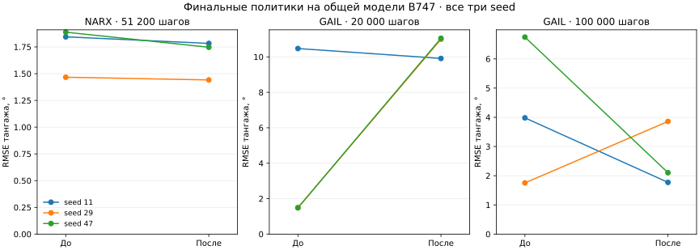

# Физика и обучение: второй проход — 16 сентября 2026

Следующий этап: [третий проход — A2C, GAIL и AAI Shadow](physics-policy-validation-round3.md). Метрики ниже описывают историческое состояние; временные артефакты первых двух проходов сейчас недоступны, численные результаты сохранены в JSON.

## Вывод

Исправлены полная балансировка Skywalker X8, ограничения его среды, переходы и цели NARX A2C, сбор опыта и обновления GAIL. **2639 тестов проходят**, добавлено **32 регрессионных случая**, покрытие **92.63%**.

**Физические проверки пройдены, NARX улучшился на трёх seed. GAIL нельзя считать надёжно сошедшимся:** при 20 000 шагах качество после исправлений хуже; при 100 000 шагах средняя ошибка ниже, выходов за предел тангажа нет, но один seed ухудшился. Конечные веса и потери сами по себе не доказывают качество управления.

[Первый проход: PPO, SAC, IM-GDHP, A3C, B747 и F-16](physics-policy-validation.md). Его изменения сохранены. «До» в этом отчёте — снимок рабочего дерева **после первого прохода**, не исходный `origin/develop` и не чистый HEAD `3f87ee6`.

## Что исправлено

### Skywalker X8 и среда

- `trim` теперь обнуляет все шесть ускорений связанных осей. Найдены угол атаки, скольжение, крен, обе виртуальные команды элевонов и газ; тангаж обеспечивает нулевую вертикальную скорость.
- `TrimResult.to_control()` возвращает все три балансировочные команды. Старые поля и формат `initial_guess=(alpha, elevator, throttle)` сохранены; добавлены `beta_rad`, `roll_rad`, `aileron_rad`.
- Признак сходимости включает остаток всех шести уравнений, диапазон газа и пределы каждого элевона. Несуществующая физически балансировка не помечается успешной.
- Среда копирует исходное состояние, отвергает нечисловые состояния/действия и некорректное время, ограничивает нормализованные/физические команды и оба смешанных элевона по ±20°.
- Параметры повреждений ранее молча игнорировались. Теперь неподдерживаемые `damage_profile`/`damage_event_callback` вызывают `NotImplementedError`. Модель повреждений X8 этим изменением **не реализована**.

На 18 м/с и 178 м получены α≈7,62°, β≈0,59°, крен≈−0,63°, δe≈−1,96°, δa≈−3,31°, газ≈0,641. Нельзя заменять возвращённый элерон нулём. Коэффициенты аэродинамики и двигателя не подгонялись. Решение относится к неподвижному воздуху и существующей упрощённой силовой установке; точка из [исходной статьи, уравнения 36–38](https://link.springer.com/article/10.1007/s13272-025-00816-3) содержит ветер.

### NARX A2C

- Следующее состояние критика: `[s_(t+1), s_t]`; прежняя история первой строки была неверна.
- История обнуляется между эпизодами и сохраняется между фрагментами одного эпизода. Наблюдения копируются, включая среды с общим изменяемым буфером.
- Действия сохраняют размерность `[batch, action_dim]`; логарифмы вероятностей суммируются по компонентам.
- Цели критика вычисляются без градиента. Возвраты обрываются при новом эпизоде, а при лимите времени и конце незавершённого фрагмента сохраняется оценка последнего состояния.
- `NARXTransition` сохраняет распаковку пяти элементов и метаданные `terminated`, `previous_state`, включая pickle. Старые пятиэлементные кортежи принимаются, но по одному `done` невозможно восстановить различие termination/truncation. Используйте новые записи для корректной обработки лимитов. Это соответствует [контракту Gymnasium](https://gymnasium.farama.org/tutorials/gymnasium_basics/handling_time_limits/).

### GAIL

- Устранена порча состояний при повторном использовании буфера наблюдений; бюджет обучения теперь точный.
- Оценка в общей среде выполняется после завершения и обработки фрагмента. Обучение затем сбрасывает среду и начинает новый эпизод; прерванный эпизод отмечается как усечённый.
- При лимите времени учитывается ценность финального наблюдения; `-log(D)` остаётся конечным при насыщении дискриминатора.
- Исправлено игнорирование `epochs` и отбрасывание двух из трёх фрагментов для обновления политики. Каждый фрагмент используется; minibatch обходят все элементы без повторений, включая неполный остаток.
- PPO использует отношение совместных вероятностей многомерного действия, нормализацию преимуществ и ограничение градиента. Дискриминатор видит ограниченную команду, действительно переданную объекту; PPO хранит исходную выборку для Gaussian log-probability.

Публичные размеры сетей и имена параметров не менялись. Число обновлений политики GAIL выросло: при 20 000 шагах **416 → 1280**, при 100 000 — **2080 → 6400**. Сравнение фиксирует бюджет взаимодействий, а не одинаковое количество вычислений.

## Проверка физики

| X8, высота 178 м | Дрейф высоты за 5 с до | После |
|---|---:|---:|
| 17,1 м/с | 2,006 м | 1,04×10⁻¹⁰ м |
| 18,0 м/с | 2,389 м | 7,26×10⁻¹¹ м |
| 18,9 м/с | 2,816 м | 4,08×10⁻¹¹ м |

Новая балансировка удерживает также скорости и углы: максимальные отклонения — порядка 10⁻¹². До исправления малый **продольный** остаток скрывал боковой дисбаланс.

Независимые проверки:

- На 100 состояниях X8 выполнены `I * omega_dot + omega × (I * omega) = M` и равенство производной полной энергии мощности внешних сил/моментов. Допуски — 10⁻¹² для моментов и 10⁻¹⁰ Вт для энергии; учитывается недиагональная инерция `Ixz`.
- При возмущении команд на 2 с ошибка RK4 относительно DOP853: **5,63×10⁻⁷ → 3,73×10⁻⁸ → 2,39×10⁻⁹** при шагах **0,04 → 0,02 → 0,01 с**. Это максимум компонент ошибки состояния в их собственных единицах; уменьшение в 15,1–15,6 раза согласуется с четвёртым порядком.
- Повторные результаты F-16, B747, B737, AAI Shadow и квадрокоптера совпали с предыдущим проходом. Сохраняются прежние несошедшиеся точки B747 и Shadow; они не выдаются за корректный установившийся полёт.

Это проверка внутренней согласованности и численного интегрирования. Полётные данные, сваливание, ветер, отказы и весь лётный диапазон ею не подтверждены. Обученный контроллер X8 в этом эксперименте не оценивался.

## Реальное обучение на общей физике B747

Основная серия: **18 обучений**, seed `11, 29, 47`; оценены финальные веса без отбора лучших checkpoint. Один и тот же файл `b747_vec_torch.py` загружается отдельно от каждой версии агента; SHA-256 совпадает. `dt=0.05`, горизонт 10 с, наблюдение со ссылочным сигналом, награда `tracking`. Обучающие ступени случайны в ±4°, модуль не менее 1°; тест — 24 фиксированных эпизода на seed со ступенями ±2°/±4° и моментом включения 0,5–1,5 с.

| Алгоритм и бюджет | RMSE до | RMSE после | Выходы за ±20° до → после |
|---|---:|---:|---:|
| NARX A2C, 51 200 шагов | 1.7329° | 1.6571° | 0/72 → 0/72 |
| GAIL, бюджет 20 000 шагов | 4.4824° | 10.6510° | 24/72 → 24/72 |
| GAIL, бюджет 100 000 шагов | 4.1602° | 2.5778° | 0/72 → 0/72 |

| Seed | NARX, 51 200 | GAIL, 20 000 | GAIL, 100 000 |
|---|---:|---:|---:|
| 11 | 1.844 → 1.783 | 10.471 → 9.912 | 3.981 → 1.771 |
| 29 | 1.467 → 1.441 | 1.493 → 10.993 | 1.753 → 3.859 |
| 47 | 1.888 → 1.747 | 1.483 → 11.049 | 6.746 → 2.103 |



RMSE усредняется по активным шагам до завершения эпизода, поэтому для GAIL на коротком бюджете обязательно учитывать отдельную колонку нарушений предела. Сравнивать один RMSE при разном числе завершившихся аварийно эпизодов недостаточно.

**NARX:** 400 фрагментов ×128 шагов, `gamma=0.99`, actor LR=0,0004, critic LR=0,001, entropy=0,001, сети 64×64, дисконтированные возвраты с bootstrap. Итоговая средняя ошибка уменьшилась примерно на 4,4%; все три seed лучше своих необученных политик и предыдущей реализации, нарушений предела нет.

**GAIL:** 40 демонстрационных эпизодов PD-регулятора, rollout=128, minibatch=64, 4 эпохи, LR=0,0003, штатные сети 256/128. Данные эксперта и начальные веса совпадают между версиями внутри каждого seed, что проверено по hash и исходной оценке. PD имеет RMSE≈0,954°. Старая реализация превышала бюджет: 20 096 и 100 096 шагов вместо 20 000 и 100 000. Оценочные взаимодействия в этот счётчик не включены.

**Ограничение GAIL остаётся существенным.** При 20 000 шагах исправленная реализация хуже предыдущей и имеет 24 нарушения из 72 эпизодов. При 100 000 шагах средняя RMSE уменьшилась примерно на 38%, нарушений нет, но seed 29 ухудшился с 1,75° до 3,86°, а результат заметно хуже PD-эксперта. Нельзя утверждать ни гарантированную сходимость, ни отсутствие регрессии качества при любом бюджете. Для допуска GAIL как регулятора нужны настройка режима обучения и более широкая серия проверок. Исправления контрактов переходов и формул не являются такой гарантией.

Все 18 запусков завершились с конечными весами и контролируемыми метриками. Промежуточные неудачные эксперименты также сохранены в JSON. Три seed не дают статистического доказательства превосходства; область проверки — линейная продольная модель B747.

## Проверки кода

- **2639 passed**, 14 предупреждений; `tests/optimization/ray_test.py` исключён, как в первом проходе.
- Покрытие: **20513 / 22144 = 92.63%**; порог 92% пройден. Это немного ниже 92,80% первого прохода.
- Flake8: 29≤30; Ruff: 0; mypy: 0; Bandit: 82≤114, medium 59≤83, high 0.
- Строгая сборка MkDocs, Black/isort и `git diff --check` пройдены.
- Проверки выполнялись на CPU, Python 3.11.10, NumPy 1.26.4, SciPy 1.15.3, PyTorch 2.14.0+cu130. CUDA и другие версии зависимостей этим прогоном не проверены.

## Воспроизведение и артефакты

[Полные численные результаты и контрольные hash](physics-policy-validation-round2.json). Скрипты: [физика](../scripts/validate_physics.py), [NARX](../scripts/validate_narx.py), [GAIL](../scripts/validate_gail.py).

```bash
python scripts/validate_physics.py --repo . --output /tmp/physics-after.json
python scripts/validate_narx.py --repo . --env-source tensoraerospace/envs/b747_vec_torch.py --seed 11 --updates 400 --output /tmp/narx-after-11.json
python scripts/validate_gail.py --repo . --env-source tensoraerospace/envs/b747_vec_torch.py --seed 11 --frames 20000 --output /tmp/gail-after-11.json
python scripts/validate_gail.py --repo . --env-source tensoraerospace/envs/b747_vec_torch.py --seed 11 --frames 100000 --output /tmp/gail-long-after-11.json
```

Повторить для seed 29 и 47. Контрольная версия находится в `/tmp/physics-policy-audit-round2/before`; меняется только `--repo`, источник среды остаётся общим. `OMP_NUM_THREADS=1`, `MKL_NUM_THREADS=1`, `WANDB_MODE=disabled`. Логи, TensorBoard, исходные JSON, промежуточные результаты и файлы `.pt` всех запусков находятся в `/tmp/physics-policy-audit-round2/`. Снимок до исправлений содержит предыдущую незакоммиченную работу и не заменяется чистым checkout HEAD.
