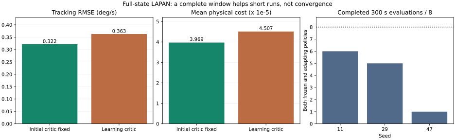

# iADP: состояние reference, окно критика и проверка качества — проход 20

Дата завершения: 2026-09-18. Ветка: `fix/agent-runtime-bugs`. Исходная версия — рабочее дерево после прохода 19. Проверка гипотез основана на оригинальной статье; отрицательные результаты сохранены.

## Результат

**Новую ошибку в формулах критика этот проход не подтвердил.** Найдено влияние постановки опыта: представления динамики reference и неполного нового окна после `reset()`. Добавлен опциональный параметр `policy_eval_min_samples`; прежнее поведение по умолчанию сохранено.

С полным состоянием генератора reference и ожиданием 20-секундного окна короткая серия прошла **24/24 эпизода** на трёх seeds. Однако при 120 с обучения и 300 с оценки **12/24 эпизода нарушили ограничения**. Средняя физическая стоимость короткого опыта оказалась **на 13.55% выше**, чем с фиксированным исходным критиком. Поэтому новый режим **не считается исправлением сходимости и не выбран по умолчанию**.

Проверки кода: **3255 passed**, покрытие **93.25151%**. Шесть обычных запусков iADP/AA-INDI на B747/LAPAN/F-16 точно воспроизвели результаты прохода 19; **40/40** их проверочных эпизодов завершились.



## Сверка с первоисточником

[Konatala et al., AIAA 2024-2402](https://research.tudelft.nl/files/173498220/konatala_et_al_2024_flight_testing_reinforcement_learning_based_online_adaptive_flight_control_laws_on_cs_25_class.pdf): уравнения (6), (10), (11), (12), рис. 2, разделы III.B и IV.

- Состояние задачи включает объект и reference. В прежнем опыте reference представлялся только текущей суммой двух синусоид. Новый диагностический режим раскрывает состояние их генератора. Это дополнительная информация, а не исправление доказанной ошибки формул.
- В описанном последовательном полётном опыте перед обучением критика собирали 20-секундное окно. У нас счётчик RLS сохранялся после reset, а окно очищалось: поэтому прогрев идентификатора не означал готовность нового окна критика. В библиотеку добавлено отдельное, явное условие по числу образцов.
- Проверено и небольшое синусоидальное возбуждение управления, мотивированное формулой (12). Оно само по себе не устранило срывы.

Дополнительно просмотрена [диссертация Ye Zhou, глава 3, §3.2.2](https://research.tudelft.nl/files/42964723/Dissertation_Ye_Zhou.pdf). Там приведён другой вариант аппроксимации по ошибке слежения с предположением о медленном reference и высокой частоте отсчётов. Его предпосылки не перенесены автоматически на реализацию по статье 2024 года; диссертация не выдаётся за полный текст журнальной статьи 2018 года.

Это диагностические опыты на LAPAN, а не воспроизведение полётной кампании Citation: частота отсчётов, начальная модель, окно и объект отличаются.

## Изменения кода

### Опциональная настройка iADP

`policy_eval_min_samples` задаёт минимальное количество переходов **в текущем буфере** перед оценкой политики, включая после reset. При `None` используется прежний порог `max(n_aug**2, 4)`. Порог проверяется на достижимость в выбранном окне; настройки и незаполненный буфер восстанавливаются из checkpoint. Старые checkpoint сохраняют прежнее поведение. Уравнения RLS, Bellman, управления и регуляризатор не менялись.

Пример ожидания полного окна:

```python
IADPConfig(
    dt=0.02,
    policy_eval_window=1000,
    policy_eval_min_samples=1000,
    policy_eval_warmup_updates=1000,
)
```

Это настройка расписания обучения, а не гарантия достаточного возбуждения или устойчивости.

### Проверочный скрипт

`scripts/validate_adaptive_tracking.py` получил режимы reference, длины окна, прогрева и дополнительного возбуждения только во время обучения. Добавлены точная средняя и дисконтированная физическая стоимость и RMS приложенного управления. Стоимость рассчитывается из состояния объекта и реально приложенного входа, отдельно от шумного наблюдения агента.

В режиме `oscillator` reference имеет вид `[r1, dr1, r1+r2, dr2]` с частотами 0,12 и 0,31 Гц. Только третья компонента — желаемая q — входит в стоимость; другие служат состояниями генератора. Его переход рассчитывается через матричную экспоненту. Девять тестов проверяют совпадение с аналитическими синусоидами при разных шагах и фазах.

## Протокол

Выполнено **33 экспериментальных запуска обучения/оценки**, **943,485 переходов**: 12 разведочных, 9 отложенных опытов на полном состоянии LAPAN, 6 обычных запусков двух агентов на трёх объектах и 6 повторов для точной оценки стоимости. Остановленные по ограничениям эпизоды входят в число запусков и отмечены как неуспешные.

Полное состояние LAPAN: `[u,w,q,theta]`, отсчёты 0,02 с, прежние Q/R, gamma=0,99, blend=0,1, ридж=1e-10. Номинальная модель используется для начального DARE, а эффективность управления умножается на случайный коэффициент по seed. Это обучение с привилегированной инициализацией.

В короткой серии обучение и оценка длятся по 60 с. Сценарии оценки: номинал, потеря половины эффективности B после 15 с, постоянное смещение команды после 20 с, шум измерения. Каждый выполняется с фиксированными и адаптирующимися параметрами; фаза задания в оценке отличается от обучения. Seeds 29 и 47 использованы после разведки на seed 11. Длинная серия: обучение 120 с, оценка 300 с.

## Разведочные опыты, seed 11

| Вариант | Завершено обучение, с | Завершено оценок |
| --- | --- | --- |
| `sampled` | 13.24 / 60 | 0/8 |
| `oscillator` | 60.00 / 60 | 4/8 |
| `constant` | 34.06 / 60 | 0/8 |
| `long_window` | 60.00 / 60 | 5/8 |
| `osc_long` | 60.00 / 60 | 5/8 |
| `osc_long_pe` | 60.00 / 60 | 5/8 |
| `sampled_long_pe` | 59.32 / 60 | 1/8 |
| `osc_long_fixed` | 60.00 / 60 | 4/8 |
| `gate_sampled` | 60.00 / 60 | 5/8 |
| `gate_osc` | 60.00 / 60 | 8/8 |
| `gate_osc_pe` | 60.00 / 60 | 6/8 |
| `gate_short` | 60.00 / 60 | 0/8 |

`sampled`: прежний reference и окно 300; `oscillator`: раскрыт генератор; `constant`: постоянное задание 0,05°/с. `long_window`/`osc_long`: окно 1000 и прогрев RLS 1000. `pe`: синусоидальная добавка 0,02° на 0,7 Гц только во время обучения. `fixed`: идентификатор фиксирован. `gate_*`: дополнительно требуется заполнение нового окна критика после reset; `gate_short` использует 300 образцов. Разведка выполнялась с прототипом условия; успешный `gate_osc` затем повторён через окончательный API на трёх seeds.

## Отложенные проверки нового режима

Полный reference, окно и минимальное заполнение 1000; дополнительного возбуждения нет.

| Seed | Обучение 60 с | Оценки 60 с | Обучение 120 с | Оценки 300 с |
| --- | --- | --- | --- | --- |
| 11 | завершено | 8/8 | завершено | 6/8 |
| 29 | завершено | 8/8 | завершено | 5/8 |
| 47 | завершено | 8/8 | завершено | 1/8 |

На seed 47 срываются и некоторые оценки с фиксированными параметрами после длинного обучения: качество итогового checkpoint недостаточно. Большинство остановок — предел тангажа; шумный адаптирующийся сценарий seed 29 остановлен по угловой скорости. Конечность матриц не равнозначна устойчивости движения.

## Качество против исходного критика

Обе группы используют одинаковые полное состояние reference, модель, Q/R, начальную P и сценарии. В контрольной группе P фиксирована с начала обучения, идентификатор продолжает работать. Таблица — среднее по 12 полным 60-секундным оценкам с адаптацией модели (три seeds × четыре сценария); в опытной группе обучается также критик.

| Метрика | Исходный критик фиксирован | Критик обучается |
| --- | --- | --- |
| RMSE q, °/с | 0.32156 | 0.36272 |
| Средняя физическая стоимость | 0.00003969 | 0.00004507 |
| Дисконтированная сумма стоимости | 0.00339707 | 0.00427306 |
| RMS приложенного руля, ° | 0.01833 | 0.01582 |

Стоимость: `(q_t-r_t)^2 + R*delta_t^2`, q в радианах/с, delta в градусах, R тот же, что в конфигурации агента. Дисконтированная сумма использует gamma=0,99, без множителя dt. Она сильнее учитывает начало эпизода; средняя стоимость характеризует весь завершённый горизонт. Уменьшение управления не компенсирует увеличение ошибки: итоговая стоимость выше. Новый режим не выбран как рекомендуемая политика.

## Физика и проверки

- 145 Python-файлов `aerospacemodel` и 28 файлов `envs` совпадают с началом прохода.
- Повтор фиксированных команд через B747/LAPAN/F-16 при dt=0,02/0,01/0,005 дал точно прежние физические состояния, наблюдения, reward и окончания эпизодов. Проверка RK4 F-16 против DOP853 с тем же RHS сохранена. Это проверяет интегрирование и связку env/model, не независимую точность аэродинамических данных.
- Шесть обычных запусков iADP/AA-INDI, seed 11, воспроизвели траектории и метрики прохода 19 точно. Новый API по умолчанию не изменяет поведение. Отдельная короткая проверка совместимости скрипта со старой версией агента также прошла; она не включена в 33 экспериментальных запуска.
- Добавлено **19 тестов**: 10 на расписание/параметры/checkpoint и 9 на генератор reference. Существующие тесты протокола дополнены сверкой физической стоимости с расчётом агента без шума.
- **3255 passed**, 14 warnings; исключён `tests/optimization/ray_test.py`. Покрытие **93.25151%**, порог 92% выполнен. Окончательная целевая группа: **104 passed**.
- Bandit 82/59 medium/0 high, Flake8 30, mypy/Ruff 0. Все gates пройдены; baseline не ослаблялся. Новые тесты и скрипт отдельно прошли Ruff. Строгая сборка документации выполнена.

## Артефакты

[JSON с метриками, конфигурациями и SHA-256](physics-policy-validation-round20.json). Полные траектории, диагностика, checkpoint, копия исходной версии и логи: `/tmp/physics-policy-audit-round20/`. Предыдущий [отчёт 19](physics-policy-validation-round19.md) сохраняет исходные результаты; отрицательные результаты новых опытов из отчёта не исключались.

```bash
OMP_NUM_THREADS=1 OPENBLAS_NUM_THREADS=1 MKL_NUM_THREADS=1 .venv/bin/python scripts/validate_adaptive_tracking.py --repo . --output /tmp/iadp-full-window.json --agent iadp --plant lapan --full-state --reference-mode oscillator --iadp-window 1000 --iadp-warmup 1000 --critic-min-samples 1000 --seed 11 --train-duration 60
# Контрольная группа: добавить --freeze-critic.
# Длинная серия: --train-duration 120 --eval-duration 300.
```

**Открыто:** качество и устойчивость обучаемого критика на полном состоянии LAPAN. Недостаточное описание reference и ранняя оценка на коротком новом окне влияют на результат, но не объясняют все срывы. Математическое исправление метода без подтверждённого расхождения со статьёй не вводилось.
