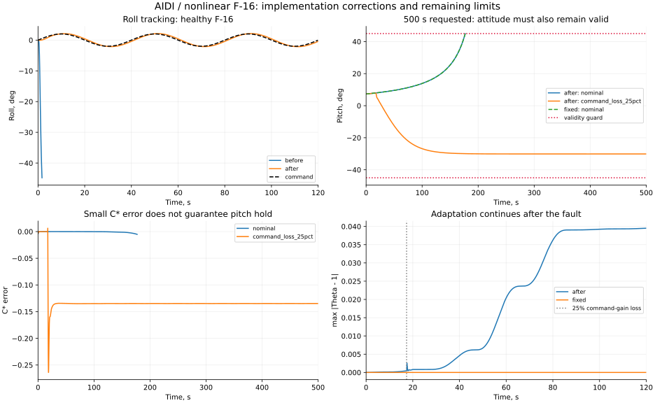

# AIDI: ошибки измерений и контуров, проверка F-16 — проход 21

Дата: 2026-09-18. Ветка: `fix/agent-runtime-bugs`. База сравнения: `3f013b2`.

## Результат

Исправлены ошибки AIDI и его подключения к нелинейному F-16. **3182 теста прошли**, включая 63 целевых теста AIDI/CLI. **Уравнения объектов и среды не изменялись**: совпали хеши 173 файлов и все девять контрольных траекторий фиксированного управления.

Старая реализация в шести опытах с малым манёвром по крену выходила за экспериментальные границы за **1,41–2,18 с**. Исправленная завершила **6/6 прогонов по 120 с**, включая потерю 25% усиления команды стабилизатора. Два дополнительных прогона с вдвое меньшим шагом физики также завершились.

**Долгосрочная устойчивость не подтверждена для всех режимов.** При заданных 500 с исправный самолёт достиг 45° по тангажу на **176,97 с**. Фиксированный идентификатор дал тот же результат. С отказом прогон завершил 500 с, но после отказа RMSE C* составила **0,1355**, максимум модуля тангажа — **30,13°**. Завершение этого эпизода не означает качественного удержания всей траектории.



Численные результаты: [JSON](physics-policy-validation-round21.json). Полные журналы и прореженные траектории этого запуска: `/tmp/physics-policy-audit-round21/`.

## Проверка по статье

Первоисточник: Ul Haq, Atmaca, van Kampen, *Adaptive Incremental Dynamic Inversion for Fault-tolerant Flight Control of a Flying Wing*, AIAA 2026-1744: [официальный PDF TU Delft](https://repository.tudelft.nl/file/File_b707118a-5ef7-4691-8c77-be7758df4a67).

- Уравнение (3) задаёт стандартную кинематику углов. Сопоставление с нативной кинематикой F-16 даёт **`(p,q,r)=(wx,wz,-wy)`**. Это вывод из уравнений, а не смена физической системы координат объекта.
- Раздел III.B, уравнения (11)–(13), (21) и рис. 3: виртуальное управление относится к ускорению; предыдущее отклонение привода и измеренное ускорение должны быть согласованы по задержке. Проверены и текст, и схема статьи.
- **Algorithm 1 подтверждает прежний знаменатель RLS с предыдущим lambda.** Формула не изменена; добавлен независимый одношаговый алгебраический тест.
- В статье отказ масштабирует аэродинамические коэффициенты. Использованный `stab_efficiency_step` уменьшает усиление команды привода. Это разные возмущения; результат не является воспроизведением эксперимента Flying V.

Наш фильтр первого порядка, C*/roll/sideslip-блоки и пропорциональный контур скоростей остаются упрощённой архитектурой. Полная структура внешнего контура статьи и модель сенсорных задержек здесь не воспроизведены.

## Исправления

1. **Первое измерение.** Дифференциатор инициализируется наблюдением в `predict(x0)`, поэтому переход `x0 → x1` больше не теряется.
2. **Обратная связь привода.** `learn(..., applied_action=...)` принимает среднее фактическое отклонение за переход. В F-16 используется трапецеидальная оценка по состояниям сервоприводов. Для идентификации ускорение и управление проходят одинаковую фильтрацию; инкрементальный закон использует фильтрованную базу.
3. **Ограничения и начало эпизода.** `reset(initial_action=...)` сохраняет балансировочное положение; ограничитель скорости сравнивает последовательные команды. Физические ограничения сервоприводов остаются в объекте.
4. **Оси.** Исправлен знак yaw в `F16NonlinearOnboardCE`, наблюдениях и восстановлении состояния. В восстановленное состояние включены крен и положения приводов. Регрессионный тест сравнивает угловую кинематику с независимыми формулами при ненулевых roll/pitch/rates.
5. **Контур скоростей.** Прежний `nu = omega_des + K*(omega_des-omega)` выдавал ненулевое ускорение даже при достигнутой постоянной скорости. Теперь `nu = K*(omega_des-omega)`, коэффициенты имеют размерность 1/с. Проверены нулевое ускорение на установившемся режиме и приближение к ненулевой скорости на интеграторе. Это корректировка интерфейса наших упрощённых блоков, а не утверждение о точном воспроизведении всех регуляторов статьи.
6. **Фиксированный идентификатор.** `adapt=False` действительно сохраняет Theta/P и счётчик обновлений, продолжая обновлять измерения. Раньше CLI лишь менял forgetting factors и продолжал обучение. Фиксация используется с начала диагностического эпизода; адаптивному варианту момент отказа не передаётся.
7. **Протокол F-16.** Балансировка вычисляется для той же угловой модели, начальный `theta=alpha`. Контроллер получает фактическую скорость аэродинамической модели 120 м/с, вместо прежних 200 м/с. Параметр `airspeed` среды сам по себе относится к реконструкции положения; его семантика не изменена.
8. **Сохранение.** Новые checkpoints сохраняют фильтр управления и незавершённый переход. Проверено точное продолжение после загрузки. Старые сохраняют обученные параметры и заново инициализируют измерительную историю.

Изменились смысл `rate_kp` и его значения по умолчанию: теперь `(1,1,1)`, нули отключают обратную связь. **Старые настройки и checkpoints требуют повторной проверки управления**; точное воспроизведение прежнего ошибочного закона не обещается. Потребители F-16 должны одновременно исправить наблюдение yaw на `-wy`.

## Постановка и результаты AIDI

- Нативная нелинейная угловая модель F-16, 14 состояний, сервоприводы второго порядка, RK4.
- Одинаковые для сравниваемых версий объект, начальные состояния, команда и ограничения. Старый пакет AIDI взят из базы без изменений формул; ему вручную установлено то же начальное балансировочное управление, так как старый `reset` его не принимал.
- Seeds 0, 1, 2 задают малые начальные отклонения углов ±0,1° и скоростей ±0,01°/с; это **не** серия разных реализаций сенсорного шума.
- Управление 100 Гц; шаг физики 0,01 с и отдельная проверка 0,005 с.
- Команда крена: синус ±2° с периодом 40 с; C*=1; beta=0.
- Отказ в 17,35 с: `mu=0.75`, то есть потеря 25% усиления абсолютной команды стабилизатора. Событие зарегистрировано средой в 17,35 с.
- Границы опыта: alpha от −10° до 35°, |beta|≤15°, |roll|,|pitch|≤45°, угловые скорости ≤100°/с; дополнительно проверяются конечность состояния/идентификатора и физические ограничения приводов. Это исследовательские ограничения, не сертифицированная область полёта.

RMSE на интервале 17,35–120 с, seed 0:

| Сценарий | Контроллер | C* | Крен, ° | Скольжение, ° |
|---|---|---:|---:|---:|
| Исправный | Адаптивный | 0,000148 | 0,30099 | 0,21007 |
| Исправный | Фиксированный | 0,000148 | 0,30194 | 0,21012 |
| Потеря 25% усиления команды | Адаптивный | 0,138218 | 0,26279 | 0,18886 |
| Потеря 25% усиления команды | Фиксированный | 0,138113 | 0,26350 | 0,18891 |

Разница адаптивного и фиксированного вариантов мала; по C* после отказа адаптивный слегка хуже. **Преимущество адаптации этот опыт не доказывает.** На каждой 120-секундной адаптивной траектории выполнено 11999 обновлений, из них 10265 после момента отказа. На 500-секундной траектории с отказом — 49999/48265 соответственно. Заморозки при отказе нет.

Уменьшение шага физики до 0,005 с изменило RMSE C* при отказе с 0,138218 до 0,138166; RMSE крена — с 0,262790° до 0,262806°. Наблюдаемый недостаток качества не объясняется грубым шагом интегрирования.

## Физика и качество других обученных контроллеров

Фиксированные команды дали **точно одинаковые** состояния/наблюдения/reward/флаги до и после правок в девяти опытах: B747, LAPAN, продольный F-16, шаги 0,02/0,01/0,005 с.

Дополнительно угловой F-16 сравнивался с независимым интегратором DOP853. Максимальная ошибка угловых скоростей при уменьшении шага RK4:

| Шаг, с | Максимальная ошибка скорости, рад/с |
|---:|---:|
| 0,02 | 1,3442e−6 |
| 0,01 | 6,0854e−8 |
| 0,005 | 3,1530e−9 |

Интеграторы используют одну аэродинамическую правую часть. Это проверяет численное интегрирование и подключение среды, **не заменяя проверку аэродинамики по экспериментальным данным**.

Отдельно iADP и AA-INDI обучались онлайн 20 с на продольном нелинейном F-16, затем каждый проверялся 30 с на другом фазовом сдвиге сигнала. Seed 0; dt=0,02 с. Отказ здесь другой: 50% усиления приращения команды относительно балансировки после 15 с. Обученные параметры скопированы в независимые оценочные эпизоды; checkpoints также сохранены.

| Алгоритм | Исправный: параметры фиксированы / обучение продолжается | Отказ: параметры фиксированы / обучение продолжается |
|---|---:|---:|
| iADP, RMSE q, °/с | 0,06867 / 0,11368 | 0,12434 / 0,15890 |
| AA-INDI, RMSE q, °/с | 0,20041 / 0,19757 | 0,18761 / 0,18105 |

Все 2 обучающих и 8 оценочных эпизодов завершились без обнаруженных нарушений проверок; ковариации оставались положительными. У iADP продолжение адаптации ухудшило метрику, у AA-INDI немного улучшило. Это короткая проверка одного seed, не доказательство общей сходимости. Код этих двух агентов не менялся в этом проходе.

## Ноутбук и оставшиеся ограничения

В `example_aidi_damage_f16.ipynb` исправлены оси, обратная связь приводов, фильтрация, условия балансировки, временные метки и неверная интерпретация Theta. Все 6 кодовых ячеек выполнены; график обновлён. Пример теперь явно использует потерю 25% команды (`mu=0.75`) вместо прежнего несоответствия подписи «25% loss» и `mu=0.25`.

**Этот pitch-only пример пока не проходит проверку восстановления:** после отказа RMSE q около 10,22°/с и нарушены ограничения углов у обоих контроллеров. Заявления о гарантированной победе адаптации и о сходимости Theta к множителю команды удалены. Результат сохранён, а не скрыт подбором параметров. Качество этого внутреннего контура нельзя переносить на полный внешний контур из CLI.

При команде C*=1 длительный здоровый прогон полного AIDI также не удерживает тангаж в заданной области. Одинаковый результат с фиксированным идентификатором указывает на проблему постановки/внешнего контура, однако не доказывает единственную причину. Следующая содержательная задача — сопоставить полный pitch reference/C* контур и восстановление перегрузки с первоисточником, определить режим удержания траектории и затем повторить длительные проверки. Подмена отказа аэродинамическим или изменение задания — отдельные эксперименты, а не исправление текущего результата.

## Воспроизведение

Использовались `OMP_NUM_THREADS=1 OPENBLAS_NUM_THREADS=1 MKL_NUM_THREADS=1 MPLBACKEND=Agg`, Python из `.venv`.

```bash
# Проверки текущей реализации, здоровый объект и потеря 25% команды.
.venv/bin/python scripts/validate_aidi_measurements.py --duration 120 --seeds 0,1,2 --versions after --output /tmp/aidi-120.json
.venv/bin/python scripts/validate_aidi_measurements.py --duration 120 --physics-dt 0.005 --seeds 0 --versions after --output /tmp/aidi-refined.json
.venv/bin/python scripts/validate_aidi_measurements.py --duration 500 --seeds 0 --versions after --output /tmp/aidi-500.json
.venv/bin/python scripts/validate_aidi_measurements.py --duration 500 --seeds 0 --versions fixed --scenarios nominal --output /tmp/aidi-fixed-500.json
.venv/bin/python scripts/validate_aidi_measurements.py --physics-only --output /tmp/aidi-physics.json
.venv/bin/python scripts/validate_adaptive_env_physics.py --repo . --output /tmp/fixed-actions.json

# Старый пакет для того же протокола; каталог должен быть новым/пустым.
mkdir -p /tmp/aidi-before
git archive 3f013b2 tensoraerospace/agent/aidi | tar -x -C /tmp/aidi-before
.venv/bin/python scripts/validate_aidi_measurements.py --duration 120 --seeds 0,1,2 --versions before --baseline-package /tmp/aidi-before/tensoraerospace/agent/aidi --output /tmp/aidi-before.json

# Обучение и отдельная оценка сохранённых параметров.
.venv/bin/python scripts/validate_adaptive_f16.py --repo . --agent iadp --seed 0 --train-duration 20 --eval-duration 30 --output /tmp/iadp-trained.json
.venv/bin/python scripts/validate_adaptive_f16.py --repo . --agent aaindi --seed 0 --train-duration 20 --eval-duration 30 --output /tmp/aaindi-trained.json

PYTEST_DISABLE_PLUGIN_AUTOLOAD=1 .venv/bin/python -m pytest tests/agent tests/agents tests/envs tests/aerospacemodel tests/examples tests/mpc tests/scripts/test_benchmark_aidi.py -p pytest_mock -p pytest_timeout -o addopts= --strict-markers --strict-config --import-mode=importlib -q
```

Валидатор записывает все результаты и возвращает код 1, если хотя бы один запрошенный прогон нарушил границы/горизонт. Неполный эпизод помечен `failed`; его RMSE относится только к пройденной части. Исследовательские отрицательные результаты не превращены в зелёные проверки сходимости.
