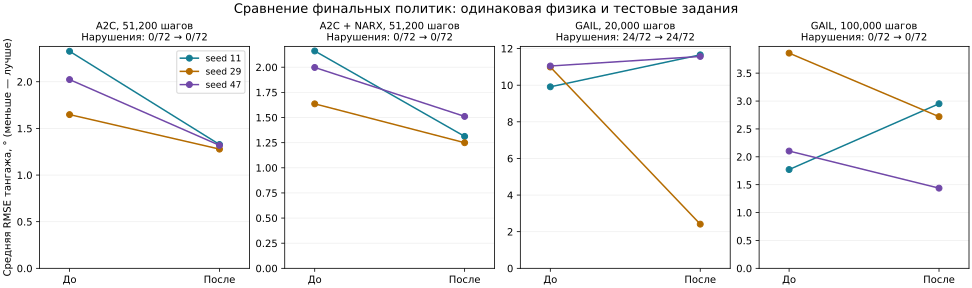

# Физика и обучение: третий проход — 16 сентября 2026

Следующий этап: [четвёртый проход — SAC, GAIL и физика B737/B747](physics-policy-validation-round4.md). Временные артефакты третьего прохода сейчас недоступны; его численные результаты сохранены в JSON.

## Результат

Исправлены переходы и цели основных `A2C` / `A2CWithNARXCritic`, насыщение и порядок обновлений GAIL, решатель балансировки и ограничения среды AAI Shadow. Добавлено **30 регрессионных случаев**.

На одинаковой линейной физике B747 обычный A2C улучшил среднюю RMSE с **1,9994° до 1,3078°**, вариант с NARX-критиком — с **1,9318° до 1,3574°**. Улучшились все три seed, нарушений ограничения тангажа нет. **GAIL всё ещё нельзя считать надёжно сошедшимся:** средняя ошибка уменьшилась, но отдельные seed ухудшились, а короткое обучение сохранило аварийные завершения.

«До» — снимок незакоммиченного дерева после [второго прохода](physics-policy-validation-round2.md), не `origin/develop`. Все прежние изменения сохранены. В этом проходе обе стороны сравнения заново обучены на CPU с Python 3.11.10 и PyTorch 2.11.0+cu130; исторические отчёты использовали другое окружение.

## Исправления агентов

### A2C и A2CWithNARXCritic

Это классы из `agent/a2c/model.py`; отдельные `Runner` / `A2CLearner` из `agent/a2c/narx.py` исправлены в предыдущем проходе.

- Буфер хранит копии наблюдений и исходную Gaussian-выборку действия. Вероятность политики больше не вычисляется для ограниченной команды как будто это исходная выборка. Исполненная команда сохранена отдельно для физической истории NARX.
- История состояний и команд сохраняется между фрагментами одного эпизода, обнуляется между эпизодами. Следующее состояние критика включает текущую команду и сдвинутую историю.
- Цели TD и дисконтированные возвраты используют оценку финального наблюдения при лимите времени и незавершённом фрагменте. Истинное завершение обнуляет продолжение; награды нового эпизода не попадают в старый. Цели отсоединены от графа градиента. Это соответствует [семантике Gymnasium](https://gymnasium.farama.org/tutorials/gymnasium_basics/handling_time_limits/).
- Обновление по одному переходу больше не создаёт NaN из выборочной дисперсии и не обнуляет градиент актёра центрированием единственного преимущества. Регрессионный тест проверяет направление изменения политики, а не только конечность весов.
- `RolloutTransition` сохраняет распаковку пяти полей и метаданные завершения/истории. Старые кортежи принимаются, но по одному `done` нельзя восстановить лимит времени или историю предыдущего фрагмента.

### GAIL

При уверенно неверном ответе дискриминатора прежняя связка sigmoid + BCE давала нулевой градиент: для логита ±100 ошибка была 100, а градиент последнего смещения — 0. Новая `BCEWithLogitsLoss` сохраняет градиент ±1. Награда вычисляется как `softplus(-logit)`; она эквивалентна `-log(D)` без искусственного плато при малой вероятности. При логите −1000 тест получает награду 1000. [Документация PyTorch о численной устойчивости](https://docs.pytorch.org/docs/2.14/generated/torch.nn.BCEWithLogitsLoss.html).

После сбора траектории сначала обновляется дискриминатор, затем его новая версия формирует награды для GAE/PPO. Прежний порядок обновлял политику по старой награде. Порядок согласован с [алгоритмом 1 исходной статьи GAIL](https://arxiv.org/html/1606.03476v1); оптимизатор политики здесь остаётся PPO. Тест отдельно проверяет использование новой версии награды.

`Discriminator.forward()` по-прежнему возвращает вероятность. Имена и размеры параметров сетей не менялись. Число обновлений политики одинаково между сравниваемыми версиями: 1280 при 20 000 шагах, 6400 при 100 000. Гиперпараметры под результат не подбирались.

## Физика и среда AAI Shadow

Неограниченный поиск балансировки мог вывести газ за единицу и застрять в области насыщения двигателя с нулевой производной. Использован ограниченный метод наименьших квадратов: газ `[0,1]`, руль в пределах модели, угол атаки `(-π/2, π/2)`. Успех требует малого остатка уравнений движения. Коэффициенты аэродинамики, тяга и сами дифференциальные уравнения не изменены.

| Shadow, 1000 м, 37,8 м/с | До | После |
|---|---:|---:|
| Сходимость балансировки | нет | да |
| Газ | 1,1393 — вне диапазона | 0,9823 |
| Норма остатка | 0,02977 | < 1×10⁻¹² |
| Дрейф высоты за 5 с | 0,1778 м | < 1×10⁻⁶ м |
| Максимальный дрейф компонент скорости | 0,08458 м/с | < 1×10⁻⁶ м/с |

Точки 34,2 и 36 м/с также сходятся. Среда копирует исходное состояние, проверяет конечность значений и корректность времени, ограничивает команды перед интегрированием. Заданные параметры повреждения вызывают `NotImplementedError`: ранее они молча игнорировались, а модели повреждений Shadow нет.

Независимые проверки физики:

- На 100 возмущённых состояниях Shadow проверены `I·ω_dot + ω×(I·ω) = M` и равенство производной полной энергии мощности внешних сил/моментов. Учтён недиагональный момент инерции `Ixz`; допуски — 1×10⁻¹⁰ для моментов и 1×10⁻⁸ Вт для энергии.
- За 2 с с возмущёнными командами ошибка RK4 относительно DOP853: **1,785×10⁻⁶ → 9,321×10⁻⁸ → 5,332×10⁻⁹** при `dt=0,04 → 0,02 → 0,01 с`. Это максимум компонент ошибки состояния в собственных единицах. Уменьшение ошибки согласуется с четвёртым порядком.
- Повторены проверки F-16, X8, B737, B747 и квадрокоптера. Их результаты не ухудшились. Баланс энергии квадрокоптера: максимальный остаток 1,78×10⁻¹⁵ Вт; X8 сохраняет проверенную точность RK4.

**Открытые ограничения:** нелинейный B747 по-прежнему не балансируется в двух проверенных точках — 750 и 787,5 ft/s при 30 000 ft. Это прежняя проблема, её нельзя выдавать за установившийся полёт. Проверка Shadow не подтверждает реальные коэффициенты по лётным измерениям, сваливание или весь лётный диапазон. Приводы остаются идеальными; динамика сервоприводов и физическое смешивание V-хвоста не добавлены. Удалены необоснованные утверждения документации о подтверждённой реальной продолжительности полёта и потолке.

## Сравнение обученных политик

**24 основных обучения**, seed `11, 29, 47`; оцениваются финальные веса без выбора лучшего checkpoint. Ещё три промежуточных запуска GAIL с одним исправлением логитов сохранены отдельно. В каждой паре проверены одинаковые исходные оценки политики, SHA-256 среды, а для GAIL — SHA-256 демонстраций.

Общая среда — линейная продольная модель B747 с ограничениями привода, `dt=0,05 с`, горизонт 10 с, наблюдение со ссылочным сигналом. Обучение использует случайные ступени ±4° с модулем не менее 1°. Оценка: 24 фиксированных эпизода на seed со ступенями ±2°/±4° и включением в 0,5–1,5 с. Нарушение — выход за ±20° тангажа. Тесты политик нелинейных Shadow/X8 этим экспериментом не заменяются.

| Алгоритм, шаги обучения | RMSE до | После | Нарушения до → после |
|---|---:|---:|---:|
| A2C, 51 200 | 1,9994° | 1,3078° | 0/72 → 0/72 |
| A2C + NARX-критик, 51 200 | 1,9318° | 1,3574° | 0/72 → 0/72 |
| GAIL, 20 000 | 10,6510° | 8,5463° | 24/72 → 24/72 |
| GAIL, 100 000 | 2,5778° | 2,3698° | 0/72 → 0/72 |

| Seed | A2C | A2C + NARX | GAIL, 20 000 | GAIL, 100 000 |
|---|---:|---:|---:|---:|
| 11 | 2,327 → 1,327 | 2,162 → 1,312 | 9,912 → 11,657 | 1,771 → 2,952 |
| 29 | 1,648 → 1,278 | 1,636 → 1,249 | 10,993 → 2,412 | 3,859 → 2,720 |
| 47 | 2,024 → 1,318 | 1,998 → 1,511 | 11,049 → 11,570 | 2,103 → 1,438 |



A2C: 400 обновлений ×128 шагов, `gamma=0.99`, actor LR=0,0004, critic LR=0,001, entropy=0,001, сети 64×64; NARX имеет длину истории 2. Средняя RMSE снизилась на **34,6%** и **29,7%** соответственно. В сохранённых оценках каждые 50 обновлений нарушений тангажа также нет, но ошибка не убывает монотонно. Конечные политики лучше своих необученных версий; это не доказательство устойчивости на всех задачах.

GAIL: 40 эпизодов эксперта PD, rollout=128, minibatch=64, 4 эпохи PPO, LR=0,0003; штатные сети 256/128. Средняя RMSE снизилась на 19,8% при коротком бюджете и на 8,1% при длинном. Однако seed 11 ухудшился в обоих режимах; seed 47 ухудшился в коротком. При 20 000 шагах seed 11 завершает все 24 эпизода по нарушению ограничения. RMSE считается по активным шагам до завершения, поэтому её нельзя оценивать отдельно от числа нарушений. При 100 000 шагах нарушений нет, но качество всё ещё хуже PD-эксперта с RMSE≈0,954°.

**Требование «изменения не ухудшают качество ни одной политики» для GAIL не подтверждено.** Исправления устраняют конкретные ошибки, но численная конечность не равна сходимости. Нужен отдельный этап стабилизации и проверки режима обучения GAIL перед использованием его как надёжного регулятора. Все 24 основных запуска завершились без NaN/Inf в контролируемых метриках и весах; промежуточные неудачные результаты не скрыты в JSON. Три seed — ограниченный эксперимент, не статистическая гарантия.

## Проверки кода

- **2669 passed**, 14 предупреждений; **20637 / 22228 = 92,84%** покрытия. Порог 92% пройден; предыдущий проход — 92,63%. Исключён `tests/optimization/ray_test.py`, как в предыдущих проходах.
- Flake8: 29≤30; Ruff: 0; mypy: 0; Bandit: 82≤114, medium 59≤83, high 0. Пороги не ослаблялись.
- Строгая сборка MkDocs, Black/isort и `git diff --check` проверены.
- Локальный W&B 0.18.7 был ниже заявленного минимума `>=0.19.10` и ломал существующий тест двух параллельных writer. Окружение приведено к `wandb==0.27.2` из `poetry.lock`; код writer и требования зависимостей не менялись.
- Python 3.11.10, NumPy 1.26.4, SciPy 1.15.3, PyTorch 2.11.0+cu130; вычисления на CPU. CUDA и весь набор версий зависимостей не проверялись.

## Воспроизведение и артефакты

[Численные результаты, кривые A2C и контрольные суммы](physics-policy-validation-round3.json). Скрипты: [физика](../scripts/validate_physics.py), [A2C](../scripts/validate_a2c.py), [GAIL](../scripts/validate_gail.py).

```bash
export OMP_NUM_THREADS=1 MKL_NUM_THREADS=1 MPLBACKEND=Agg WANDB_MODE=disabled
.venv/bin/python scripts/validate_physics.py --repo . --output /tmp/physics-after.json
.venv/bin/python scripts/validate_a2c.py --repo . --env-source tensoraerospace/envs/b747_vec_torch.py --critic plain --seed 11 --updates 400 --output /tmp/a2c-after-11.json
.venv/bin/python scripts/validate_a2c.py --repo . --env-source tensoraerospace/envs/b747_vec_torch.py --critic narx --seed 11 --updates 400 --output /tmp/a2c-narx-after-11.json
.venv/bin/python scripts/validate_gail.py --repo . --env-source tensoraerospace/envs/b747_vec_torch.py --seed 11 --frames 20000 --output /tmp/gail-after-11.json
.venv/bin/python scripts/validate_gail.py --repo . --env-source tensoraerospace/envs/b747_vec_torch.py --seed 11 --frames 100000 --output /tmp/gail-long-after-11.json
```

Повторить для seed 29 и 47. Контрольный снимок третьего прохода: `/tmp/physics-policy-audit-round3/before`; для сравнения меняется только `--repo`, файл среды общий. JSON, TensorBoard, логи и веса `.pt` текущих запусков находятся в `/tmp/physics-policy-audit-round3/`. Это временное хранилище; численные результаты продублированы в `reports/`. Временные веса и исходные снимки первых двух проходов больше недоступны, их сохранённые JSON-результаты остаются в репозитории.
