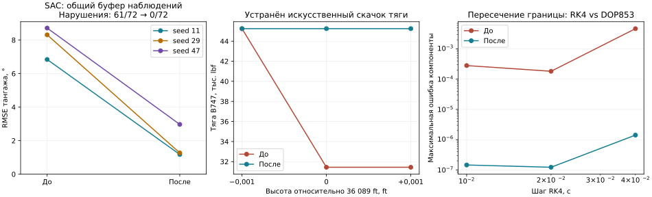

# Физика и обучение: четвёртый проход — 17 сентября 2026

## Результат

Исправлены сбор опыта и короткие запуски SAC, bootstrap GAIL при автоматическом reset, ограничения сред B737/B747, поиск и проверка балансировки, разрыв тяги на тропопаузе. Добавлено **46 регрессионных случаев**; **41 проверка падает на контрольной версии**. Полный набор: **2715 тестов**.

На трёх seed SAC с общим буфером наблюдений улучшился с **7,9525° до 1,8041° RMSE**, нарушения предела тангажа — **61/72 → 0/72**. После исправления все тензоры весов совпадают с контрольным SAC, которому среда возвращает независимые наблюдения. GAIL при 100 000 шагах сохранил те же веса и результаты. Его прежняя нестабильность короткого обучения остаётся открытой.

«До» — снимок незакоммиченного дерева после [третьего прохода](physics-policy-validation-round3.md), а не `origin/develop`. Прежние изменения сохранены. [Численные данные и контрольные суммы](physics-policy-validation-round4.json).

## Исправления агентов

### SAC

`ReplayMemory.push()` уже копировал массивы, но делал это **после** `env.step()`. Если среда переиспользовала массив наблюдения, к этому времени исходное состояние перехода уже было изменено. В памяти оказывалось неверное соответствие состояния, действия и результата.

Теперь `train()` копирует состояние до шага среды. При завершении эпизода используются `final_observation` или `terminal_observation`, если среда автоматически сбросилась. Усечение сохраняет bootstrap, истинное завершение его обнуляет. Пользовательский предел шагов корректно отмечается в метриках как усечение. Правила bootstrap соответствуют [семантике Gymnasium](https://gymnasium.farama.org/tutorials/gymnasium_basics/handling_time_limits/).

Дополнительно исправлен сбой короткого обучения до накопления первого батча: отсутствие обновлений теперь явно записывается как ноль, и проверка обязательных метрик не прерывает такой запуск. Формулы SAC, размеры сетей и гиперпараметры не менялись.

### GAIL

При усечении сборщик теперь принимает оба варианта поля финального наблюдения и обрабатывает `final_observation=None`. Ранее использовалось наблюдение уже сброшенного эпизода либо нечисловое значение. Регрессионные тесты проверяют аналитическую цель ценности и оба флага завершения.

Это исправление контракта среды, а не стабилизация состязательного обучения. Проблемы GAIL на коротком бюджете из предыдущего отчёта остаются актуальными.

## Балансировка и ограничения сред

### B737 и B747

- Поиск ограничен физическими пределами газа и руля высоты; начальное приближение также ограничивается. Решатель больше не застревает просто потому, что начальный газ оказался выше единицы.
- Для поиска три продольных ускорения масштабированы: линейные — по `g`, угловое — по `g/cbar`. Это устраняет несопоставимость их численных величин в задаче наименьших квадратов. Сами уравнения движения и коэффициенты аэродинамики не менялись.
- `residual` сообщает немасштабированную норму **всех шести** ускорений связанных осей; успех требует `residual <= tol`. Раньше малый продольный остаток мог скрыть ускорение рыскания при отказе двигателя.
- В воспроизведении B747 на уровне моря при 500 ft/s и отказе левого внешнего двигателя прежний решатель возвращал `converged=True`, хотя ускорение рыскания составляло около **−0,02017 rad/s²**. Теперь такой результат отвергается. Боковые команды для балансировки отказа этим изменением **не рассчитываются**.
- Среды копируют исходное состояние, отвергают NaN/Inf и некорректное время, ограничивают команды по объявленным пределам. В B747 ограничение выполняется перед поддерживаемыми воздействиями повреждений.
- Среда B737 раньше молча игнорировала `damage_profile` и callback. Теперь их передача вызывает `NotImplementedError`. Поддержка повреждений в B747 сохранена.

Две прежние проблемные точки B747 при 30 000 ft и 750/787,5 ft/s **не исправлены до физически допустимого равновесия**. Существующая модель при ограниченных командах не даёт принятого решения; они не объявляются установившимся полётом. Численный остаток неуспешного кандидата может отличаться из-за ограничений и масштабирования решателя.

## Непрерывность тяги

В B737/B747 множитель плотности менялся с `sigma**0.7` на `sigma` при 36 089 ft без согласования опорного значения. Из-за этого пересечение границы всего на 0,002 ft снижало тягу на **30,52%**.

Верхняя ветвь теперь продолжается от значения нижней на границе и далее пропорциональна плотности. Показатели степеней и зависимость от числа Маха сохранены. Односторонние опорные значения учитывают округлённые константы ISA. Разделение атмосферных слоёв описано в [модели атмосферы NASA](https://www1.grc.nasa.gov/beginners-guide-to-aeronautics/earth-atmosphere-equation-english/); непрерывное согласование используемой здесь кривой тяги — исправление реализации, а не результат калибровки двигателя по этому источнику.

| Полный газ, M=0,8 | До, ниже → выше границы | После, ниже → выше |
|---|---:|---:|
| B747 | 45 248,03 → 31 437,56 lbf | 45 248,03 → 45 248,03 lbf |
| B737 | 6 964,93 → 4 839,11 lbf | 6 964,93 → 6 964,93 lbf |

Относительная разница через 0,002 ft после исправления — **7,53×10⁻⁸**. Ниже границы закон тяги сохранён; выше тяга примерно на **43,9%** больше прежней разрывной реализации. Это существенное изменение для высотных контроллеров, которое нельзя объявлять безусловно совместимым с ранее обученными политиками.

Проверки физики:

- По 100 возмущённых состояний B737/B747, включая по 50 состояний с отказом двигателя: проверены уравнение вращения с недиагональной инерцией и баланс полной энергии с мощностью аэродинамических сил, тяги и моментов.
- Максимальный остаток энергии: **3,35×10⁻⁸ ft·lbf/s** для B747 и **8,15×10⁻⁹ ft·lbf/s** для B737. Остаток моментов — соответственно **2,79×10⁻⁹** и **2,33×10⁻¹⁰ lbf·ft**.
- За двухсекундный манёвр обе модели пересекают границу снизу вверх, затем возвращаются ниже. RK4 сравнивался с независимым DOP853. При `dt=0,01 с` максимальная ошибка компоненты состояния снизилась у B747 с **2,81×10⁻⁴ до 1,46×10⁻⁷**, у B737 — с **1,70×10⁻³ до 1,07×10⁻⁷**. Компоненты имеют собственные единицы; это не единая физическая норма. Из-за смены наклона функции на границе строгий четвёртый порядок здесь не утверждается.
- Повторены прежние проверки F-16, X8, Shadow и квадрокоптера; их результаты сохранены. Номинальные успешные балансировки B737/B747 также удерживают равновесие.

Эти проверки подтверждают внутреннюю согласованность. Измеренные характеристики двигателей, полётные данные и весь диапазон режимов не проверялись. Динамика сервоприводов и раскрутка двигателей в этих моделях по-прежнему не реализованы.

## Обученные политики: 15 запусков

### SAC: сравнение способа передачи наблюдений

По 20 000 взаимодействий, seed `11, 29, 47`, одинаковая линейная продольная физика B747. Девять запусков: прежний агент с общим буфером, прежний агент с независимыми массивами, исправленный агент с общим буфером. Адаптер меняет только владение массивом наблюдения; физика, награда и данные наблюдения одинаковы.

| Seed | До, общий буфер | Контроль, независимые массивы | После, общий буфер |
|---|---:|---:|---:|
| 11 | 6,8380° | 1,1757° | 1,1757° |
| 29 | 8,3075° | 1,2688° | 1,2688° |
| 47 | 8,7121° | 2,9679° | 2,9679° |
| Среднее | **7,9525°** | **1,8041°** | **1,8041°** |
| Нарушения тангажа | **61/72** | **0/72** | **0/72** |

Сравнены не только метрики, но и каждый тензор финальных весов политики и критика: исправленный сбор опыта точно воспроизводит контроль с независимыми наблюдениями. Все три итоговые политики лучше необученных. Seed 47 заметно слабее остальных и ухудшается относительно своей промежуточной оценки на 5000 шагах; монотонная или гарантированная сходимость не утверждается.

Сети 64×64, minibatch=128, alpha=0,01, gamma=0,99, LR=0,0003, автоматическая настройка энтропии выключена. Для точного бюджета сценарий вызывает штатное обучение по одному эпизоду с пределом оставшихся шагов. Проверка полноты метрик выполняется после общего бюджета: в контрольной версии короткий первый эпизод мог закончиться до первого обновления и ошибочно остановить сценарий. Три таких прерванных запуска сохранены в JSON, затем сценарий исправлен одинаково для обеих сторон.

### GAIL: проверка отсутствия регрессии

Шесть запусков, по 100 000 шагов, три seed до/после. Итоговая RMSE: **2,9518°; 2,7198°; 1,4379°**, средняя **2,3698°**; нарушений **0/72**. Начальные оценки, демонстрации, итоговые метрики и все тензоры сохранённых сетей совпали. В данном сценарии среда не требует исправленного альтернативного поля финального наблюдения; этот случай отдельно покрыт аналитическими тестами.

Проверка не отменяет **24/72 нарушения при 20 000 шагах**, выявленные в предыдущем проходе. Короткий бюджет в этом проходе заново не запускался, поскольку режим обучения GAIL не менялся. Отсутствие NaN/Inf и сохранение длинного результата не доказывают надёжность GAIL на иных режимах.



Оценка во всех запусках: 24 фиксированных эпизода на seed, ступени ±2°/±4°, включение 0,5–1,5 с, горизонт 10 с, `dt=0,05 с`; нарушение — выход тангажа за ±20°. RMSE учитывает активные шаги до завершения и рассматривается вместе с числом нарушений. Оцениваются финальные веса, а не лучший checkpoint. Контрольные суммы среды и демонстраций сохранены.

**Область проверки политик — линейный B747.** Она не подтверждает качество обученных контроллеров нелинейных B737/B747 выше тропопаузы. Для допуска таких контроллеров нужен отдельный эксперимент с соответствующими наблюдениями, действиями и моделью двигателя. Изменение высотной тяги нельзя скрывать за успешным тестом агента на другой физике.

## Проверки и воспроизведение

- **2715 тестов проходят**, добавлено 46 случаев; исключён `tests/optimization/ray_test.py`, как в предыдущих проходах. Покрытие **20707 / 22301 = 92,85%**, порог 92% пройден (предыдущий проход — 92,84%).
- Flake8: 30≤30; Ruff: 0; mypy: 0; Bandit: 82≤114, medium 59≤83, high 0. Пороги не ослаблялись.
- Строгая сборка MkDocs, Black/isort и `git diff --check` пройдены.
- CPU; Python 3.11.10, NumPy 1.26.4, SciPy 1.15.3, PyTorch 2.11.0+cu130.

```bash
export OMP_NUM_THREADS=1 MKL_NUM_THREADS=1 MPLBACKEND=Agg WANDB_MODE=disabled
.venv/bin/python scripts/validate_physics.py --repo . --output /tmp/physics-after.json
.venv/bin/python scripts/validate_transport_physics.py --repo . --output /tmp/transport-after.json
.venv/bin/python scripts/validate_sac_scalar.py --repo . --env-source tensoraerospace/envs/b747_vec_torch.py --seed 11 --frames 20000 --buffer-mode reused --output /tmp/sac-after-11.json
.venv/bin/python scripts/validate_gail.py --repo . --env-source tensoraerospace/envs/b747_vec_torch.py --seed 11 --frames 100000 --output /tmp/gail-after-11.json
```

Повторить для seed 29 и 47. Контрольная версия — `/tmp/physics-policy-audit-round4/before`; у SAC контроль способа передачи массива задаётся `--buffer-mode copied`. Файл среды остаётся общим. Временные логи, TensorBoard, веса `.pt` и исходные JSON находятся в `/tmp/physics-policy-audit-round4/`. Численные результаты, график и контрольные суммы продублированы в `reports/`.
