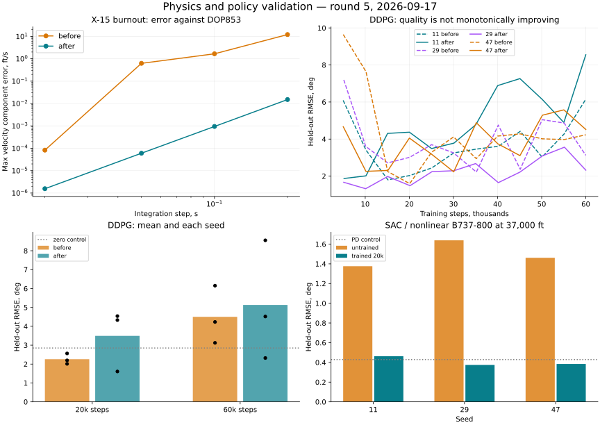

# Физика и обучение: пятый проход — 17 сентября 2026

## Результат

Исправлены выгорание топлива X-15, входные контракты его среды и хранение переходов DDPG. Добавлены защита загрузки старого replay, восстановление режима нормализации и исправление расписания шума OU.

**Физические проверки прошли, но отсутствие ухудшения качества всех политик не подтверждено.** DDPG с прежними настройками имеет регрессию средней точности, в том числе после увеличения бюджета. Это открытая проблема качества обучения. SAC на отдельной задаче тангажа нелинейного B737-800 обучился без наблюдаемой потери устойчивости.

## X-15: импульс при выгорании

Ранее интегратор мог продолжить прикладывать тягу в шаге, на который топлива уже не хватало. Обнуление отрицательного остатка в конце шага не убирало лишний импульс. Теперь шаг разделяется в физический момент выгорания: участок с тягой и участок без неё. RK4 на конце первого участка вычисляет левый предел правой части, чтобы не выключать двигатель преждевременно в последней стадии.

При постоянной команде расход топлива внутри участка постоянен. Для изолированной горизонтальной ракеты без аэродинамики используется независимый ориентир:

`Δu = Isp × g₀ × ln(1 + propellant_lb / empty_weight_lb)`.

Это применение [идеального уравнения ракеты NASA](https://www1.grc.nasa.gov/beginners-guide-to-aeronautics/ideal-rocket-equation/) и определения [удельного импульса](https://www1.grc.nasa.gov/beginners-guide-to-aeronautics/specific-impulse/). В коде топливо выражено в lb, поэтому его расход равен `T_lbf / Isp_s`; расход в slug/s дополнительно делится на `g₀`.

- Топлива на 0,1 с, шаг 1 с: ожидается **12,55144 ft/s**, старый RK4 давал **62,70902 ft/s**, исправленный — **12,55144 ft/s**. Euler раньше давал **125,41805 ft/s**, теперь — **12,54180 ft/s**: его ошибка первого порядка сохраняется.
- Проверены выгорания на 0,1/0,5/1,0 с обоими интеграторами. Максимальная абсолютная ошибка RK4 — **5,63×10⁻⁸ ft/s**; после выгорания дополнительного ракетного импульса нет.
- С аэродинамикой: начальная скорость 2000 ft/s, высота 70 000 ft, угол атаки 4°, руль −1°, газ 100%; выгорание на 0,037/0,37 с и контроль без выгорания в течение 1 с. Сравнение с кусочным DOP853 (`rtol=atol=1e-12`, `max_step=0,002 с`). При выгорании на 0,37 с и `dt=0,1 с` максимальная ошибка компоненты скорости уменьшилась с **1,66834 до 0,000943 ft/s**. Для нового RK4 при шагах 0,2/0,1/0,05/0,02 с ошибки составляют **0,01503 / 0,000943 / 0,0000601 / 0,00000156 ft/s**.
- В контрольных траекториях без выгорания значения до/после совпали. Коэффициенты аэродинамики, номинальная тяга и закон изменения инерции не менялись.

Дополнительно `default_state(config=...)` берёт полный запас из параметров конфигурации: 17 900 lb для BASIC и 30 900 lb для A2 вместо жёстко заданных 13 000 lb. Именованные условия полёта сохраняют собственные частичные загрузки. Среда копирует начальное состояние, ограничивает действия, отвергает NaN/Inf и неверное время, явно отклоняет неподдерживаемые аргументы повреждений.

Документация теперь отличает реализованные ограничения команд от отсутствующих ограничений скорости приводов. Постоянные тяга/Isp и вращение с мгновенными инерциями остаются приближениями. Поток углового момента истекающих газов, движение топлива, калибровка по полётным данным и полный высотный диапазон не проверялись. DOP853 использует ту же аэродинамическую правую часть: это независимая проверка интегратора, не аэродинамической базы.

Повторные проверки квадрокоптера, F-16, X8, Shadow, B737/B747 — баланс энергии и моментов, равновесия и интегрирование — **точно совпали с результатами четвёртого прохода**. Его ограничения, включая неуспешные точки балансировки B747, остаются в силе.

## DDPG: исправления

1. Replay сохраняет копии исходных наблюдений и действий. Статистика нормализации получает снимки состояний до вызова среды.
2. Оба состояния выбранного перехода нормализуются одной текущей статистикой. Раньше в replay смешивались координаты, полученные по разным средним/дисперсиям.
3. При автоматическом сбросе берётся `final_observation` либо `terminal_observation`; ограничение времени не превращается в терминальный переход.
4. Файловые checkpoint помечают исходный replay версией `raw_v1`. Старый нормализованный replay нельзя обратить без исторических статистик: он пропускается с предупреждением. Веса, оптимизаторы и статистика загружаются. Старый replay без нормализации совместим. Проверено точное сохранение выходов политики при загрузке в агент с противоположной настройкой нормализации.
5. Убывающий шум OU использует общий счётчик шагов внутри `learn()`, а масштаб текущего шага применяется до генерации шума. Раньше расписание перезапускалось в эпизодах и отставало на один шаг. Два новых теста воспроизводят дефекты в исходной версии.

Хранение переходов соответствует постановке replay в [описании DDPG OpenAI Spinning Up](https://spinningup.openai.com/en/latest/algorithms/ddpg.html). Конкретный контракт нормализации и миграция checkpoint — решения этого проекта.

### Сравнение обучения: 15 запусков DDPG

Одна и та же линейная продольная физика B747, seed 11/29/47. Настройки: сети 256×256, batch=128, critic LR=0,001, actor LR=0,0001, gamma=0,99, tau=0,005, warmup=1000, replay=50 000, без ограничения Bellman target, нормализация включена. Шум OU постоянный `min_sigma=max_sigma=0,3`, поэтому исправление расписания не меняет численные результаты этих запусков.

Девять коротких запусков по 20 000 шагов: исходный агент с копиями наблюдений, исправленный с копиями, исправленный с общим массивом. **Все веса четырёх сетей и статистика нормализации точно совпали между двумя вариантами исправленного агента для каждого seed.** Это подтверждает устранение зависимости от владения массивом; не является доказательством сходимости.

RMSE финальных политик при 20 000 шагах:

| Seed | До | После |
|---|---:|---:|
| 11 | 2.0110° | 4.3291° |
| 29 | 2.1962° | 1.6078° |
| 47 | 2.5622° | 4.5395° |
| Среднее | **2.2565°** | **3.4922°** |

После обнаружения ухудшения выполнены ещё шесть запусков с бюджетом **60 000** шагов. Сохранены те же настройки и все три seed, без выбора лучшего checkpoint:

| Seed | До | После |
|---|---:|---:|
| 11 | 6.1506° | 8.5511° |
| 29 | 3.1224° | 2.3210° |
| 47 | 4.2292° | 4.5184° |
| Среднее | **4.5007°** | **5.1301°** |

В финальной оценке при 20 000 шагах — 0/72 нарушений до и после; при 60 000 после — 0/72. Но это слабее требования хорошего слежения: нулевое управление даёт **2,8493°**, простой PD — **0,9538°**. Веса и логируемые потери конечны, однако политика может деградировать. **DDPG с этими настройками не признан сошедшимся или прошедшим проверку отсутствия регрессии качества.** Механическая корректность replay исправлена; для устойчивого обучения нужен отдельный подбор режима и анализ причин деградации.

Оценка DDPG: 24 фиксированных эпизода, ступени ±2°/±4° на 0,5–1,5 с, горизонт 10 с, `dt=0,05 с`. Нарушение — выход тангажа за ±20°. Ошибка считается на активной части эпизода и всегда рассматривается вместе с числом нарушений. Кривые каждые примерно 5000 шагов сохранены в JSON. Промежуточные нарушения также видны там; ноль финальных нарушений не распространяется на всё обучение.

## SAC на нелинейном B737-800: три запуска

Проверка расширена на полную нелинейную модель с текущим законом тяги выше тропопаузы. Начальная балансировка: **37 000 ft, 800 ft/s**, B737-800; газ **0,88717** зафиксирован в балансировочном значении. Агент управляет добавкой руля высоты в пределах ±3°; цель — ступени тангажа относительно балансировки. Это задача продольного управления с полной правой частью 6-DoF, а не обучение произвольному манёвру по всем осям.

SAC: сети 64×64, batch=128, 20 000 шагов на seed, LR=0,0003, gamma=0,99, автоматическая настройка энтропии, начальная alpha=0,2. Обучающие ступени равномерны в ±2°. Оценка: 12 комбинаций ступеней ±1°/±2° и времени 0,5/1,0/1,5 с; 10 секунд при `dt=0,05 с`. Критерии нарушения: отклонение тангажа >15°, скорость вне 650–950 ft/s, высота ниже 35 000 ft.

| Seed | Необученная политика | После 20 000 шагов | Нарушения |
|---|---:|---:|---:|
| 11 | 1.3759° | 0.4627° | 0/12 |
| 29 | 1.6384° | 0.3740° | 0/12 |
| 47 | 1.4613° | 0.3844° | 0/12 |
| Среднее | | **0.4071°** | **0/36** |

Без добавки к балансировочному управлению RMSE **1,4266°**, у PD — **0,4290°**. SAC сопоставим с этим простым контроллером, не превосходит его во всех seed. Во всех финальных эпизодах скорость осталась в **791,79–808,76 ft/s**, высота — **36 808,74–37 171,56 ft**, отклонение тангажа — не более **2,115°**. NaN/Inf в действиях, состояниях, параметрах и логируемых потерях не обнаружены. Seed 11 практически перестал улучшаться к концу обучения; монотонная сходимость не утверждается.

Это проверка **новых политик на текущей модели**. Она не подтверждает совместимость ранее обученных высотных политик с изменением тяги четвёртого прохода, устойчивость при отказах или качество во всём лётном диапазоне. Отдельная обученная политика X-15 в этом проходе не проверялась.



## Проверки и воспроизведение

- **2746 тестов**, 0 ошибок assertions, 0 ошибок выполнения; добавлен 31 регрессионный случай. Как ранее, исключён `tests/optimization/ray_test.py`.
- Покрытие: **20760 / 22350 = 92.89%**, требование ≥92% пройдено.
- Flake8 30≤30; Ruff 0; mypy 0; Bandit 82≤114, medium 59≤83, high 0. Baseline не ослаблялся.
- Black/isort, `git diff --check`, строгая сборка MkDocs — пройдены.
- CPU, Python 3.11.10, NumPy 1.26.4, SciPy 1.15.3, PyTorch 2.11.0+cu130. Всего **18 запусков обучения** (15 DDPG и 3 SAC).

```bash
export OMP_NUM_THREADS=1 MKL_NUM_THREADS=1 MPLBACKEND=Agg WANDB_MODE=disabled
.venv/bin/python scripts/validate_x15_physics.py --repo . --output /tmp/x15-after.json
.venv/bin/python scripts/validate_physics.py --repo . --output /tmp/physics-after.json
.venv/bin/python scripts/validate_transport_physics.py --repo . --output /tmp/transport-after.json
.venv/bin/python scripts/validate_ddpg.py --repo . --env-source tensoraerospace/envs/b747_vec_torch.py --seed 11 --frames 20000 --buffer-mode reused --output /tmp/ddpg-after-11.json
.venv/bin/python scripts/validate_nonlinear_policy.py --repo . --seed 11 --frames 20000 --output /tmp/sac-nonlinear-11.json
```

Повторить обучение для seed 29 и 47. Для длинного DDPG — `--frames 60000`. Исходная версия — `/tmp/physics-policy-audit-round5/before`, для неё используется `--buffer-mode copied`; источник среды всегда одинаков. Длинные процессы стартовали до окончательных правок загрузки и OU: загрузка в них не вызывается, а постоянная sigma делает старый и новый порядок шума эквивалентными.

Численные данные, кривые и SHA256 артефактов сохранены в [JSON](physics-policy-validation-round5.json). Логи, веса, TensorBoard и снимок исходников — в `/tmp/physics-policy-audit-round5/`; они временные. Изменения этого прохода не закоммичены.
