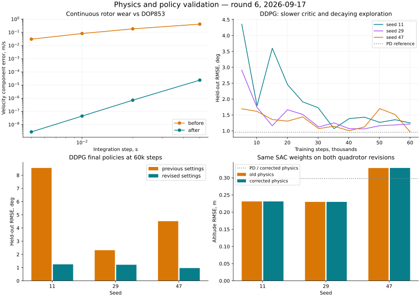

# Физика и обучение: шестой проход — 17 сентября 2026

## Результат

Исправлены преждевременное применение отказов роторов, неверная длительность износа и порядок событий; постепенная потеря тяги теперь учитывается внутри интегратора. В DDPG исправлен публичный путь применения обученной политики: `predict()` использует сохранённую нормализацию, пример рендера переведён на него.

Для прежней проблемы качества DDPG подобран и проверен режим обучения **на конкретной задаче B747**. При 60 000 шагах средняя ошибка снизилась с **5.1301° до 1.1443°**, финальных нарушений тангажа 0/72. Это настройка обучения; обновления актора/критика в этом проходе не менялись. Результат не доказывает универсальную или монотонную сходимость.

## Квадрокоптер: ошибки физического времени

Прежняя среда сначала применяла события до конца шага, затем интегрировала весь шаг с уже повреждёнными роторами. Например, остановка всех роторов на **0,015 с** внутри шага **0,02 с** приводила к скорости падения **0,1962 м/с**, хотя без сопротивления ожидается **0,04905 м/с**. Отказ на правой границе 0,02 с также ошибочно влиял на предшествующий интервал.

Исправления:

- Шаг делится на гладкие участки в точные моменты событий. Событие на правой границе действует на следующий участок, RK4 использует левый предел управления на конце предыдущего.
- Экспоненциальная эффективность вычисляется на каждой стадии интегратора. Раньше её значение на конце шага применялось ко всему шагу.
- Менеджер сортирует вместе события профиля и внедрённые события. Износ интегрируется до очередного события, затем от него до следующего. Одновременные события сохраняют порядок профиля, затем внедрения.
- Длительность берётся из временных меток; старый аргумент `dt` сохранён для совместимости. Журнал записывает фактический `trigger_time`.
- Сохраняется один отсчёт состояния на внешний шаг; `info` и история управления содержат эффективную команду на конец шага, а не среднюю по интервалу.
- Среда и состояние повреждений копируют входные массивы. Некорректные время, пределы скорости, NaN/Inf отклоняются. Плохая команда не успевает изменить ни повреждения, ни состояние объекта.

Матрица распределения тяги и уравнения Ньютона–Эйлера не менялись. Последовательность «команда тяги/моментов → скорости роторов → ограничения → эффективность → реальные силы» соответствует принципу [control allocation PX4](https://docs.px4.io/main/en/concept/control_allocation); численные параметры данной модели этим источником не калибруются.

### Аналитические и независимые проверки

Проверены свободное падение после одновременной остановки, экспоненциальная потеря тяги и порядок смешанных событий. Для всех четырёх одинаково деградирующих роторов без сопротивления:

`v_down = g(1-floor)[t - tau(1-exp(-t/tau))]`,

где `t` — время **после** активации износа; высота проверяется по интегралу этого выражения.

Дополнительно полная 6-DoF модель сравнивалась с кусочным DOP853 (`rtol=atol=1e-12`, максимальный шаг 0,001 с). Эффективность в эталоне рассчитывается отдельно по формулам, без менеджера повреждений. Интервал 0,2 с, шаги 0,05/0,02/0,01/0,005 с; четыре сценария: исправный аппарат, остановка всех роторов на 0,037 с, износ с 0,037 с, частичный отказ одного ротора плюс износ другого.

| Сценарий, шаг 0,02 с | Величина | Ошибка до | Ошибка после |
|---|---|---:|---:|
| Полная остановка | Скорость, м/с | 0,16677 | 3,55×10⁻¹⁵ |
| Износ, tau=0,08 с | Скорость, м/с | 0,18503 | 7,08×10⁻⁷ |
| Несимметричные повреждения | Угловая скорость, рад/с | 0,29320 | 8,88×10⁻⁸ |

22 новых регрессионных случая не проходят на исходной версии и проходят после исправления. Повторные проверки энергии, моментов, равновесия и интегрирования F-16, B737/B747, X8, Shadow, номинального квадрокоптера и X-15 **точно совпали с пятым проходом**.

Это подтверждает внутреннюю численную согласованность. DOP853 использует ту же правую часть движения; аэродинамика, сопротивление, параметры моторов и модель отказов по лётным измерениям не проверялись. Исправление времени отказов намеренно меняет траектории повреждённого аппарата.

## DDPG: применение политики и качество обучения

### Нормализация при inference

`example/reinforcement_learning/deep_rl/ddpg-b747-render.py` передавал исходное наблюдение в `policy_net.get_action()`, обходя нормализацию обучения. Теперь пример использует `agent.predict()`: одиночные и пакетные наблюдения нормализуются сохранёнными статистиками, без их изменения и без шума.

Проверены три checkpoint из предыдущих длинных обучений: на 100 одинаковых наблюдениях выходы нового `predict()` **точно совпали** с прежним корректным ручным применением статистики. Добавлено 7 тестов, включая загрузку checkpoint и некорректные входы.

Эта ошибка примера **не была причиной** регрессии, показанной пятым проходом: прежний валидационный скрипт нормализовал наблюдения правильно. Уравнения DDPG сверены с [описанием Spinning Up](https://spinningup.openai.com/en/latest/algorithms/ddpg.html); само наличие корректного Bellman target не гарантирует хорошую политику.

### Девять новых запусков DDPG

Все используют одинаковую физику B747, seed 11/29/47, сети 256×256, batch=128, actor LR=1e-4, gamma=0,99, tau=0,005, warmup=1000, replay=50 000, без clipping Bellman target.

1. Отключение дополнительной нормализации, 20k, прочие настройки прежние: средняя RMSE **2.7441°**. Один seed хуже нулевого управления; проблема не решена.
2. Нормализация включена, critic LR снижен **1e-3 → 1e-4**, OU sigma уменьшается **0,3 → 0,05 за 15 000 шагов**, 20k: средняя RMSE **1.9383°**. Seed 11 остаётся слабым — 2,8221°.
3. Тот же режим, 60k, повторены все три seed:

| Seed | Прежние настройки, 60k | Новый режим, 60k |
|---|---:|---:|
| 11 | 8.5511° | 1.2486° |
| 29 | 2.3210° | 1.2163° |
| 47 | 4.5184° | 0.9680° |
| Среднее | **5.1301°** | **1.1443°** |

Сравнение использует прежние численные результаты пятого прохода, а не повторное обучение baseline. Источник среды совпадает; новые функции inference дают те же действия. Изменены два гиперпараметра режима одновременно, поэтому улучшение нельзя приписать одному из них отдельно.

Оценка: 24 фиксированных эпизода на seed, ступени ±2°/±4°, включение 0,5–1,5 с, горизонт 10 с, `dt=0,05 с`. Нарушение — тангаж вне ±20°. Все три финальные политики нового режима: **0/72 нарушений**, конечные параметры и потери. Максимум тангажа в финальных эпизодах — около 6,073°. Оцениваются последние веса, без отбора лучшего checkpoint.

Нулевое управление даёт 2,8493°, PD — 0,9538°. Новый DDPG заметно лучше прежнего режима, но в среднем всё ещё уступает PD. Кривые обучения немонотонны; универсальная сходимость и переносимость настроек на другие объекты не утверждаются. Рецепт добавлен в русскую/английскую документацию DDPG и воспроизводится параметрами скрипта.

## SAC на изменённой физике квадрокоптера

Три новых обучения по 20 000 шагов; затем **те же веса** каждого seed оценены на старой и исправленной среде. Задача — высота вокруг 10 м, целевые ступени ±1 м, управление общей тягой 0–30 Н. Все роторы повреждаются одинаково; это сохраняет продольную симметрию и не проверяет восстановление при потере одного ротора.

Наблюдения: ошибка высоты, вертикальная скорость и **истинная эффективность роторов из симулятора**. Диагностика отказов по реальным датчикам не моделируется. Обучение включает исправный аппарат, скачок эффективности и экспоненциальный износ. Эффективность после отказа 0,7–0,9, время 0,7–1,3 с.

SAC: сети 64×64, batch=128, LR=0,0003, gamma=0,99, начальная alpha=0,1, автоматическая настройка энтропии. Оценка: 12 сочетаний ступеней ±0,5/±1 м и трёх профилей — без отказа, падение эффективности до 0,75 на 1,015 с, износ с того же времени до 0,75 с tau=0,5 с. Горизонт 4 с, шаг 0,02 с. RNG обучения сохраняется во время оценки.

| Seed | Старое время отказов, RMSE м | Исправленная физика, RMSE м | Нарушения после |
|---|---:|---:|---:|
| 11 | 0.231140 | 0.231128 | 0/12 |
| 29 | 0.229890 | 0.229889 | 0/12 |
| 47 | 0.328525 | 0.328673 | 0/12 |
| Среднее | **0.263185** | **0.263230** | **0/36** |

Контрольный PD с той же доступной эффективностью даёт 0,29793 м, фиксированная тяга висения — 1,53135 м. Seed 47 слабее PD; остальные два лучше. В финальных оценках высота 8,8898–11,2839 м, модуль вертикальной скорости ≤1,886 м/с; NaN/Inf не обнаружены. Нарушение определено как отклонение высоты от 10 м >5 м, модуль скорости >8 м/с или крен/тангаж >0,5 рад.

Средняя RMSE выросла на **0,000045 м** (около **0,017%**): у seed 11 и 29 она слегка уменьшилась, у seed 47 увеличилась примерно на **0,000148 м**. Точного совпадения траекторий не ожидается после исправления времени отказов; нарушений границ не появилось. Это не проверка произвольных сохранённых контроллеров, несимметричных аварий, ветра, полного конверта полёта или длительного удержания высоты.



## Проверки и воспроизведение

- **2775 тестов проходят**, добавлено 29 случаев; исключён `tests/optimization/ray_test.py`, как ранее.
- Покрытие **20825 / 22421 = 92.88%**, порог 92% пройден.
- Flake8 30≤30, Ruff 0, mypy 0, Bandit 82≤114 / medium 59≤83 / high 0. Baseline не ослаблялся.
- Black/isort, `git diff --check`, строгая сборка MkDocs пройдены.
- **12 новых обучений**: 9 DDPG и 3 SAC; дополнительно 3 оценки фиксированных SAC на старой физике.

```bash
export OMP_NUM_THREADS=1 MKL_NUM_THREADS=1 MPLBACKEND=Agg WANDB_MODE=disabled
.venv/bin/python scripts/validate_quadrotor_physics.py --repo . --output /tmp/quad-after.json
.venv/bin/python scripts/validate_ddpg.py --repo . --env-source tensoraerospace/envs/b747_vec_torch.py --seed 11 --frames 60000 --value-lr 0.0001 --noise-min-sigma 0.05 --noise-decay-period 15000 --output /tmp/ddpg-11.json
.venv/bin/python scripts/validate_quadrotor_policy.py --repo . --seed 11 --output /tmp/sac-quad-11.json
.venv/bin/python scripts/validate_quadrotor_policy.py --repo /tmp/physics-policy-audit-round6/before --seed 11 --load-weights /tmp/sac-quad-11.pt --output /tmp/sac-quad-before-11.json
```

Повторить для seed 29 и 47. CPU: Python 3.11.10, NumPy 1.26.4, SciPy 1.15.3, PyTorch 2.11.0+cu130. [JSON с метриками, кривыми и SHA256](physics-policy-validation-round6.json). Логи, веса и снимок контрольной версии — `/tmp/physics-policy-audit-round6/`; временные файлы не заменяют сохранённый отчёт. Изменения не закоммичены.
